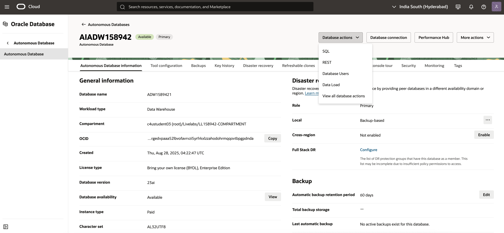

# Lab 3: Create AI Hub Database Resources

**Duration:** 15 minutes  

## Introduction
In this lab, you will work within the **AI Hub Autonomous Data Warehouse (ADW)** to set up the foundational resources needed for AI-driven data exploration. You’ll create vector stores for embedding-based semantic search, load the YAN_POS Orders dataset, and design a JSON Duality View. These steps will enable both relational and JSON-style access, preparing the data for natural language and AI-powered queries.

### Objectives:

In this lab, you:

* Access and use SQL Web Developer in AI Hub ADW.
* Create vector stores to support AI-driven semantic search.
* Initialize and validate the YAN_POS Orders dataset.
* Build a JSON Duality View to expose data for both relational and JSON-native access.  

### Prerequisites

Ensure that you've successfully completed all preceding labs.

## Task 1: Create vector stores in AI Hub (ADW)

1.  In the Oracle Cloud console navigation menu, select **Oracle Database**, then **Autonomous Data Warehouse**.

2.  On the Autonomous Data Warehouse page, select the ADW instance provisioned as your AI Hub.

3.  On your database details page, from the **Actions** menu, select **SQL**.

4.  Log in using the provided workshop database credentials.
     
       Note: Username is ADMIN and Password can be Copied from the Reservation Information panel.
     
     
     
5.  In the SQL worksheet, create a new table to store vector embeddings. These embeddings power semantic search across orders and items.
    
    - Example SQL (adjust table name/columns if needed):
    
      ```sql
           <copy> --------------------------------------------------------
         --  DDL for Table DYNAMIC_PRODUCT_DESCRIPTION_OUTBOX
         --------------------------------------------------------

          CREATE TABLE "YAN_POS"."DYNAMIC_PRODUCT_DESCRIPTION_OUTBOX" 
          (	"OUTBOX_ID" NUMBER GENERATED BY DEFAULT AS IDENTITY MINVALUE 1 MAXVALUE 9999999999999999999999999999 INCREMENT BY 1 START WITH 1 CACHE 20 NOORDER  NOCYCLE  NOKEEP  NOSCALE , 
          "PRODUCT_ID" NUMBER, 
          "REGION_CODE" VARCHAR2(50 BYTE) COLLATE "USING_NLS_COMP", 
          "SEARCH_TERM" VARCHAR2(255 BYTE) COLLATE "USING_NLS_COMP", 
          "REQUESTED_AT" TIMESTAMP (6) DEFAULT CURRENT_TIMESTAMP, 
          "PROCESSED" CHAR(1 BYTE) COLLATE "USING_NLS_COMP" DEFAULT 'N'
          )  DEFAULT COLLATION "USING_NLS_COMP" SEGMENT CREATION IMMEDIATE 
          PCTFREE 10 PCTUSED 40 INITRANS 10 MAXTRANS 255 
         COLUMN STORE COMPRESS FOR QUERY HIGH ROW LEVEL LOCKING LOGGING
          STORAGE(INITIAL 65536 NEXT 1048576 MINEXTENTS 1 MAXEXTENTS 2147483645
          PCTINCREASE 0 FREELISTS 1 FREELIST GROUPS 1
          BUFFER_POOL DEFAULT FLASH_CACHE DEFAULT CELL_FLASH_CACHE DEFAULT)
          TABLESPACE "DATA" ;
         --------------------------------------------------------
         --  DDL for Table ORDER_VECTORS
         --------------------------------------------------------

          CREATE TABLE "YAN_POS"."ORDER_VECTORS" 
          (	"ORDER_ID" NUMBER, 
          "PRODUCT_IDS_JSON" JSON, 
          "ORDER_EMBEDDING" VECTOR(1024, *)
          )  DEFAULT COLLATION "USING_NLS_COMP" SEGMENT CREATION IMMEDIATE 
          PCTFREE 10 PCTUSED 40 INITRANS 10 MAXTRANS 255 
         COLUMN STORE COMPRESS FOR QUERY HIGH ROW LEVEL LOCKING LOGGING
          STORAGE(INITIAL 65536 NEXT 1048576 MINEXTENTS 1 MAXEXTENTS 2147483645
          PCTINCREASE 0 FREELISTS 1 FREELIST GROUPS 1
          BUFFER_POOL DEFAULT FLASH_CACHE DEFAULT CELL_FLASH_CACHE DEFAULT)
          TABLESPACE "DATA" 
         JSON ("PRODUCT_IDS_JSON") STORE AS (
          TABLESPACE "DATA"  CHUNK 8192 RETENTION MIN 1800
          STORAGE(INITIAL 262144 NEXT 1048576 MINEXTENTS 1 MAXEXTENTS 2147483645
          PCTINCREASE 0
          BUFFER_POOL DEFAULT FLASH_CACHE DEFAULT CELL_FLASH_CACHE DEFAULT)) 
         VECTOR ("ORDER_EMBEDDING") STORE AS (
          TABLESPACE "DATA"  CHUNK 8192 RETENTION MIN 1800
          STORAGE(INITIAL 262144 NEXT 1048576 MINEXTENTS 1 MAXEXTENTS 2147483645
          PCTINCREASE 0
          BUFFER_POOL DEFAULT FLASH_CACHE DEFAULT CELL_FLASH_CACHE DEFAULT)) ;
        --------------------------------------------------------
        --  DDL for Table POS_ORDER_VECTORS
        --------------------------------------------------------

          CREATE TABLE "YAN_POS"."POS_ORDER_VECTORS" 
          (	"ORDER_ID" NUMBER, 
          "ORDER_JSON" JSON, 
          "ORDER_EMBEDDING" VECTOR(1024, *)
          )  DEFAULT COLLATION "USING_NLS_COMP" SEGMENT CREATION IMMEDIATE 
          PCTFREE 10 PCTUSED 40 INITRANS 10 MAXTRANS 255 
         COLUMN STORE COMPRESS FOR QUERY HIGH ROW LEVEL LOCKING LOGGING
          STORAGE(INITIAL 65536 NEXT 1048576 MINEXTENTS 1 MAXEXTENTS 2147483645
          PCTINCREASE 0 FREELISTS 1 FREELIST GROUPS 1
          BUFFER_POOL DEFAULT FLASH_CACHE DEFAULT CELL_FLASH_CACHE DEFAULT)
          TABLESPACE "DATA" 
         JSON ("ORDER_JSON") STORE AS (
          TABLESPACE "DATA"  CHUNK 8192 RETENTION MIN 1800
          STORAGE(INITIAL 262144 NEXT 1048576 MINEXTENTS 1 MAXEXTENTS 2147483645
          PCTINCREASE 0
          BUFFER_POOL DEFAULT FLASH_CACHE DEFAULT CELL_FLASH_CACHE DEFAULT)) 
         VECTOR ("ORDER_EMBEDDING") STORE AS (
          TABLESPACE "DATA"  CHUNK 8192 RETENTION MIN 1800
          STORAGE(INITIAL 262144 NEXT 1048576 MINEXTENTS 1 MAXEXTENTS 2147483645
          PCTINCREASE 0
          BUFFER_POOL DEFAULT FLASH_CACHE DEFAULT CELL_FLASH_CACHE DEFAULT)) ;
         --------------------------------------------------------
         --  DDL for Table PRODUCT_REWRITES
         --------------------------------------------------------

          CREATE TABLE "YAN_POS"."PRODUCT_REWRITES" 
          (	"REWRITE_ID" NUMBER GENERATED BY DEFAULT AS IDENTITY MINVALUE 1 MAXVALUE 9999999999999999999999999999 INCREMENT BY 1 START WITH 1 CACHE 20 NOORDER  NOCYCLE  NOKEEP  NOSCALE , 
          "PRODUCT_ID" NUMBER, 
          "REGION_CODE" VARCHAR2(50 BYTE) COLLATE "USING_NLS_COMP", 
          "REWRITE_TEXT" CLOB COLLATE "USING_NLS_COMP", 
          "TREND_CONTEXT" VARCHAR2(255 BYTE) COLLATE "USING_NLS_COMP", 
          "COMPETITOR_SNAPSHOT" CLOB COLLATE "USING_NLS_COMP", 
          "INVENTORY_SNAPSHOT" NUMBER, 
          "CREATED_AT" TIMESTAMP (6) DEFAULT CURRENT_TIMESTAMP
          )  DEFAULT COLLATION "USING_NLS_COMP" SEGMENT CREATION IMMEDIATE 
          PCTFREE 10 PCTUSED 40 INITRANS 10 MAXTRANS 255 
         COLUMN STORE COMPRESS FOR QUERY HIGH ROW LEVEL LOCKING LOGGING
          STORAGE(INITIAL 65536 NEXT 1048576 MINEXTENTS 1 MAXEXTENTS 2147483645
          PCTINCREASE 0 FREELISTS 1 FREELIST GROUPS 1
          BUFFER_POOL DEFAULT FLASH_CACHE DEFAULT CELL_FLASH_CACHE DEFAULT)
          TABLESPACE "DATA" 
         LOB ("REWRITE_TEXT") STORE AS SECUREFILE (
          TABLESPACE "DATA" ENABLE STORAGE IN ROW 4000 CHUNK 8192
          NOCACHE LOGGING  NOCOMPRESS  KEEP_DUPLICATES 
          STORAGE(INITIAL 262144 NEXT 1048576 MINEXTENTS 1 MAXEXTENTS 2147483645
          PCTINCREASE 0
          BUFFER_POOL DEFAULT FLASH_CACHE DEFAULT CELL_FLASH_CACHE DEFAULT)) 
         LOB ("COMPETITOR_SNAPSHOT") STORE AS SECUREFILE (
          TABLESPACE "DATA" ENABLE STORAGE IN ROW 4000 CHUNK 8192
          NOCACHE LOGGING  NOCOMPRESS  KEEP_DUPLICATES 
          STORAGE(INITIAL 262144 NEXT 1048576 MINEXTENTS 1 MAXEXTENTS 2147483645
          PCTINCREASE 0
          BUFFER_POOL DEFAULT FLASH_CACHE DEFAULT CELL_FLASH_CACHE DEFAULT)) ;
         --------------------------------------------------------
         --  DDL for Table PRODUCT
         --------------------------------------------------------


          CREATE TABLE "YAN_POS"."DYNAMIC_PRODUCT_DESCRIPTION_OUTBOX" 
          (	"OUTBOX_ID" NUMBER GENERATED BY DEFAULT AS IDENTITY MINVALUE 1 MAXVALUE 9999999999999999999999999999 INCREMENT BY 1 START WITH 1 CACHE 20 NOORDER  NOCYCLE  NOKEEP  NOSCALE , 
          "PRODUCT_ID" NUMBER, 
          "REGION_CODE" VARCHAR2(50 BYTE) COLLATE "USING_NLS_COMP", 
          "SEARCH_TERM" VARCHAR2(255 BYTE) COLLATE "USING_NLS_COMP", 
          "REQUESTED_AT" TIMESTAMP (6) DEFAULT CURRENT_TIMESTAMP, 
          "PROCESSED" CHAR(1 BYTE) COLLATE "USING_NLS_COMP" DEFAULT 'N'
          )  DEFAULT COLLATION "USING_NLS_COMP" SEGMENT CREATION IMMEDIATE 
          PCTFREE 10 PCTUSED 40 INITRANS 10 MAXTRANS 255 
         COLUMN STORE COMPRESS FOR QUERY HIGH ROW LEVEL LOCKING LOGGING
          STORAGE(INITIAL 65536 NEXT 1048576 MINEXTENTS 1 MAXEXTENTS 2147483645
          PCTINCREASE 0 FREELISTS 1 FREELIST GROUPS 1
          BUFFER_POOL DEFAULT FLASH_CACHE DEFAULT CELL_FLASH_CACHE DEFAULT)
          TABLESPACE "DATA" ;</copy>

     ```
     This vector store will later be populated with embeddings generated from order and item descriptions.  

## Task 2: Initialize Data

1.  Load the YAN_POS Orders Dataset.
     - Initialize the YAN_POS Orders dataset in your ADW instance.
     - Verify that the data has been correctly loaded and is available for queries.

     - Ensure the **YAN\_POS Orders dataset** (tables `POS_ORDER` and `ORDERITEM`) has been replicated into ADW via OCI GoldenGate ZeroETL Pipeline.  
     - If needed, run a quick check:  
     ```sql
     <copy> SELECT COUNT(*) FROM YAN_POS.pos_order;
     SELECT COUNT(*) FROM YAN_POS.orderitem;</copy>
     ```
     - Confirm row counts match with the source database.  
     - Insert initial embeddings into the vector store:  
     ```sql

      <copy>Insert into YAN_POS.ORDER_VECTORS (ORDER_ID,PRODUCT_IDS_JSON,ORDER_EMBEDDING) values (258,'[79,15,85]',TO_CLOB(q'[[2.08990395E-001,-2.57836014E-001,-6.65510178E-001,3.72304231E-001,-6.01657093E-001,1.01179779E-001,-2.59865552E-001,-1.19958237E-001,9.84913826E-001,7.72194564E-001,2.46216804E-001,1.08588207E+000,4.47982401E-001,-3.86131167E-001,-4.38452423E-001,6.04123294E-001,-3.37328553E-001,-1.83373258E-001,-1.28849164E-001,2.63981938E-001,4.38640684E-001,1.03827441E+000,-8.19189906E-001,-5.12309849E-001,-1.14139163E+000,2.54677415E-001,-6.51798368E-001,-5.70198953E-001,3.0855155E-001,8.28419983E-001,-1.24]')
      || TO_CLOB(q'[075897E-001,-5.77276111E-001,2.43193105E-001,-1.0698911E+000,-4.13423568E-001,-3.49326879E-001,3.45410496E-001,2.96353757E-001,2.13573858E-001,-6.48903191E-001,1.39213249E-001,1.23818144E-002,7.60435998E-001,-7.7547437E-001,-5.40543556E-001,-1.08469218E-001,-1.15411617E-002,-5.87300241E-001,1.72767654E-001,-1.03931999E+000,-5.42703927E-001,9.59280282E-002,2.12342054E-001,-6.59901351E-002,4.75921154E-001,-1.24381617E-001,-4.05608863E-001,-3.54378998E-001,-5.59605896E-001,-8.92829299E-002,6.718797]')
      || TO_CLOB(q'[09E-001,-1.38281494E-001,5.51326752E-001,-1.17092893E-001,-2.63913989E-001,5.06579757E-001,4.86680493E-002,1.09455645E-001,-2.04606906E-001,-8.531394E-001,-2.38061264E-001,3.26638848E-001,-3.52777064E-001,-9.64357555E-001,-4.36741948E-001,3.40587854E-001,1.47506684E-001,3.08492184E-001,-6.36263415E-002,-2.12039143E-001,5.99502027E-002,1.06713429E-001,-7.39836633E-001,3.36361021E-001,-3.32395673E-001,1.92058682E-002,1.67802051E-001,-1.78095385E-001,2.09369734E-002,-2.09120944E-001,-1.57676861E-00]')
      || TO_CLOB(q'[1,6.76909387E-001,2.73556054E-001,-1.6309534E-001,9.98550355E-001,-3.51157993E-001,-9.7020179E-002,-1.47673965E-001,-3.0481413E-001,-8.93865824E-002,1.98363513E-001,3.77957404E-001,2.14635357E-001,6.0156554E-001,1.53706037E-003,6.04516566E-001,4.02141511E-001,-7.12397397E-001,-7.28906691E-001,-7.74564803E-001,5.52992344E-001,-1.13314897E-001,-3.20123672E-001,3.7444219E-002,4.03800547E-001,6.87383592E-001,-1.19450867E-001,5.85775852E-001,4.4944346E-001,5.06359577E-001,-2.20553309E-001,1.73606664E]')
      || TO_CLOB(q'[-001,2.17935026E-001,2.43624032E-001,-4.87984717E-001,-8.66238713E-001,6.16506599E-002,-2.25724027E-001,-8.94360691E-002,2.15918012E-002,-1.96390286E-001,3.40549558E-001,2.12516002E-002,3.40332448E-001,3.38630468E-001,-6.61624596E-002,3.34358037E-001,4.30485755E-001,9.62532699E-001,1.66344181E-001,-9.14396867E-002,-2.14534849E-002,2.99258798E-001,1.30476952E+000,9.57768224E-003,9.00291145E-001,-3.06271464E-001,5.02541065E-001,-5.34484029E-001,-4.21717048E-001,-4.05667633E-001,7.09803581E-001,1.1]')
      || TO_CLOB(q'[1369975E-002,4.75245744E-001,6.41677231E-002,-7.55688369E-001,-5.75508237E-001,2.45473027E-001,8.58013481E-002,3.12448412E-001,8.45710784E-002,-5.39308563E-002,2.2817567E-001,6.7120856E-001,-1.43740386E-001,8.25022399E-001,-1.46064728E-001,-3.95933092E-002,1.62467912E-001,-2.35179543E-001,-1.69514716E-002,2.94669539E-001,-3.86913747E-001,-2.19414502E-001,-1.49885282E-001,1.79551661E-001,1.10790527E+000,1.07650291E-002,5.82410157E-001,-1.74326718E-001,-2.14715526E-001,3.05000506E-003,-1.00977495E]')
      || TO_CLOB(q'[-001,1.09615171E+000,-1.51077345E-001,8.66721272E-001,-3.68960679E-001,3.75989288E-001,-7.85480559E-001,-5.2866888E-001,8.11473727E-002,4.30827618E-001,-5.25806308E-001,-2.41153315E-002,-4.94978726E-001,1.72334269E-001,-6.81316912E-001,4.45093423E-001,5.175272E-002,-8.98775637E-001,-5.7265538E-001,5.65523624E-001,-1.90910444E-001,-2.32775658E-001,2.9787302E-001,1.31385505E-001,8.50652158E-003,2.31031567E-001,-6.22697055E-001,1.66207105E-001,2.19863489E-001,7.11100549E-002,-1.37403727E-001,-5.711]')
      || TO_CLOB(q'[30514E-001,4.9314478E-001,-3.32512468E-001,-1.79830238E-001,5.04985332E-001,-7.67183304E-001,-1.03861839E-001,-3.20669651E-001,2.70698905E-001,8.09915662E-002,4.45066839E-001,-4.28573012E-001,-5.7511501E-002,-2.48556614E-001,5.72880805E-001,-1.7048569E-001,6.71995401E-001,-1.66194767E-001,1.38182747E+000,6.32026315E-001,6.49656117E-001,-3.56904343E-002,2.2371541E-001,5.00432253E-001,1.12192584E-002,8.33910882E-001,6.06421292E-001,3.96482974E-001,-4.8816967E-001,7.4846673E-001,-4.17681098E-001,1.]')
      || TO_CLOB(q'[30585223E-001,-5.77090606E-002,3.64424616E-001,3.9231956E-002,-3.00720692E-001,3.95056456E-002,-2.4835743E-001,3.24799031E-001,9.21125561E-002,-1.90211356E-001,-1.04679026E-001,-3.04435641E-002,4.13423449E-001,1.00571537E+000,4.9082756E-001,2.53105849E-001,2.40367562E-001,-8.23076889E-002,1.11646307E+000,8.52995098E-001,6.67992055E-001,-1.55421868E-001,1.08720982E+000,-1.55434236E-001,-4.17280942E-001,-1.70784399E-001,-1.38159025E+000,-7.10787356E-001,-9.77293849E-001,-1.38778657E-001,-1.1298396]')
      || TO_CLOB(q'[6E+000,-5.66462219E-001,1.05284974E-002,-6.6529727E-001,9.54459369E-001,-6.29707634E-001,8.21452558E-001,1.5546155E-001,-1.43834889E-001,4.56543684E-001,-1.30598083E-001,1.19507873E+000,-1.07640231E+000,4.71755743E-001,1.93750024E-001,4.14114416E-001,-2.46572644E-001,2.09314853E-001,-2.92720705E-001,-8.33147407E-001,-5.4879427E-001,-3.92144531E-001,2.25693911E-001,-3.2788083E-001,-9.41570103E-001,-8.86552781E-003,-3.88787121E-001,1.62065014E-001,-6.04728818E-001,3.70430872E-002,-7.88359106E-001,]')
      || TO_CLOB(q'[2.99244285E-001,5.58135152E-001,-1.92076042E-001,5.02880454E-001,5.27713418E-001,-4.54914153E-001,1.66573018E-001,3.36588353E-001,1.63146138E-001,-9.24355328E-001,-1.96220487E-001,7.58142173E-001,-2.27691263E-001,-1.32725224E-001,4.95383143E-002,-9.26044881E-001,2.85789728E-001,-4.31355685E-001,-9.88178849E-002,-1.21185392E-001,1.3670592E-001,-7.87074387E-001,-7.60233402E-001,5.99660933E-001,-6.1691916E-001,-6.67896092E-001,-6.32032216E-001,3.72527957E-001,-1.19314797E-001,-1.37030035E-001,2.165]')
      || TO_CLOB(q'[49993E-001,4.73988801E-001,-9.46580946E-001,-3.58477443E-001,5.78950584E-001,5.79187334E-001,2.61756778E-001,-1.23950168E-002,8.44962597E-001,-6.43564701E-001,9.33322966E-001,3.48052144E-001,1.39709488E-002,-2.49762595E-001,5.76517284E-001,-8.51418316E-001,4.56762582E-001,5.92101097E-001,-5.31484187E-001,3.9699012E-001,1.12953186E+000,-2.29056463E-001,-8.64103317E-001,-1.83422267E-001,2.38466725E-001,2.59585977E-002,-3.15621868E-002,1.5864332E-001,8.30060169E-002,-9.38438773E-002,-1.01012766E+00]')
      || TO_CLOB(q'[0,6.62374437E-001,3.33828837E-001,7.10490942E-001,-9.16006446E-001,-1.2298055E-001,-2.84273401E-002,-5.9021014E-001,3.15834463E-001,-1.21287748E-001,-1.25839031E+000,4.96709853E-001,4.56309378E-001,9.79742646E-001,-7.40963399E-001,1.78034902E-001,2.9519248E-001,2.08074152E-002,-4.40573394E-001,-3.61005455E-001,6.32071793E-002,-2.70233989E-001,2.18483023E-002,-6.34034753E-001,-7.85313845E-002,4.1605556E-001,-2.06707641E-002,-4.07616675E-001,-6.6168946E-001,-4.1979751E-001,-7.09607005E-001,2.66232]')
      || TO_CLOB(q'[193E-001,4.16843779E-002,6.91724062E-001,3.28492522E-001,-1.33457839E-001,7.38452196E-001,-1.74854845E-002,-1.46022858E-003,-3.81159186E-001,3.47144008E-001,-2.30562598E-001,5.9681046E-001,4.60502952E-002,-2.37046629E-001,-1.21274269E+000,-3.75924967E-002,-3.83412927E-001,1.50670126E-001,3.76286298E-001,-8.40912014E-002,-4.40485299E-001,2.20732495E-001,-5.90671957E-001,-4.69928831E-002,-4.98244613E-001,2.37726778E-001,-1.61838412E+000,2.29297593E-001,2.28808403E-001,3.08192462E-001,7.12282062E-0]')
      || TO_CLOB(q'[02,-4.14758444E-001,4.80089277E-001,1.36345649E+000,-2.16028839E-001,7.38776922E-002,-4.23647612E-001,7.49126822E-002,-1.12382911E-001,1.22013077E-001,5.85503399E-001,-2.20630676E-001,6.3991648E-001,-7.2772181E-001,1.64185584E-001,1.27266914E-001,-1.87158361E-001,3.51733387E-001,1.52005926E-001,1.99466586E-001,2.15964437E-001,-1.26879394E-001,-4.52846736E-001,-6.91202164E-001,-1.13914326E-001,-7.37091601E-001,-2.9982549E-001,-4.38874274E-001,-6.37667626E-002,5.51952064E-001,1.1012485E+000,3.6345]')
      || TO_CLOB(q'[0497E-001,1.63379014E-002,-7.07774043E-001,3.42525899E-001,-5.11588752E-002,7.03836381E-001,-1.76812738E-001,-2.79869407E-001,1.09698546E+000,-7.7124767E-002,-6.96482837E-001,2.75698274E-001,-4.30223942E-001,3.82080585E-001,-9.25220549E-003,4.01517928E-001,-4.47841048E-001,9.94244888E-002,-4.56325322E-001,-2.8005439E-001,1.70990348E-001,-3.53375614E-001,2.44380049E-002,-1.2720027E+000,5.03419042E-001,2.2780028E-001,8.84750187E-002,2.81200349E-001,-3.50053251E-001,-8.01675498E-001,5.08460581E-001]')
      || TO_CLOB(q'[,-3.43748838E-001,1.56622028E+000,-1.57296419E-001,2.7263093E-001,-1.81482628E-001,3.85103703E-001,3.31865013E-001,4.35015023E-001,-1.3487916E+000,1.22346431E-001,6.50244355E-001,6.38426021E-002,1.09432459E+000,-3.92651886E-001,-1.06477392E+000,7.04940438E-001,3.87710482E-001,-1.2580201E-001,6.66054934E-002,7.90764391E-001,-4.33381259E-001,1.66517124E-001,2.59406626E-001,9.14671957E-001,-3.72986764E-001,2.79277146E-001,3.94678563E-001,6.36332512E-001,6.37787104E-001,-1.95891961E-001,-6.16995454E]')
      || TO_CLOB(q'[-001,4.92336422E-001,6.34908497E-001,-9.54090953E-001,-1.52723834E-001,6.08000576E-001,7.61956498E-002,4.21611577E-001,7.42244542E-001,-5.44476151E-001,-5.27312458E-001,-2.46499375E-001,-4.13840771E-001,-1.87593743E-001,2.57433891E-001,-4.46225584E-001,-1.34310678E-001,-4.32292908E-001,1.25831932E-001,-7.92973116E-002,2.91645639E-002,-6.59615695E-002,-3.76234174E-001,4.92704064E-001,-7.56704271E-001,-5.79743862E-001,5.10258019E-001,-6.39394164E-001,-3.83546352E-002,3.33479077E-001,-7.54016995E-0]')
      || TO_CLOB(q'[01,-5.58114886E-001,-5.03748059E-002,7.06785798E-001,3.66694152E-001,6.23705387E-001,-8.13458681E-001,-5.10265708E-001,1.54795572E-001,4.85970557E-001,-8.76813352E-001,-1.76200867E-001,-8.61119211E-001,6.47543788E-001,-6.4661032E-001,-2.88215429E-002,4.09692526E-003,-7.08142444E-002,-3.78423363E-001,-3.13791186E-001,1.9889237E-001,-2.56943703E-001,-1.10628819E+000,5.24957299E-001,2.18796059E-001,2.82873183E-001,4.29017246E-002,4.88377213E-002,-9.88727629E-001,-1.75427143E-002,-1.02885675E+000,-4]')
      || TO_CLOB(q'[.78958905E-001,4.24756527E-001,1.89853907E-001,1.84834167E-001,-5.08902669E-001,5.69234908E-001,-1.33811027E-001,-1.92756385E-001,1.13783693E+000,1.52935274E-002,-6.74728155E-001,-7.72396743E-001,5.72156549E-001,6.69476807E-001,-1.26612335E-001,9.6325092E-002,-7.52171934E-001,-3.17058191E-002,-1.72909379E-001,-5.52121162E-001,-1.72677732E+000,-2.82704383E-001,5.53815603E-001,5.56712568E-001,-3.76909018E-001,6.15817487E-001,-4.09477651E-001,-8.43040764E-001,-4.86955047E-001,1.35503483E+000,-1.524]')
      || TO_CLOB(q'[33604E-001,3.07782263E-001,7.68860877E-001,1.10143796E-001,-1.12286377E+000,-2.19459444E-001,2.22195908E-001,-3.02912265E-001,-6.0128814E-001,2.28965655E-001,-2.4824366E-003,-5.12541175E-001,4.74743158E-001,5.41669965E-001,-1.52824149E-001,-6.52426898E-001,3.00236166E-001,-1.88399583E-001,-2.73489326E-001,-8.77378166E-001,-8.50139186E-002,4.52028632E-001,-1.27097473E-001,4.10237536E-003,-3.75167653E-003,1.10304281E-001,4.37692732E-001,-6.1517334E-001,4.50098097E-001,-5.61573029E-001,-1.77243024E]')
      || TO_CLOB(q'[-001,6.67335272E-001,-2.60584831E-001,4.24943268E-002,-1.30507767E+000,-2.15852231E-001,-9.53427792E-001,-2.63252109E-001,3.40732753E-001,-1.54851899E-001,-4.7584182E-001,6.33148432E-001,1.09368241E+000,7.53114223E-001,2.61864245E-001,1.75048634E-001,6.03816569E-001,-3.81080732E-002,-7.85791576E-001,-2.38747478E-001,1.03850722E+000,-4.24692333E-002,-2.58968562E-001,-4.50769998E-002,-6.57629669E-001,5.39749861E-001,9.21043754E-001,-7.31562674E-001,-3.03157359E-001,-9.06150579E-001,-2.71515161E-00]')
      || TO_CLOB(q'[1,9.05332267E-002,-9.69469309E-001,-2.11710542E-001,1.81635618E-001,-3.11475217E-001,-3.7494339E-002,2.36160666E-001,-4.64385748E-001,1.11440265E+000,-4.82708216E-001,-2.57462233E-001,-7.02920377E-001,9.08534974E-003,-6.66449606E-001,-1.85382888E-001,-7.64841795E-001,3.50869745E-001,-6.52473092E-001,4.72588122E-001,-2.9602921E-001,-5.25001466E-001,-9.91007209E-001,9.29956317E-001,-8.86828303E-001,7.16293573E-001,-3.82445097E-001,-6.63230896E-001,1.57294162E-002,1.16362524E+000,-2.34222993E-001,4]')
      || TO_CLOB(q'[.78074327E-002,1.10925829E+000,5.47901262E-003,5.07176518E-001,-2.02556014E-001,-2.6243481E-001,-2.30388343E-001,5.50628901E-001,-1.44601434E-001,-5.21099985E-001,-1.03047639E-002,-9.01361227E-001,7.8664732E-001,-7.77206361E-001,1.21332444E-001,3.93105634E-002,2.7658087E-001,2.09050372E-001,3.72861832E-001,-5.77545106E-001,7.57312894E-001,5.16422316E-002,-2.92544723E-001,-7.07180977E-001,-8.28728676E-002,2.29064301E-001,3.07531476E-001,7.04268515E-001,6.90412939E-001,1.01290397E-001,-8.83361936E]')
      || TO_CLOB(q'[-001,4.00290161E-001,-7.85258234E-001,-9.32386875E-001,-1.60833359E-001,-4.3661508E-001,-2.73420125E-001,-2.95223594E-002,-4.36723046E-002,-4.60704595E-001,1.39261812E-001,-2.26338357E-002,3.58741462E-001,3.88338238E-001,3.59295547E-001,-1.3389425E-001,-5.94311178E-001,-1.42640662E+000,-4.30065513E-001,1.30198276E+000,3.7417534E-001,4.20064986E-001,-4.00994986E-001,-5.95342875E-001,2.81883299E-001,9.21328664E-002,6.45837367E-001,-4.42966968E-002,1.21100438E+000,-9.41046178E-001,8.03048253E-001,-]')
      || TO_CLOB(q'[3.61061335E-001,3.05173486E-001,3.39636058E-001,6.29544139E-001,-2.87769467E-001,-8.54699254E-001,-5.2622959E-002,4.98024791E-001,2.95826852E-001,-5.2595818E-001,-5.70942685E-002,-1.0557273E-001,1.15953833E-001,-1.60031244E-001,5.99054024E-002,2.46681184E-001,-8.16203415E-001,5.34272075E-001,3.98837119E-001,5.49276292E-001,-1.20069817E-001,5.09061217E-001,3.30153972E-001,-5.22862136E-001,-4.66852821E-002,-4.26286548E-001,1.79395229E-001,1.35427222E-001,-5.13494909E-002,5.87857366E-001,1.43819287]')
      || TO_CLOB(q'[E-001,-2.00363353E-001,-3.30944538E-001,-5.96880138E-001,6.29963279E-001,4.18144852E-001,4.89399046E-001,-1.65904939E-001,2.2065942E-001,8.67538154E-001,-1.25057518E-001,3.23664136E-002,5.8062011E-001,4.85959053E-002,-4.90653664E-002,7.40113795E-001,2.01979488E-001,3.67346525E-001,2.92215645E-001,-1.86311543E-001,-3.86243016E-001,5.76305985E-001,-5.62144592E-002,1.13371539E+000,-2.74380058E-001,3.37869823E-001,2.39001244E-001,-1.50435105E-001,7.7058658E-002,1.67410791E-001,2.69115828E-002,-4.036]')
      || TO_CLOB(q'[37767E-001,-1.59181207E-001,-4.07332212E-001,7.65752196E-001,6.05849028E-001,5.48766792E-001,4.13476616E-001,4.07396764E-001,4.47485596E-001,-2.47352958E-001,-1.10218853E-001,4.88821775E-001,4.42343615E-002,2.08880007E-003,-2.09216043E-001,-8.51394013E-002,9.23032701E-001,-7.05567747E-002,-3.34206313E-001,1.32703555E+000,-8.34567428E-001,1.1927484E-001,-4.50635254E-001,-4.81158674E-001,1.48387887E-002,-1.39993191E-001,3.0552122E-001,-3.22627038E-001,-3.99147421E-001,1.05793345E+000,-1.86434314E-]')
      || TO_CLOB(q'[002,-3.79240662E-002,9.54853654E-001,5.39434314E-001,-2.88443923E-001,5.72660327E-001,6.48254812E-001,-4.56163913E-001,-1.09821841E-001,3.16822648E-001,-1.55117184E-001,-1.00174084E-001,3.48657042E-001,-8.1393981E-001,-2.7327323E-001,-1.30727112E-001,-5.70180655E-001,-4.36671495E-001,1.21089065E+000,2.45042697E-001,-2.09905535E-001,2.54320294E-001,2.40349457E-001,3.05687562E-002,-3.4572953E-001,1.87598705E-001,1.32541224E-001,5.65547943E-001,3.12027901E-001,-3.24119449E-001,-4.11201477E-001,-8.7]')
      || TO_CLOB(q'[0071426E-002,-6.51285768E-001,2.29534537E-001,-4.44503069E-001,-4.18599218E-001,6.11320555E-001,-1.02083719E+000,-5.00478208E-001,-2.2660026E-001,1.74433738E-003,-4.88733917E-001,-2.74256259E-001,2.04211883E-002,4.60615933E-001,4.10077691E-001,-2.00059414E-002,-9.27096546E-001,5.37055075E-001,6.84821188E-001,-5.03534853E-001,8.20161283E-001,1.59426972E-001,7.23430157E-001,6.06735587E-001,-5.34034193E-001,-6.53600156E-001,1.26978263E-001,5.70199013E-001,-3.08260083E-001,-6.72355592E-001,-1.583601]')
      || TO_CLOB(q'[68E-001,-5.71523726E-001,-1.06837523E+000,-1.13938376E-001,2.29088262E-001,-1.61800206E-001,-5.53128183E-001,-9.19951379E-001,-1.29911029E+000,4.21232611E-001,-9.27045941E-001,3.6426723E-001,-8.71931314E-002,-8.18853676E-001,2.0587723E-001,-8.68616939E-001,4.10313988E+000,1.2156496E+000,7.87109852E-001,1.95841938E-001,4.7250089E-001,4.88807291E-001,2.5660032E-001,-2.5308156E-001,-1.89414948E-001,1.14767268E-001,-3.03075016E-001,2.33339012E-001,3.1847205E-002,7.63452351E-001,5.04935384E-001,6.028]')
      || TO_CLOB(q'[94306E-001,-4.27418947E-001,-4.34777617E-001,-2.38528624E-002,-9.06036794E-001,-1.09384727E+000,2.74158716E-001,-7.58704245E-002,3.1821683E-001,-7.56015956E-001,-3.69940519E-001,4.19093072E-001,1.59468293E-001,-8.76361907E-001,2.12584399E-002,1.07424378E+000,-2.4946006E-002,7.48586059E-001,6.51438683E-002,-2.24706575E-001,3.60681295E-001,4.05311406E-001,2.83497721E-002,-7.98296273E-001,-2.3109654E-002,3.3536306E-001,-4.59703147E-001,-1.41735956E-001,-2.34260052E-001,-2.74975896E-001,3.53591219E-]')
      || TO_CLOB(q'[002,-3.32176685E-001,-3.38468671E-001,8.28162909E-001,-1.18397164E+000,3.63674581E-001,-1.00127292E+000,3.53617877E-001,2.63432741E-001,-1.12043142E+000,1.48608595E-001,4.95419323E-001,-2.54328251E-001,-8.02432224E-002,-2.29921222E-001,7.54074454E-001,-1.57558799E-001,-8.74864757E-001,-2.96332568E-001,-5.26347458E-001,3.75812322E-001,-1.75158739E-001,1.25980854E+000,4.04892504E-001,5.27027786E-001,-8.86021927E-002,-8.41177702E-002,-1.38324726E+000,1.00889772E-001,3.63876462E-001,-2.30882391E-002]')
      || TO_CLOB(q'[,5.77243567E-002,3.28299522E-001,-9.97887135E-001,-3.09999734E-001,-4.17708278E-001,4.73354042E-001,-3.86189282E-001,-4.70988303E-002,8.18169475E-001,6.78876758E-001,-5.04319429E-001,-4.23596084E-001,-5.1116848E-001,4.51162905E-001,4.94758308E-001,5.47875687E-002,2.1249868E-001,2.13429779E-001,-3.01025026E-002]]'));
      Insert into YAN_POS.ORDER_VECTORS (ORDER_ID,PRODUCT_IDS_JSON,ORDER_EMBEDDING) values (259,'[105]',TO_CLOB(q'[[-1.04772717E-001,1.4860855E-001,-6.01040125E-001,6.54377759E-001,-8.23325098E-001,-8.78271013E-002,-3.39217573E-001,4.35392588E-001,5.53701282E-001,7.04731584E-001,1.19810566E-001,7.6590085E-001,-4.97405827E-001,2.39701152E-001,-1.12490833E+000,-1.45564437E-001,-3.61275345E-001,-7.73196518E-001,4.36808646E-001,1.6039598E-001,2.6611042E-001,5.5543083E-001,-5.4555428E-001,-4.13774014E-001,-2.47473255E-001,1.15582243E-001,-3.83681118E-001,-7.44469404E-001,5.59572399E-001,1.26450634E+000,-7.1745961]')
      || TO_CLOB(q'[9E-001,-6.49325788E-001,8.81208554E-002,-1.25776279E+000,-5.56374371E-001,-8.02994788E-001,5.67874253E-001,-1.18551411E-001,-2.15413928E-001,-5.99737346E-001,-5.84527373E-001,1.01232529E+000,1.03102124E+000,-6.13822222E-001,-6.44853473E-001,-7.7194947E-001,-3.5702908E-001,-1.9511205E-001,2.54733592E-001,8.2544148E-002,-1.00110328E+000,-1.78958587E-002,1.4141418E-001,2.69701153E-001,5.06861091E-001,-4.95955676E-001,-8.11393738E-001,-4.34156507E-002,1.4796637E-001,2.83981323E-001,4.59906071E-001,2]')
      || TO_CLOB(q'[.12498859E-001,5.43448389E-001,-7.42960691E-001,-9.7415626E-002,-3.63490805E-002,9.23797429E-001,-2.23610252E-001,1.53834552E-001,-2.48231098E-001,3.10421288E-001,1.00877225E+000,4.2271167E-003,-6.69429183E-001,-1.34678856E-002,8.57202291E-001,-4.44409221E-001,6.24822319E-001,-3.44884604E-001,4.34521735E-001,-1.81913331E-001,-4.67259824E-001,-1.73319995E-001,1.71331093E-002,-8.41518998E-001,-6.38441503E-001,2.84982562E-001,-3.84245068E-001,-1.62702993E-001,2.25433618E-001,-1.88574389E-001,6.5184]')
      || TO_CLOB(q'[1223E-001,-2.15156317E-001,2.82873094E-001,1.39783275E+000,3.6743775E-002,1.33112177E-001,-2.12604269E-001,4.33374316E-001,1.25010103E-001,5.11467934E-001,6.5207392E-001,-8.90400037E-002,6.60332859E-001,-2.8155338E-002,7.91690946E-001,2.64518201E-001,-2.41228223E-001,-5.06039977E-001,-8.08280587E-001,1.36667788E-002,-4.06162292E-001,-1.96148902E-001,-6.239115E-001,-4.81257617E-001,5.48606753E-001,-5.08414507E-001,1.01109433E+000,2.45598793E-001,2.89295733E-001,3.34465027E-001,6.08818293E-001,7.3]')
      || TO_CLOB(q'[3095467E-001,-3.75572652E-001,-3.97257298E-001,-1.32427621E+000,2.83515692E-001,-4.09217238E-001,-4.83374178E-001,1.10146865E-001,-2.69119948E-001,4.76448774E-001,1.21988833E-001,4.66626585E-001,6.0631609E-001,-3.78851891E-001,7.2436142E-001,1.55584216E-001,9.96860266E-001,7.07679838E-002,1.71258673E-002,5.93830012E-002,-1.65184557E-001,1.53326869E+000,1.96222588E-001,7.06324279E-001,-4.33304429E-001,6.83065057E-001,-2.65994191E-001,-4.49793786E-001,4.7922039E-001,6.81367695E-001,-7.51833558E-00]')
      || TO_CLOB(q'[1,9.87847984E-001,3.76978666E-001,-3.83094847E-001,-3.75340246E-002,2.73457617E-001,-2.53091753E-001,7.18038857E-001,6.22668087E-001,7.34494478E-002,-5.4767549E-001,4.47865695E-001,-8.43169749E-001,3.38856786E-001,-2.08668932E-002,7.82789364E-002,-3.5239628E-001,-7.11593986E-001,2.99207151E-001,3.62201124E-001,-1.2000744E-001,-4.37303126E-001,-1.33362338E-001,5.40027916E-002,1.03712368E+000,7.27088392E-001,3.50397944E-001,4.30379063E-003,-1.84980586E-001,-1.13110974E-001,1.47487372E-001,1.062886]')
      || TO_CLOB(q'[71E+000,3.35410297E-001,2.9956013E-001,-4.94294092E-002,9.74456519E-002,-9.50655282E-001,1.02387473E-001,2.50375085E-002,-9.72925425E-002,-2.65649498E-001,-1.3424249E-001,-5.34652829E-001,4.49232519E-001,1.3722676E-001,3.11956778E-002,-1.75821513E-001,-1.70903611E+000,-7.80820847E-001,1.26740527E+000,-1.2092942E-001,-2.89878249E-001,3.94946337E-001,-3.07271034E-001,6.94044948E-001,8.57944965E-001,-2.79815555E-001,-5.87908447E-001,2.73065627E-001,5.89783609E-001,-3.61148298E-001,1.31783769E-001,7]')
      || TO_CLOB(q'[.9339385E-001,-6.76801205E-002,-7.81821489E-001,7.64655411E-001,-2.47377396E-001,5.09402215E-001,-7.91125834E-001,5.40170252E-001,-2.4413842E-001,1.23257101E+000,-3.54555398E-001,-2.33222127E-001,-1.94047287E-001,2.20602125E-001,-1.82210132E-001,5.39951146E-001,-3.1653893E-001,7.70243585E-001,5.95828891E-002,5.80890477E-001,2.58928746E-001,9.43496764E-001,4.61102426E-001,-8.37481618E-002,3.38189036E-001,1.20920904E-001,-2.76590914E-001,-1.28772914E-001,1.17606223E+000,4.75674644E-002,2.58709908E]')
      || TO_CLOB(q'[-001,-2.77151853E-001,3.48924011E-001,-4.40824449E-001,-1.99829265E-001,-9.49678779E-001,-4.22132052E-002,5.80442846E-001,3.15302163E-001,7.6380834E-002,-4.93697971E-001,1.1292769E-001,6.58037245E-001,1.42285168E+000,1.93046108E-001,1.65792048E-001,4.94489074E-001,6.43232048E-001,-7.9448007E-002,7.1195209E-001,7.7911073E-001,1.39633603E-002,1.11431956E+000,-2.87174508E-002,-7.80700445E-001,-6.10992134E-001,-1.14083254E+000,-8.26687157E-001,-9.51161265E-001,-1.13096267E-001,-4.99274701E-001,-4.17]')
      || TO_CLOB(q'[255878E-001,1.27117157E-001,-6.36599958E-001,9.75160599E-001,-1.16005206E+000,3.58545154E-001,1.79986373E-001,-9.68728781E-001,5.00364006E-001,-3.2963264E-001,6.08747244E-001,-4.01745081E-001,4.08931494E-001,4.63773668E-001,7.90579498E-001,-1.33413538E-001,1.98478207E-001,-3.51114035E-001,-5.69424808E-001,-6.6331166E-001,-1.45367049E-002,-4.22857642E-001,1.08140387E-001,-9.56142068E-001,-2.7641353E-001,-2.07450673E-001,4.09425318E-001,6.62796348E-002,-3.1692335E-001,-6.12883449E-001,1.0292156E-0]')
      || TO_CLOB(q'[01,6.15286529E-001,-3.23496282E-001,8.40703964E-001,1.05901182E+000,-8.04708779E-001,5.59894502E-001,-7.09446743E-002,9.56905842E-001,-1.16831934E+000,4.17191803E-001,6.18805051E-001,4.47830141E-001,-5.1706028E-001,2.21503638E-002,-3.95652875E-002,-4.62081909E-001,-1.40629947E-001,9.9946633E-002,4.98612151E-002,-2.33096376E-001,1.5007031E-001,-1.45018327E+000,3.1920284E-001,-6.39734566E-001,-3.57676983E-001,-1.6436038E+000,1.79711521E-001,6.76459074E-002,6.94719434E-001,4.60806817E-001,8.3185547]')
      || TO_CLOB(q'[6E-001,-6.23851478E-001,6.89875185E-002,8.01796377E-001,1.31473911E+000,-2.07333341E-002,-2.6314798E-001,7.98379242E-001,-1.02665293E+000,8.03025126E-001,-2.28220642E-001,4.10087168E-001,-7.79891074E-001,4.24992889E-002,-2.83739805E-001,1.98279917E-001,-2.13631481E-001,-2.71876067E-001,9.78541613E-001,8.90994132E-001,-7.97150016E-001,6.3285625E-001,5.08297682E-001,6.35791719E-001,8.27952698E-002,5.06476641E-001,2.96005249E-001,-3.41590881E-001,4.05151516E-001,-9.06940877E-001,3.61148179E-001,-4.]')
      || TO_CLOB(q'[19797271E-001,6.08299561E-002,-3.73099804E-001,-1.95914209E-001,-6.42285883E-001,-4.95096385E-001,5.7727363E-002,-7.05378175E-001,1.45315528E-001,2.1555616E-001,-3.30259889E-001,2.2886844E-001,-6.17704809E-001,4.4477123E-001,-4.96265858E-001,-9.45955962E-002,3.25255811E-001,-2.33929083E-001,3.32589149E-001,2.09277093E-001,7.98238754E-001,-4.22741413E-001,-3.74927878E-001,2.686047E-002,-5.24134755E-001,5.74327409E-002,-2.74034768E-001,-5.95012665E-001,-7.25610912E-001,1.70981318E-001,-1.24128506E]')
      || TO_CLOB(q'[-001,4.55729663E-001,-1.31248295E-001,1.28225759E-001,-3.24676514E-001,6.25325859E-001,-1.29692867E-001,-1.04451716E+000,1.44505233E-001,-5.37770748E-001,5.16763508E-001,9.37042311E-002,6.24004066E-001,-1.06794786E+000,9.50593054E-002,-5.66135228E-001,9.03591514E-001,1.79317087E-001,-2.01960862E-001,-4.2625764E-001,-8.63484889E-002,-4.6084854E-001,3.89049768E-001,-5.29861808E-001,-1.83224753E-001,-1.10954547E+000,1.42486811E-001,-5.06920218E-001,-2.61791319E-001,-1.79480821E-001,-9.44666862E-001]')
      || TO_CLOB(q'[,2.0352298E-001,1.66341707E-001,-4.5614329E-001,-3.59192818E-001,5.64047471E-002,-4.31105286E-001,-6.36147022E-001,4.64902103E-001,1.33575574E-001,-1.32710233E-001,4.71580863E-001,-7.98405468E-001,2.6818651E-001,1.73751354E-001,-3.75348538E-001,-2.13139415E-001,-2.18132749E-001,1.39384717E-003,-2.08849497E-002,-2.44235903E-001,3.33052218E-001,-1.03680074E+000,-3.61256897E-002,-3.30098599E-001,3.16257387E-001,-2.56099105E-001,-3.55109125E-001,2.52508879E-001,9.92147982E-001,3.5134989E-001,4.38476]')
      || TO_CLOB(q'[89E-001,-2.95892E-001,9.18501139E-001,-2.7379477E-001,2.11146295E-001,-5.60889319E-002,-8.56686294E-001,3.28933507E-001,4.64385033E-001,-1.05637476E-001,1.39436215E-001,-2.98148096E-001,4.73728955E-001,2.48199165E-001,6.67412519E-001,-1.1116575E+000,-2.14602634E-001,-1.67926833E-001,3.05082858E-001,4.62558568E-001,-7.13469326E-001,3.02507505E-002,-1.03962636E+000,4.31273162E-001,2.69522786E-001,5.40223241E-001,-8.19397867E-001,-5.1645577E-001,1.8866241E-001,2.01258093E-001,-6.49617791E-001,1.351]')
      || TO_CLOB(q'[61626E+000,3.00192446E-001,5.33463359E-001,1.08804882E-001,-5.76583624E-001,-3.94269586E-001,1.07275978E-001,-6.7326808E-001,9.03651416E-002,1.23414004E+000,-2.11480469E-001,2.3951596E-001,-6.99140966E-001,-2.04847887E-001,4.59048718E-001,-4.63322364E-003,3.89541388E-002,-5.64050674E-001,1.17168105E+000,-4.62531835E-001,-2.54228301E-002,-7.52976954E-001,4.96108383E-001,-6.0770154E-001,2.52518564E-001,1.19872439E+000,1.56523913E-001,1.37536705E-001,-2.05416277E-001,-5.53948283E-001,5.47752321E-00]')
      || TO_CLOB(q'[1,6.52178586E-001,-6.56829059E-001,-1.37674665E+000,7.06308722E-001,-7.09864795E-002,8.97610009E-001,8.79649222E-001,-6.53487504E-001,-6.75985396E-001,-1.54263228E-002,-2.34250307E-001,-5.87516963E-001,7.74622858E-002,-9.69234705E-001,-3.20665479E-001,-7.6419872E-001,1.15101658E-001,3.17354172E-001,-5.83157167E-002,-1.08209252E-001,-4.47297335E-001,3.64935398E-001,-3.69473659E-002,-2.83074379E-001,-2.84234285E-001,5.71764946E-001,-1.13233179E-001,8.38766545E-002,-5.7264322E-001,-7.58616984E-001,]')
      || TO_CLOB(q'[-5.6865567E-001,7.61135459E-001,2.74905153E-002,5.97261071E-001,-2.19518661E-001,-5.22501707E-001,5.01787663E-001,-1.38272978E-002,-9.47188675E-001,1.81642562E-001,-6.85422301E-001,3.18664163E-001,-6.54392481E-001,-3.82766962E-001,1.28755942E-001,-1.79293126E-001,-5.8360523E-001,-7.56667435E-001,5.38198769E-001,7.90375829E-001,-5.16266465E-001,7.19890714E-001,3.02839689E-002,1.06490791E-001,-1.2288744E-001,-6.51212692E-001,-1.33673358E+000,-9.70146954E-002,-3.46710354E-001,-6.40902147E-002,6.774]')
      || TO_CLOB(q'[90115E-001,1.81361675E-001,-4.90001619E-001,-3.00652832E-001,4.01124418E-001,3.4403336E-001,9.39362049E-002,1.22858214E+000,-1.41798124E-001,-3.2143271E-001,-1.21971226E+000,8.64215672E-001,5.95388293E-001,-8.10513794E-001,-4.05009359E-001,-2.88193136E-001,-8.09229314E-001,-8.18328679E-001,-4.38237786E-001,-1.45752263E+000,-9.71611559E-001,2.62464918E-002,8.60030532E-001,-1.2416079E+000,-3.51068452E-002,-5.60903907E-001,-1.33890271E+000,-5.90715468E-001,1.46155977E+000,7.12509453E-001,-1.6712921]')
      || TO_CLOB(q'[9E-001,1.17773652E+000,-2.31066495E-002,-4.93219405E-001,5.09463429E-001,-5.34709334E-001,-4.07174677E-001,-4.70267355E-001,-2.30606794E-002,-4.49874997E-003,-8.90073776E-002,8.47676516E-001,1.29571688E+000,-3.17379534E-001,-6.70482457E-001,4.18472528E-001,-4.92125809E-001,5.83668798E-003,-6.86005116E-001,-2.45429222E-002,2.80109048E-001,2.69656867E-001,2.46625453E-001,2.31541336E-001,3.71783435E-001,3.63011628E-001,-2.62121379E-001,7.4421221E-001,-5.91872156E-001,-2.93903023E-001,5.19726276E-00]')
      || TO_CLOB(q'[1,-9.80803892E-002,-5.86764812E-001,-8.10894072E-001,-7.52191782E-001,-1.24916792E+000,4.60015714E-001,7.62311459E-001,-1.50821805E-001,2.25838512E-001,9.47614908E-001,-2.04924718E-001,1.53023076E+000,3.76804799E-001,2.86493935E-002,5.68905354E-001,-1.56500891E-001,-6.54960334E-001,3.39166194E-001,1.91477582E-001,1.879334E-001,3.67300719E-001,-3.27021122E-001,-6.51648879E-001,3.21513712E-001,8.29451978E-001,-2.83255041E-001,5.64931929E-001,-4.09309268E-001,-2.36072928E-001,-1.63529381E-001,-6.50]')
      || TO_CLOB(q'[831103E-001,-9.32351112E-001,5.57221711E-001,2.00137138E-001,-3.21781375E-002,5.09212911E-003,-1.85787708E-001,3.9694494E-001,-7.28563786E-001,1.95797533E-001,-7.6818198E-001,-5.09010196E-001,-4.86325264E-001,-5.18420517E-001,-8.48794937E-001,-1.89916492E-002,-4.75313246E-001,2.83755451E-001,-1.66705102E-001,-2.95965463E-001,-9.02823091E-001,7.25588679E-001,-8.86740267E-001,8.58546078E-001,-3.52146208E-001,-2.19124705E-001,-2.61873931E-001,1.24504292E+000,2.17290878E-001,3.11656803E-001,5.795159]')
      || TO_CLOB(q'[34E-001,1.22542441E-001,5.97459316E-001,1.85935855E-001,-2.6061587E-002,2.70039499E-001,-1.75178438E-001,1.00722872E-002,4.76917952E-001,-7.04456091E-001,-1.41292989E+000,5.74489534E-001,-3.80649E-001,2.66128838E-001,2.86215171E-002,8.75939369E-001,-2.49357581E-001,5.55902719E-001,-3.28891188E-001,9.59669352E-001,1.59590272E-003,3.5926193E-001,-9.5194602E-001,-1.62683174E-001,6.70512378E-001,4.30854708E-001,2.06015766E-001,2.59522587E-001,8.05838346E-001,-9.52724636E-001,4.50463682E-001,-4.46151]')
      || TO_CLOB(q'[257E-001,-6.58516288E-001,-9.69717875E-002,-8.81887794E-001,-3.7825603E-002,-4.46886361E-001,-7.83077538E-001,-2.30997235E-001,2.0582816E-001,3.76999751E-002,4.40063961E-002,9.8117508E-002,1.3067894E+000,-8.73963118E-001,-1.57037333E-001,-1.21068227E+000,-1.4253594E-001,8.16562057E-001,2.85705268E-001,-2.34490782E-001,-1.54681563E-001,-6.00571811E-001,7.50937939E-001,1.1810752E-001,-3.74071747E-002,3.41774583E-001,9.77082849E-001,-3.83240134E-001,1.39907134E+000,-1.19774806E+000,5.33414841E-001,]')
      || TO_CLOB(q'[-6.25978172E-001,9.80604768E-001,-3.6676836E-001,-8.41961324E-001,-6.93119228E-001,8.93006921E-001,2.22691327E-001,-3.3254391E-001,-4.76331592E-001,2.64746279E-001,8.737486E-001,-9.45394263E-002,2.25177854E-001,2.75334537E-001,-1.41510999E+000,1.02457356E+000,-3.79586637E-001,-2.936562E-001,6.3882643E-001,2.38921493E-001,1.5270254E-001,-6.52954102E-001,-2.93191612E-001,1.57685757E-001,5.121243E-001,-3.79071355E-001,1.53117657E-001,4.70212638E-001,3.53942722E-001,3.26075673E-001,-5.25007546E-001,]')
      || TO_CLOB(q'[-1.30689576E-001,1.18315792E+000,9.49140668E-001,6.50019884E-001,-2.43556291E-001,4.40488696E-001,7.29313612E-001,-1.59470886E-001,5.8605957E-001,8.76708567E-001,1.30252868E-001,-5.62798381E-001,6.42130136E-001,3.53111207E-001,5.23572683E-001,-2.93325186E-002,4.87677276E-001,-4.05143321E-001,-6.52354419E-001,-6.07462488E-002,3.38926554E-001,4.62419689E-002,5.44804335E-001,3.15585136E-002,-6.15158439E-001,-3.0253008E-001,-8.10995758E-001,-7.54749179E-002,-1.76999092E-001,1.03074342E-001,-2.688525]')
      || TO_CLOB(q'[02E-001,3.44605774E-001,6.68645263E-001,7.26825297E-001,7.61907756E-001,3.67455691E-001,6.78553641E-001,-1.87635481E-001,-3.01604569E-001,-1.29090518E-001,-4.91381496E-001,5.00271678E-001,2.45885551E-002,-3.64625394E-001,4.98504162E-001,3.95359159E-001,-1.09886415E-001,1.03088975E+000,-8.44967186E-001,-5.78041136E-001,-6.00706637E-001,5.80219068E-002,-2.84815758E-001,-3.70756358E-001,1.13708556E-001,5.28154612E-001,-4.07846153E-001,6.88600004E-001,-1.420656E-001,-2.77604878E-001,4.20877635E-001,]')
      || TO_CLOB(q'[8.80967081E-001,-9.70064878E-001,1.60205674E+000,4.79597867E-001,-2.63230085E-001,-2.52135634E-001,4.12139595E-001,-2.73646891E-001,-1.52583018E-001,-2.37612978E-001,-8.25213313E-001,-1.19761157E+000,-5.07423997E-001,-5.57171047E-001,-3.13396066E-001,5.270859E-001,3.33303005E-001,-7.1933493E-004,-4.33198482E-001,-1.02147773E-001,1.35341167E-001,-9.57972765E-001,6.06239498E-001,2.59205103E-001,3.6002633E-001,-2.86053985E-001,-1.21860921E-001,-2.68825203E-001,2.28891522E-001,-7.03531861E-001,5.557]')
      || TO_CLOB(q'[23786E-001,-8.23207736E-001,-5.20967782E-001,-5.58303893E-001,-2.27237135E-001,-7.79198468E-001,-2.24863738E-002,-4.26218182E-001,1.78121999E-001,-1.6093269E-001,7.04472303E-001,5.4782778E-001,5.35103083E-001,-6.26733005E-002,-4.39108104E-001,-1.98122039E-002,4.90370393E-001,-7.67937064E-001,1.33209014E+000,3.89062732E-001,1.00496399E+000,-1.8140804E-002,-2.21658647E-002,-6.14541352E-001,-6.47825003E-001,3.28311712E-001,-5.87582409E-001,2.47886218E-002,-7.13670015E-001,-5.22027731E-001,-1.155578]')
      || TO_CLOB(q'[49E-001,3.20230663E-001,-1.01081014E-001,-7.63047457E-001,-1.2965734E+000,-1.96890607E-002,-8.23123932E-001,-5.51587522E-001,-6.46297872E-001,2.99602091E-001,-2.74154723E-001,-2.14834571E-001,-6.97651386E-001,-8.70017529E-001,3.6736269E+000,1.3706013E+000,5.02423525E-001,1.06931841E+000,7.54598916E-001,2.01168582E-001,4.22341108E-001,-6.51636243E-001,1.85153916E-001,6.81490079E-003,4.65129092E-002,1.76924527E-001,1.00750163E-001,5.59292495E-001,4.43185836E-001,3.41323346E-001,1.14936382E-001,-1.]')
      || TO_CLOB(q'[76023424E-001,9.96477067E-001,-6.93231106E-001,-7.52915323E-001,2.49645412E-001,-4.46707964E-001,7.68914342E-001,-7.74981916E-001,5.5567652E-002,7.84519851E-001,3.00328061E-002,-3.45285416E-001,-4.33640093E-001,8.66425037E-001,-2.74275661E-001,7.42590785E-001,-5.78005798E-002,-7.57800579E-001,4.73982722E-001,1.01633735E-001,-4.75028396E-001,3.37154493E-002,-5.5887264E-001,1.78508312E-001,2.82752663E-001,-4.28961784E-001,-2.98855126E-001,-6.94198966E-001,6.69389129E-001,4.67266738E-001,-1.5087664]')
      || TO_CLOB(q'[1E-002,1.31999564E+000,-6.67986572E-001,7.94788361E-001,-6.52452648E-001,5.94432116E-001,8.58949184E-001,-6.74827874E-001,2.44624674E-001,8.7125212E-001,-2.0255293E-001,1.93577886E-001,6.26240373E-001,-5.37303984E-002,7.85520494E-001,-8.47700477E-001,-4.37770069E-001,-5.32900333E-001,-2.87898272E-001,-3.12481314E-001,4.75477427E-001,1.92650199E-001,6.39817059E-001,2.20090598E-001,-2.41375059E-001,-8.50326002E-001,-4.09977466E-001,4.32484627E-001,5.42901278E-001,9.46443081E-001,-4.67629246E-002,1]')
      || TO_CLOB(q'[.78711683E-001,-8.34696174E-001,-9.50350761E-001,-5.16427994E-001,-8.42718333E-002,1.65010288E-001,3.232283E-001,7.85769284E-001,-6.77100003E-001,-3.30472678E-001,-6.77827656E-001,7.65001774E-001,4.49283093E-001,3.55413079E-001,-4.61694658E-001,-4.13732976E-001,3.96753669E-001]]'));
      Insert into YAN_POS.ORDER_VECTORS (ORDER_ID,PRODUCT_IDS_JSON,ORDER_EMBEDDING) values (255,'[93]',TO_CLOB(q'[[-2.28166059E-002,-6.80404544E-001,-2.00991422E-001,1.24894869E+000,-3.09007972E-001,3.07477444E-001,3.16728503E-001,7.95717314E-002,4.86241221E-001,-5.73320948E-002,3.91194344E-001,3.97975594E-001,2.75837362E-001,-7.96186328E-002,-6.03863358E-001,6.62155077E-003,2.05344334E-001,-4.47886586E-002,-2.10223421E-002,-3.21331322E-001,1.78458303E-001,4.08685297E-001,-2.8207472E-001,-5.27426124E-001,-5.83883822E-001,-2.89990664E-001,-5.2955997E-001,-2.39275455E-001,1.11405313E+000,9.36268151E-001,-1.07]')
      || TO_CLOB(q'[167637E+000,-3.58069062E-001,8.07378411E-001,-3.08768332E-001,-8.90703686E-003,-4.68437761E-001,3.88477832E-001,-2.39510685E-001,-3.03078771E-001,-7.12974787E-001,-1.16667263E-001,-1.65798575E-001,1.06588256E+000,-3.5648647E-001,-3.84575188E-001,-4.23834115E-001,-2.70938158E-001,-6.57807291E-001,8.26935917E-002,-1.08052933E+000,7.11446851E-002,1.78121537E-001,1.95365548E-002,-2.47295797E-001,1.93254594E-002,-4.43074316E-001,-5.00354826E-001,-6.99838281E-001,-2.85032511E-001,2.63269663E-001,3.935]')
      || TO_CLOB(q'[92656E-001,2.63497204E-001,1.03830683E+000,-2.51965076E-001,8.96394998E-003,9.188658E-002,1.43593132E-001,1.24499083E-001,3.82927001E-001,1.96268961E-001,-3.5691902E-001,5.74416697E-001,-9.60246399E-002,-8.32562268E-001,-3.49805892E-001,5.39257288E-001,1.70219511E-001,5.68837166E-001,-2.58468628E-001,-3.47539783E-002,4.38562185E-001,6.70284569E-001,-2.95469046E-001,5.71123399E-002,-6.51059091E-001,1.9166097E-001,-3.27639252E-001,-5.21820724E-001,-2.74414599E-001,1.12705007E-001,1.82335943E-001,7]')
      || TO_CLOB(q'[.85400271E-001,4.95066464E-001,-3.76538783E-001,1.38915575E+000,1.12544246E-001,-8.99429172E-002,-4.44402933E-001,3.85626584E-001,4.24677998E-001,8.12065303E-001,-9.77122188E-002,-2.1729061E-001,4.01637167E-001,-2.9531908E-001,6.59546494E-001,2.60831058E-001,-1.24130897E-001,3.5588637E-001,-5.46995938E-001,7.68280774E-003,-1.59039758E-002,-1.03229666E+000,-7.86167026E-001,-4.45320845E-001,-2.1433267E-001,-9.37829018E-002,2.48764932E-001,4.44449961E-001,-3.35999221E-001,3.99552315E-001,6.33953288]')
      || TO_CLOB(q'[E-002,-1.8481712E-001,4.9504739E-001,-6.52750075E-001,-8.53347361E-001,-1.35141879E-001,9.51224267E-002,-4.3726325E-002,-7.50493556E-002,2.23473027E-001,-3.5773021E-001,1.60286635E-001,3.41754586E-001,5.66541255E-001,2.42350265E-001,1.17784977E-001,8.71434212E-001,8.37818801E-001,6.25561476E-002,6.89867973E-001,-4.02203709E-001,2.0592013E-001,1.10624695E+000,-3.81095111E-001,7.60725677E-001,5.54931581E-001,9.77779627E-002,-1.19117546E+000,-5.1250115E-002,-6.66278958E-001,4.72781688E-001,-7.84905]')
      || TO_CLOB(q'[612E-001,9.64287519E-001,9.69941821E-003,3.95933211E-001,-1.70605615E-001,4.03976947E-001,3.62911373E-001,2.17392705E-002,5.56504391E-002,5.48507333E-001,-4.40213889E-001,4.96878386E-001,-2.22180307E-001,1.67317912E-001,9.99396294E-003,2.15671882E-001,-1.73420638E-001,-3.01515818E-001,-3.41646552E-001,9.1406095E-001,-4.29294556E-002,1.06444168E+000,1.16264418E-001,2.92992532E-001,1.57948852E+000,2.93556023E-002,5.84506929E-001,1.14929363E-001,-1.51412524E-002,-2.34361514E-001,3.88289332E-001,1.4]')
      || TO_CLOB(q'[5186293E+000,1.20766945E-001,8.19982111E-001,-3.94104809E-001,-9.34316032E-003,-3.49997789E-001,-6.02073222E-002,2.36503929E-002,-4.91556972E-002,-3.49282771E-001,1.81753933E-002,-1.09701705E+000,3.75261217E-001,-1.02656317E+000,-3.77940834E-001,1.15177035E-003,-1.76511407E+000,-2.28547737E-001,-7.65465945E-002,-2.99502313E-001,6.44090101E-002,2.95827895E-001,-5.01432538E-001,8.06955278E-001,6.49645269E-001,5.9199965E-001,-2.65548438E-001,1.12247956E+000,7.80434668E-001,3.80872965E-001,-1.862940]')
      || TO_CLOB(q'[94E-001,-2.84846216E-001,-2.73505479E-001,-4.87290263E-001,5.73967636E-001,-7.3015064E-002,3.32291156E-001,-3.65574926E-001,1.17950246E-001,-1.14391342E-001,9.04884815E-001,-8.56461562E-003,4.44733739E-001,2.41021842E-001,5.95956385E-001,-7.93047607E-001,5.23184724E-002,-1.21582341E+000,1.33010459E+000,-6.92218766E-002,1.3962177E+000,3.3130455E-001,7.13128984E-001,6.44071043E-001,-6.20178699E-001,1.23522496E+000,5.62741607E-002,-4.54145133E-001,-8.18207383E-001,2.49081865E-001,-1.75562814E-001,1]')
      || TO_CLOB(q'[.50421292E-001,-4.59929049E-001,-7.6172933E-002,-3.38879645E-001,-7.56575525E-001,5.61136603E-001,6.49839044E-002,4.83873874E-001,-4.68671843E-002,3.32597584E-001,-9.71913218E-001,1.25895143E-001,2.13142812E-001,9.01346147E-001,2.15934664E-001,2.42980301E-001,-1.73220888E-001,4.26960826E-001,9.12088379E-002,3.74379784E-001,8.18715036E-001,3.68684441E-001,7.23625779E-001,-7.13328272E-002,4.64531243E-001,-6.40319511E-002,-7.25275874E-001,-6.42437637E-001,-1.2131139E+000,-4.72230434E-001,-4.0961691]')
      || TO_CLOB(q'[7E-001,2.1331612E-002,6.48463726E-001,-7.85135686E-001,4.55792546E-001,-8.88777494E-001,6.67594612E-001,2.16638781E-002,-2.94895947E-001,5.39542437E-001,4.53139544E-001,6.41635954E-001,-1.30492008E+000,4.95915174E-001,9.7899735E-001,5.83942711E-001,-3.95893276E-001,2.00818121E-001,1.54288739E-001,-9.56928134E-001,4.32311445E-002,-1.94311142E-004,-1.51560917E-001,-2.20667608E-002,-8.07970524E-001,-6.36272609E-001,-4.25342381E-001,-8.7099202E-002,-1.0185495E-001,-1.64669991E-001,-6.56040013E-001,8]')
      || TO_CLOB(q'[.77147973E-001,1.05469382E+000,2.25801796E-001,3.14447939E-001,3.4856084E-001,-6.17499411E-001,8.25751007E-001,-1.17993066E-002,6.9103235E-001,-9.49201167E-001,4.1302073E-001,9.05694127E-001,-1.86399743E-003,2.23482698E-001,1.98908597E-001,-5.97627699E-001,-2.98794657E-001,-1.11617461E-001,-3.84250253E-001,1.7444624E-001,1.03778675E-001,-5.87477922E-001,-9.13497508E-001,4.46552157E-001,-7.84721553E-001,-1.80601031E-001,-9.19399559E-001,-3.86442304E-001,-1.9624497E-001,-5.3684777E-001,2.79015183E]')
      || TO_CLOB(q'[-001,1.96496353E-001,-9.13685143E-001,2.1811673E-001,4.35363948E-001,4.20983553E-001,3.08242351E-001,-5.54240823E-001,1.22980011E+000,-2.99289256E-001,1.34622246E-001,-3.53343546E-001,-3.80668521E-001,-1.23444986E+000,-6.05866432E-001,-1.13061249E-001,3.77818644E-001,5.09013772E-001,-9.769921E-002,3.48357618E-001,1.11308396E+000,-3.7784043E-001,-6.01053238E-002,1.92422584E-001,1.12210028E-002,-1.70891404E-001,4.20649111E-001,6.22481704E-001,-4.77762938E-001,7.11912036E-001,-1.06658471E+000,8.778]')
      || TO_CLOB(q'[25677E-001,2.9588294E-001,2.43756741E-001,-6.40762806E-001,4.21506837E-002,5.04235566E-001,-7.8497833E-001,6.05227292E-001,3.55007917E-001,-2.56349981E-001,1.18273115E+000,-5.35923466E-002,4.86968338E-001,-1.15813828E+000,1.62417032E-002,2.94650942E-001,3.34728658E-001,-5.42005062E-001,-6.70848489E-002,9.7581017E-001,-1.78270489E-001,2.56338179E-001,-7.70334899E-001,-3.96451861E-001,1.90271005E-001,9.4457671E-002,2.85349131E-001,-5.07666349E-001,-4.86117363E-001,-1.13161135E+000,5.32816052E-001,]')
      || TO_CLOB(q'[3.02910004E-002,6.2964952E-001,-1.57252476E-001,6.21559143E-001,7.36490965E-001,5.67360044E-001,5.1439029E-001,-2.68895328E-001,-1.07201084E-001,1.5939419E-001,5.28277099E-001,7.35492408E-001,-1.31257862E-001,-7.77169585E-001,4.93736386E-001,-1.20688188E+000,4.84279633E-001,-3.13467383E-001,-6.75814033E-001,2.00350672E-001,5.03774285E-001,-2.21809477E-001,2.84095407E-001,1.42133325E-001,-6.42908067E-002,-1.62926304E+000,6.48171827E-003,-9.83593836E-002,-5.02421379E-001,-4.77202654E-001,-3.650189]')
      || TO_CLOB(q'[64E-001,4.00518626E-001,6.3092351E-001,-3.28870714E-001,-7.2978276E-001,-2.07686231E-001,5.1198101E-001,-6.93996549E-001,9.03663218E-001,1.12474173E-001,-1.3251555E-001,3.86188507E-001,-8.96169484E-001,3.12524945E-001,6.90580726E-001,-1.03301078E-001,7.18355596E-001,8.45374912E-002,1.00142673E-001,5.13857961E-001,-1.73751086E-001,4.27998424E-001,-3.61767113E-002,1.43590882E-001,-1.01241672E+000,-2.11440861E-001,2.38913685E-001,-1.03771257E+000,3.68662119E-001,2.98252285E-001,-1.29618749E-001,8.2]')
      || TO_CLOB(q'[3347494E-002,8.46218988E-002,-3.24921489E-001,-1.01887316E-001,9.93038535E-001,-5.06046772E-001,-4.00659919E-001,1.06903517E+000,2.9154858E-001,-1.92588776E-001,7.99115539E-001,8.55408534E-002,1.22967735E-002,1.07934117E+000,3.80487353E-001,-6.73746109E-001,3.59780699E-001,-4.67247963E-001,4.83063877E-001,6.47891685E-002,3.58609967E-002,-1.99860886E-001,-2.59118438E-001,2.0054388E-001,6.82335138E-001,3.13718915E-001,1.91808939E-001,-9.73172367E-001,-2.26197243E-002,8.40686679E-001,-4.63362277E-0]')
      || TO_CLOB(q'[01,9.15578842E-001,6.61478758E-001,-3.32459182E-001,-3.39003772E-001,7.90951699E-002,6.15876555E-001,-2.6732862E-001,-9.8665446E-001,-1.72304958E-001,8.99685562E-001,-4.43541586E-001,4.43164229E-001,-6.71171606E-001,-2.3222813E-001,8.92405093E-001,-4.5004797E-001,-9.0518862E-002,-5.93245924E-001,3.15049917E-001,-3.96663725E-001,1.19909501E+000,-2.96047419E-001,8.41412723E-001,-1.07850075E+000,-5.50637603E-001,1.13812125E+000,8.18715632E-001,3.86034667E-001,1.89148143E-001,-4.26641583E-001,1.1530]')
      || TO_CLOB(q'[2396E+000,6.02544427E-001,-4.11204666E-001,-4.64495361E-001,7.5075078E-001,3.04994583E-001,-1.5626955E-001,7.61563659E-001,-2.12747112E-001,-9.74297225E-001,-5.75532258E-001,-1.5051242E-002,-4.29541379E-001,1.81189239E-001,-7.01445043E-001,-4.82267886E-002,-8.54802191E-001,-3.45239043E-001,6.20842129E-002,-7.51277953E-002,5.34648418E-001,-6.14951253E-001,2.11364537E-001,-3.82054299E-001,-4.79803264E-001,-4.88553613E-001,-8.04775432E-002,-3.48785669E-001,-1.91420928E-001,-7.62607634E-001,5.629247]')
      || TO_CLOB(q'[43E-001,-3.63391787E-001,5.84224522E-001,3.43293875E-001,1.77545041E-001,1.54356956E-002,-5.29391289E-001,-1.76692665E-001,-3.71281207E-001,-1.47885489E+000,4.8472926E-001,-1.58559203E+000,1.15073776E+000,-1.09368563E+000,-6.54669642E-001,-6.62364811E-003,-1.00919284E-001,-2.27236561E-003,-9.21682656E-001,5.82164049E-001,-1.03332214E-001,1.13441929E-001,8.65445197E-001,4.27069515E-002,4.8362124E-001,5.00523508E-001,-3.13364238E-001,-3.27697337E-001,1.16838224E-001,-1.16652465E+000,-3.07028443E-0]')
      || TO_CLOB(q'[02,4.11821753E-002,-6.23354137E-001,-1.66217849E-001,-1.98496997E-001,5.61281681E-001,3.10385972E-002,4.0273419E-001,1.67590642E+000,2.87238061E-002,-6.06693745E-001,-2.58268386E-001,2.62668461E-001,8.64905059E-001,-5.64965725E-001,-1.15223393E-001,-2.77065396E-001,-3.57210666E-001,-8.42840672E-001,-6.69304073E-001,-1.46341908E+000,-1.01194441E+000,-7.22756311E-002,8.60877991E-001,-4.53976244E-001,1.06994724E+000,-7.04673469E-001,-1.29730737E+000,-5.27203083E-001,1.01868796E+000,-1.8307741E-001,]')
      || TO_CLOB(q'[1.04877675E+000,8.94956052E-001,4.28063959E-001,-9.00325537E-001,5.05389214E-001,-6.10607207E-001,1.31068081E-002,-6.96234465E-001,-1.3540253E-002,3.09327431E-002,-4.51952696E-001,3.64916742E-001,8.05117548E-001,-4.05225396E-001,-1.1731962E+000,3.10074873E-002,-6.09895945E-001,-8.2734865E-001,-6.49114311E-001,-4.62659031E-001,1.11429282E-002,-2.01014906E-001,-5.57348728E-002,-3.00975516E-003,1.79899901E-001,4.98175114E-001,-4.17396873E-001,7.64980376E-001,-1.08241558E+000,-8.18425655E-001,3.6606]')
      || TO_CLOB(q'[3565E-001,-2.23809183E-001,-5.26238859E-001,-1.13843668E+000,-2.71183342E-001,-4.45426226E-001,-1.51938468E-001,1.25011659E+000,2.56031826E-002,-5.1640147E-001,2.98135519E-001,4.6121034E-001,1.0103004E+000,6.76472843E-001,-2.93899238E-001,1.32018995E+000,-8.21399868E-001,-3.22183162E-001,9.21218038E-001,9.8993665E-001,-3.59182E-001,-8.45188081E-001,-4.31776881E-001,-4.0841195E-001,3.79312307E-001,5.12508631E-001,-7.32335389E-001,-1.19386643E-001,-5.33293545E-001,-5.06166637E-001,2.8263092E-001,-]')
      || TO_CLOB(q'[5.06099582E-001,-5.00985384E-001,-3.93837422E-001,3.66090745E-001,-1.44352943E-001,-4.00557786E-001,-2.37988651E-001,8.16812396E-001,-1.09299052E+000,1.67974561E-001,-3.62712681E-001,-2.95456767E-001,-9.98178601E-001,-7.72664785E-001,-3.24227482E-001,6.38145745E-001,-6.0118562E-001,4.4695437E-001,-9.66506302E-001,3.91431898E-001,-8.83527175E-002,-1.37056246E-001,-2.58867681E-001,5.03209293E-001,-5.64128697E-001,-2.282013E-001,-5.42447902E-003,9.3645364E-001,-5.98120511E-001,3.83577108E-001,4.322]')
      || TO_CLOB(q'[5643E-001,-2.54302949E-001,-1.81874365E-001,-3.19562882E-001,-1.38049319E-001,-5.85421264E-001,4.25568134E-001,1.00945838E-001,-1.22564048E-001,-8.33401382E-001,-2.0285219E-001,-5.17839253E-001,-8.06985676E-001,1.45078987E-001,-3.50271463E-001,5.71796417E-001,-3.72945905E-001,-1.40304059E-001,-3.44872147E-001,1.18133239E-001,2.5281664E-002,3.96015912E-001,-3.35969895E-001,-3.65092039E-001,2.38486335E-001,1.66400224E-001,5.48383772E-001,-2.85776794E-001,6.93516433E-002,-7.67688751E-001,3.49375308]')
      || TO_CLOB(q'[E-001,1.41166314E-001,-2.12661326E-001,3.70051295E-001,-1.95663884E-001,-2.36262396E-001,-1.25736132E-001,-4.62356716E-001,-5.6628269E-001,5.45517206E-001,7.5691092E-001,8.48560929E-001,-8.41438621E-002,-7.26102293E-003,-1.33267748E+000,-4.9762404E-001,-1.25675654E+000,-8.42999339E-001,4.57230955E-001,-1.70024961E-001,-8.32954407E-001,-4.4168897E-002,-9.01950717E-001,2.90774196E-001,2.91514814E-001,-1.29024088E-001,-3.16272527E-002,3.38035107E-001,-3.20399433E-001,6.83708265E-002,-4.39433962E-00]')
      || TO_CLOB(q'[1,-1.52853966E-001,-3.90878946E-001,1.23543119E+000,-6.16307795E-001,-9.91603792E-001,-1.10943943E-001,-1.3777861E-001,3.3807829E-001,1.05077609E-001,-8.71439159E-001,-3.89294893E-001,6.10515058E-001,-4.96897139E-002,-7.34393895E-001,2.39363402E-001,-9.42252755E-001,7.64454067E-001,1.92975402E-002,3.63474488E-001,-4.12329197E-001,-3.06820214E-001,4.85887378E-002,1.73703387E-001,-4.87715602E-001,4.20940071E-002,7.74008989E-001,2.65602589E-001,4.72403504E-002,2.55103081E-001,9.90967453E-002,-1.533]')
      || TO_CLOB(q'[19702E-001,-1.75876409E-001,-5.73200464E-001,1.0642941E+000,4.96855378E-001,4.27493006E-001,-9.20923352E-002,-4.06546175E-001,6.85629487E-001,1.22848414E-001,3.18530947E-001,4.99830037E-001,-5.70174277E-001,-8.0854094E-001,9.27284002E-001,3.68664533E-001,-2.47668654E-001,-1.53611556E-001,2.15202227E-001,1.15636751E-001,-3.69952023E-001,-5.71679354E-001,7.23608553E-001,3.36796194E-002,-4.20660734E-001,-6.40309691E-001,-2.42237538E-001,-4.69595134E-001,-2.18638003E-001,-3.3783859E-001,-3.48315328E]')
      || TO_CLOB(q'[-001,-1.70985371E-001,-4.31128323E-001,7.0752722E-001,3.13514948E-001,9.23338115E-001,6.03681207E-001,4.59015146E-002,3.9188689E-001,-4.01838392E-001,2.38753244E-001,-5.96173823E-001,-1.41294777E-001,4.35137033E-001,5.01121283E-002,-6.14881873E-001,6.39535427E-001,-4.6894598E-001,-1.20050609E-002,1.33184648E+000,-6.62133038E-001,-3.82773936E-001,-1.78258598E-001,-3.10352951E-001,-4.96016353E-001,-3.16674858E-001,6.76050365E-001,-1.24874637E-001,2.03449875E-001,5.82337797E-001,-1.88196212E-001,-2]')
      || TO_CLOB(q'[.42107555E-001,9.11115229E-001,9.27101076E-001,-3.80549103E-001,1.48040783E+000,4.90559936E-001,-1.69618532E-001,-3.8476792E-001,5.49198985E-001,-4.17110234E-001,1.14447355E-001,5.40882528E-001,-4.85520184E-001,-4.32797402E-001,-3.95688862E-002,-1.17905885E-001,3.61356169E-001,6.32368147E-001,1.03379512E+000,-7.69091845E-001,2.77487695E-001,2.43243337E-001,3.15871626E-001,-2.91005641E-001,3.72994959E-001,3.3410418E-001,-6.98215961E-002,-7.74600446E-001,-3.25498104E-001,1.78996563E-001,-4.0190228]')
      || TO_CLOB(q'[8E-001,-2.54594386E-001,7.87825212E-002,-3.0013454E-001,-3.78789723E-001,-2.40294829E-001,-6.0445869E-001,-4.98797297E-001,4.9884811E-002,-2.20523775E-001,-1.89070478E-002,2.04551548E-001,1.0864263E-001,-3.03179771E-003,7.08902895E-001,-1.0401316E-001,-4.42311823E-001,8.81460845E-001,1.26975644E+000,-5.79401374E-001,1.19761229E+000,4.21506763E-001,3.85564238E-001,5.05436182E-001,1.47487998E-001,6.3685216E-002,-2.38049269E-001,-2.3551704E-001,-3.99219096E-001,1.19452141E-001,-2.25561187E-001,-8.1]')
      || TO_CLOB(q'[8514228E-001,2.78775662E-001,1.14995503E+000,-1.79108977E-001,7.915999E-002,-4.57238019E-001,-6.99365616E-001,-1.31508541E+000,-2.20446914E-001,-2.41708696E-001,4.79797632E-001,-3.32436353E-001,2.80874997E-001,-1.30312294E-001,-8.99524271E-001,3.75226307E+000,1.1980952E+000,8.14421952E-001,-2.43553668E-001,1.19479388E-001,9.82236862E-001,9.20796394E-001,-1.04638672E+000,2.14402854E-001,-2.52425313E-001,-3.60402197E-001,1.94019049E-001,1.87719226E-001,6.24293864E-001,7.67147005E-001,6.97517037E-0]')
      || TO_CLOB(q'[01,1.04557902E-001,2.3865436E-001,4.45930898E-001,-9.69681561E-001,-8.49128246E-001,1.04546614E-001,-6.8457222E-001,1.32885206E+000,-1.11978002E-001,-1.58394128E-003,9.46769834E-001,-9.98307839E-002,-2.83443242E-001,1.89335272E-001,5.886693E-001,-6.97607994E-001,3.6066556E-001,9.10497904E-002,-4.50895011E-001,6.40216589E-001,6.68747187E-001,-9.41500366E-001,-3.45097333E-001,-3.93903673E-001,4.03097451E-001,-3.16365838E-001,-3.56386006E-001,-4.81036365E-001,-8.0819577E-001,9.88414526E-001,-1.6336]')
      || TO_CLOB(q'[3218E-001,2.20465258E-001,-2.80655831E-001,-9.66354012E-001,1.00142527E+000,3.93968016E-001,-8.50571878E-003,-2.13011056E-001,-1.13468647E+000,2.81860948E-001,3.73227507E-001,-7.44175315E-001,1.93707302E-001,-2.60269314E-001,3.50583315E-001,-2.47597575E-001,-8.24201882E-001,3.71535569E-002,-1.04773879E+000,8.12158942E-001,6.74903393E-004,1.6099391E+000,1.52374566E-001,6.47873208E-002,2.40611866E-001,-3.71382326E-001,-1.23083043E+000,-3.3652848E-001,-7.99333602E-002,-1.97122514E-001,-9.07573253E-]')
      || TO_CLOB(q'[002,-2.89123118E-001,-1.94483489E-001,-3.04898083E-001,7.83174783E-002,-3.32026899E-001,-4.03972954E-001,2.97340035E-001,1.80310711E-001,8.38260293E-001,-5.60232699E-001,6.71681762E-002,-5.81049204E-001,5.91796398E-001,1.48818702E-001,1.02749014E+000,-5.40041983E-001,3.115049E-001,-3.51887256E-001]]'));</copy>

     ```
     *(Function call will vary depending on integration with OCI Generative AI service.)*  

## Task 3: Create JSON Duality View
1.  Build a JSON Duality View over the `ORDER` and `ORDERITEMS` tables.
     - This will simplify AI-driven queries and allow access in both relational and JSON formats. 
     - Run this SQL on both Source ATP and ADW to create the view after reviewing:  
     ```sql

           <copy> CREATE or REPLACE JSON RELATIONAL DUALITY VIEW  YAN_POS.FULLORDERVIEW
           AS 

            SELECT JSON 
            {'_id' : o.order_id,
            'order_time' : o.order_time,
            'total_amount' : o.total_amount,
              'Customer': (
                SELECT JSON
                {'customer_id' : c.customer_id,
                  'first_name' : c.first_name,
                  'last_name' : c.last_name,
                  'email' : c.email,
                'phone_number' : c.phone_number,
                  'loyalty_level' : c.loyalty_level 
                }
                FROM YAN_POS.Customer c
                WHERE c.customer_id = o.customer_id
              ),
                  
              'Items' : [
                SELECT JSON
                { 'order_item_id' : i.order_item_id,
                'order_id' : i.order_id,
                  'quantity' : i.quantity,
                  'unit_price' : i.unit_price,
                  'discount_applied' :  i.discount_applied,
                  'Product' : [
                    SELECT JSON
                    {'product_id' : p.product_id,
                    'product_name' : p.product_name,
                    'product_description' : p.product_description,
                    'price' : p.price,
                    'active' : p.active}
                    FROM YAN_POS.Product p
                    WHERE p.product_id = i.product_id
                    
              ]
                  }
                    FROM  YAN_POS.OrderItem i
                    WHERE   i.order_id = o.order_id]
                  
            }
            
            FROM YAN_POS.POS_Order o;
          ALTER JSON RELATIONAL DUALITY VIEW YAN_POS.FULLORDERVIEW ENABLE LOGICAL REPLICATION;</copy>
     ```
     - Verify the data loaded into the Duality View:  
     ```sql
     <copy>SELECT * FROM YAN_POS.FULLORDERVIEW FETCH FIRST 5 ROWS ONLY;</copy>
     ```  

You may now **proceed to the next lab**.


## Acknowledgements
* **Author** - Shrinidhi Kulkarni, GoldenGate Product Manager
* **Reviewed By**  - Denis Gray,  Vice President, GoldenGate Product Management
* **Last Updated By/Date** - Jenny Chan, September 2025