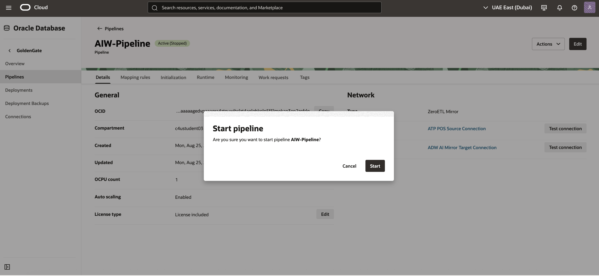
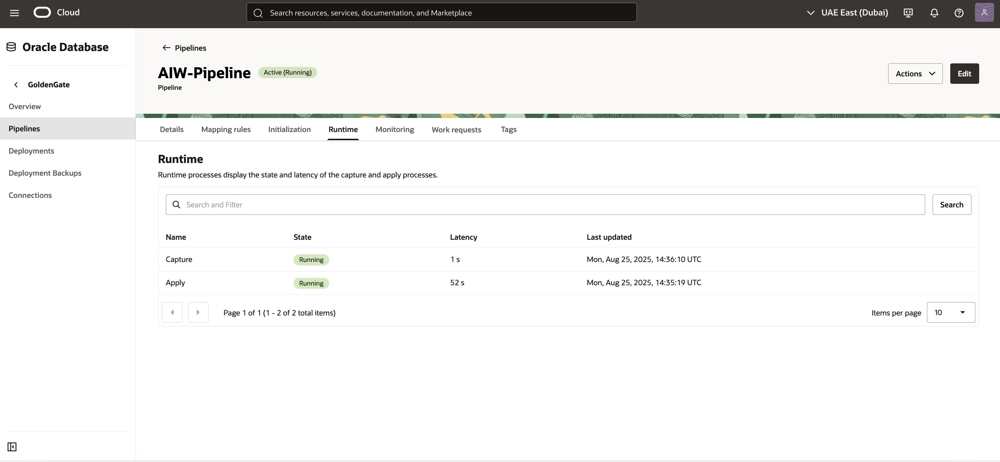

# Lab 1: Create the OCI GoldenGate ZeroETL

## Introduction
In this lab, you learn to create an Oracle Cloud Infrastructure (OCI) GoldenGate pipeline.

Estimated time: 20 minutes

**About Oracle Cloud Infrastructure GoldenGate pipelines**

A Oracle Cloud Infrastructure GoldenGate pipeline lets you configure real time data replication flows that support mission critical use cases such as analytics, operational reporting, and hybrid cloud integrations. You can create a pipeline to stream data directly from operational databases to analytical environments without traditional extract, transform, load (ETL) processes. For example, you can set up a pipeline to directly replicate data from Autonomous Transaction Processing to Autonomous Data Warehouse with minimal configuration.

## Task 1: Create the pipeline

1. In the Oracle Cloud console navigation menu, select **Oracle Database**, and then **GoldenGate**. 

2. On the GoldenGate Overview page, in the **GoldenGate** menu, click **Pipelines**.

3. On the Data fabric pipelines page, for **Applied filters**, select the correct compartment in which to create the pipeline.

	

4. Click **Create pipeline**. The Create ZeroETL Mirror pipeline page appears. 

5. In the Create ZeroETL Mirror pipeline page, complete the fields as follows, and then click **Create pipeline**.

   * For **Name**, enter AIW-Pipeline and optionally, a description.
   * For **Choose a license type**, select **Licenses included**.
   * For **Source connection**, select **ATP POS Source Connection** from the dropdown.
   * For **Target connection**, select **ADW AI Mirror Target Connection** from the dropdown.

  

## Task 2: Check Source and Target

1. After the pipeline is Active, select the piplien to open the its details page.

2. On the details page, locate the Source and Target Connection section.

  

3. Click Test Connection. Both source and target tests should display Success.

  

  If either fails, check credentials, networking, and endpoint configuration before retrying.

    > **Note:** The test connection may fail the first time with a timeout error (e.g., “Cause: Failed to connect to adb.me-dubai-1.oraclecloud.com:1522, reason: curl: (28) Resolving timed out after 5000 milliseconds”). This is expected behavior. Running the test a second time typically returns a Success result.

4. Once both connections are tested successfully, navigate to the ATP (source) and ADW (target) by clicking on the respective connection names from the pipeline Details page.

5. For each (ATP and ADW), click on Actions → SQL.

6. Run the following SQL command on **both the source (ATP)** and the **target (ADW)** to check the row count for the `POS_ORDER` table:  

    <pre> SELECT COUNT(*) FROM YAN_POS.POS_ORDER; </pre>

## Task 3: Add mapping rules

1. In the Pipelines page, select the pipeline.

2. Update Mapping Rule:
 
   On the **Pipeline Details** page, click on the **Mapping rules** tab.  
   Locate the default `Include` rule (`*.* → *.*`).  
   Click the **three dots (⋮)** menu on the right and select **Edit**. 
    
   Change the default rule to YAN_POS.*: 
    

3. After saving, the pipeline status will briefly change to **Updating**. Wait a few seconds until it returns to **Active** with the updated mapping rule. Then Click Preview.
 

4. In the Preview mapping dialog, expand the YAN_POS Orders schema and review the list of related tables that are going to be replicated. Select Cancel to close the dialog. 

## Task 4: Start the pipeline

1. In the pipelines details page, expand the Actions menu, and then click Start.
 

2. In the Start pipeline dialog, click Start.
 

3. On the pipeline's details page, click Initialization. The Initialization steps displays the current status of the pipeline steps. For each step, you can select View details from its Actions menu and review corresponding messages.
 

4. On the pipeline's details page, click Runtime to view the state and latency of the Capture and Apply processes.
 

## Task 5: Review Processes and Metrics Once Started
1. Once the pipeline is running, open the **Runtime** section.  
2. Check process state, latency, and Last Updated metrics.
 
3. Insert sample product rows into the source database, then validate that the changes are replicated to the target database through SQL Developer.    

   i.   Connect to the Source ATP Database -> SQL Web Developer.
    
   
   ii.  Use ADMIN user credentials from the View login info screen.
   
   iii. Expand the schema YAN_POS and verify that the PRODUCT table exists.

   Run these on Source and Target to record current row counts before inserting:
   
    -- Source ATP
     <pre> SELECT COUNT(*) AS src_count_before FROM YAN_POS.PRODUCT; </pre>

     -- Target ADW
     <pre> SELECT COUNT(*) AS tgt_count_before FROM YAN_POS.PRODUCT; </pre>

  
      iv.  Run Insert Statements on Source ATP

    Copy and paste the following SQL statements into a worksheet connected to the Source ATP:
   

     <pre> 
    INSERT INTO YAN_POS.PRODUCT (PRODUCT_ID, PRODUCT_NAME, PRODUCT_DESCRIPTION, PRICE, COST, ACTIVE) VALUES
    (2000, '4K Ultra HD Monitor - 27 inch', 'IPS panel with 3840x2160 resolution, HDR10, 144Hz refresh rate, and USB-C connectivity.', 399.99, 245.00, 'Y');

   INSERT INTO YAN_POS.PRODUCT (PRODUCT_ID, PRODUCT_NAME, PRODUCT_DESCRIPTION, PRICE, COST, ACTIVE) VALUES
   (3000, 'NVMe Gen4 SSD - 2TB', 'High-speed PCIe Gen4 solid-state drive, 7,000 MB/s read, 6,850 MB/s write speeds.', 229.99, 142.75, 'Y');

   INSERT INTO YAN_POS.PRODUCT (PRODUCT_ID, PRODUCT_NAME, PRODUCT_DESCRIPTION, PRICE, COST, ACTIVE) VALUES
   (4000, 'Wireless Mechanical Keyboard', 'Hot-swappable switches, compact 75% layout, Bluetooth + 2.4GHz with PBT keycaps.', 129.50, 68.20, 'Y');

   INSERT INTO YAN_POS.PRODUCT (PRODUCT_ID, PRODUCT_NAME, PRODUCT_DESCRIPTION, PRICE, COST, ACTIVE) VALUES
   (5000, 'USB-C Docking Station', 'Dual 4K display output, 100W PD, Gigabit Ethernet, 6x USB ports.', 189.00, 112.40, 'Y');

   INSERT INTO YAN_POS.PRODUCT (PRODUCT_ID, PRODUCT_NAME, PRODUCT_DESCRIPTION, PRICE, COST, ACTIVE) VALUES
   (6000, 'Noise-Cancelling Headphones', 'Over-ear ANC with 30-hour battery life and multi-point pairing.', 249.99, 135.00, 'Y');

   INSERT INTO YAN_POS.PRODUCT (PRODUCT_ID, PRODUCT_NAME, PRODUCT_DESCRIPTION, PRICE, COST, ACTIVE) VALUES
   (7000, '1080p USB Conference Camera', 'Wide 95° FOV, dual mics, low-light enhancement, privacy shutter.', 89.95, 41.30, 'Y');

   INSERT INTO YAN_POS.PRODUCT (PRODUCT_ID, PRODUCT_NAME, PRODUCT_DESCRIPTION, PRICE, COST, ACTIVE) VALUES
   (8000, 'Portable 2TB HDD', 'USB 3.2 Gen1 external hard drive, shock-resistant enclosure.', 79.99, 49.10, 'Y');

   INSERT INTO YAN_POS.PRODUCT (PRODUCT_ID, PRODUCT_NAME, PRODUCT_DESCRIPTION, PRICE, COST, ACTIVE) VALUES
   (9000, 'Wi-Fi 6 Router', 'Tri-band AX5400 with OFDMA, MU-MIMO, and WPA3 security.', 169.00, 98.75, 'Y');

   INSERT INTO YAN_POS.PRODUCT (PRODUCT_ID, PRODUCT_NAME, PRODUCT_DESCRIPTION, PRICE, COST, ACTIVE) VALUES
   (10000, 'Ergonomic Office Chair', 'Adjustable lumbar support, breathable mesh back, tilt lock.', 299.00, 165.00, 'N');

   INSERT INTO YAN_POS.PRODUCT (PRODUCT_ID, PRODUCT_NAME, PRODUCT_DESCRIPTION, PRICE, COST, ACTIVE) VALUES
   (11000, '27W GaN Fast Charger', 'Compact wall charger with USB-C PD and foldable prongs.', 34.99, 12.60, 'Y');

   -- Commit if your environment is not autocommit
   COMMIT;
   </pre>

4. Ensure there are no errors in the replication flow.  
5. Review Source and Target Schemas  
  a. Connect to both the source and target databases.  
  b. Verify that the schemas and tables are correctly created and populated.  
  c. Ensure data changes in the source are reflected in the target in real time.
     <pre>
     SELECT COUNT(*) AS tgt_count_before FROM YAN_POS.PRODUCT; 
     SELECT * FROM YAN_POS.PRODUCT WHERE PRODUCT_ID BETWEEN 2000 AND 11000; </pre>

## Outcomes
By the end of this lab, you will be able to:
* Navigate the OCI GoldenGate console and identify the ZeroETL pipeline interface.  
* Create, map, and initialize a ZeroETL pipeline between YAN_POS Orders and ADW.  
* Monitor replication processes, metrics, and troubleshoot replication lag or errors.  
* Confirm that replicated schemas and data are available in the target ADW for downstream use.  

## Acknowledgements
* **Author** - Shrinidhi Kulkarni, GoldenGate Product Manager
* **Reviewed By**  - Denis Gray,  Vice President, GoldenGate Product Management
* **Last Updated By/Date** - Shrinidhi Kulkarni, August 2025