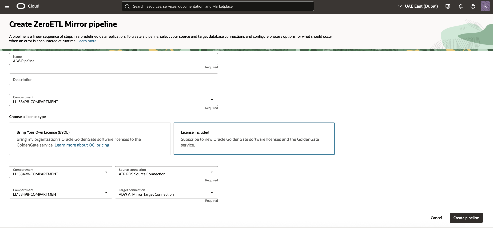

# Create the OCI GoldenGate ZeroETL

## Introduction
In this lab, you learn to create an Oracle Cloud Infrastructure (OCI) GoldenGate pipeline.

Estimated time: 20 minutes

### About Oracle Cloud Infrastructure GoldenGate pipelines

A Oracle Cloud Infrastructure GoldenGate pipeline lets you configure real time data replication flows that support mission critical use cases such as analytics, operational reporting, and hybrid cloud integrations. You can create a pipeline to stream data directly from operational databases to analytical environments without traditional extract, transform, load (ETL) processes. For example, you can set up a pipeline to directly replicate data from Autonomous Transaction Processing to Autonomous Data Warehouse with minimal configuration.

### Objectives

In this lab, you:

  * Navigate the OCI GoldenGate console and identify the ZeroETL pipeline interface.  
  * Create, map, and initialize a ZeroETL pipeline between YAN_POS Orders and ADW.  
  * Monitor replication processes, metrics, and troubleshoot replication lag or errors.  
  * Confirm that replicated schemas and data are available in the target ADW for downstream use. 

## Task 1: Create the pipeline

1. In the Oracle Cloud console navigation menu, select **Oracle Database**, and then **GoldenGate**. 

2. On the GoldenGate Overview page, in the **GoldenGate** menu, click **Pipelines**.

3. On the Data fabric pipelines page, for **Applied filters**, select the correct compartment in which to create the pipeline.

	

4. Click **Create pipeline**. The Create ZeroETL Mirror pipeline page appears. 

5. In the Create ZeroETL Mirror pipeline page, complete the fields as follows, and then click **Create pipeline**.

   * For **Name**, enter AIW-Pipeline and optionally, a description.
   * For **Choose a license type**, select **Licenses included**.
   * For **Source connection**, select **ATP POS Source Connection** from the dropdown.
   * For **Target connection**, select **ADW AI Mirror Target Connection** from the dropdown.

  

## Task 2: Check Source and Target

1. After the pipeline is **Active**, select the pipeline to open the its details page.

2. On the details page, click **Test connection** for both **Source connection** and **Target connection**.

  

3. The Test connection dialog for both source and target tests should return **Success**.

  

  If either test fails, check the credentials, networking, and endpoint configuration of the connection before you retry.

    > **Note:** The test connection may fail the first time with a timeout error (e.g., “Cause: Failed to connect to adb.me-dubai-1.oraclecloud.com:1522, reason: curl: (28) Resolving timed out after 5000 milliseconds”). This is expected behavior. Running the test a second time typically returns a Success result.

4. After both connection tests are successful, click the source connection name to view the source connection's details.

  > **Tip:** Open the source and target database details in a new browser tab because you'll need them later.

5. On the source connection's details page, from the **Actions** menu, select **SQL**. 

6. To check the row count for the `POS_ORDER` table, paste the follow command into the SQL worksheet and then click **Run script**.

    ```
    <copy>SELECT COUNT(*) FROM YAN_POS.POS_ORDER;</copy>
    ```

7. Repeat **steps 4 to 6** for the target connection.

## Task 3: Add mapping rules

1. Return to the GoldenGate Pipelines page. 

2. Select the **AIW-Pipeline** pipeline.

3. On the AIW-Pipeline details page, click **Mapping rules**. 

4. For the `Include` rule, select **Edit** from its **Actions** menu.  

    

5. In the Edit mapping rule panel, change the default rule to `YAN_POS.*` for both the **Source** and **Target** fields, and then click **Update**.

    

6. You return to the AIW-Pipeline Mapping rules page. The pipeline status changes to **Updating**. After the pipeline is **Active** again, click **Preview**.

   

7. In the Preview mapping panel, expand **YAN_POS** Source schema Orders schema and review the list of related tables to replicate. Click **Cancel** to close the dialog. 

   

## Task 4: Start the pipeline

1. On the pipelines details page, from the pipeline's **Actions** menu, select **Start**.

   

2. In the Start pipeline dialog, click **Start**.

   

3. On the pipeline's details page, click **Initialization**. The Initialization page displays the status of the pipeline steps. For each step, you can select **View details** from its **Actions** menu and review corresponding messages.

   

4. On the pipeline's details page, click **Runtime** to view the state and latency of the Capture and Apply processes.

  

## Task 5: Verify replication from source to target

Insert sample product rows into the source database, then validate that the changes are replicated to the target database through SQL Developer.    

1.  Return to the **Source ATP database** details page. 

2.  On the database details page, from the **Actions** menu, select **SQL**.

     
   
3.  Use the ADMIN user credentials from the **View login info** panel of your workshop instructions to log in.
   
4.  In the left navigation, expand the schema **YAN_POS** and verify that the PRODUCT table exists.

5.  Run the following script to record the current row count:

     ```
     <copy> SELECT COUNT(*) AS src_count_before FROM YAN_POS.PRODUCT;</copy>
     ```

6.  Repeat **steps 1 to 4** for the **Target ADW database**.

7.  Run the following script to record the current row count:

     ```
     <copy> SELECT COUNT(*) AS tgt_count_before FROM YAN_POS.PRODUCT;</copy>
     ```
  
8.  In the Source ATP SQL Worksheet, copy and paste the following statements:

    ```
    <copy> 
    INSERT INTO YAN_POS.PRODUCT (PRODUCT_ID, PRODUCT_NAME, PRODUCT_DESCRIPTION, PRICE, COST, ACTIVE) VALUES
    (2000, '4K Ultra HD Monitor - 27 inch', 'IPS panel with 3840x2160 resolution, HDR10, 144Hz refresh rate, and USB-C connectivity.', 399.99, 245.00, 'Y');

   INSERT INTO YAN_POS.PRODUCT (PRODUCT_ID, PRODUCT_NAME, PRODUCT_DESCRIPTION, PRICE, COST, ACTIVE) VALUES
   (3000, 'NVMe Gen4 SSD - 2TB', 'High-speed PCIe Gen4 solid-state drive, 7,000 MB/s read, 6,850 MB/s write speeds.', 229.99, 142.75, 'Y');

   INSERT INTO YAN_POS.PRODUCT (PRODUCT_ID, PRODUCT_NAME, PRODUCT_DESCRIPTION, PRICE, COST, ACTIVE) VALUES
   (4000, 'Wireless Mechanical Keyboard', 'Hot-swappable switches, compact 75% layout, Bluetooth + 2.4GHz with PBT keycaps.', 129.50, 68.20, 'Y');

   INSERT INTO YAN_POS.PRODUCT (PRODUCT_ID, PRODUCT_NAME, PRODUCT_DESCRIPTION, PRICE, COST, ACTIVE) VALUES
   (5000, 'USB-C Docking Station', 'Dual 4K display output, 100W PD, Gigabit Ethernet, 6x USB ports.', 189.00, 112.40, 'Y');

   INSERT INTO YAN_POS.PRODUCT (PRODUCT_ID, PRODUCT_NAME, PRODUCT_DESCRIPTION, PRICE, COST, ACTIVE) VALUES
   (6000, 'Noise-Cancelling Headphones', 'Over-ear ANC with 30-hour battery life and multi-point pairing.', 249.99, 135.00, 'Y');

   INSERT INTO YAN_POS.PRODUCT (PRODUCT_ID, PRODUCT_NAME, PRODUCT_DESCRIPTION, PRICE, COST, ACTIVE) VALUES
   (7000, '1080p USB Conference Camera', 'Wide 95° FOV, dual mics, low-light enhancement, privacy shutter.', 89.95, 41.30, 'Y');

   INSERT INTO YAN_POS.PRODUCT (PRODUCT_ID, PRODUCT_NAME, PRODUCT_DESCRIPTION, PRICE, COST, ACTIVE) VALUES
   (8000, 'Portable 2TB HDD', 'USB 3.2 Gen1 external hard drive, shock-resistant enclosure.', 79.99, 49.10, 'Y');

   INSERT INTO YAN_POS.PRODUCT (PRODUCT_ID, PRODUCT_NAME, PRODUCT_DESCRIPTION, PRICE, COST, ACTIVE) VALUES
   (9000, 'Wi-Fi 6 Router', 'Tri-band AX5400 with OFDMA, MU-MIMO, and WPA3 security.', 169.00, 98.75, 'Y');

   INSERT INTO YAN_POS.PRODUCT (PRODUCT_ID, PRODUCT_NAME, PRODUCT_DESCRIPTION, PRICE, COST, ACTIVE) VALUES
   (10000, 'Ergonomic Office Chair', 'Adjustable lumbar support, breathable mesh back, tilt lock.', 299.00, 165.00, 'N');

   INSERT INTO YAN_POS.PRODUCT (PRODUCT_ID, PRODUCT_NAME, PRODUCT_DESCRIPTION, PRICE, COST, ACTIVE) VALUES
   (11000, '27W GaN Fast Charger', 'Compact wall charger with USB-C PD and foldable prongs.', 34.99, 12.60, 'Y');

   COMMIT;
   </copy>
   ```

9.  Ensure there are no errors in the replication flow.  How?

10. Review Source and Target Schemas  
  a. Connect to both the source and target databases.  How? SQL developer?
  b. Verify that the schemas and tables are correctly created and populated.  In the schema/table menu again?
  c. Ensure data changes in the source are reflected in the target in real time.

    ```
     <copy>SELECT COUNT(*) AS tgt_count_before FROM YAN_POS.PRODUCT; 
     SELECT * FROM YAN_POS.PRODUCT WHERE PRODUCT_ID BETWEEN 2000 AND 11000;</copy> 
    ```

## Acknowledgements
* **Author** - Shrinidhi Kulkarni, GoldenGate Product Manager
* **Reviewed By**  - Denis Gray,  Vice President, GoldenGate Product Management
* **Last Updated By/Date** - Jenny Chan, September 2025