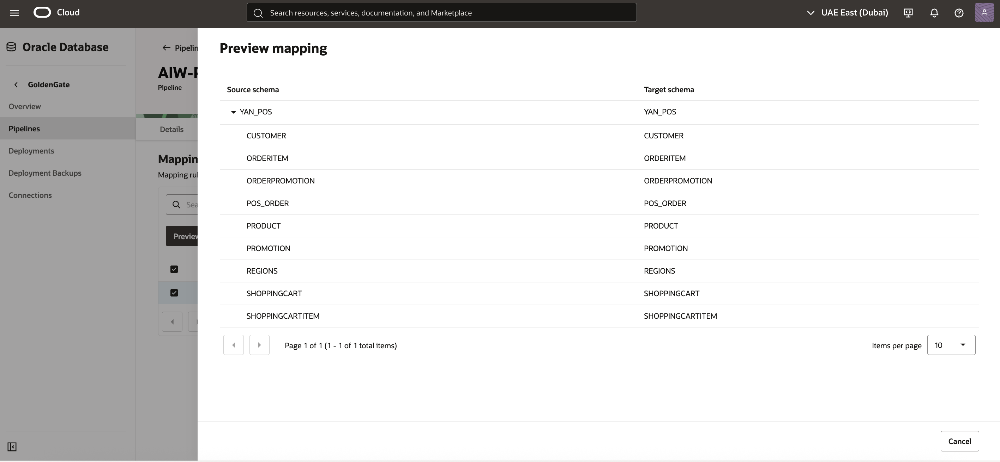
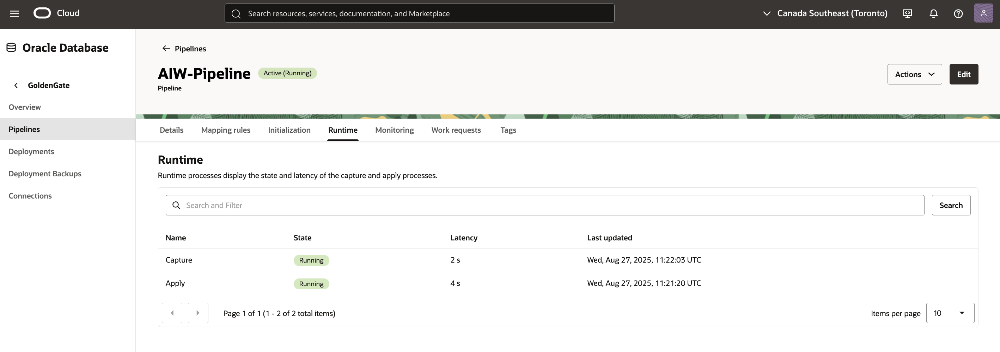

# Create the OCI GoldenGate ZeroETL

## Introduction
In this lab, you learn to create an Oracle Cloud Infrastructure (OCI) GoldenGate pipeline.

Estimated time: 20 minutes

### About Oracle Cloud Infrastructure GoldenGate pipelines

A Oracle Cloud Infrastructure GoldenGate pipeline lets you configure real time data replication flows that support mission critical use cases such as analytics, operational reporting, and hybrid cloud integrations. You can create a pipeline to stream data directly from operational databases to analytical environments without traditional extract, transform, load (ETL) processes. For example, you can set up a pipeline to directly replicate data from Autonomous Transaction Processing to Autonomous Data Warehouse with minimal configuration.

### Objectives

In this lab, you:

  * Navigate the OCI GoldenGate console and identify the ZeroETL pipeline interface.  
  * Create, map, and initialize a ZeroETL pipeline between YAN_POS Orders and ADW.  
  * Monitor replication processes, metrics, and troubleshoot replication lag or errors.  
  * Confirm that replicated schemas and data are available in the target ADW for downstream use. 

> **Tips:** 
>
> * Ensure that you enter names and values as directed.
>  * When using SQL Developer, always click **Run script**, not Run statement, to ensure that you run the entire script.

### Prerequisites

Before you begin this lab:

* Ensure that you have followed the instructions in the Get Started lab to log in to the workshop environment. You can ignore multifactor authentication, but do reset your password when prompted.
* Check that you're logged in to the correct region. Refer to the Reservation Information panel to check your assigned region, then change regions in the Oracle Cloud console if needed.

## Task 1: Create the pipeline

1. In the Oracle Cloud console navigation menu, select **Oracle Database**, and then **GoldenGate**. 

  

2. On the GoldenGate Overview page, in the **GoldenGate** menu, click **Pipelines**.

  

3. On the Data fabric pipelines page, for **Applied filters**, select the LiveLabs compartment that you were assigned from the dropdown. Workshop compartments are located under LiveLabs, or you can use the search field. 

    > **NOTE:** Refer to the Reservation Information panel to check your assigned compartment. If you don't choose the correct compartment, you won't be able to create a pipeline. 

	  

4. Click **Create pipeline**. The Create ZeroETL Mirror pipeline page opens. 

  

5. In the Create ZeroETL Mirror pipeline page, complete the fields as follows, and then click **Create pipeline**.

   * For **Name**, enter `AIW-Pipeline` and optionally, a description.
   * For **Choose a license type**, select **Licenses included**.
   * For **Source connection**, select **ATP POS Source Connection** from the dropdown.
   * For **Target connection**, select **ADW AI Mirror Target Connection** from the dropdown.

  

You're brought to the AIW-Pipeline details page, where the pipeline's status is **Creating**. It will take a few moments for it to become **Active**. You may need to refresh the page to view its updated status.

## Task 2: Check Source and Target

1. On the AIW-Pipeline details page, click **Test connection** for both **Source connection** and **Target connection**.

  

2. The Test connection dialog for both source and target tests should return **Success**.

  

  If either test fails, check the credentials, networking, and endpoint configuration of the connection before you retry.

    > **Note:** The test connection may fail the first time with the timeout error: “Failed to connect to adb.<region>.com:1522, reason: curl: (28) Resolving timed out after 5000 milliseconds”. This is expected behavior. Running the test a second time typically returns a Success result.

3. After both connection tests are successful, click the source connection name to view the source connection's details.

   

    > **Tip:** Open the source and target connection details in a new browser tab or window because you'll need them later.

4. On the **ATP POS Source Connection** details page, under **Connection information**, click the **Database** name.

   

5. On the source ATP database details page, from the **Database actions** menu, select **SQL**. 

   

6. Copy and paste the following command into SQL Developer to check the row count for the `POS_ORDER` table, and then click **Run script**.

    ```
    <copy>SELECT COUNT(*) FROM YAN_POS.POS_ORDER;</copy>
    ```

   The total table count returned should be 22.

7. Repeat **steps 3 to 6** for the target connection.

   The Query Result returned should return an error saying the table does not exist.

## Task 3: Add mapping rules

1. In your web browser, return to the GoldenGate Pipelines page and select the **AIW-Pipeline** pipeline.

2. On the AIW-Pipeline details page, click **Mapping rules**. 

   

3. On the Mapping rules page, for the **Include** rule, select **Edit** from its **Actions** menu.  

    

4. In the Edit mapping rule panel, change the default rule to `YAN_POS.*` for both the **Source** and **Target** fields, and then click **Update**.

    

6. You return to the AIW-Pipeline Mapping rules page. The pipeline status changes to **Updating**. After the pipeline is **Active** again, click **Preview**.

   

7. In the Preview mapping panel, expand **YAN_POS** Source schema Orders schema and review the list of related tables to replicate. Click **Cancel** to close the dialog. 

   

## Task 4: Start the pipeline

1. On the pipelines details page, from the pipeline's **Actions** menu, select **Start**.

   

2. In the Start pipeline dialog, click **Start**.

   

3. On the pipeline's details page, click **Initialization**. The Initialization page displays the status of the pipeline steps. For each step, you can select **View details** from its **Actions** menu and review corresponding messages.

   

4. On the pipeline's details page, click **Runtime** to view the state and latency of the Capture and Apply processes.

  

## Task 5: Verify replication from source to target

Insert sample product rows into the source database, then validate that the changes are replicated to the target database through SQL Developer.    

1.  Return to the Source ATP SQL tool. 
   
2.  In the left navigation, expand the schema **YAN_POS** and verify that the PRODUCT table exists.

   

3.  In the SQL Worksheet, copy and paste the following script to record the current row count, and then click **Run script**:

     ```
     <copy> SELECT COUNT(*) AS src_count_before FROM YAN_POS.PRODUCT;</copy>
     ```

     Note the row count.

4.  In the Target ADW SQL tool, copy and paste the following script to record the current row count, and then click **Run script**:

     ```
     <copy> SELECT COUNT(*) AS tgt_count_before FROM YAN_POS.PRODUCT;</copy>
     ```
  
    The row count returned should match that of the source.

5.  In the Source ATP SQL Worksheet, clear the worksheet, paste the following statements, and then click **Run script**:

    ```
    <copy> 
    INSERT INTO YAN_POS.PRODUCT (PRODUCT_ID, PRODUCT_NAME, PRODUCT_DESCRIPTION, PRICE, COST, ACTIVE) VALUES
    (2000, '4K Ultra HD Monitor - 27 inch', 'IPS panel with 3840x2160 resolution, HDR10, 144Hz refresh rate, and USB-C connectivity.', 399.99, 245.00, 'Y');

   INSERT INTO YAN_POS.PRODUCT (PRODUCT_ID, PRODUCT_NAME, PRODUCT_DESCRIPTION, PRICE, COST, ACTIVE) VALUES
   (3000, 'NVMe Gen4 SSD - 2TB', 'High-speed PCIe Gen4 solid-state drive, 7,000 MB/s read, 6,850 MB/s write speeds.', 229.99, 142.75, 'Y');

   INSERT INTO YAN_POS.PRODUCT (PRODUCT_ID, PRODUCT_NAME, PRODUCT_DESCRIPTION, PRICE, COST, ACTIVE) VALUES
   (4000, 'Wireless Mechanical Keyboard', 'Hot-swappable switches, compact 75% layout, Bluetooth + 2.4GHz with PBT keycaps.', 129.50, 68.20, 'Y');

   INSERT INTO YAN_POS.PRODUCT (PRODUCT_ID, PRODUCT_NAME, PRODUCT_DESCRIPTION, PRICE, COST, ACTIVE) VALUES
   (5000, 'USB-C Docking Station', 'Dual 4K display output, 100W PD, Gigabit Ethernet, 6x USB ports.', 189.00, 112.40, 'Y');

   INSERT INTO YAN_POS.PRODUCT (PRODUCT_ID, PRODUCT_NAME, PRODUCT_DESCRIPTION, PRICE, COST, ACTIVE) VALUES
   (6000, 'Noise-Cancelling Headphones', 'Over-ear ANC with 30-hour battery life and multi-point pairing.', 249.99, 135.00, 'Y');

   INSERT INTO YAN_POS.PRODUCT (PRODUCT_ID, PRODUCT_NAME, PRODUCT_DESCRIPTION, PRICE, COST, ACTIVE) VALUES
   (7000, '1080p USB Conference Camera', 'Wide 95° FOV, dual mics, low-light enhancement, privacy shutter.', 89.95, 41.30, 'Y');

   INSERT INTO YAN_POS.PRODUCT (PRODUCT_ID, PRODUCT_NAME, PRODUCT_DESCRIPTION, PRICE, COST, ACTIVE) VALUES
   (8000, 'Portable 2TB HDD', 'USB 3.2 Gen1 external hard drive, shock-resistant enclosure.', 79.99, 49.10, 'Y');

   INSERT INTO YAN_POS.PRODUCT (PRODUCT_ID, PRODUCT_NAME, PRODUCT_DESCRIPTION, PRICE, COST, ACTIVE) VALUES
   (9000, 'Wi-Fi 6 Router', 'Tri-band AX5400 with OFDMA, MU-MIMO, and WPA3 security.', 169.00, 98.75, 'Y');

   INSERT INTO YAN_POS.PRODUCT (PRODUCT_ID, PRODUCT_NAME, PRODUCT_DESCRIPTION, PRICE, COST, ACTIVE) VALUES
   (10000, 'Ergonomic Office Chair', 'Adjustable lumbar support, breathable mesh back, tilt lock.', 299.00, 165.00, 'N');

   INSERT INTO YAN_POS.PRODUCT (PRODUCT_ID, PRODUCT_NAME, PRODUCT_DESCRIPTION, PRICE, COST, ACTIVE) VALUES
   (11000, '27W GaN Fast Charger', 'Compact wall charger with USB-C PD and foldable prongs.', 34.99, 12.60, 'Y');

   COMMIT;
   </copy>
   ```

6.  Return to your AIW-Pipeline details page to ensure there are no errors in the replication flow.

7.  In the Source ATP SQL Developer worksheet, copy and paste the following script to ensure YAN_POS tables and data were replicated into ADW with the AIW-Pipeline, and then click **Run script**:

    ```
    <copy>SELECT count(*) FROM user_tables WHERE table_name LIKE 'YAN_POS%';
    SELECT COUNT(*) FROM YAN_POS.pos_order;
    SELECT COUNT(*) FROM YAN_POS.Customer;
    SELECT COUNT(*) FROM YAN_POS.Product;</copy>
    ```

8.  Take note of the record counts.

9.  Repeat step 7 in the ADW SQL Developer worksheet, and compare record counts to the Source ATP. They should match.

You may now **proceed to the next lab**.
6.  Return to your AIW-Pipeline details page to ensure there are no errors in the replication flow.

7. Review Source and Target Schemas  

  * Connect to both the source and target databases using SQL Developer.
  * Verify that the schemas and tables are correctly created and populated.
  * Copy and paste the following script into SQL Developer to ensure data changes in the source are reflected in the target in real time:

    ```
     <copy>SELECT COUNT(*) AS tgt_count_before FROM YAN_POS.PRODUCT; 
     SELECT * FROM YAN_POS.PRODUCT WHERE PRODUCT_ID BETWEEN 2000 AND 11000;</copy> 
    ```

    


You may now **proceed to the next lab**.

## Acknowledgements
* **Author** - Shrinidhi Kulkarni, GoldenGate Product Manager
* **Reviewed By**  - Denis Gray,  Vice President, GoldenGate Product Management
* **Last Updated By/Date** - Jenny Chan, September 2025