# Lab 6: Demo — End-to-End Real-Time AI Point of Sale & AI-Enabled Ops Chat

**Duration:** 20–25 minutes

## Introduction
In this lab, you will run the end-to-end demo that integrates multiple components of your AI Data Platform:
 * OCI GoldenGate ZeroETL – real-time capture of transactional POS orders.
 * JSON Duality View (JDV) in ADW – unified relational + JSON access to data.
 * AI Vector Search – semantic embeddings and similarity search for orders.
 * AI Chat Interface – natural language interaction for both business and operational queries.
 * You will observe:
     - New POS orders flowing into ADW in real time.
     - The AI Agent creating embeddings for each new order and running similarity searches.
     - AI-driven product recommendations and dynamic FOMO marketing descriptions.
     - Conversational queries that cover business insights (orders, items, revenue) and ops metrics (GoldenGate processes, streams, lag, configs, ERDs).

Objectives
By completing this lab, you will be able to:
 * Review the **AI demo app layout** and key panels.
 * Generate dynamic **AI FOMO product descriptions** and **recommendations**.
 * Validate that **JDV inserts** are captured by GoldenGate Data Streams.
 * Confirm the AI Agent creates **vector embeddings** for new orders and performs **similarity search**.
 * Use the chat interface to query **GoldenGate ops metrics** (Extracts, Replicats, lag, heartbeat, streams, configs).
 * Use the chat to query business data (orders, schema metadata, ER diagrams).

## Task 1: Open the AI Demo web application

1.  If you previously closed the GoldenGate LiveLab Status window, you can open it from your **Reservation Information** panel. Click **AI URL**.

2.  On the GoldenGate LiveLabs Status page, click **Continue to Workshop**.

    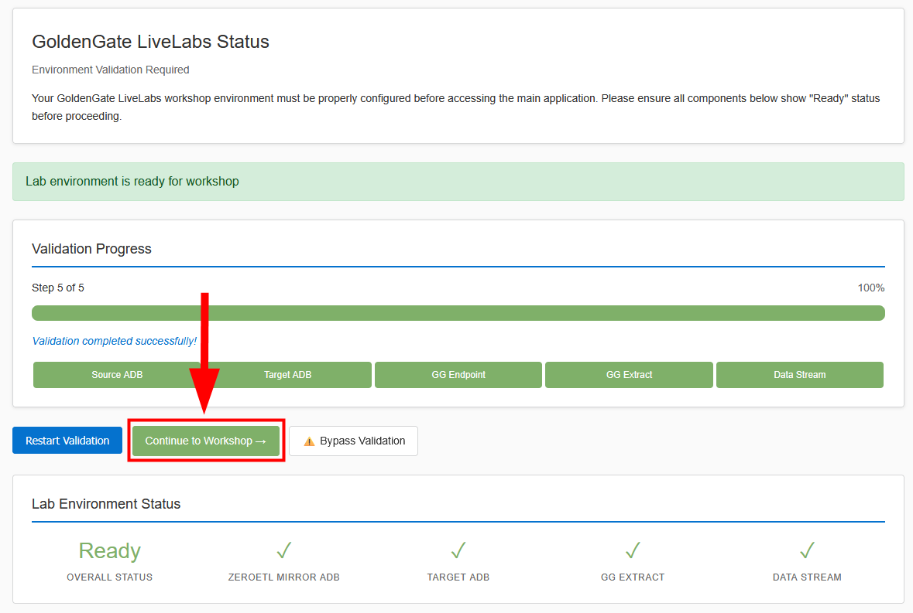

    The Customer POS demo opens.

    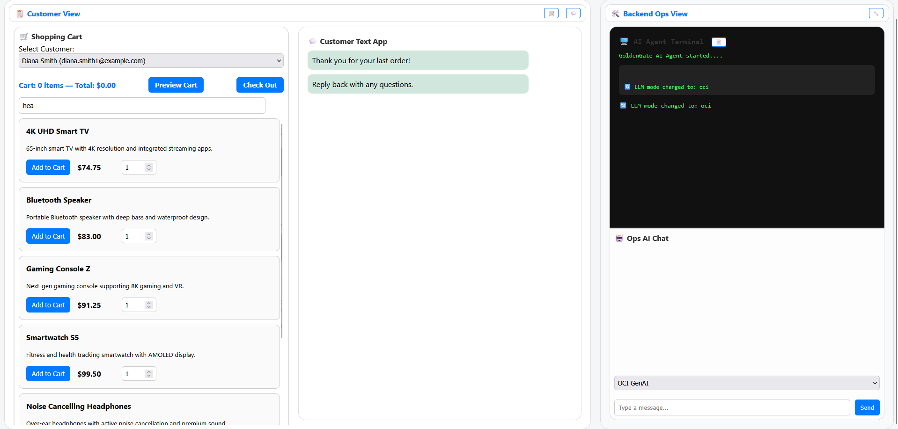

3.  Familiarize yourself with the three panels that make up the Customer POS demo:

    * (Left) **Shopping Cart POS System**: Add products, see order recommendations, view dynamic product descriptions.
    * (Center) **Customer Text App**: Simulates customer-facing responses generated by AI.
    * (Right) **Backend Ops View**: Contains two panels:
        * (Top) **Monitor Outbox Events**: Shows agentic AI activity such as Data Stream events, LLM prompts, and responses.
        * (Bottom) **Ops Chat**: Query operational data using natural language. 

    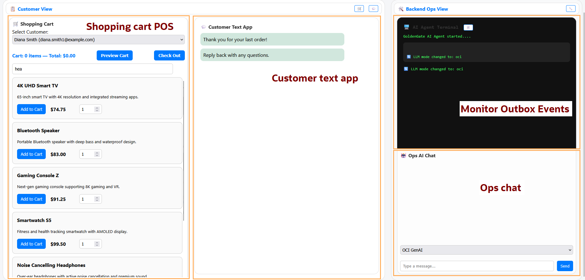

## Task 2: Generate Dynamic AI-Driven FOMO Descriptions

As you interact with the Customer POS system, observe AI creating compelling, urgency-driven product descriptions. For example, “Only 3 left!”, “Trending now!”, “Bestseller this week!”. Learn how product searches trigger outbox events, LLM requests, and live description updates in the Shopping Cart POS System. Experience multiple dynamic rewrites generated in real time. 

1. Search for a product. In the Shopping Cart POS System, enter "Speakers" into the search field. 

    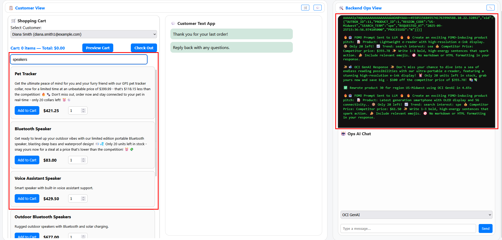

    As you type, the product list updates and a new FOMO description automatically generates based on inventory, competitor price, and other factors as the generated prompt is sent to the LLM. 

2.  Monitor the Outbox Events. Observe an Insert made to YAN\_POS.DYNAMIC\_PRODUCT\_DESCRIPTION\_OUTBOX, captured by AI\_DATASTREAM.  The AI Agent then generated a prompt for the GEN AI LLM to write a FOMO description for the searched product and sent this new description back to the Shopping Cart POS System.

    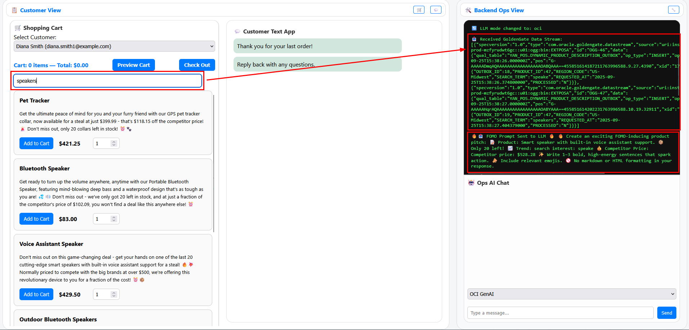

    The generated prompt to the GEN AI LLM is as follows:

    ```
    Received GoldenGate Data Stream: [{"specversion":"1.0","type":"com.oracle.goldengate.datastream","source":"uri:inst-prod-mzfyrudwt6gc::u01:ogg:bin:EXTPOSA","id":"OGG-46","data":{"qual_table":"YAN_POS.DYNAMIC_PRODUCT_DESCRIPTION_OUTBOX","op_type":"INSERT","op_ts":"2025-09-25T15:38:26.000000Z","pos":"G-AAAAADmqAQAAAAAAAAAAAAAAAAAOABQAAA==455851614187211763996588.9.27.4390","xid":"1763996588.9.27.4390","after":{"OUTBOX_ID":18,"PRODUCT_ID":47,"REGION_CODE":"US-Midwest","SEARCH_TERM":"speake","REQUESTED_AT":"2025-09-25T15:38:26.374800000","PROCESSED":"N"}}},{"specversion":"1.0","type":"com.oracle.goldengate.datastream","source":"uri:inst-prod-mzfyrudwt6gc::u01:ogg:bin:EXTPOSA","id":"OGG-47","data":{"qual_table":"YAN_POS.DYNAMIC_PRODUCT_DESCRIPTION_OUTBOX","op_type":"INSERT","op_ts":"2025-09-25T15:38:27.000000Z","pos":"G-AAAAAHqrAQAAAAAAAAAAAAAAAAAOABYAAA==455851614202231763996588.10.19.32911","xid":"1763996588.10.19.32911","after":{"OUTBOX_ID":19,"PRODUCT_ID":47,"REGION_CODE":"US-Midwest","SEARCH_TERM":"speakers","REQUESTED_AT":"2025-09-25T15:38:27.404379000","PROCESSED":"N"}}}]
    ```

    One of the Responses captured:

    ```
    🔥📤 FOMO Prompt Sent to LLM 🔥 🔥 Create an exciting FOMO-inducing product pitch: 📝 Product: Smart speaker with built-in voice assistant support. 📦 Only 20 left! 📈 Trend: search interest: speake 💰 Competitor Price: Competitor price: $528.28 ✨ Write 1–3 bold, high-energy sentences that spark action. 📣 Include relevant emojis. 🚫 No markdown or HTML formatting in your response.

    ✨📬 OCI GenAI Response ✨ Get ready to revolutionize your home with our cutting-edge smart speaker featuring built-in voice assistant support! 🔥 Don't miss out - we have only 20 units left in stock and they're flying off the shelves! ⏰ Snag yours now for a steal at a price that blows the competition's $528.28 out of the water! 💸

    ✅ Rewrote product 47 for region US-Midwest using OCI GenAI in 2.85s
    ```

 3.  Review the updated descriptions for the listed products in the Shopping Cart POS System. 

     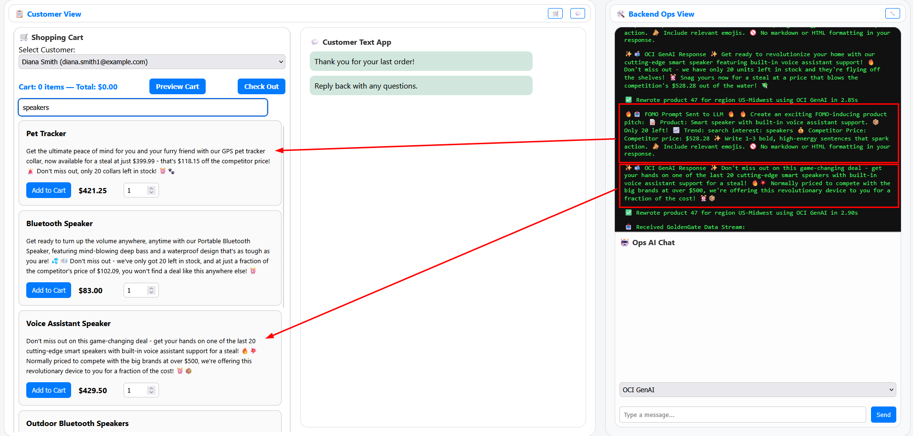

4.  Repeat steps 1 to 3, using different search terms such as, "TV", "headset", or "Vacuum". Observe the dynamic updates in both the Monitor Backend Ops and Shopping Cart panels.

## Task 3: AI Agent Vector Embedding with New Order

Verify that the AI Agent generates a vector embedding row for each new order.

1.  From the product list, add three products to the Shopping Cart.

    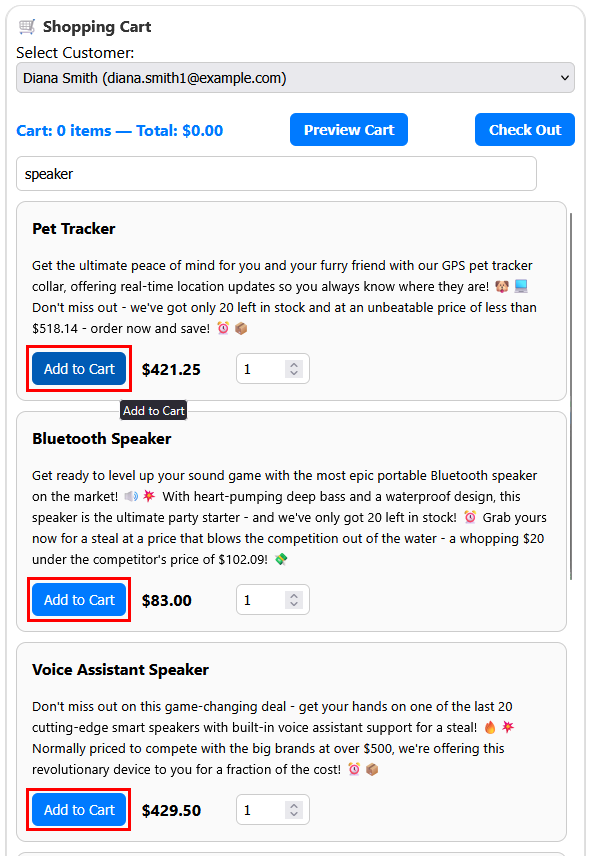

2.  After you add products to the cart, click **Preview Cart**.

    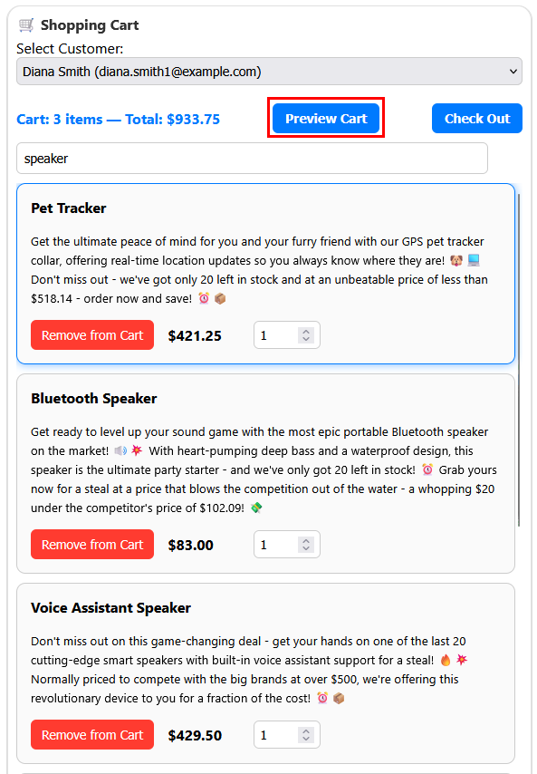

3.  Review your shopping cart, and then click **Check Out**.

    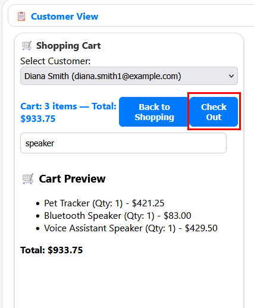

4.  A confirmation dialog appears with your order number. Take note of this order number for use in a later task.

    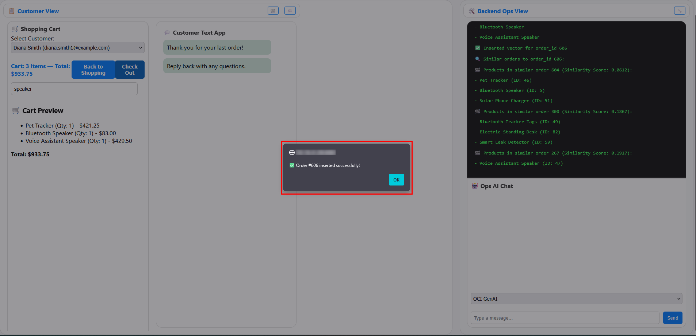

5.  Observe the updates in the Monitor Backend Panel. 

    * Observe the updates in the Monitor Backend Panel. Confirm the Data Stream entry created in YAN\_POS.FULLORDERVIEW.
    
        ```
        📥 Received GoldenGate Data Stream: [{"specversion":"1.0","type":"com.oracle.goldengate.datastream","source":"uri:inst-prod-mzfyrudwt6gc::u01:ogg:bin:EXTPOSA","id":"OGG-66","data":{"qual_table":"YAN_POS.DYNAMIC_PRODUCT_DESCRIPTION_OUTBOX","op_type":"UPDATE","op_ts":"2025-09-25T16:32:37.000000Z","pos":"G-AAAAAEl+AgAAAAAAAAAAAAAAAAAOABYAAA==455854285849531763996588.10.24.33039","xid":"1763996588.10.24.33039","before":{"OUTBOX_ID":27,"PRODUCT_ID":5,"REGION_CODE":"US-Midwest","SEARCH_TERM":"speaker","REQUESTED_AT":"2025-09-25T16:32:31.788987000","PROCESSED":"N"},"after":{"OUTBOX_ID":27,"PROCESSED":"Y"}}}]

        📥 Received GoldenGate Data Stream: [{"specversion":"1.0","type":"com.oracle.goldengate.datastream","source":"uri:inst-prod-mzfyrudwt6gc::u01:ogg:bin:EXTPOSA","id":"OGG-74","data":{"qual_table":"YAN_POS.FULLORDERVIEW","op_type":"INSERT","op_ts":"2025-09-25T17:08:52.000000Z","pos":"G-AAAAAFcnAwAAAAAABAAAAAAAAAAOABUAAA==455855867788441763996588.10.4.33120","xid":"1763996588.10.4.33120","after":{"_ID":"608","DATA":"{\"_id\":608,\"_metadata\":{\"etag\":{\"$binary\":\"FqveXmjX8HDeBIWvgtdd/A==\"},\"asof\":{\"$binary\":\"AAApdbi08tc=\"}},\"order_time\":{\"$oracleTimestamp\":\"2025-09-25T17:08:52\"},\"total_amount\":933.75,\"Customer\":{\"customer_id\":1,\"first_name\":\"Diana\",\"last_name\":\"Smith\",\"email\":\"diana.smith1@example.com\",\"phone_number\":\"555-6585\",\"loyalty_level\":\"Bronze\"},\"Items\":[{\"order_item_id\":60800,\"order_id\":608,\"quantity\":1,\"unit_price\":421.25,\"discount_applied\":0,\"Product\":[{\"product_id\":46,\"product_name\":\"Pet Tracker\",\"product_description\":\"GPS pet tracker collar with real-time location updates.\",\"price\":421.25,\"active\":\"Y\"}]},{\"order_item_id\":60801,\"order_id\":608,\"quantity\":1,\"unit_price\":83,\"discount_applied\":0,\"Product\":[{\"product_id\":5,\"product_name\":\"Bluetooth Speaker\",\"product_description\":\"Portable Bluetooth speaker with deep bass and waterproof design.\",\"price\":83,\"active\":\"Y\"}]},{\"order_item_id\":60802,\"order_id\":608,\"quantity\":1,\"unit_price\":429.5,\"discount_applied\":0,\"Product\":[{\"product_id\":47,\"product_name\":\"Voice Assistant Speaker\",\"product_description\":\"Smart speaker with built-in voice assistant support.\",\"price\":429.5,\"active\":\"Y\"}]}]}"}}}]
        ```

        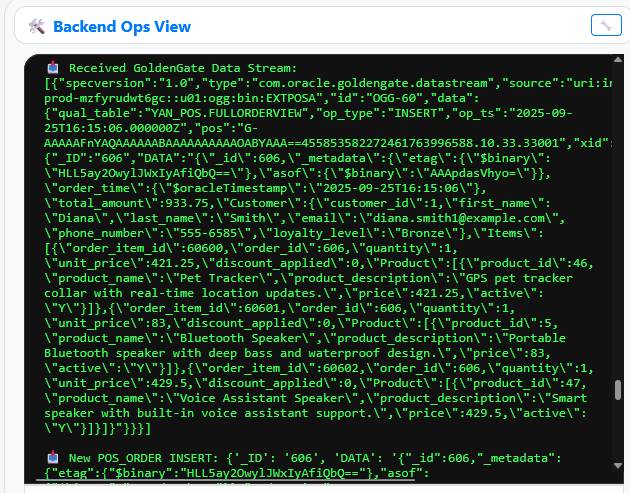
    
    * Vector embedding created and sample displayed.

        ```
        📥 New POS_ORDER INSERT: {'_ID': '608', 'DATA': '{"_id":608,"_metadata":{"etag":{"$binary":"FqveXmjX8HDeBIWvgtdd/A=="},"asof":{"$binary":"AAApdbi08tc="}},"order_time":{"$oracleTimestamp":"2025-09-25T17:08:52"},"total_amount":933.75,"Customer":{"customer_id":1,"first_name":"Diana","last_name":"Smith","email":"diana.smith1@example.com","phone_number":"555-6585","loyalty_level":"Bronze"},"Items":[{"order_item_id":60800,"order_id":608,"quantity":1,"unit_price":421.25,"discount_applied":0,"Product":[{"product_id":46,"product_name":"Pet Tracker","product_description":"GPS pet tracker collar with real-time location updates.","price":421.25,"active":"Y"}]},{"order_item_id":60801,"order_id":608,"quantity":1,"unit_price":83,"discount_applied":0,"Product":[{"product_id":5,"product_name":"Bluetooth Speaker","product_description":"Portable Bluetooth speaker with deep bass and waterproof design.","price":83,"active":"Y"}]},{"order_item_id":60802,"order_id":608,"quantity":1,"unit_price":429.5,"discount_applied":0,"Product":[{"product_id":47,"product_name":"Voice Assistant Speaker","product_description":"Smart speaker with built-in voice assistant support.","price":429.5,"active":"Y"}]}]}'}

        🔎 Summary text: Product ID 46: Pet Tracker - GPS pet tracker collar with real-time location updates. Product ID 5: Bluetooth Speaker - Portable Bluetooth speaker with deep bass and waterproof design. Product ID 47: Voice Assistant Speaker - Smart speaker with built-in voice assistant support.

        🔢 Embedding preview: [-0.002097563, -0.017411005, -0.035664197, -0.008919699, -0.0042027766]

        🛒 Products in current order:

        - Pet Tracker

        - Bluetooth Speaker

        - Voice Assistant Speaker

        ✅ Inserted vector for order_id 608

        ```

        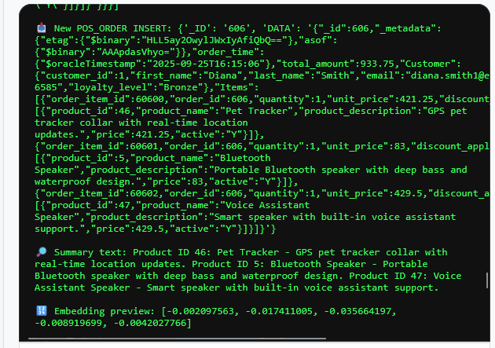
    
    * Similarity search performed against all past carts. Three similar carts returned.

        ```
        🔍 Similar orders to order_id 608:

        🛒 Products in similar order 604 (Similarity Score: 0.0612):

        - Pet Tracker (ID: 46)

        - Bluetooth Speaker (ID: 5)

        - Solar Phone Charger (ID: 51)

        🛒 Products in similar order 300 (Similarity Score: 0.1867):

        - Bluetooth Tracker Tags (ID: 49)

        - Electric Standing Desk (ID: 82)

        - Smart Leak Detector (ID: 59)

        🛒 Products in similar order 267 (Similarity Score: 0.1917):

        - Voice Assistant Speaker (ID: 47)
        ```

        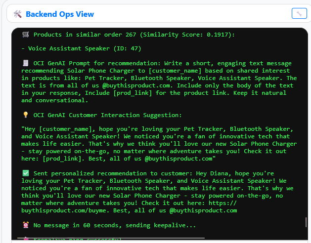

    * First non-matching product identified. Prompt generated for the LLM to create a recommendation.

        ```
        🧾 OCI GenAI Prompt for recommendation: Write a short, engaging text message recommending Solar Phone Charger to [customer_name] based on shared interest in products like: Pet Tracker, Bluetooth Speaker, Voice Assistant Speaker. The text is from all of us @buythisproduct.com. Include only the body of the text in your response, Include [prod_link] for the product link. Keep it natural and conversational.

        💡 OCI GenAI Customer Interaction Suggestion:

        "Hey [customer_name], hope you're enjoying your Pet Tracker, Bluetooth Speaker, and Voice Assistant Speaker! We noticed you love staying connected on-the-go, so we thought you'd be interested in our new Solar Phone Charger It's perfect for outdoor adventures and keeps your devices charged all day long. Check it out here: [prod_link] - all of us @buythisproduct.com"

        ```
    
    * LLM response returned to the Customer Text App.

        ```
        ✅ Sent personalized recommendation to customer: Hey Diana, hope you're enjoying your Pet Tracker, Bluetooth Speaker, and Voice Assistant Speaker! We noticed you love staying connected on-the-go, so we thought you'd be interested in our new Solar Phone Charger It's perfect for outdoor adventures and keeps your devices charged all day long. Check it out here: https://buythisproduct.com/buyme - all of us @buythisproduct.com
        ```
        
        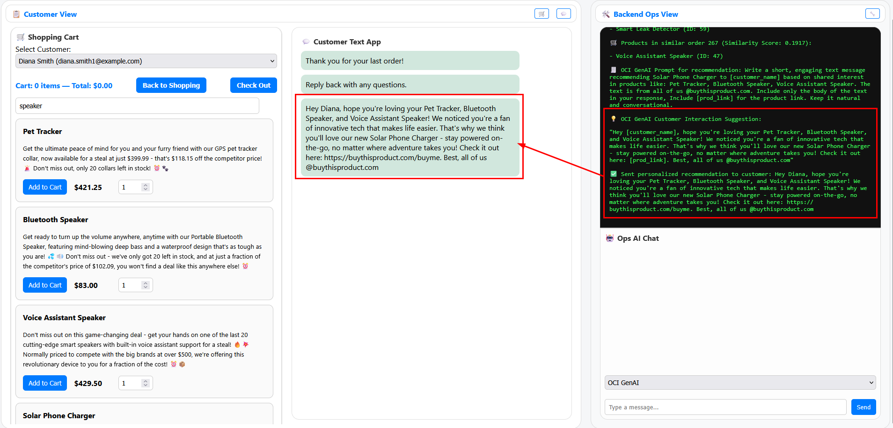

     
6.  Perform another product search, add items to cart, and then checkout without preview. Observe the Monitor Backend Panel and Customer Text App. 
     
## Task 4: GoldenGate Operations using Ops AI Chat

Use the Ops AI Chat to retrieve real-time GoldenGate statistics. Enter the following prompts into the Ops AI Chat and observe the responses.

 * List Extracts
    
    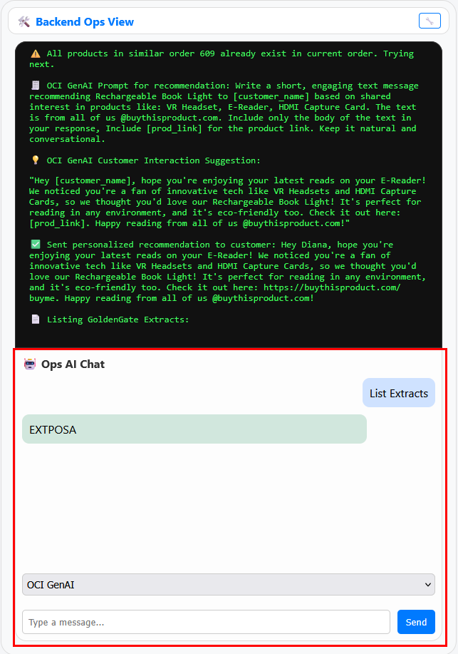

 * Show goldengate statistics

    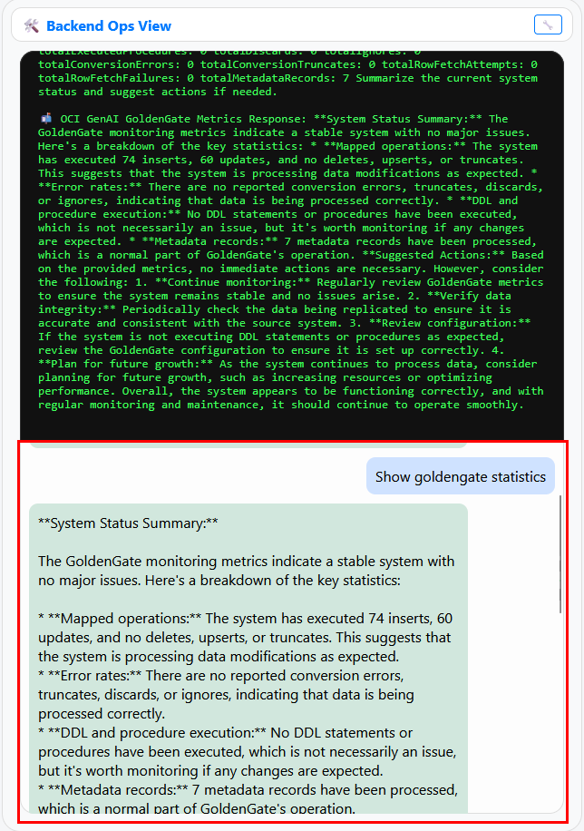
     
 * List data streams

    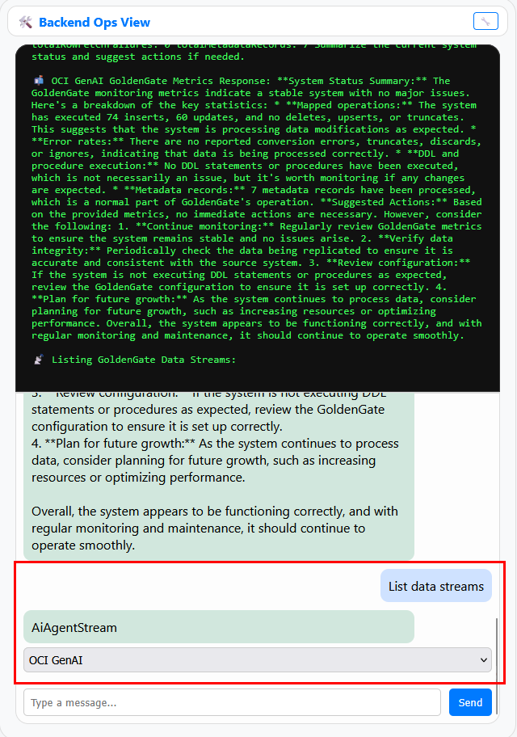

 * Get data stream config AiAgentStream

    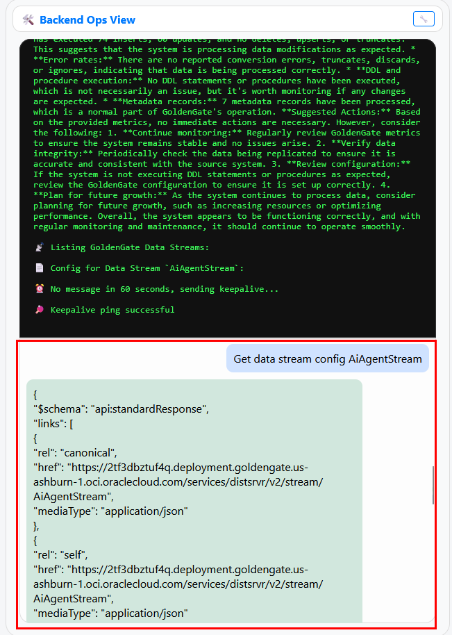

 * Get data stream yaml AiAgentStream

    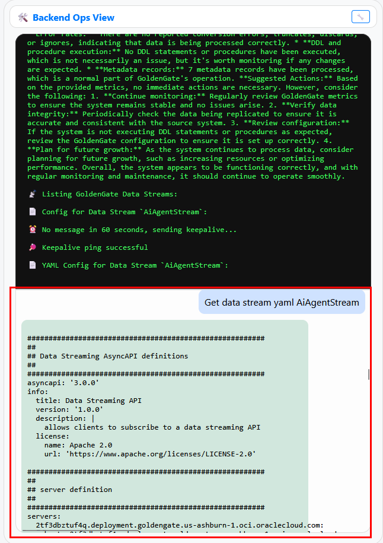

## Task 5: Data Operations via Chat

Use Ops AI Chat to explore the schema and query order data. Enter the following prompts into the Ops AI Chat and observe the responses.

1.  Using the order number from Task 3 step 4, enter `Show order <order-number-here>`. 

    

2.  Next, enter the prompt, `Show schema ER diagram`.

    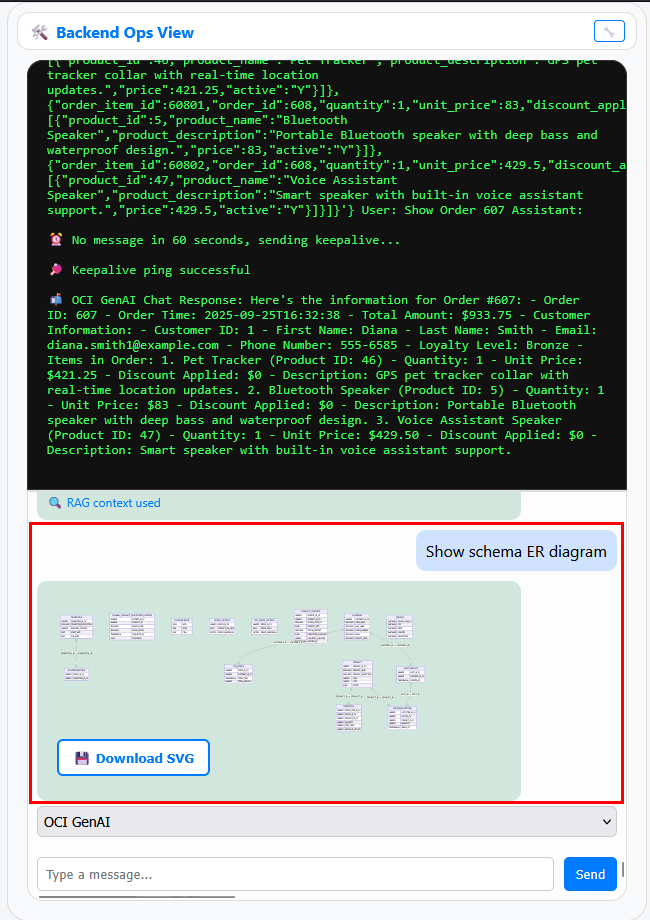

    The response returns a diagram and SVG file you can download.

3.  Enter the prompt, `Is there a table with orders`.

    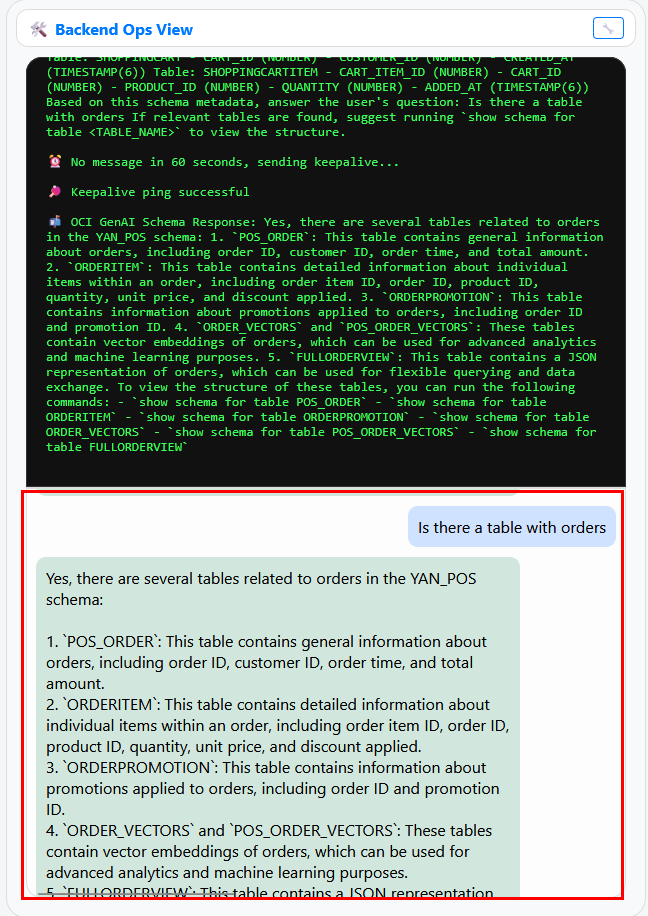

4.  Enter the prompt, `Show schema for table POS_ORDER`. 

    * The LLM realizes there is no connection and prompts you for a connection. Enter `yes` to accept the connection.
    * Retry the original prompt, `Show schema for table POS_ORDER`.

    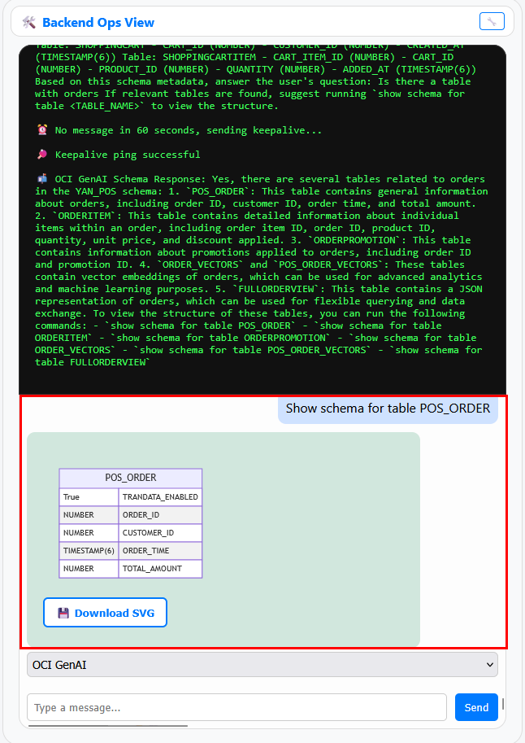

5. Enter the prompt, `Show schema for ORDERITEM`.

    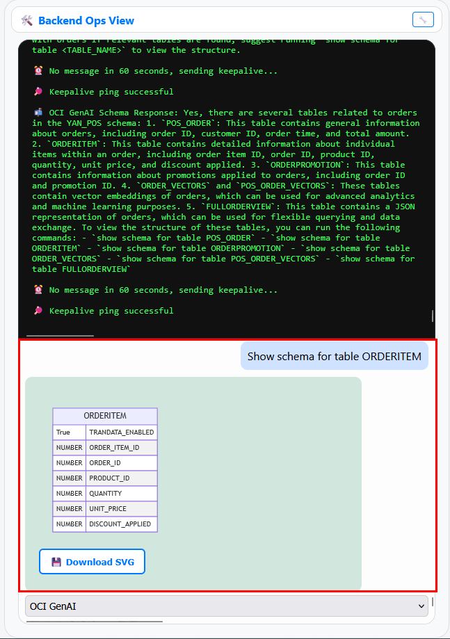

6. Enter the prompt, `Show schema for table FULLORDERVIEW`.

    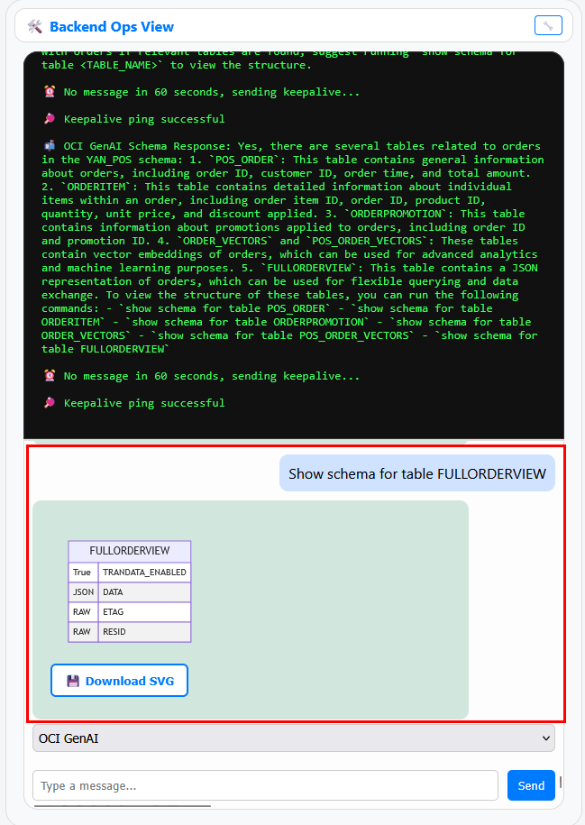

7. Enter the prompt, `Does a data product exist for FULLORDERVIEW`.

    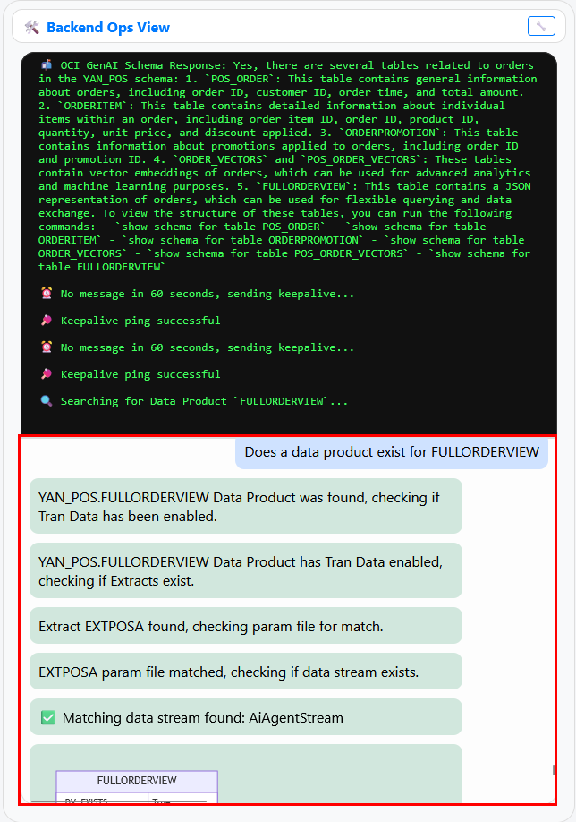
    

## Acknowledgements
* **Author** - Shrinidhi Kulkarni, GoldenGate Product Manager
* **Reviewed By**  - Denis Gray,  Vice President, GoldenGate Product Management
* **Last Updated By/Date** - Jenny Chan, September 2025