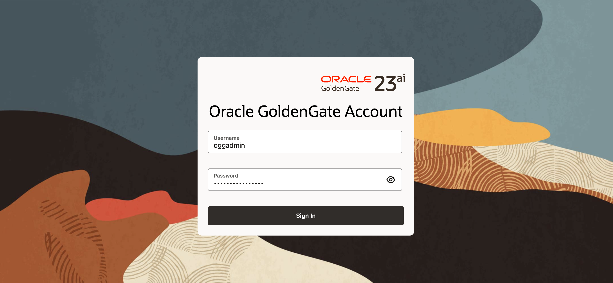
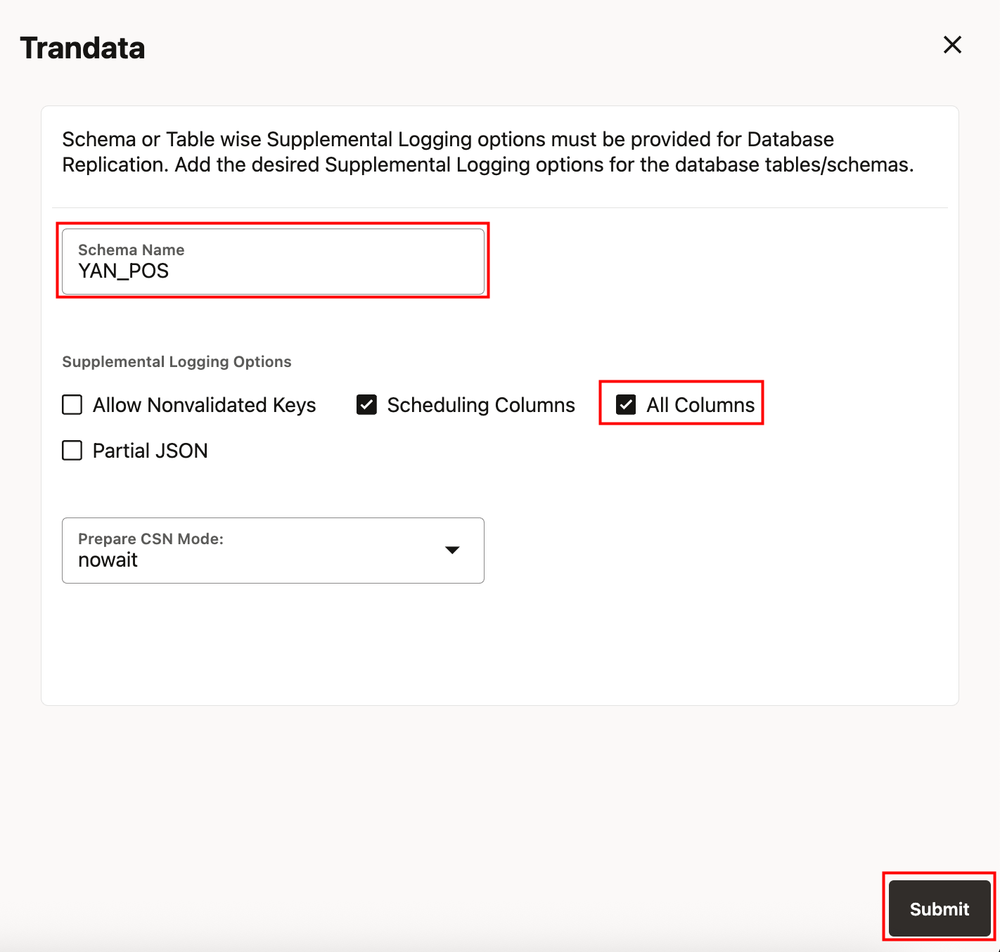
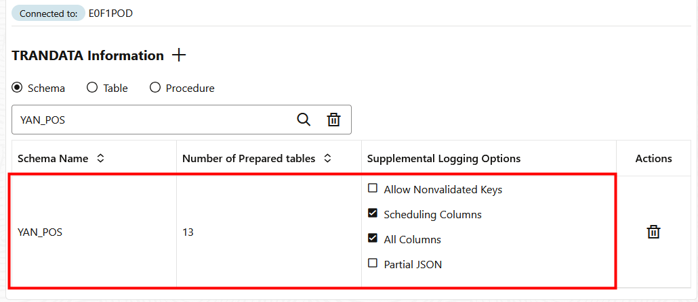
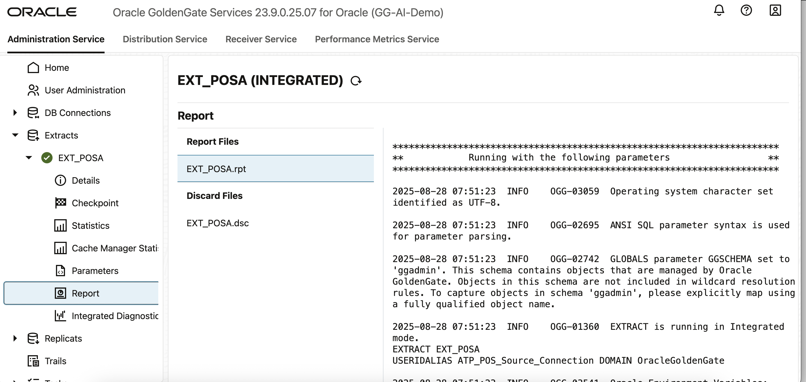
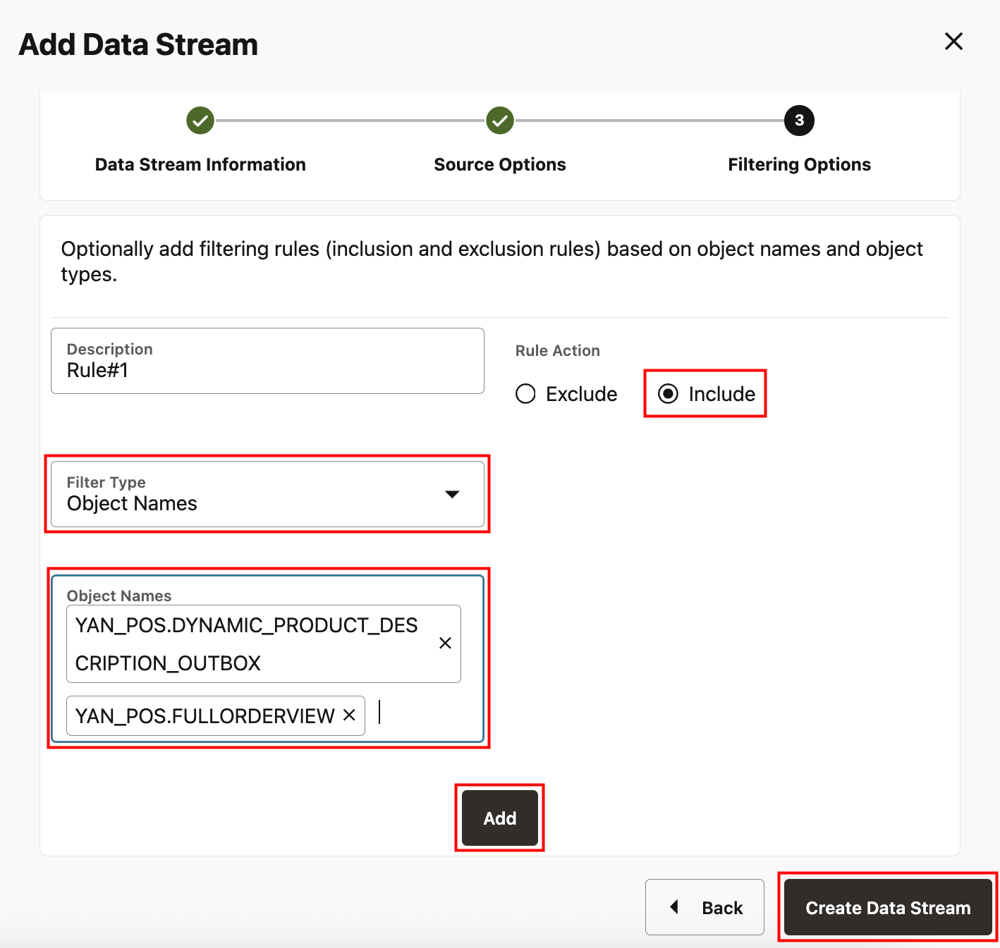
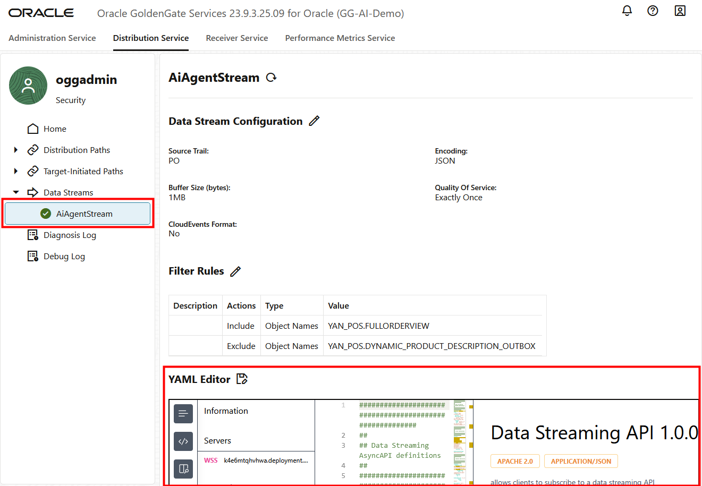

# Lab 4: Create the GoldenGate Extract and Data Stream Processes

**Duration:** 15 minutes  

## Introduction
In this lab, you will configure OCI GoldenGate depoloyment to capture transactional changes from the POS ADW database and stream them into the AI Hub environment. This setup enables a live data feed, ensuring that AI-driven queries work on real-time data.

### Objectives
In this lab, you:

 - Add trandata for source tables in ADW.
 - Create an Extract process to capture transactional changes.
 - Build and run a Data Stream process.
 - Test replication by inserting data into source tables.
 - Monitor GoldenGate statistics for process health.

## Task 1: Add trandata for source tables in ADW

1. Open the GoldenGate Deployment Console
    - In the OCI Console, navigate to:
    ☰ Menu → Oracle Database → GoldenGate.
    - Select your GoldenGate deployment.
    - From the deployment details page, click Launch Console to launch the  GoldenGate Deployment Console.
    - Log in using your GoldenGate administrator credentials displayed in View Login Info. 
       Username: oggadmin
       Password: Same as ADB ADMIN user password 
     

2. Enable and Verify Trandata 
       GoldenGate requires supplemental logging (trandata) to capture row-level changes from the ADW database. Follow these steps:
    - In the Deployment Console, look at the left-hand side menu and click on DB Connections.
    - From the list of available connections, locate the source connection:
      ADW\_AI\_MIRROR\_Target\_Connection.
    - In the Actions column, click the login icon (->]) for this connection.
    - Once successfully connected, the connection name will show as active.
    - In the left-hand side menu, expand the connection options and click Trandata.
    - From the Trandata screen:
       Enable trandata for the YAN\_POS schema.
       Click Submit.
        
       Confirm that the all the table objects are listed and supplemental logging is enabled.
       Ensure all columns are included in logging.
       
    
## Task 2: Create an Extract

The Extract process captures changes from the ADW database.

1.  In the Deployment Console, navigate to Extracts → + Create Extract

2.  Provide the following details:
            
           Process Name: EXT_POSA (or similar convention)
           Type: Integrated Extract
           Domain: OracleGoldenGate
           Alias: TP_POS_Source_Connection
           Trail File Prefix: PO
           Click Next with Default values.
           Paramater file section: TABLE YAN_POS.*; 

            

    - Click on Create and Run.

3.  Verify the Extract is running:
       
        Checking the Report File for status messages.
       
        Viewing the Statistics tab for heartbeat and captured operations. 
       
        

## Task 4: Create Data Stream for AI Hub

The Data Stream delivers changes from the Extract trail into AI Hub.

1.  In the Deployment Console, go to Distributioon Service → + Create Data Stream.

2.  Provide the following details:
        Name: AiAgentStream
        
        Source Trail: PO (from the Extract).Click Next.
        
        Provide a Description. Select Include under Rule Action and Object Names from 
        Filter Type dropdown. Define table inclusion rules by providing below table name in Object Names text box:
          YAN\_POS.FULLORDERVIEW
          
           YAN\_POS.DYNAMIC\_PRODUCT\_DESCRIPTION\_OUTBOX
          

          Click Add.
         
          
    
    - Click Create Data Stream.
    
3.  Verify the Data Stream is active by checking its status and configuration YAML.
    
    

## Task 5: Test Data Capture with an Insert 

 Now, insert a new record into the POS_Order and ORDERITEM tables and confirm GoldenGate captures it.

1.  Connect to the ADW database using SQL Developer Web or SQL*Plus.

2.  Run the following SQL to insert a new order and item: 
    
    ```
    <copy> -- Insert a new order into POS_ORDER
    INSERT INTO YAN_POS.POS_ORDER (ORDER_ID, CUSTOMER_ID, ORDER_TIME, TOTAL_AMOUNT) VALUES (331, 1, SYSTIMESTAMP, 249.99);
     
    INSERT INTO YAN_POS.POS_ORDER (ORDER_ID, CUSTOMER_ID, ORDER_TIME, TOTAL_AMOUNT) VALUES (332, 2, SYSTIMESTAMP, 89.50);
     
    INSERT INTO YAN_POS.POS_ORDER (ORDER_ID, CUSTOMER_ID, ORDER_TIME, TOTAL_AMOUNT) VALUES (333, 3, SYSTIMESTAMP, 560.00);

    Sample Inserts for YAN_POS.ORDERITEM
    -- Items for order 301
    INSERT INTO YAN_POS.ORDERITEM (ORDER_ITEM_ID, ORDER_ID, PRODUCT_ID, QUANTITY, UNIT_PRICE, DISCOUNT_APPLIED) VALUES (5001, 301, 4, 1, 249.99, 0);
     
    -- Items for order 302
    INSERT INTO YAN_POS.ORDERITEM (ORDER_ITEM_ID, ORDER_ID, PRODUCT_ID, QUANTITY, UNIT_PRICE, DISCOUNT_APPLIED) VALUES (5002, 302, 5, 2, 45.00, 0.50);
     
    -- Items for order 303 (multiple items)
    INSERT INTO YAN_POS.ORDERITEM (ORDER_ITEM_ID, ORDER_ID, PRODUCT_ID, QUANTITY, UNIT_PRICE, DISCOUNT_APPLIED) VALUES (5003, 303, 6, 1, 300.00, 0);
     
    -- Items for order 5004 (multiple items)
    INSERT INTO YAN_POS.ORDERITEM (ORDER_ITEM_ID, ORDER_ID, PRODUCT_ID, QUANTITY, UNIT_PRICE, DISCOUNT_APPLIED) VALUES (5004, 303, 7, 2, 130.00, 0);


    COMMIT;</copy>
    ```

    This record should be captured by the Extract and delivered via the Data Stream.  

## Task 6: Verify GoldenGate Statistics

1.  Return to the Deployment Console.  

2.  Open the **Monitoring → Statistics** tab.  

3.  Verify that the Extract show DML captured (records captured and delivered).  

4. In ADW, query the replicated `ORDERS` table to confirm the new order appears:  
   
    ```
    <copy>SELECT * FROM YAN_POS.POS_ORDER WHERE order_id = 331;</copy>
     ```
   

You may now **proceed to the next lab.**

## Acknowledgements
* **Author** - Shrinidhi Kulkarni, GoldenGate Product Manager
* **Reviewed By**  - Denis Gray,  Vice President, GoldenGate Product Management
* **Last Updated By/Date** - Jenny Chan, September 2025