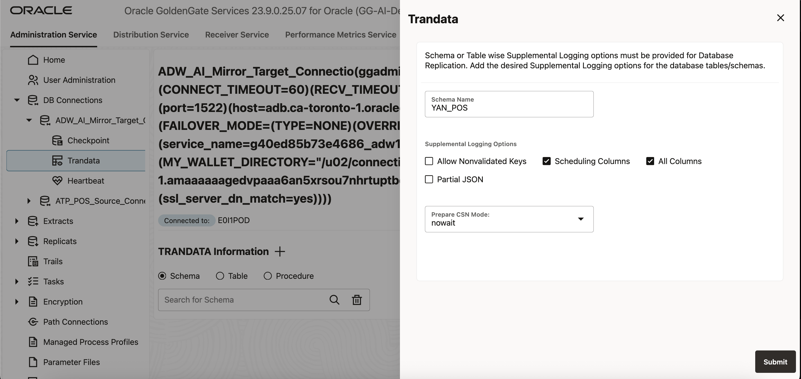
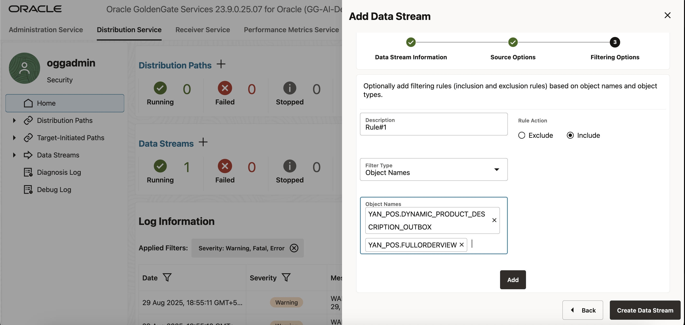

# Lab 4: Create the GoldenGate Extract and Data Stream Processes

**Duration:** 15 minutes  

## Introduction
In this lab, you will configure OCI GoldenGate depoloyment to capture transactional changes from the POS ADW database and stream them into the AI Hub environment. This setup enables a live data feed, ensuring that AI-driven queries work on real-time data.
You will:
 - Enable transaction data capture (trandata) on source tables.
 - Create an Extract process to capture changes from ADW.
 - Configure a Data Stream process to stream changes into the AI Hub application.
 - Insert and test new POS records.
 - Monitor GoldenGate statistics to verify that the replication pipeline is active.

Objectives
By the end of this lab, you will be able to:

 - Navigate the GoldenGate Deployment Console.
 - Enable trandata for source tables in ADW.
 - Create an Extract process to capture transactional changes.
 - Build and run a Data Stream process.
 - Test replication by inserting data into source tables.
 - Monitor GoldenGate statistics for process health.

## Tasks

1. Open the GoldenGate Deployment Console
    - In the OCI Console, navigate to:
    ☰ Menu → Oracle Database → GoldenGate.
    - Select your GoldenGate deployment.
    - From the deployment details page, click Launch Console to launch the  GoldenGate Deployment Console.
    - Log in using your GoldenGate administrator credentials displayed in View Login Info. 
       Username: oggadmin
       Password: Same as ADB ADMIN user password 
     

2. Enable and Verify Trandata 
       GoldenGate requires supplemental logging (trandata) to capture row-level changes from the ADW database. Follow these steps:
    - In the Deployment Console, look at the left-hand side menu and click on DB Connections.
    - From the list of available connections, locate the source connection:
      ADW\_AI\_MIRROR\_Target\_Connection.
    - In the Actions column, click the login icon (->]) for this connection.
    - Once successfully connected, the connection name will show as active.
    - In the left-hand side menu, expand the connection options and click Trandata.
    - From the Trandata screen:
       Enable trandata for the YAN\_POS schema.
       Click Submit.
        
       Confirm that the all the table objects are listed and supplemental logging is enabled.
       Ensure all columns are included in logging.
       
    
3. Create Extract for AI Hub ADW 
    - The Extract process captures changes from the ADW database.
    - In the Deployment Console, navigate to Extracts → + Create Extract
    - Provide the following details:
            
           Process Name: EXT_POSA (or similar convention)
           Type: Integrated Extract
           Domain: OracleGoldenGate
           Alias: TP_POS_Source_Connection
           Trail File Prefix: PO
           Click Next with Default values.
           Paramater file section: TABLE YAN_POS.*; 

            

    - Click on Create and Run.
    - Verify the Extract is running by:
       
        Checking the Report File for status messages.
       
        Viewing the Statistics tab for heartbeat and captured operations. 
       
        

4. Create Data Stream for AI Hub
    - The Data Stream delivers changes from the Extract trail into AI Hub.
    - In the Deployment Console, go to Distributioon Service → + Create Data Stream.
    - Provide the following details:
        Name: AiAgentStream
        
        Source Trail: PO (from the Extract).Click Next.
        
        Provide a Description. Select Include under Rule Action and Object Names from 
        Filter Type dropdown. Define table inclusion rules by providing below table name in Object Names text box:
          YAN\_POS.FULLORDERVIEW
          
           YAN\_POS.DYNAMIC\_PRODUCT\_DESCRIPTION\_OUTBOX
          

          Click Add.
         
          
    
    - Click Create Data Stream.
    - Verify the Data Stream is active by checking its status and configuration YAML.
    


5. Test Data Capture with an Insert 
    - Now, insert a new record into the POS_Order and ORDERITEM tables and confirm GoldenGate captures it.
    - Connect to the ADW database using SQL Developer Web or SQL*Plus.

       Run the following SQL to insert a new order and item: 
       ```sql
       <copy> -- Insert a new order into POS_ORDER
       INSERT INTO YAN_POS.POS_ORDER (ORDER_ID, CUSTOMER_ID, ORDER_TIME, TOTAL_AMOUNT) VALUES (331, 1, SYSTIMESTAMP, 249.99);
     
       INSERT INTO YAN_POS.POS_ORDER (ORDER_ID, CUSTOMER_ID, ORDER_TIME, TOTAL_AMOUNT) VALUES (332, 2, SYSTIMESTAMP, 89.50);
     
       INSERT INTO YAN_POS.POS_ORDER (ORDER_ID, CUSTOMER_ID, ORDER_TIME, TOTAL_AMOUNT) VALUES (333, 3, SYSTIMESTAMP, 560.00);

       Sample Inserts for YAN_POS.ORDERITEM
        -- Items for order 301
       INSERT INTO YAN_POS.ORDERITEM (ORDER_ITEM_ID, ORDER_ID, PRODUCT_ID, QUANTITY, UNIT_PRICE, DISCOUNT_APPLIED) VALUES (5001, 301, 4, 1, 249.99, 0);
     
       -- Items for order 302
       INSERT INTO YAN_POS.ORDERITEM (ORDER_ITEM_ID, ORDER_ID, PRODUCT_ID, QUANTITY, UNIT_PRICE, DISCOUNT_APPLIED) VALUES (5002, 302, 5, 2, 45.00, 0.50);
     
       -- Items for order 303 (multiple items)
       INSERT INTO YAN_POS.ORDERITEM (ORDER_ITEM_ID, ORDER_ID, PRODUCT_ID, QUANTITY, UNIT_PRICE, DISCOUNT_APPLIED) VALUES (5003, 303, 6, 1, 300.00, 0);
     
       -- Items for order 5004 (multiple items)
       INSERT INTO YAN_POS.ORDERITEM (ORDER_ITEM_ID, ORDER_ID, PRODUCT_ID, QUANTITY, UNIT_PRICE, DISCOUNT_APPLIED) VALUES (5004, 303, 7, 2, 130.00, 0);


       COMMIT;</copy>
     ```
       - This record should be captured by the Extract and delivered via the Data Stream.  

6. Verify GoldenGate Statistics

     - Return to the Deployment Console.  
     - Open the **Monitoring → Statistics** tab.  
     - Verify that the Extract show DML captured (records captured and delivered).  
     - In ADW, query the replicated `ORDERS` table to confirm the new order appears:  
      ```sql
      <copy>SELECT * FROM YAN_POS.POS_ORDER WHERE order_id = 331;</copy>
      ```
   

## Outcomes
At the end of this lab, you will have:
  * Enabled trandata for POS source tables to capture row-level changes.
  * Created and started an Extract process in GoldenGate.
  * Configured and verified a Data Stream delivering captured data.
  * Tested replication by inserting data into the ADW database.
  * Validated replication activity through GoldenGate statistics.


## Acknowledgements
* **Author** - Shrinidhi Kulkarni, GoldenGate Product Manager
* **Reviewed By**  - Denis Gray,  Vice President, GoldenGate Product Management
* **Last Updated By/Date** - Jenny Chan, September 2025