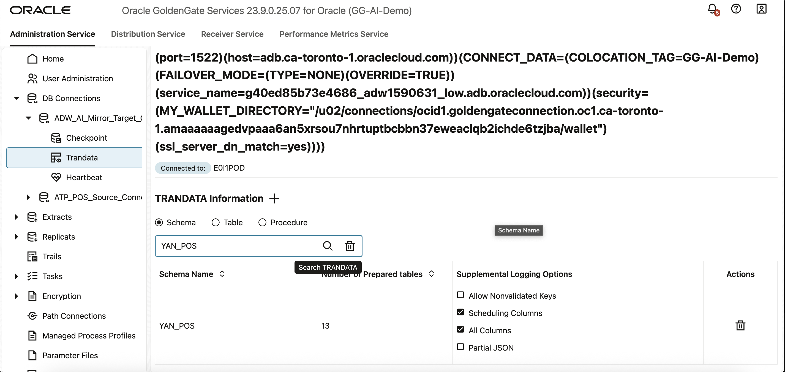

# Lab 4: Create the GoldenGate Extract and Data Stream Processes

**Duration:** 15 minutes  

## Introduction
In this lab, you will configure OCI GoldenGate depoloyment to capture transactional changes from the POS ADW database and stream them into the AI Hub environment. This setup enables a live data feed, ensuring that AI-driven queries work on real-time data.

### Objectives

In this lab, you:

 - Add trandata for source tables in ADW.
 - Create an Extract process to capture transactional changes.
 - Build and run a Data Stream process.
 - Test replication by inserting data into source tables.
 - Monitor GoldenGate statistics for process health.

## Task 1: Add trandata for source tables in ADW

GoldenGate requires supplemental logging (trandata) to capture row-level changes from the ADW database.

1.  Return to the GoldenGate deployment console. Follow the steps below to log back in if you were logged out or closed the window previously.

  * In the Oracle Cloud navigation menu, select **Oracle Database**, and then **GoldenGate**.
  * In the GoldenGate menu, click **Deployments**. 
  *  On the Deployments page, select your GoldenGate deployment.
  * On the deployment details page, click **Launch Console**.
  * On the GoldenGate sign in page, enter `oggadmin` for User Name. 
  * For Password, copy and paste the GG Password from your Reservation Information panel.

     

2.  In the GoldenGate deployment console navigation menu, click **DB Connections**.

3.  On the DB Connections page, in the Actions column for **ADW\_AI\_MIRROR\_Target\_Connection**, click **Connect**. If successfully connected, the connection name will show as active.

4.  In the navigation menu, expand the connection options and then click **Trandata**.

5.  On the Trandata page, click **Add Trandata** (plus icon).

6.  In the Trandata panel, for Schema, enter `YAN_POS`, and then click **Submit**.

     

7.  To verify, enter `YAN_POS` in the search field, and then click **Search**. Confirm that the all the table objects are listed and supplemental logging is enabled.

    
    
## Task 2: Create an Extract

The Extract process captures changes from the ADW database.

1.  In the GoldenGate deployment console navigation menu, click **Extracts**.

2.  On the Extracts page, click **Add Extract** (plus icon).

3.  The Add Extract panel consists of four pages. On the Extract Information page, complete the fields as follows, and then click **Next**:
            
    * For **Type**, select **Integrated Extract**.
    * For **Process Name**, enter `EXT_POSA`.

4.  On the Extract Options page, complete the fields as follows, and then click **Next**.

    * For **Domain**, select **OracleGoldenGate**.
    * For **Alias**, enter `TP_POS_Source_Connection`.
    * For **Trail File**, enter `PO`.
 
4.  On the Managed Options page, click **Next**.

5.  On the Parameter File page, copy and paste the following, and then click **Create and Run**:

    ```
    <copy>TABLE YAN_POS.*;</copy>
    ```

6.  After the Extract's status is **Running**, expand the Extract in the navigation menu, and then select **Report**. Review the messages in the report file.
       
7.  In the navigation menu, under **EXT\_POSA**, select **Statistics** to view heartbeat and captured operations. 
       
    

## Task 4: Create Data Stream for AI Hub

The Data Stream delivers changes from the Extract trail into AI Hub.

1.  In the GoldenGate deployment console, click **Distribution Service**.

2.  In the Distribution Service navigation menu, click **Data Streams**.

3.  On the Data Streams page, click **Add Data Stream** (plus icon).

4.  The Add Data Stream panel consists of three pages. On the Data Stream Information page, enter `AiAgentStream` for **Name**, and then click **Next**.

5.  On the Source Options page, enter `PO` for **Source Trail**, and then click **Next**.

6.  On the Filtering Options page, complete the fields as follows:

    * Enter a **Description**. 
    * For **Rule Action**, select **Include**.
    * For **Filter Type**, select **Object Names**
    * Enter the following table names, and then click **Add**: 
    ```
    <copy>YAN_POS.FULLORDERVIEW</copy>
    ```
    ```
    <copy>YAN_POS.DYNAMIC_PRODUCT_DESCRIPTION_OUTBOX</copy>
    ```
         
    
    
7.  Click **Create Data Stream**.
    
3.  Verify the Data Stream is active by checking its status and configuration YAML.
    
    

## Task 5: Test Data Capture with an Insert 

 Now, insert a new record into the POS_Order and ORDERITEM tables and confirm GoldenGate captures it.

1.  Connect to the ADW database using SQL Developer Web or SQL*Plus.

2.  Run the following SQL to insert a new order and item: 
    
    ```
    <copy> -- Insert a new order into POS_ORDER
    INSERT INTO YAN_POS.POS_ORDER (ORDER_ID, CUSTOMER_ID, ORDER_TIME, TOTAL_AMOUNT) VALUES (331, 1, SYSTIMESTAMP, 249.99);
     
    INSERT INTO YAN_POS.POS_ORDER (ORDER_ID, CUSTOMER_ID, ORDER_TIME, TOTAL_AMOUNT) VALUES (332, 2, SYSTIMESTAMP, 89.50);
     
    INSERT INTO YAN_POS.POS_ORDER (ORDER_ID, CUSTOMER_ID, ORDER_TIME, TOTAL_AMOUNT) VALUES (333, 3, SYSTIMESTAMP, 560.00);

    Sample Inserts for YAN_POS.ORDERITEM
    -- Items for order 301
    INSERT INTO YAN_POS.ORDERITEM (ORDER_ITEM_ID, ORDER_ID, PRODUCT_ID, QUANTITY, UNIT_PRICE, DISCOUNT_APPLIED) VALUES (5001, 301, 4, 1, 249.99, 0);
     
    -- Items for order 302
    INSERT INTO YAN_POS.ORDERITEM (ORDER_ITEM_ID, ORDER_ID, PRODUCT_ID, QUANTITY, UNIT_PRICE, DISCOUNT_APPLIED) VALUES (5002, 302, 5, 2, 45.00, 0.50);
     
    -- Items for order 303 (multiple items)
    INSERT INTO YAN_POS.ORDERITEM (ORDER_ITEM_ID, ORDER_ID, PRODUCT_ID, QUANTITY, UNIT_PRICE, DISCOUNT_APPLIED) VALUES (5003, 303, 6, 1, 300.00, 0);
     
    -- Items for order 5004 (multiple items)
    INSERT INTO YAN_POS.ORDERITEM (ORDER_ITEM_ID, ORDER_ID, PRODUCT_ID, QUANTITY, UNIT_PRICE, DISCOUNT_APPLIED) VALUES (5004, 303, 7, 2, 130.00, 0);


    COMMIT;</copy>
    ```

    This record should be captured by the Extract and delivered via the Data Stream.  

## Task 6: Verify GoldenGate Statistics

1.  Return to the Deployment Console.  

2.  Open the **Monitoring → Statistics** tab.  

3.  Verify that the Extract show DML captured (records captured and delivered).  

4.  In ADW, query the replicated `ORDERS` table to confirm the new order appears:  
   
    ```
    <copy>SELECT * FROM YAN_POS.POS_ORDER WHERE order_id = 331;</copy>
    ```

5.  Check your environment status. All tiles should now be green.

    

You may now **proceed to the next lab.**

## Acknowledgements
* **Author** - Shrinidhi Kulkarni, GoldenGate Product Manager
* **Reviewed By**  - Denis Gray,  Vice President, GoldenGate Product Management
* **Last Updated By/Date** - Jenny Chan, September 2025