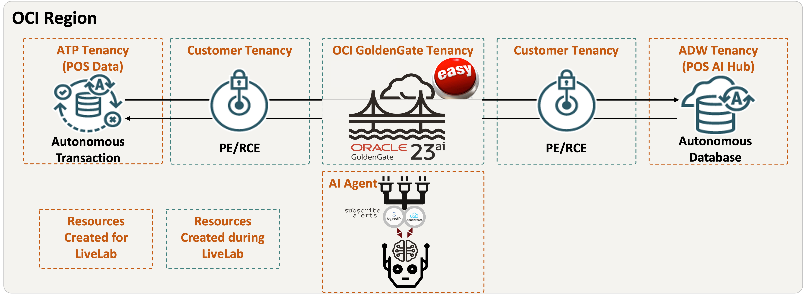

# Introduction

In this session, you learn how to combine **real-time data replication**, **modern database features**, and **Generative AI** to build an end-to-end intelligent solution on Oracle Cloud Infrastructure (OCI).

Using the **YAN_POS Orders** dataset as our case study, you experience how transactional data from a point-of-sale (POS) system can be replicated in real time, transformed into Orace Database JSON Duality Views, and queried through a conversational AI agent that can answer both **business** and **operational** questions.

**Estimated time:** 90 minutes

**Workshop Architecture**
    

## Objectives

In this workshop, you will:

- **OCI GoldenGate ZeroETL Replication**  
  Set up and run a ZeroETL pipeline to replicate POS data directly into **Autonomous Data Warehouse (ADW)** with no intermediate ETL jobs.  

- **JSON Duality Views**  
  Build a JSON Duality View on top of replicated relational tables, enabling seamless SQL and JSON-native access to orders and order items.  

- **AI Hub Resources**  
  Prepare vector stores and embeddings inside ADW to support semantic search and retrieval for AI queries.  

- **GoldenGate Extracts and Data Streams**  
  Configure Extract and Data Stream processes to capture and deliver live transactional changes into ADW for analytics and AI.  

- **Generative AI Service Playground**  
  Explore OCI Generative AI service, test prompts in the Chat Playground, and experiment with Retrieval-Augmented Generation (RAG) queries over the YAS_POS dataset.  

- **End-to-End Demo**  
  Run a live demo where you can:  
  Generate AI-powered FOMO product descriptions and recommendations.  
  Use an AI chatbot to ask natural questions like *“Show me pending orders in the last hour”* or *“What’s the current GoldenGate replication lag?”*  
  Retrieve GoldenGate operational stats (Extracts, Replicats, Streams, Configs).  
  Perform vector similarity search on new orders (e.g., find orders similar to Order 483).  
  Request and view the ER diagram of the dataset directly through the chat.  

## Why it Matters

This workshop demonstrates how OCI GoldenGate, Oracle database 23ai JSON Duality Views, and OCI Generative AI service (with LLaMA) can be combined to:
- Keep your operational and analytical systems in sync in real time.
- Make data simultaneously usable as structured tables and JSON documents.
- Enable AI-driven conversational access to both business insights and system operations.

By the end of the workshop, you will have built a practical blueprint for integrating **ZeroETL pipelines, AI embeddings, and conversational AI agents** into real-world enterprise solutions.  

## Prerequisites

Before starting the labs, ensure you have the following:

- **OCI Account & Access**  
  Access to an Oracle Cloud Infrastructure (OCI) tenancy with required privileges.  
  Correct **region** selected where GoldenGate and Generative AI services are enabled.  

- **Provisioned Resources**  
  An **Autonomous Transaction Processing (ATP)** database with the YAS_POS Orders dataset loaded.  
  An **Autonomous Data Warehouse (ADW)** instance as the AI Hub target.  
  An **OCI GoldenGate deployment** with connections to ATP (source) and ADW (target).  
  OCI **Generative AI Service** enabled in the region.  

- **Tools**  
  Web browser with access to OCI Console.  
  Access to **SQL Web Developer** (Database Actions) for ADW.  
  Access to **GoldenGate Deployment Console** for managing Extracts and Streams.  

- **Credentials**  
  Database user credentials for ATP and ADW.  
  GoldenGate deployment admin credentials.  
  OCI Console user credentials.  

- **Network Access**  
  Ability to connect to ATP, ADW, and GoldenGate endpoints from your network.  
  Ensure no firewall or VPN restrictions are blocking access.  

## Workshop Outcomes

By the end of this workshop, you will be able to:

- **Set up real-time replication with ZeroETL**  
  Configure OCI GoldenGate ZeroETL pipelines to continuously replicate data from a transactional source (POS) into Autonomous Data Warehouse (ADW).  

- **Leverage JSON Duality Views**  
  Create JSON Duality Views to access the same dataset as both structured tables and JSON documents, enabling flexible data access for applications and AI agents.  

- **Prepare AI-ready data in ADW**  
  Create and manage vector stores for embeddings, and integrate them into workflows for semantic similarity search.  

- **Configure GoldenGate Extract and Data Streams**  
  Capture transactional changes from the source, deliver them into ADW, and validate replication with metrics and statistics.  

- **Experiment with Generative AI models**  
  Use OCI Generative AI service (LLaMA) in the Chat Playground to test Retrieval-Augmented Generation (RAG)-style prompts and natural queries over business and operations data.  

- **Run a real-time end-to-end demo**  
  Interact with an AI chatbot to:  
    - Ask natural language questions about orders (e.g., pending, totals, top products).  
    - Query GoldenGate operations (Extracts, Replicats, lag, heartbeats, streams).  
    - Generate AI-powered product descriptions and recommendations.  
    - Retrieve an ER diagram or run vector similarity search for specific orders.  

- **Connect AI with operations**  
  Demonstrate how AI Agents can answer not only business-focused queries but also operational and DevOps-level questions about GoldenGate replication itself.  

Together, these outcomes show how OCI’s **data integration**, **database innovation**, and **AI services** can be combined to deliver intelligent, real-time applications that bridge business analytics and system operations in a single conversational interface.

## Acknowledgements
* **Author** - Shrinidhi Kulkarni, GoldenGate Product Manager
* **Reviewed By**  - Denis Gray,  Vice President, GoldenGate Product Management
* **Last Updated By/Date** - Shrinidhi Kulkarni, August 2025