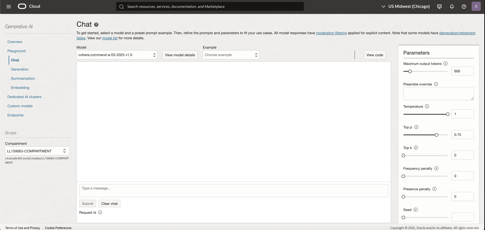
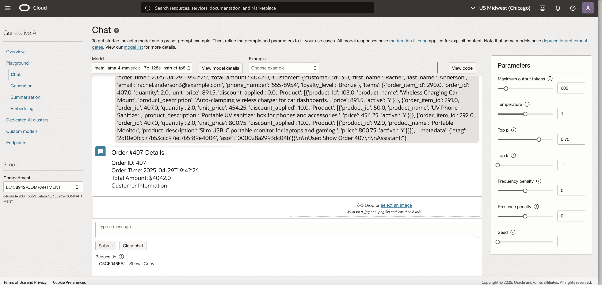

# Lab 5: Review OCI Generative AI Service – Chat Playground

**Duration:** 15 minutes  

## Introduction
In this lab, you will explore the OCI Generative AI Service through the Chat Playground. This service allows you to interact directly with large language models (LLMs), test prompts, and validate how AI can support both business use cases (like querying orders) and operational monitoring (like checking GoldenGate replication health).
You will experiment with Retrieval-Augmented Generation (RAG) queries to:
    Ask natural-language questions about the YAS_POS Orders dataset.
    Interrogate GoldenGate Extract and Data Stream statistics through conversational AI.


Objectives
By completing this lab, you will learn how to:
 * Navigate to the correct OCI Generative AI Endpoint Region and open the Generative AI service.
 * Launch and use the Chat Playground.
 * Select an appropriate AI model (e.g., LLaMA) and configure key parameters.
 * Run general AI prompts to understand model behavior.
 * Use RAG-style prompts to query YAS_POS Orders data.
 * Use natural language to check GoldenGate operational metrics (Extract, Data Stream, lag, heartbeat).

## Tasks

1. Navigate to Generative AI Service
    - Log in to the OCI Console.
    - At the top-right of the Console, confirm that you are in the correct OCI Generative AI Endpoint Region mentioned in the View Login Info screen. This is where Generative AI service is enabled.
    - From the left-side navigation menu, go to:
       
       ☰ Menu → Analytics & AI → Under AI Services → Generative AI.
    - The Generative AI dashboard will appear. 
    

2. Open the Chat Playground  
    - In the Generative AI service dashboard, locate the Playgrounds section on the left side menu.Click Chat Playground.
    - The Playground interface will open, showing a text box for prompts and a panel for model responses. 
     

3. Select an AI Model 
    - In the Chat Playground, click View Model details to view the Model vendor,version and description etc..
    - Choose an available AI Model (e.g., LLaMA-4 or other deployed family).
    - Adjust parameters as needed:
          - Maximum Output Tokens – controls response length.
          - Temperature – controls creativity (lower = factual, higher = creative).
          - Top-K / Top-P – controls randomness vs. diversity (optional).
           

4. Run General AI Prompts 
    - Start by testing the model with simple and business-related prompts:
          
           - Simple factual: “Why is the sky blue?”
           - GoldenGate-related: “Help me generate a GoldenGate parameter file for an Extract process.”
           - “What is the best real-time data integration tool for keeping databases in sync?”Operational brainstorming:
          - “List common reasons why a GoldenGate Extract might lag and how to troubleshoot.”

5. Query the YAN_POS Orders Dataset (RAG Simulation)  
    - Now simulate business-side queries against the replicated dataset.
    - Enter the below below which is similar to prompts in lab 6 designed to test Retrieval-Augmented Generation (RAG).  
    
    - Check Order Status - Rag Simialirty Sarch:  
     ```sql
     <copy>You are an AI assistant with access to the following context:\n\n\ud83d\udce6 Order #483 (\ud83d\udd0d Similarity: 0.2560)\n\ud83d\uded2 Products: {'_id': 483.0, 'order_time': '2025-05-01T04:16:57', 'total_amount': 0.0, 'Customer': {'customer_id': 1.0, 'first_name': 'Diana', 'last_name': 'Smith', 'email': 'diana.smith1@example.com', 'phone_number': '555-6585', 'loyalty_level': 'Bronze'}, 'Items': [], '_metadata': {'etag': 'f7285615161d5a6e2d7d92b5f76a5a74', 'asof': '000028a2993dc04b'}}\n\n\ud83d\udce6 Order #482 (\ud83d\udd0d Similarity: 0.2773)\n\ud83d\uded2 Products: {'_id': 482.0, 'order_time': '2025-05-01T04:16:49', 'total_amount': 0.0, 'Customer': {'customer_id': 1.0, 'first_name': 'Diana', 'last_name': 'Smith', 'email': 'diana.smith1@example.com', 'phone_number': '555-6585', 'loyalty_level': 'Bronze'}, 'Items': [], '_metadata': {'etag': '0fd2d9a1ef731efc166e8ff246025259', 'asof': '000028a2993dc04b'}}\n\n\ud83d\udce6 Order #407 (\ud83d\udd0d Similarity: 0.3121)\n\ud83d\uded2 Products: {'_id': 407.0, 'order_time': '2025-04-29T19:42:26', 'total_amount': 4042.0, 'Customer': {'customer_id': 3.0, 'first_name': 'Rachel', 'last_name': 'Anderson', 'email': 'rachel.anderson3@example.com', 'phone_number': '555-8954', 'loyalty_level': 'Bronze'}, 'Items': [{'order_item_id': 290.0, 'order_id': 407.0, 'quantity': 2.0, 'unit_price': 891.5, 'discount_applied': 0.0, 'Product': [{'product_id': 103.0, 'product_name': 'Wireless Charging Car Mount', 'product_description': 'Auto-clamping wireless charger for car dashboards.', 'price': 891.5, 'active': 'Y'}]}, {'order_item_id': 291.0, 'order_id': 407.0, 'quantity': 2.0, 'unit_price': 454.25, 'discount_applied': 10.0, 'Product': [{'product_id': 50.0, 'product_name': 'UV Phone Sanitizer', 'product_description': 'Portable UV sanitizer box for phones and accessories.', 'price': 454.25, 'active': 'Y'}]}, {'order_item_id': 292.0, 'order_id': 407.0, 'quantity': 2.0, 'unit_price': 800.75, 'discount_applied': 10.0, 'Product': [{'product_id': 92.0, 'product_name': 'Portable Monitor', 'product_description': 'Slim USB-C portable monitor for laptops and gaming.', 'price': 800.75, 'active': 'Y'}]}], '_metadata': {'etag': '2df0e0fc577b53ccc97ec7b5f89e4004', 'asof': '000028a2993dc04b'}}\n\nUser: Show Order 407\n\nAssistant:"}</copy>
     
     ```
   
       - In practice, these RAG queries combine semantic search (vector stores you created in Lab 3) with structured queries. The model retrieves the right data context and then generates a natural response.

6. Interrogate GoldenGate Operational Statistics 
       - Use below prompt to check replication health and stats:
       Show GoldenGate Statistics  - Rag Prompt Injection Search:  
       ```sql
           <copy> GoldenGate Metrics Table (2025-07-15T22:50:18.867267 UTC): +--------------------------+---------------------------+ | Metric | Value | +--------------------------+---------------------------+ | $schema | mpoints:statisticsExtract | | mappedTotalInserts | 44 | | mappedTotalUpdates | 16 | | mappedTotalDeletes | 23 | | mappedTotalUpserts | 0 | | mappedTotalUnsupported | 0 | | mappedTotalTruncates | 0 | | totalExecutedDdls | 0 | | totalExecutedProcedures | 0 | | totalDiscards | 0 | | totalIgnores | 0 | | totalConversionErrors | 0 | | totalConversionTruncates | 0 | | totalRowFetchAttempts | 0 | | totalRowFetchFailures | 0 | | totalMetadataRecords | 5 | +--------------------------+---------------------------+ 🧠 LLM Prompt: GoldenGate Monitoring Insight: 📊 GoldenGate Metrics Summary: $schema: mpoints:statisticsExtract mappedTotalInserts: 44 mappedTotalUpdates: 16 mappedTotalDeletes: 23 mappedTotalUpserts: 0 mappedTotalUnsupported: 0 mappedTotalTruncates: 0 totalExecutedDdls: 0 totalExecutedProcedures: 0 totalDiscards: 0 totalIgnores: 0 totalConversionErrors: 0 totalConversionTruncates: 0 totalRowFetchAttempts: 0 totalRowFetchFailures: 0 totalMetadataRecords: 5 Summarize the current system status and suggest actions if needed.</copy>
     ```
    


## Outcomes
By the end of this lab, you will be able to:
* Access the OCI Generative AI service and use the Chat Playground.  
* Select and test an AI model with configurable parameters.  
* Run RAG-style queries against replicated business data.  
* Interact with the YAS_POS Orders dataset using natural language.  
* Query GoldenGate operational metrics (Extract, Replicat, lag, heartbeat) through AI-driven prompts.  


## Acknowledgements
* **Author** - Shrinidhi Kulkarni, GoldenGate Product Manager
* **Reviewed By**  - Denis Gray,  Vice President, GoldenGate Product Management
* **Last Updated By/Date** - Jenny Chan, September 2025