# Lab 2: Review OCI GoldenGate Resources

**Duration:** 10 minutes  

## Introduction
In this lab, you will review the key resources provisioned for this workshop. You will validate access to the source and target databases, confirm the GoldenGate deployment is running, and test the GoldenGate connections. This step ensures your environment is ready before configuring replication pipelines.

### Objectives 

In this lab, you:

* Log in to the Oracle Cloud console and locate your ATP source and ADW target databases.  
* Verify that the YAS_POS Orders dataset is available in the ATP source.  
* Locate the GoldenGate deployment and confirm its status.  
* Verify GoldenGate connections to both source and target databases are configured and working.
* Check the status of your lab envionment as you work through each lab.

### Prerequisites

Ensure that you've successfully completed all tasks in the preceding lab. 

## Task 1: Review POS source and target databases

1.  Return to the Oracle Cloud console. Use the Launch OCI button in your Reservation Information panel if you closed the window or were logged out. 

2.  In the Oracle Cloud navigation menu, select **Oracle Database**, then **Autonomous Database**.  

    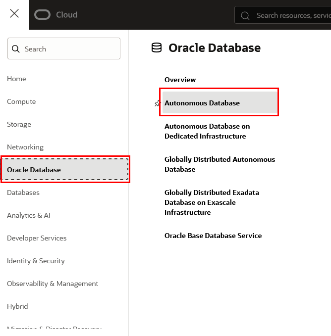

3.  On the Autonomous Database page, select the source **AIATP** instance.

    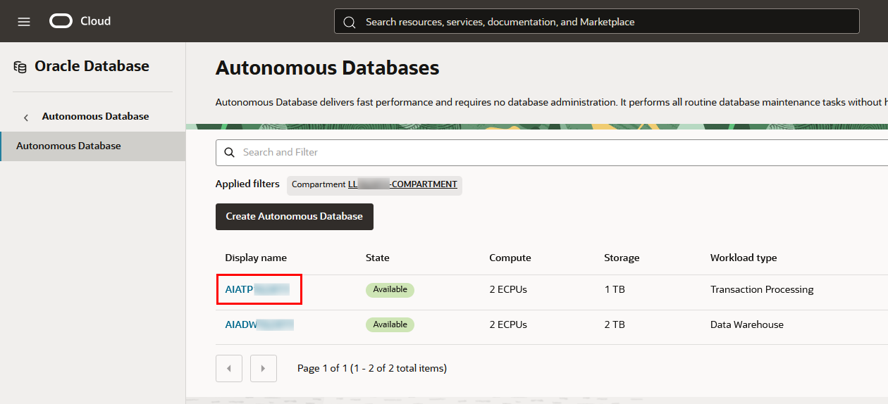

4.  On the AIATP details page, from the **Database Actions** menu, select **SQL**.

    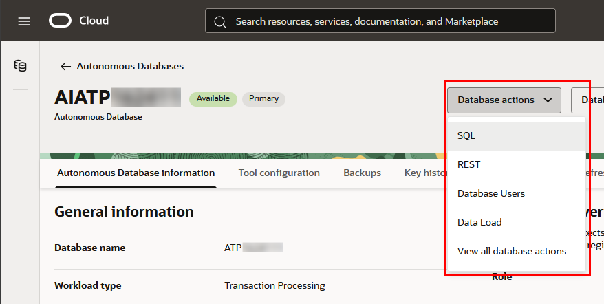

5.  Copy and paste the following script to verify that the **YAN_POS Orders dataset** schema exists, and then click **Run script**.
    
     ``` 
     <copy> SELECT COUNT(*) FROM YAN_POS.POS_ORDER;
     SELECT COUNT(*) FROM YAN_POS.ORDERITEM;</copy>
     ```
     
     This confirms sample data is loaded.  

6.  In the Oracle Cloud console navigation menu, select **Oracle Database**, then **Autonomous Data Warehouse**.

7.  On the Autonomous Data Warehouse page, select Target **AIADW** Hub.

    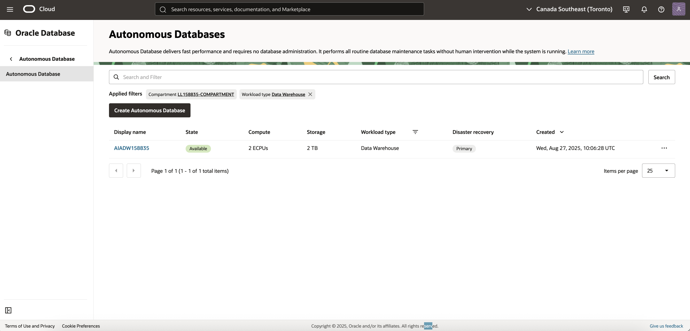  

8.  On the AIADW details page, from the **Datebase Actions** menu, select **SQL**.

9.  Repeat step 5, verifying the row counts match.

## Task 2: Test assigned connections
   
1.  In the Oracle Cloud console navigation menu, select **Oracle Database**, then **GoldenGate**.

2.  In the GoldenGate menu, select **Deployments**.

3.  On the Deployments page, select **GG-AI-Demo**.

4.  On the deployment details page, verify that the deployment status is **Active**. 

    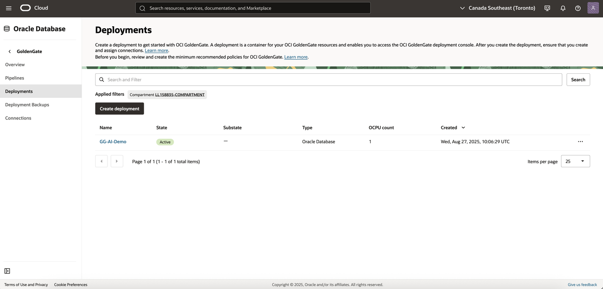  

5.  Take note of the **Deployment console URL** for later use.

    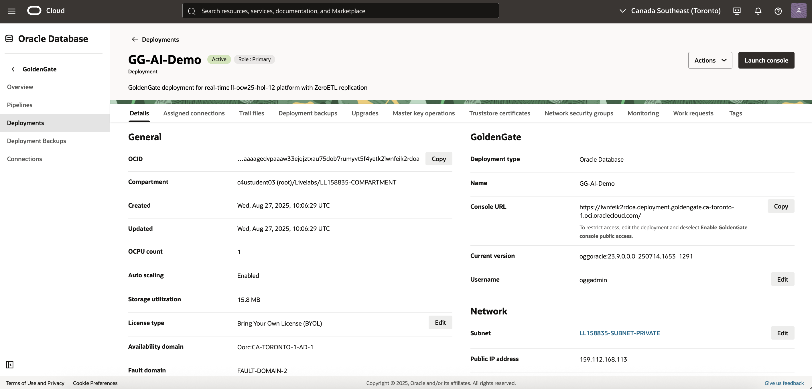  

6.  Click **Assigned connections**.
    
    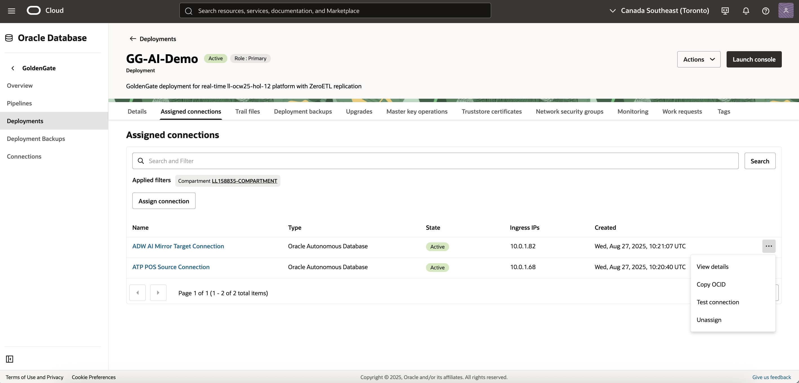    
    
7.  On the Assigned connections page, from the Actions menu for **ATP POS Source Connection**, select **Test connection**. 

8.  Repeat step 7 for **ADW AI Mirror Target Connection**.

    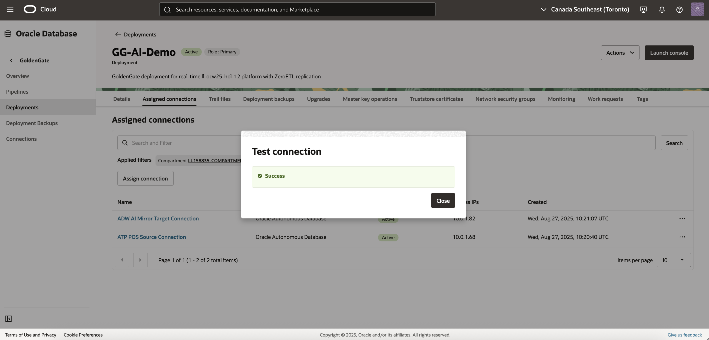 

    > **Note:** If an error message appears, then return to the connection details and check your settings.

9.  At the top of the deployment details page, click **Launch Console**.

    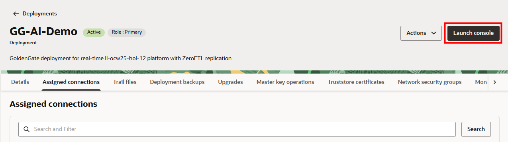

10. On the GoldenGate sign in page, enter `oggadmin` for **Username**, then copy and paste the **GoldenGate password** from the Reservation Information panel for Password.

11. In the GoldenGate deployment console from the  **Administration Service** navigation menu, select **DB Connections**.
    
    You should see two connections already created:  
    * **Source (ATP)** – ATP\_POS\_Source\_Connection
    * **Target (ADW)** – ADW\_AI\_Mirror\_Target\_Connection

    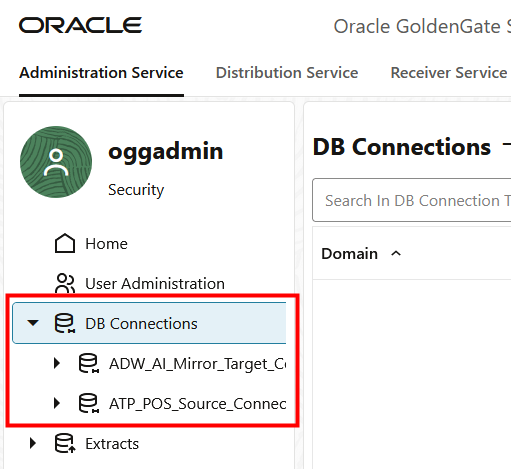

    You can also test connectivity for these connections. In the Actions column for each connection, click Connect. If the connection is successful, the page displays Checkpoint tables.

    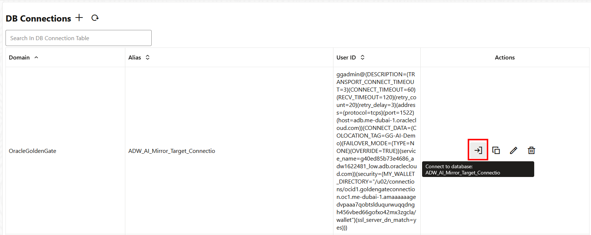 

## Task 3: Check your lab environment status

1.  In your lab instructions, click **View Login Info**.

2.  In the Reservation Information panel, select the **AI URL** in the Terraform Values section. 

3.  Review the GoldenGate LiveLabs status page. 

    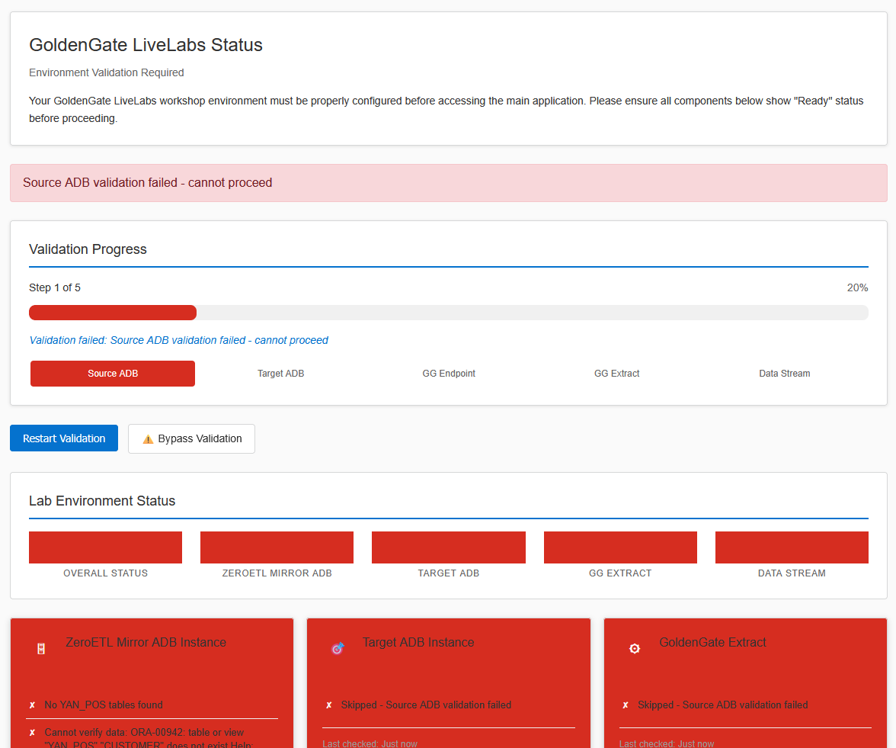

    You can refresh this page to check the status of your environment as you progress through the rest of this workshop. 

You may now **proceed to the next lab**.

## Acknowledgements
* **Author** - Shrinidhi Kulkarni, GoldenGate Product Manager
* **Reviewed By**  - Denis Gray,  Vice President, GoldenGate Product Management
* **Last Updated By/Date** - Jenny Chan, September 2025