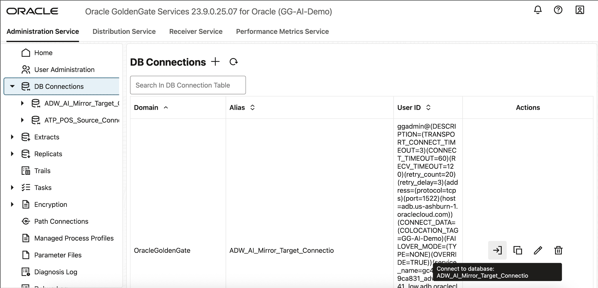

# Lab 2: Review OCI GoldenGate Resources

**Duration:** 10 minutes  

## Introduction
In this lab, you will review the key resources provisioned for this workshop. You will validate access to the source and target databases, confirm the GoldenGate deployment is running, and test the GoldenGate connections. This step ensures your environment is ready before configuring replication pipelines.


## Task

1. Login to OCI Console 
    - Open the View Login Info and click on Launch OCI to open the OCI Console.
    - Log in using your OCI workshop credentials provided in the View Login Info page. (Username: ADMIN)
     
    - Verify that you are in the correct compartment for the lab resources.  

2. Review POS Source Data – ATP
    - In the OCI Console, go to **Oracle Database → Autonomous Transaction Processing**.  
    - Open the ATP instance provisioned as your POS **source database**.  
    - Verify that the **YAN_POS Orders dataset** schema exists (tables `POS_ORDER` and `ORDERITEM`).  
    - Optionally, open the **Database Actions → SQL Worksheet** and run:  
     
     
         ```sql 
         <copy> SELECT COUNT(*) FROM YAN_POS.POS_ORDER;
         SELECT COUNT(*) FROM YAN_POS.ORDERITEM;</copy>
     ```
     
     This confirms sample data is loaded.  

3. Review POS AI Hub – ADW 
    - In the OCI Console, go to **Oracle Database → Autonomous Data Warehouse**.  
    - Open the ADW instance provisioned as the **target AI Hub database**. 
      
    - Verify connectivity and note the database service name for later steps.  
   
4. Review OCI GoldenGate Deployment
    - In the OCI Console, navigate to **Oracle Database → GoldenGate**.  
    - Select the GoldenGate deployment (GG-AI-Demo) created for this workshop.  
    - Confirm the deployment status is **Active**. 
      
    - Note the **deployment Console URL** for later use. 
      

5. Test OCI GoldenGate Connections  
    - On the deployment details page, click **Assigned connections**.
        
    - In the list of Assigned connections, from the Actions menu for the connection you want to test, select **Test connection**. 
    - Confirm both **ATP (source)** and **ADW (target)** connections return a **successful status**. 
     
    -  If an error message appears, then return to the connection and your settings.
    - Click **Close**.

6. Review OCI GoldenGate Connections 
    - Click Launch Console to login into the GoldenGate deployment console.
    ( Username: oggadmin  
     password: same as ADB ADMIN user password) 
    - Click on **Administration Service → DB Connections**.  
    - You should see two connections already provisioned:  
     - **Source (ATP)** – ATP\_POS\_Source\_Connection.  
     - **Target (ADW)** – ADW\_AI\_Mirror\_Target\_Connection.  

    You can optionally test connectivity using the synced connections within the GoldenGate deployment console as well. Click on the login (first icon) under Actions to test datbaase login into Source ATP and Target ADW from GoldenGate console.
     

## Outcomes
By the end of this lab, you will be able to:
* Navigate the OCI Console to locate your ATP source and ADW target databases.  
* Confirm that the YAS_POS Orders dataset is available in the ATP source.  
* Identify the GoldenGate deployment and confirm its status.  
* Verify GoldenGate connections to both source and target databases are configured and working.  


## Acknowledgements
* **Author** - Shrinidhi Kulkarni, GoldenGate Product Manager
* **Reviewed By**  - Denis Gray,  Vice President, GoldenGate Product Management
* **Last Updated By/Date** - Shrinidhi Kulkarni, August 2025