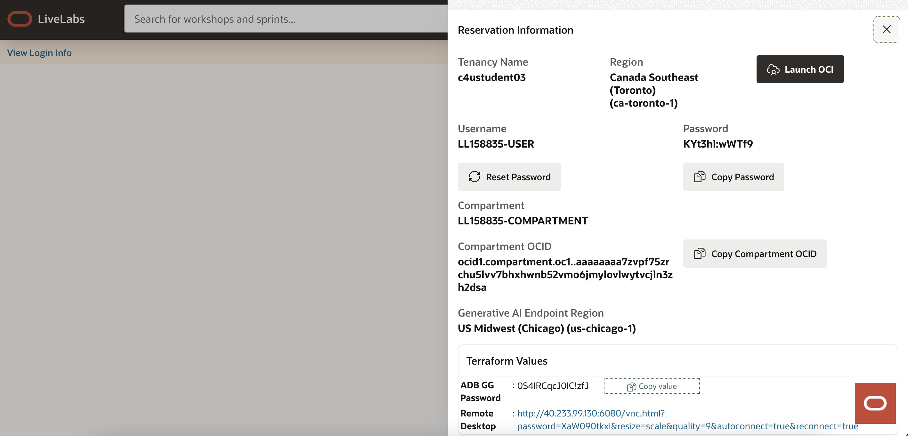

# Lab 2: Review OCI GoldenGate Resources

**Duration:** 10 minutes  

## Introduction
In this lab, you will review the key resources provisioned for this workshop. You will validate access to the source and target databases, confirm the GoldenGate deployment is running, and test the GoldenGate connections. This step ensures your environment is ready before configuring replication pipelines.

### Objectives 

In this lab, you:

* Log in to the Oracle Cloud console and locate your ATP source and ADW target databases.  
* Verify that the YAS_POS Orders dataset is available in the ATP source.  
* Locate the GoldenGate deployment and confirm its status.  
* Verify GoldenGate connections to both source and target databases are configured and working.  

### Prerequisites

Ensure that you've successfully completed all tasks in the preceding lab. 

## Task 1: Review POS source and target databases

1.  In your lab instructions, click **View Login Info**.

2.  In the Reservation Information panel, click **Launch OCI** to open the Oracle Cloud console.

3.  Log in using the workshop credentials found on the Reservation Information panel.

     

4.  After you log in, verify that you are in the correct compartment for the lab resources.  

5.  In the Oracle Cloud navigation menu, select **Oracle Database**, then **Autonomous Transaction Processing**.  

6.  On the Autonomous Transaction Processing page, select **Source POS**.

7.  On the Source POS details page, verify that the **YAN_POS Orders dataset** schema exists (tables `POS_ORDER` and `ORDERITEM`).

    Optionally, open the **Database Actions → SQL Worksheet** and run:  
     
     
         ```sql 
         <copy> SELECT COUNT(*) FROM YAN_POS.POS_ORDER;
         SELECT COUNT(*) FROM YAN_POS.ORDERITEM;</copy>
     ```
     
     This confirms sample data is loaded.  

8.  In the Oracle Cloud console navigation menu, select **Oracle Database**, then **Autonomous Data Warehouse**.

9.  On the Autonomous Data Warehouse page, select **Target AI Hub**.

      

10. Verify connectivity and note the database service name for later steps.  

## Task 2: Test assigned connections
   
1.  In the Oracle Cloud console, select **Oracle Database**, then **GoldenGate**.

2.  In the GoldenGate menu, select **Deployments**.

3.  On the Deployments page, select **GG-AI-Demo**.

4.  On the deployment details page, verify that the deployment status is **Active**. 

      

5.  Take note of the **deployment Console URL** for later use.

      

6.  Click **Assigned connections**.
    
        
    
7.  On the Assigned connections page, from the Actions menu for **ATP (source)**, select **Test connection**. 

8.  Repeat step 7 for **ADW (target**).

     

    > **Note:** If an error message appears, then return to the connection and check your settings.

9.  On the deployment details page, click **Launch Console**.

10. On the sign in page, enter `oggadmin` for Username, then copy and paste the ADM ADMIN password from the Reservation Information panel for Password.

11. In the deployment console, **Administration Service** navigation menu, select **DB Connections**.
    - You should see two connections already provisioned:  
     - **Source (ATP)** – ATP\_POS\_Source\_Connection.  
     - **Target (ADW)** – ADW\_AI\_Mirror\_Target\_Connection.  

    You can optionally test connectivity using the synced connections within the GoldenGate deployment console as well. Click on the login (first icon) under Actions to test datbaase login into Source ATP and Target ADW from GoldenGate console.
     

You may now **proceed to the next lab**.

## Acknowledgements
* **Author** - Shrinidhi Kulkarni, GoldenGate Product Manager
* **Reviewed By**  - Denis Gray,  Vice President, GoldenGate Product Management
* **Last Updated By/Date** - Jenny Chan, September 2025