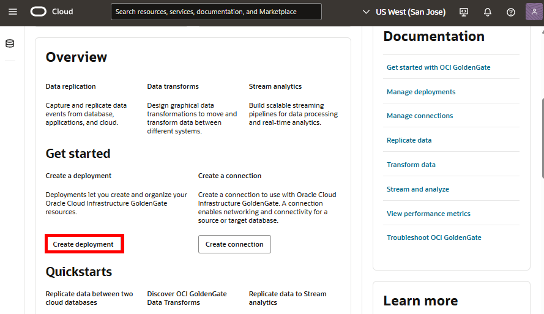
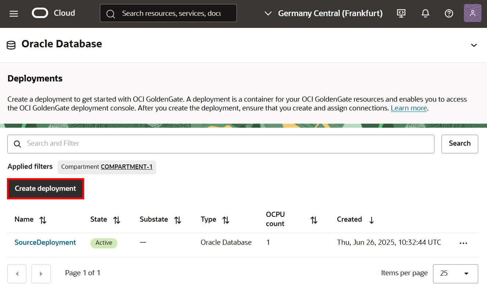
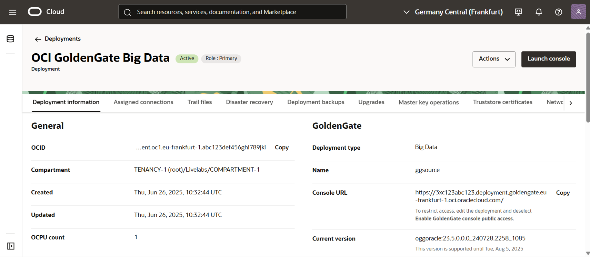
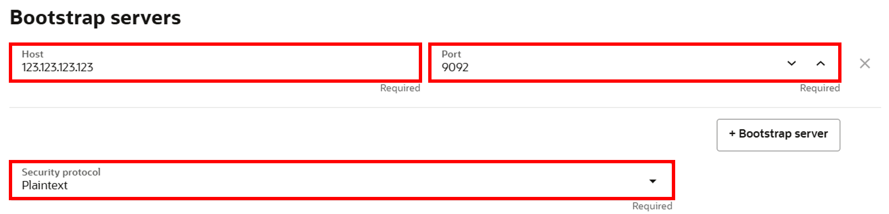
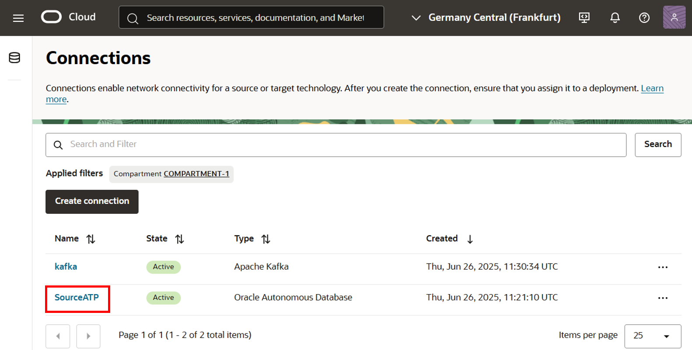
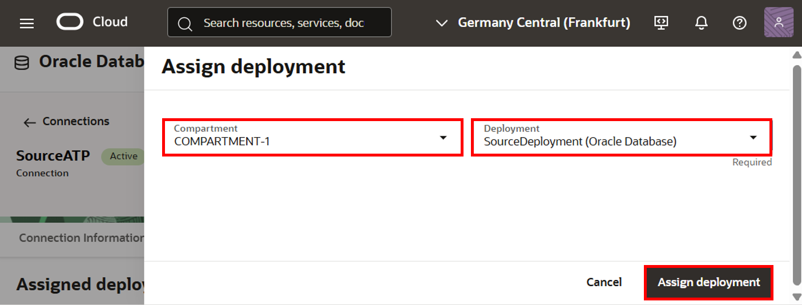

# Create the OCI GoldenGate resources

## Introduction

In this lab, you learn to create Oracle Cloud Infrastructure (OCI) GoldenGate resources necessary to complete this workshop.

Estimated Time: 20 minutes

### About OCI GoldenGate deployments

A Oracle Cloud Infrastructure GoldenGate deployment manages the resources it requires to function. The GoldenGate deployment also lets you access the GoldenGate deployment console, where you can access the OCI GoldenGate deployment console to create and manage processes such as Extracts and Replicats.

### About OCI GoldenGate connections

Connections capture source and target credential information. A connection also enables networking between the Oracle Cloud Infrastructure (OCI) GoldenGate service tenancy virtual cloud network (VCN) and your tenancy VCN using a private endpoint.

### Objectives

In this lab, you will:
* Locate Oracle Cloud Infrastructure GoldenGate in the Console
* Create the deployments
* Review and access the OCI GoldenGate deployment details
* Create the connections
* Assign the connections to their respective deployments
* Access the OCI GoldenGate deployment console

### Prerequisites

This lab assumes that you completed all preceding labs.

## Task 1: Create the source deployment

1.  In the Oracle Cloud console, open the **navigation menu,** navigate to **Oracle Database**, and select **GoldenGate**.

    

2.  On the GoldenGate **Overview** page, click **Create deployment**.

    

3.  You may need to select a compartment. Under List Scope, from the Compartment dropdown, expand the root compartment, and then select the compartment **LiveLabCompartment**.

4.  In the Create Deployment panel, enter **SourceDeployment** for Name.

5.  From the Compartment dropdown, select a compartment.

6. For Choose a deployment type, select **Data replication**.

7. For Select a technology dropdown, select **Oracle Database** from the dropdown.

    

8. Select **Development or testing**. The OCPU count is autopopulated based on your selection.

    

9. For Subnet, select a subnet. If you're using the workshop environment, select **LiveLabWebSubnet**. If located in a different compartment, use the dropdown to change compartments. 

10. For GoldenGate instance name, enter **ggsource**. Take note of the instance name. This helps you identify the source as you switch between deployment consoles. 

11. In an IAM-enabled tenancy, select a Credential Store.

    * If you select **OCI Identity and Access Management (OCI IAM)**, click **Create**, and then proceed to Task 2.
    * If you select **GoldenGate**, complete the following steps.

12. For Administrator username, enter **oggadmin**.

13. For Password secret in &lt;USER&gt;-COMPARTMENT, click **Create password secret**.

    

14. In the Create Secret panel, for Name, enter **LLsecret**.

15. From the Compartment dropdown, select **LiveLabCompartment**.

16. From the Vault dropdown, select your vault.

17. From the Encryption key dropdown, select your encryption key.

18. For User Password, enter a password 8 to 30 alphanumeric characters in length, containing at least 1 uppercase, 1 lowercase, 1 numeric, and 1 special character.

    > **Note:** The special characters must not be $, ^, or ?.

19. Click **Create**.

    

20. Back in the Create deployment panel, for Password secret, ensure **LLsecret** is selected, and then click **Create**.

You're brought to the Deployment Details page. It takes a few minutes for the deployment to be created. Its status changes from CREATING to ACTIVE when it's ready for you to use. You can continue with Tasks 3 and 4 while you wait for the deployment creation to complete.
    

## Task 2: Create the target deployment

1. Go back to the GoldenGate **Overview** page, click **Create deployment**.

    

2.  In the Create Deployment panel, enter **OCI GoldenGate Big Data** for Name.

3.  From the Compartment dropdown, select **LiveLabCompartment**.

4.  Select **Development or testing**. The OCPU count autopopulates based on your selection.

5.  For Subnet, select a subnet. If you're using the workshop environment, select **LiveLabWebSubnet**.

6.  For License type, select **License included**.

7.  Click **Show advanced options**, and then select **Enable GoldenGate console public access**.

8. Click **Next**.

    

9. For deployment type, select **Data replication**.

9. From the Select a technology dropdown, select **Big Data**.

10. For GoldenGate instance name, enter **OCIGGBigData**.

11. In an IAM-enabled tenancy, select a Credential Store.

    * If you select **OCI Identity and Access Management (OCI IAM)**, click **Create**, and then proceed to Task 3.
    * If you select **GoldenGate**, complete the following steps.

11. For Administrator username, enter **oggadmin**.

12. For Password secret, select **LLsecret** from the dropdown.

    

13. Click **Create**.

You're brought to the Deployment Details page. It takes a few minutes for the deployment to be created. Its status changes from CREATING to ACTIVE when it's ready for you to use. You can continue with Tasks 2, 3, and 4 while you wait for the deployment creation to complete.
    

## Task 3: Create the ATP connection

Follow these steps to create a connection to the source Autonomous Transaction Processing (ATP) database.

1.  Use the Oracle Cloud Console breadcrumb to navigate back to the Deployments page.

    

2. Click **Connections**.

3.  On the GoldenGate **Connections** page, click **Create connection**.

    

4.  In the Create connection panel, enter **ATP_Source** for Name.

5.  From the Compartment dropdown, select **LiveLabCompartment**.

6.  For Type, select **Oracle Autonomous Database** and click **Next**.

    

7.  For Database details, choose **Select database**, and then select the ATP database created in Lab 1. Enter **ggadmin** for Database username, **Or4cl3##2023** for password, and then click  **Create**.

    

## Task 4: Create the Apache Kafka connection

Follow the steps below to create a connection to the target  Apache Kafka.

1.  On back to the GoldenGate **Connections** page, click **Create connection**.

    

2.  In the Create connection panel, enter **kafka** for Name.

3.  From the Compartment dropdown, select **LiveLabCompartment**.

4.  For Type, select **Apache Kafka**, and then click **Next**.

    

5.  For Host, enter the public IP of the Kafka Bootstrap servers configured in Lab 1.

6.  For Port, enter **9092**.

7.  For Security protocol, select **Plaintext**, and then click **Create**.

    

## Task 5: Assign connections to deployments

1. On the Connections page, select **ATP_Source**.

    

2. On the Connection details page, under Resources, click **Assigned deployments**, and then click **Assign deployment**.

    

3.	In the Assign deployment dialog, select **SourceDeployment** from the dropdown, and then click **Assign deployment**.

    

4.	Repeat these steps to assign **OCI GoldenGate Big Data** to the Kafka connection.

You may now **proceed to the next lab**.

## Learn More

* [Create data replication resources](https://docs.oracle.com/en/cloud/paas/goldengate-service/llyhq/#articletitle)
* [Connect to Oracle Autonomous Databases](https://docs.oracle.com/en/cloud/paas/goldengate-service/tqrlh/#articletitle)
* [Connect to Apache Kafka](https://docs.oracle.com/en/cloud/paas/goldengate-service/wkynw/#articletitle)

## Acknowledgements
* **Author** - Madhu Kumar S, Senior Solution Engineer, AppDev and Integration
* **Contributors** -  Denis Sendil, Database Product Management; Jenny Chan, Consulting User Assistance Developer, Database User Assistance; Katherine Wardhana, User Assistance Developer
* **Last Updated By/Date** - Katherine Wardhana, User Assistance Developer, December 2023

