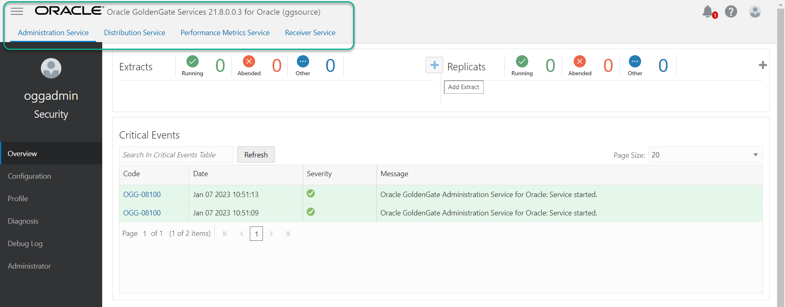
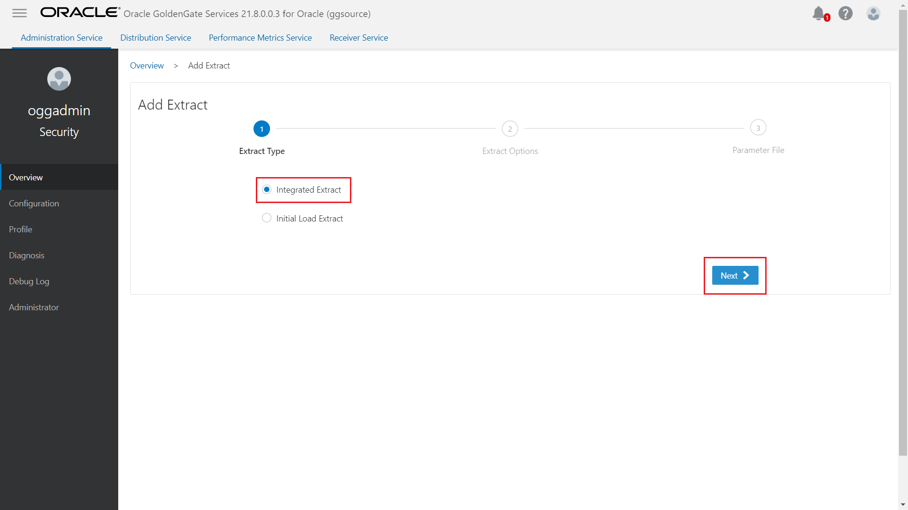
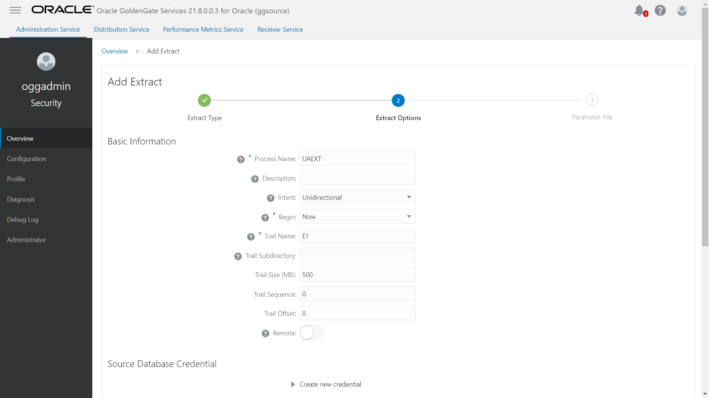
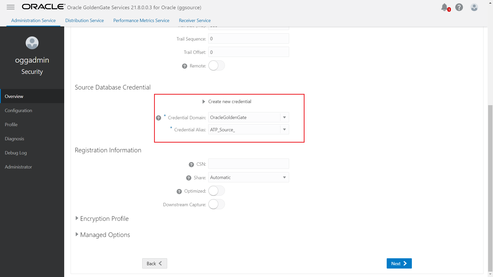
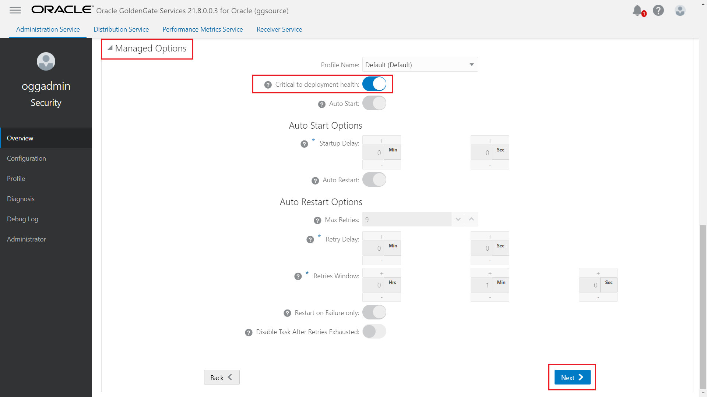
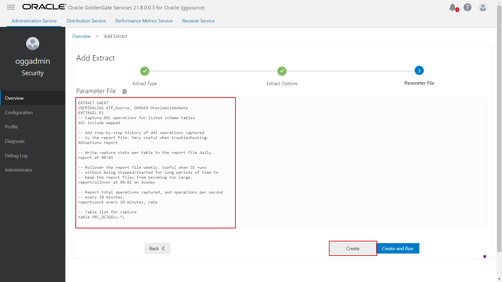
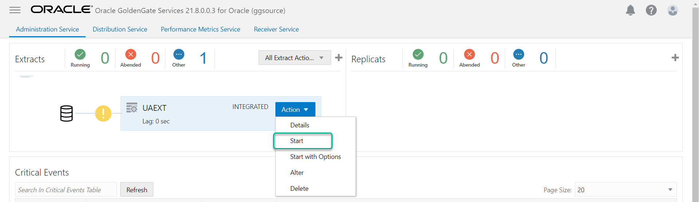
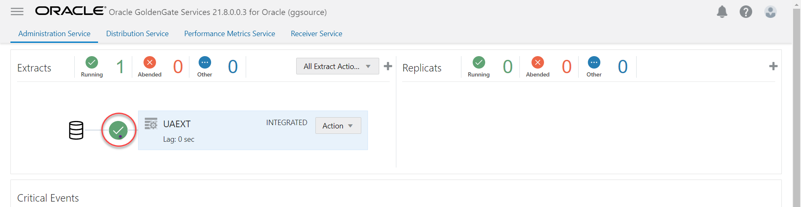

# Create and run the Extract

## Introduction

This lab walks you through the steps to create and run an Extract in the Oracle Cloud Infrastructure (OCI) GoldenGate Deployment Console.

Estimated Time: 15 minutes

### About Extracts 

An Extract is a process that extracts, or captures, data from a source database. 


### Objectives

In this lab, you will:
* Add and run an Extract


### Prerequisites

This lab assumes that you completed all preceding labs, and your deployment is in the Active state.

## Task 1: Add and Run an Extract

1.  On the GoldenGate Deployment Console Home page, click **Add Extract** (plus icon).

    

2.  On the Add Extract page, select **Integrated Extract**, and then click **Next**.

    

3.  For **Process Name**, enter UAEXT.

4.  For **Trail Name**, enter E1.

    

5.  Under **Source Database Credential**, for **Credential Domain**, select **OracleGoldenGate**.

6.  For **Credential Alias**, select the **ATP_Source**.

    

7.  Under Managed Options, enable **Critical to deployment health**.

    

8.  Click **Next**.

9.  On the Parameter File page, in the text area, add a new line to the existing text and add the following:

    ```
    <copy>-- Capture DDL operations for listed schema tables
    ddl include mapped

    -- Add step-by-step history of ddl operations captured
    -- to the report file. Very useful when troubleshooting.
    ddloptions report

    -- Write capture stats per table to the report file daily.
    report at 00:01

    -- Rollover the report file weekly. Useful when IE runs
    -- without being stopped/started for long periods of time to
    -- keep the report files from becoming too large.
    reportrollover at 00:01 on Sunday

    -- Report total operations captured, and operations per second
    -- every 10 minutes.
    reportcount every 10 minutes, rate

    -- Table list for capture
    table SRC_OCIGGLL.*;</copy>
    ```

    

10. Click **Create**. You're returned to the OCI GoldenGate Deployment Console Home page.

11. In the UAEXT **Actions** menu, select **Start**. In the Confirm Action dialog, click **OK**.

    

    The yellow exclamation point icon changes to a green checkmark.

    


You may now **proceed to the next lab**.
## Learn more

* [Creating an Extract](https://docs.oracle.com/en/cloud/paas/goldengate-service/using/goldengate-deployment-console.html#GUID-3B004DB0-2F41-4FC2-BDD4-4DE809F52448)


## Acknowledgements
* **Author** - Madhu Kumar S, Senior Solution Engineer, AppDev and Integration
* **Contributors** -  Denis Sendil, Database Product Management; Jenny Chan, Consulting User Assistance Developer, Database User Assistance
* **Last Updated By/Date** - Madhu Kumar S, Senior Solution Engineer, AppDev and Integration