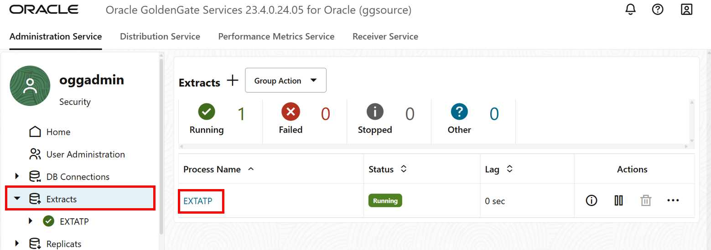
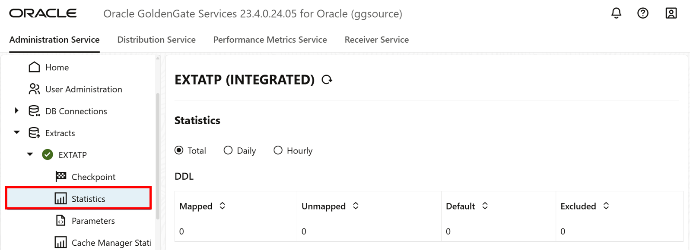
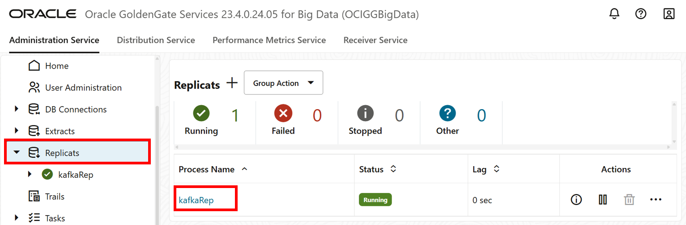
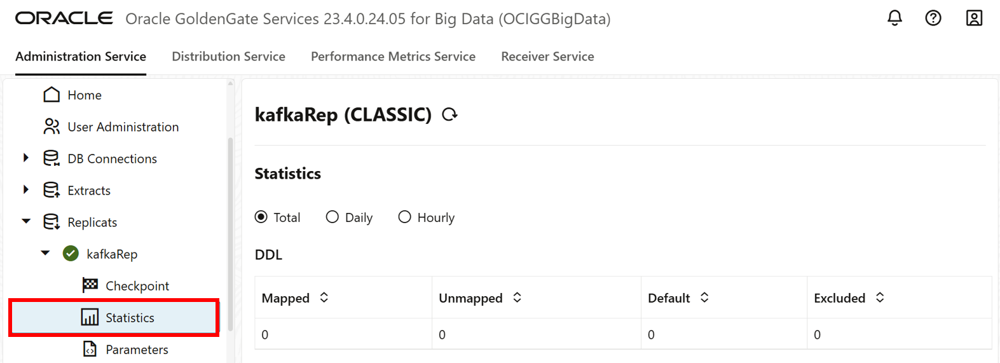

# Verify the replication process

## Introduction

In this lab, you learn to view the Extract and Replicat details and then add data to the ATP schema to verify the replication process runs as expected.

Estimated time: 15 minutes

### Objectives

In this lab, you:
* View the Extract details in the source deployment console
* View the Replicate details in the target deployment console
* Add data to the source database
* Review the Extract and Replicat details to verify replication
* (Optional) View the Kafka topic content


### Prerequisites

This lab assumes that you completed all preceding labs, and your deployment is in the Active state.

## Task 1: View the Extract and Replicat details

1. In the source OCI GoldenGate (ggsource) deployment console, on the Home page, click **Extracts**. 

2. On the Extracts page, click **EXTATP** to view its details.

     

3. On the EXTATP (Integrated) page, click **Statistics**. Verify that there are zero (0) transaction statistics in the table.

      

4. In the target OCI GoldenGate for Big Data (OCIGGBigData) deployment console, on the Home page, click **Replicats**.

5. On the Replicats page, click **kafkaRep** to view its details.

    

6. On the KAFKAREP (CLASSIC APPLY) page, click **Statistics**. Verify that there are no records displayed.

    

## Task 2: Load data into the source database

1. In the Oracle Cloud console, open the navigation menu, click **Oracle Database**, and then click **Autonomous Databases**.

2. On the Autonomous Databases page, select the **SourceATP** database to view its details.

    

3. On the **SourceATP** Database Details page, click **Database actions**, and select **SQL** from the dropdown.

    

 > **Note**: If you're not automatically logged in to SQL, use the ATP database credentials to log in.

4.  Copy the SQL query and paste it into the SQL Worksheet. Click **Run Script**. The Script Output tab displays confirmation messages.

    ```
    <copy>
    Insert into SRC_OCIGGLL.SRC_CITY  values (10,'Houston',20,743113);
    Insert into SRC_OCIGGLL.SRC_CITY  values (11,'Dallas',20,822416);
    Insert into SRC_OCIGGLL.SRC_CITY  values (12,'San Francisco',21,157574);
    Insert into SRC_OCIGGLL.SRC_ORDER_LINES values (1,1,1,549,59292);
    Insert into SRC_OCIGGLL.SRC_ORDER_LINES values (1,2,2,1477,146223);
    Insert into SRC_OCIGGLL.SRC_ORDER_LINES values (1,3,3,1163,20934);
    Insert into SRC_OCIGGLL.SRC_PRODUCT values (1,'Gold Watch',120,'Watches');
    Insert into SRC_OCIGGLL.SRC_PRODUCT values (2,'Silver Watch',110,'Watches');
    Insert into SRC_OCIGGLL.SRC_PRODUCT values (3,'Earrings',20,'Jewels');
    Insert into SRC_OCIGGLL.SRC_REGION values (20,'South',1,'USA');
    Insert into SRC_OCIGGLL.SRC_REGION values (21,'West',1,'USA');
    Insert into SRC_OCIGGLL.SRC_REGION values (22,'East Coast',1,'USA');
    Insert into SRC_OCIGGLL.SRC_ORDERS  values (1,'COM',1001,to_date('11-JAN-01','DD-MON-RR'),null);
    Insert into SRC_OCIGGLL.SRC_ORDERS  values (2,'CLO',1002,to_date('12-FEB-99','DD-MON-RR'),null);
    Insert into SRC_OCIGGLL.SRC_ORDERS  values (3,'CLO',103,to_date('23-MAR-90','DD-MON-RR'),null);
    Insert into SRC_OCIGGLL.SRC_CUSTOMER values (101,0,'Brendt','Paul','10 Jasper Blvd.',107,'(212) 555 2146',19,10);
    Insert into SRC_OCIGGLL.SRC_CUSTOMER values (102,0,'McCarthy','Robin','27 Pasadena Drive',11,'(214) 555 3075',29,11);
    Insert into SRC_OCIGGLL.SRC_CUSTOMER values (103,0,'Travis','Peter','7835 Hartford Drive',12,'(510) 555 4448',34,12);
    commit;

    </copy>
    ```
    

## Task 3: Statistics of the extract and replicat, post data loading to the ATP

1. In the source OCI GoldenGate (ggsource) deployment console, on the Home page, click **Extracts**. 

2. On the Extracts page, click **EXTATP** to view its details.

     

3. On the EXTATP (Integrated) page, click **Statistics**, and then verify that each row displays 3 inserts.

4. In the target OCI GoldenGate for Big Data (OCIGGBigData) deployment console, on the Home page, click **Replicats**.

5. On the Replicats page, click **kafkaRep** to view its details.

    

6. On the KAFKAREP (CLASSIC APPLY) page, click **Statistics**, and then verify that each row displays 3 inserts.


## Task 4: (Optional) Verify the Kafka topic content

1. In the Oracle Cloud console global header, click **Cloud Shell**. Cloud Shell opens as a separate panel in the Oracle Cloud console, which you can expand to full screen.

    

2. Copy the ssh connecting string from the Cloud Shell terraform output and paste it into a Cloud Shell.

    

     
    
3. Run `listtopic` to list all the topics.

     

4. To view the content of the topic, run `consumetopic <topic-name>`.
    
    ```
    <copy> consumetopic SRC_OCIGGLL.SRC_CITY </copy>
    ```
     


## Acknowledgements
* **Author** - Madhu Kumar S, Senior Solution Engineer, AppDev and Integration
* **Contributors** -  Denis Sendil, Database Product Management; Jenny Chan, Consulting User Assistance Developer, Database User Assistance; Katherine Wardhana, User Assistance Developer
* **Last Updated By/Date** - Katherine Wardhana, User Assistance Developer, July 2025
