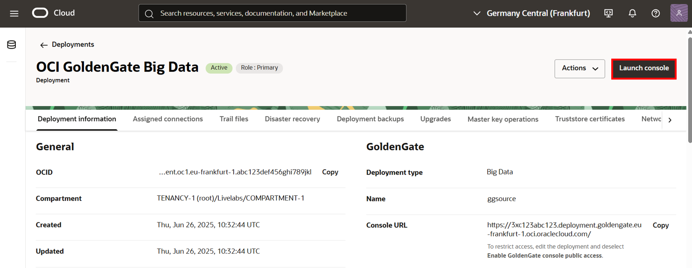
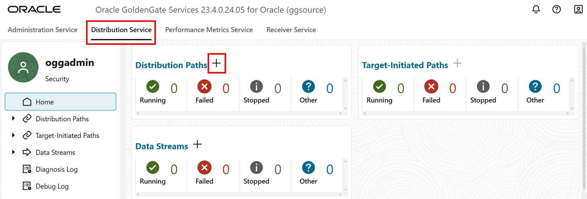

# Create and run the Distribution Path

## Introduction

This lab walks you through the steps to create a distribution path from source OCI GoldenGate Deployment to OCI GoldenGate for Big Data Deployment. 

Estimated time: 10 minutes

### About Distribution Paths

A Distribution Path is a source-to-destination configuration that uses the Distribution Service to send data in a distributed environment.

### Objectives

In this lab, you will:
* Add a deployment user that the distribution path uses to connect to the OCI GoldenGate for Big Data deployment
* Add and run the Distribution Path

### Prerequisites

This lab assumes that you completed all preceding labs.

## Task 1: Add a deployment user on the target deployment

1. Use the Oracle Cloud Console navigation menu to navigate back to Deployments.

2. On the Deployments page, select **OCI GoldenGate Big Data**.

3. On the Deployment Details page, click **Launch Console**.

    

4. On the OCI GoldenGate Big Data Deployment Console sign-in page, enter **oggadmin** for User Name and the password you provided when you created the deployment, and then click **Sign In**.

    > **NOTE**: If using OCI IAM, you must click **Allow** when prompted to give the application access to `get_groups`.

    

    You're brought to the OCI GoldenGate Deployment Console Home page after successfully signing in.

5. In the target OCI GoldenGate for Big Data deployment (OCIGGBigData), open the navigation menu, and then click **Administrator**.

6. On the Users page, click **Add User** (plus icon).

    

7. For **Username**, enter  `DistUser`.

8. For **Role**, select **Operator**.

9. For **Type**, select **Password**.

10. For **Password**, enter a password for the DistUser.

11. Verify your password and the click **Submit**. 

    

## Task 2: Add a Credential to the source deployment

1. In the source OCI GoldenGate deployment (ggsource), open the navigation menu, and then click **Configuration**.

2. On the Credentials page, click **Add Credential** (plus icon).

3. For **Credential Domain**, enter **Distribution**.

4. For **Credential Alias**, enter **ociggbd**.

5. For **User ID**, enter **DistUser**.

6. For **Password** and **Verify Password**, enter the DistUser password from Task 1, Step 7.

7. Click **Submit**.

    

## Task 3: Add a Distribution Path

1. In the source OCI GoldenGate (ggsource) deployment console, click **Distribution Service**.

2. On the Paths page, click **Add Path** (plus icon).

    

3. On the Add Path page, for **Name**, enter `Dist_Path`.

4. For **Source**, select **EXTATP**.

5. For **Trail Name**, enter `AE`.

6. For **Target Authentication Method**, select **UserID Alias**.

7. For **Target**, select **wss** from the dropdown.

8. For **Target Host**, enter the OCI GoldenGate for Big Data hostname in the following format: **&lt;domain&gt;.deployment.goldengate.us-&lt;region&gt;-1.oci.oraclecloud.com**.

    > **NOTE:** You can also copy this from the OCI GoldenGate for Big Data deployment console url from your browser address bar. Ensure that it is the target Big Data deployment console you're copying from, and remove the https://.

9. For **Port Number**, enter `443`.

10. For **Trail Name**, enter `RT`.

11. For **Domain**, enter the domain created in **Task 2, Step 2**. For example, `Distribution`.

12. For **Alias**, enter the User ID created in **Task 2, Step 4**. For example, `ociggbd`.

    

13.	Click **Create and Run**.  You return to the Paths page. If successful, the Distribution Path changes from a yellow exclamation point to a green checkmark.

    

    

14.	This Distribution Path also creates a Receiver Path in the target deployment. In the OCI GoldenGate for Big Data deployment console, click **Receiver Service**. You should see Dist_Path on the Paths page. 

    

In this lab, you created a distribution path from source OCI GoldenGate Deployment to OCI GoldenGate for Big Data Deployment.

You may now **proceed to the next lab**.

## Learn More

* [Managing deployments](https://docs.oracle.com/en/cloud/paas/goldengate-service/ebbpf/index.html#articletitle)

## Acknowledgements
* **Author** - Madhu Kumar S, Senior Solution Engineer, AppDev and Integration
* **Contributors** -  Denis Sendil, Database Product Management; Jenny Chan, Consulting User Assistance Developer, Database User Assistance
* **Last Updated By/Date** - Katherine Wardhana, User Assistance Developer, December 2023