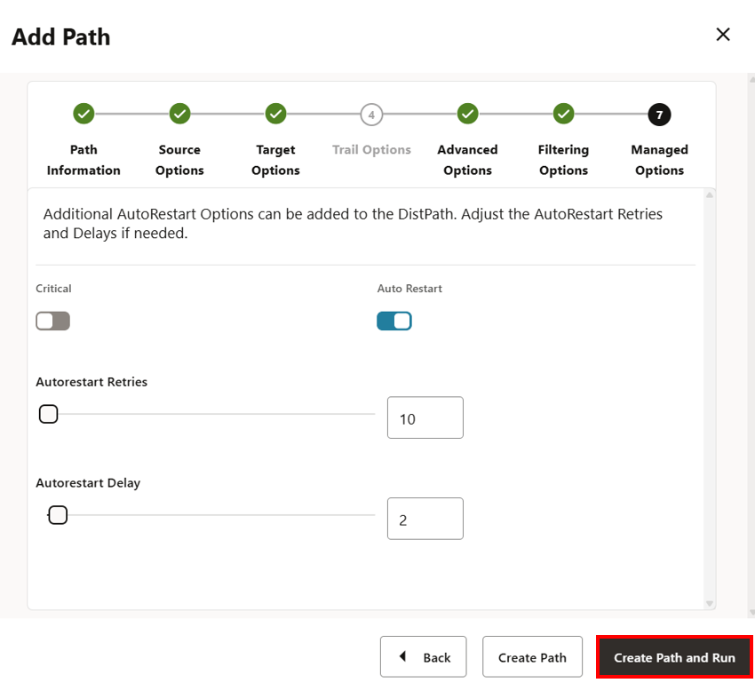

# Create and run the Distribution Path

## Introduction

This lab walks you through the steps to create a distribution path from source OCI GoldenGate Deployment to OCI GoldenGate for Big Data Deployment. 

Estimated time: 10 minutes

### About Distribution Paths

A Distribution Path is a source-to-destination configuration that uses the Distribution Service to send data in a distributed environment.

### Objectives

In this lab, you will:
* Add a deployment user that the distribution path uses to connect to the OCI GoldenGate for Big Data deployment
* Add and run the Distribution Path

### Prerequisites

This lab assumes that you completed all preceding labs.

## Task 1: Add a deployment user on the target deployment

1. Use the Oracle Cloud Console navigation menu to navigate back to Deployments.

2. On the Deployments page, select **OCI GoldenGate Big Data**.

3. On the Deployment details page, click **Launch console**.

    

4. On the OCI GoldenGate Big Data Deployment Console sign-in page, enter **oggadmin** for User Name and the password you provided when you created the deployment, and then click **Sign In**.

    > **NOTE**: If using OCI IAM, you must click **Allow** when prompted to give the application access to `get_groups`.

    

    You're brought to the OCI GoldenGate Deployment Console Home page after successfully signing in.

5. In the target OCI GoldenGate for Big Data deployment (OCIGGBigData), on the navigation menu, click **User Administration**.

6. On the Users page, click **Add New User** (plus icon).

    

7. In the Create new User panel, complete the following fields, and then click **Submit**:

    * For the Authenticated By dropdown, select **Password**.
    * For the Role dropdown, select **Operator**.
    * For Username, enter `DistUser`.
    * For Password, enter a password for the DistUser. Verify the password.

    

## Task 2: Add a Credential to the source deployment

1. In the source OCI GoldenGate deployment (ggsource), in the navigation menu, click **DB Connections**.

2. On the DB Connection page, click **Add DB Connections** (plus icon).

    

3. In the Path Connection panel, complete the following fields, and then click Submit:

    * For Credential Domain, enter **Distribution**.
    * For Credential Alias, enter **ociggbd**.
    * For User ID, enter **DistUser**.
    * For **Password** and **Verify Password**, enter the DistUser password from Task 1, Step 7.

    

## Task 3: Add a Distribution Path

1. In the source OCI GoldenGate (ggsource) deployment console, click **Distribution Service**.

2. On the Paths page, click **Add Path** (plus icon).

    

3. The Add Path panel consists of seven pages. On the Path Information page, for **Name**, enter `Dist_Path`, and then click **Next**.

    

4. On the Source Options page, complete the following fields, and then click **Next**:

    * For **Source Extract**, select **EXTATP** from the dropdown.
    * For **Trail Name**, `AE` should automatically populate the field.

    

5. On the Target Options page, complete the following fields, and then click **Next**:

    * For **Target Protocol**, select **wss** from the dropdown.
    * For **Target Host**, enter the OCI GoldenGate for Big Data hostname in the following format: **&lt;domain&gt;.deployment.goldengate.us-&lt;region&gt;-1.oci.oraclecloud.com**.

        > **NOTE:** You can also copy this from the OCI GoldenGate for Big Data deployment console url from your browser address bar. Ensure that it is the target Big Data deployment console you're copying from, and remove the https://.

    * For **Port Number**, enter `443`.
    * For **Trail Name**, enter `RT`.
    * For **Alias**, enter enter the User ID created in **Task 2, Step 3**. For example, `ociggbd`.

    

6. On the Advanced Options page, leave the fields as they are, and click **Next**.

    

7. On the Filtering Options page, leave the fields as they are, and click **Next**.

    

8. On the Managed Options page, leave the fields as they are, and click **Create Path and Run**. You return to the Paths page. If successful, the Distribution Path changes from a yellow exclamation point to a green checkmark.

    

    

14.	This Distribution Path also creates a Receiver Path in the target deployment. In the OCI GoldenGate for Big Data deployment console, click **Receiver Service**. You should see Dist_Path on the Paths page. 

    

In this lab, you created a distribution path from source OCI GoldenGate Deployment to OCI GoldenGate for Big Data Deployment.

You may now **proceed to the next lab**.

## Learn More

* [Add a Distribution Path](https://docs.oracle.com/en/cloud/paas/goldengate-service/adpen/#articletitle)

## Acknowledgements
* **Author** - Madhu Kumar S, Senior Solution Engineer, AppDev and Integration
* **Contributors** -  Denis Sendil, Database Product Management; Jenny Chan, Consulting User Assistance Developer, Database User Assistance; Katherine Wardhana, User Assistance Developer
* **Last Updated By/Date** - Katherine Wardhana, User Assistance Developer, July 2025
