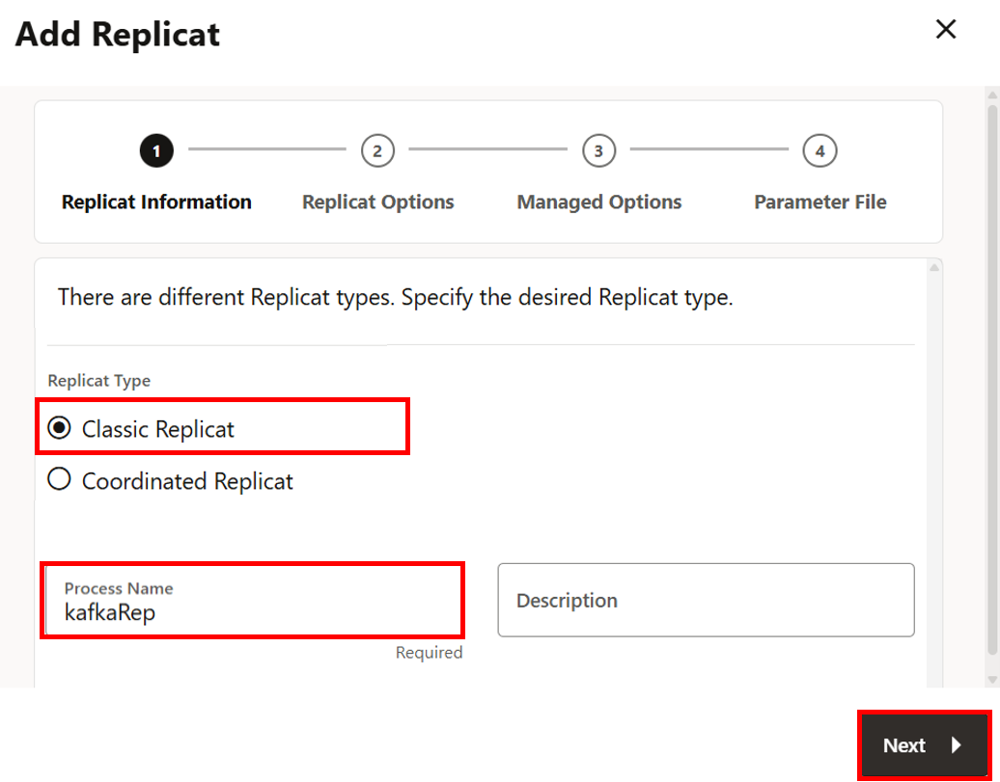
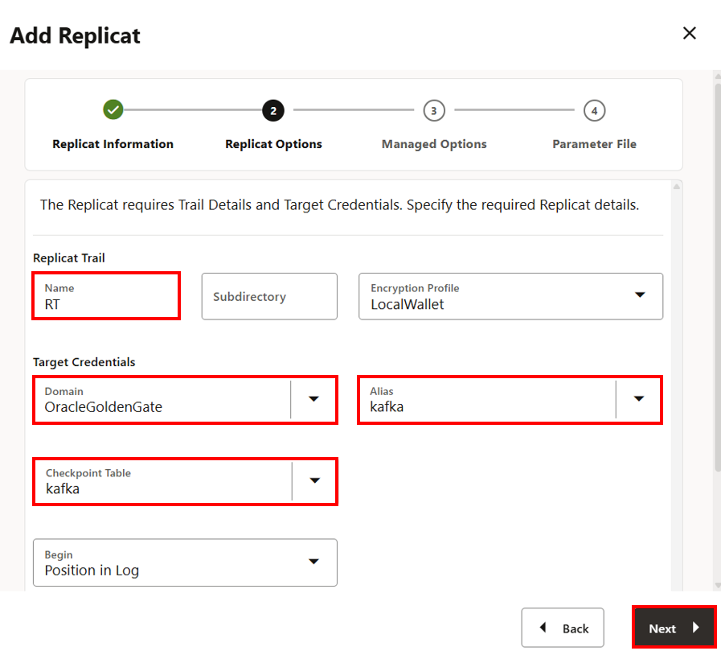
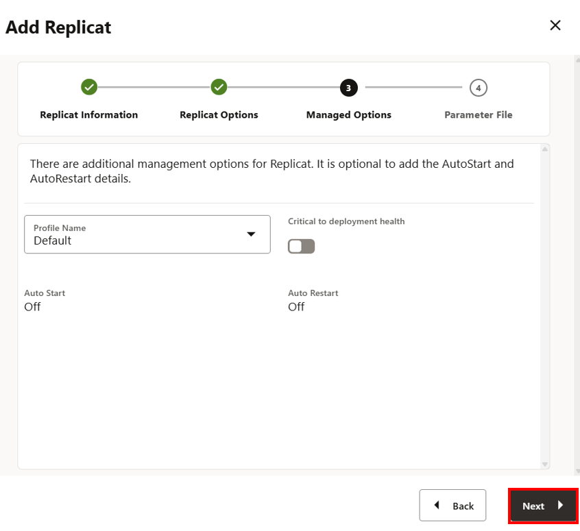
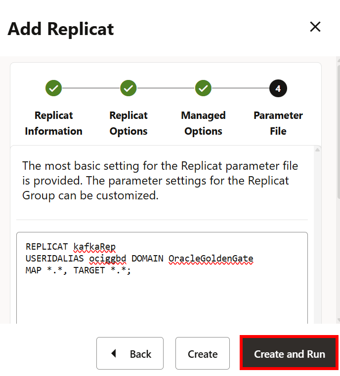

# Create and run the Replicat

## Introduction

In this lab, you learn to Add a checkpoint table and then add and run a Replicat process in the OCI GoldenGate for Big Data deployment console.

Estimated time: 10 minutes

### About Replicat

The Replicat process runs on the target system, reads the trail on that system, and then reconstructs the DML or DDL operations and applies them to the target Apache Kafka. Replicat uses dynamic SQL to compile a SQL statement once, and then execute it many times with different bind variable.

### Objectives

In this lab, you will add and run a Replicat process.

### Prerequisites

This lab assumes that you completed all preceding labs.

## Task 1: Add and run the Replicat

1. In the OCI GoldenGate for Big Data (OCIGGBigData) deployment console, click **Administration Service**. If you don't see Extracts and Replicats, open the navigation menu and click **Overview**.

2. In the Replicats section, click **Add Replicat** (plus icon).

    

3. The Add Replicat panel consists of four pages. On the Replicat Information page, complete the following fields, and then click **Next**: 

    * For Replicat Type, select **Classic Replicat**.
    * For Process Name, enter `kafkaRep`.

    

4. On the Replicat Options page, complete the following fields, and then click **Next**:

    * On the Replicat Options page, for Name, enter `RT`.
    * For Domain, select OracleGoldenGate from the dropdown.
    * For Alias, select **Kafka** from the dropdown.
    * For Checkpoint table, select **Kafka** from the dropdown.

    

5. On the Managed Options page, leave the fields as they are, and then click **Next**.

    

6. On the Parameter File page, leave the fields as they are, and then click **Create and Run**.

    

In this lab, you created a replicat for OCI GoldenGate for Big Data Deployment.

You may now **proceed to the next lab**.

## Learn More
* [Add a Replicat for Kafka](https://docs.oracle.com/en/cloud/paas/goldengate-service/nbxnd/#articletitle)

## Acknowledgements
* **Author** - Madhu Kumar S, Senior Solution Engineer, AppDev and Integration
* **Contributors** -  Denis Sendil, Database Product Management; Jenny Chan, Consulting User Assistance Developer, Database User Assistance; Katherine Wardhana, User Assistance Developer
* **Last Updated By/Date** - Katherine Wardhana, User Assistance Developer, July 2025
