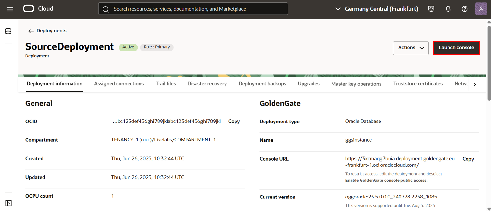
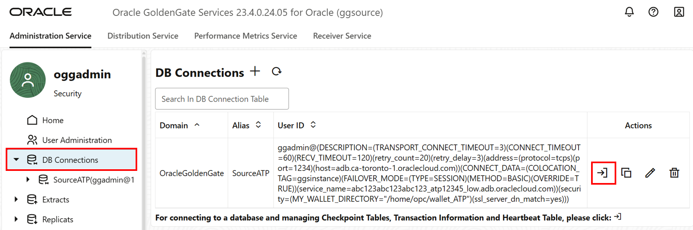

# Create and run the Extract

## Introduction

In this lab, you learn to add Transaction information (TRANDATA) and then add and run the Extract process in the source OCI GoldenGate deployment console.

Estimated time: 15 minutes

### About Transaction information 

Adding Transaction information (TRANDATA) allows Oracle GoldenGate to collect the information it needs from database transaction records.

### About the Extract process

An Extract is a process that extracts, or captures, data from a source database.

### Objectives

In this lab, you will:
* Launch the OCI GoldenGate deployment console and log in
* Add transaction information
* Add and run an Extract


### Prerequisites

This lab assumes that you completed all preceding labs, and your deployment is in the Active state.


## Task 1: Add transaction information

1.  Use the Oracle Cloud Console navigation menu to navigate back to Deployments.

2.  On the Deployments page, select **SourceDeployment**.

3.  On the Deployment Details page, click **Launch console**.

    

4.  On the OCI GoldenGate Deployment Console sign-in page, enter **oggadmin** for User Name and the password you provided when you created the deployment, and then click **Sign In**.

    > **NOTE**: If using OCI IAM, you must click **Allow** when prompted to give the application access to `get_groups`.

    

    You're brought to the OCI GoldenGate Deployment Console Home page after successfully signing in.

> **Note:** Ensure that you enable supplemental logging before adding an Extract or you may encounter errors. If you encounter errors, delete and add the Extract before trying again.

5.  Open the navigation menu and then click **DB Connections**.

6.  Click **Connect to database SourceATP**.

    

7. In the navigation menu, under SourceATP, click **Trandata**.

8. On the **TRANDATA Information** page, click **Add TRANDATA** (plus icon).

    

8.  For **Schema Name**, enter `SRC_OCIGGLL`, and then click **Submit**.

    

9.  To verify, click **Search TRANDATA**, and then enter **SRC\_OCIGGLL** into the Search field and click **Search**.

    

To return to the GoldenGate Deployment Console Home page, click **Home** in the left navigation.

## Task 2: Add and Run an Extract

1.  In the navigation menu, click **Extracts**.

2. On the Extracts page, click **Add Extract** (plus icon).

    

3.  The Add Extract panel consists of five pages. On the Extract information page, complete the following fields, and then click **Next**: 

    * For Extract Type, select **Integrated Extract**.
    * For Process Name, enter `EXTATP`.

    

4. On the Extract Options page, complete the following fields, and then click **Next**:

    * For Domain, select **OracleGoldenGate** from the dropdown.
    * For Alias, select **SourceATP** from the dropdown.
    * For Name, enter `AE`.

    

5. On the Managed Options page, enable **Critical to deployment health**, and then click **Next**.

    

6.  On the Parameter File page, in the text area, add a new line to the existing text and add the following:

    ```
    <copy>-- Capture DDL operations for listed schema tables
    ddl include mapped

    -- Add step-by-step history of ddl operations captured
    -- to the report file. Very useful when troubleshooting.
    ddloptions report

    -- Write capture stats per table to the report file daily.
    report at 00:01

    -- Rollover the report file weekly. Useful when IE runs
    -- without being stopped/started for long periods of time to
    -- keep the report files from becoming too large.
    reportrollover at 00:01 on Sunday

    -- Report total operations captured, and operations per second
    -- every 10 minutes.
    reportcount every 10 minutes, rate

    -- Table list for capture
    table SRC_OCIGGLL.*;</copy>
    ```

7. Click **Create**. You returned to the OCI GoldenGate Deployment Console Home page.

    

8. The EXTATP Extract appears. In the EXTATP Action menu, select **Start**. In the Confirm Action dialog, click **OK**.

    

    The grey exclamation point icon changes to a green checkmark.

    

You may now **proceed to the next lab**.

## Learn more

* [Enable TRANDATA](https://docs.oracle.com/en/middleware/goldengate/core/21.3/coredoc/extract-adding-extract.html#GUID-5848749D-282E-4DA9-9D65-00C34ED5F3BF)
* [Add an Extract for Oracle Database](https://docs.oracle.com/en/cloud/paas/goldengate-service/eeske/#articletitle)

You may now **proceed to the next lab**.

## Acknowledgements
* **Author** - Madhu Kumar S, Senior Solution Engineer, AppDev and Integration
* **Contributors** -  Deniz Sendil, Database Product Management; Jenny Chan, Consulting User Assistance Developer, Database User Assistance; Katherine Wardhana, User Assistance Developer
* **Last Updated By/Date** - Katherine Wardhana, User Assistance Developer, July 2025
