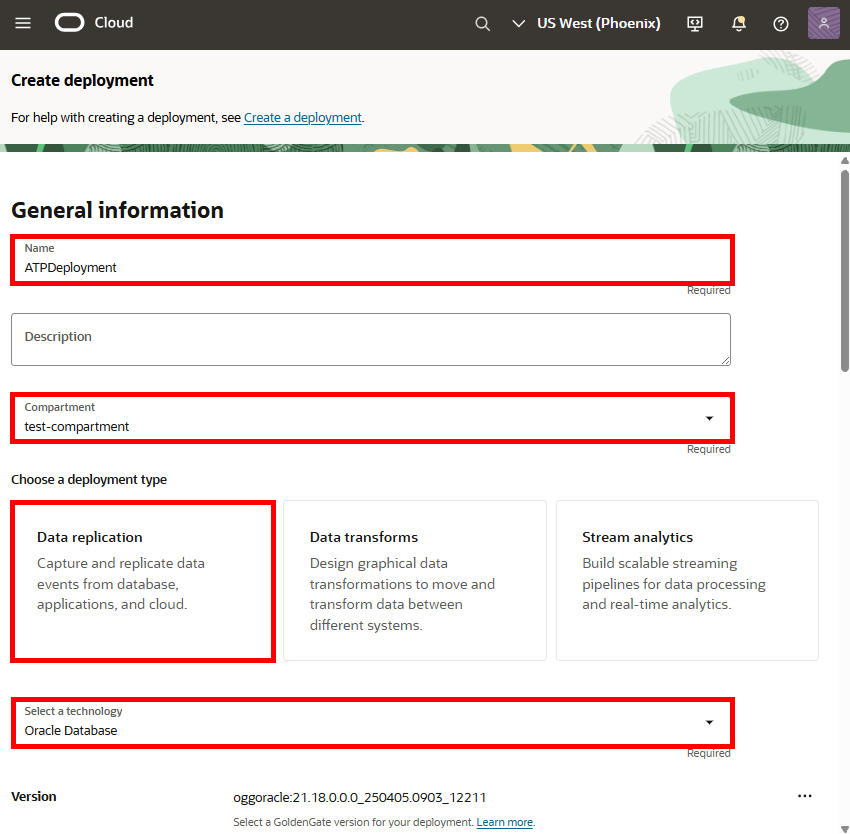
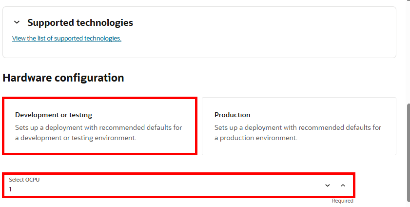
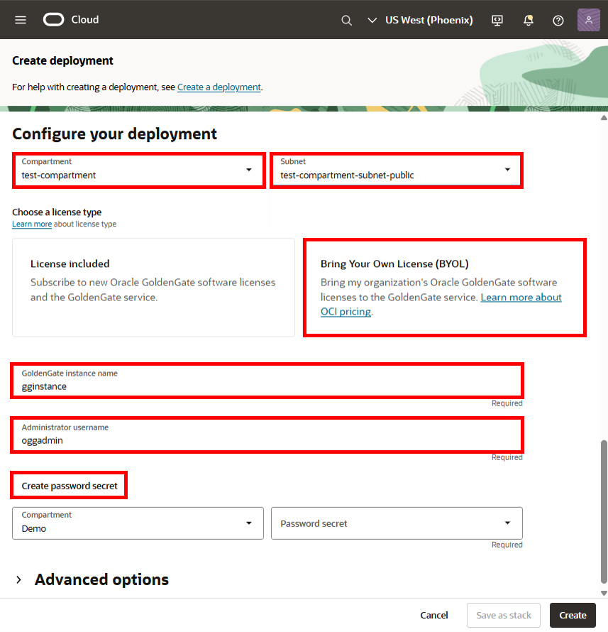
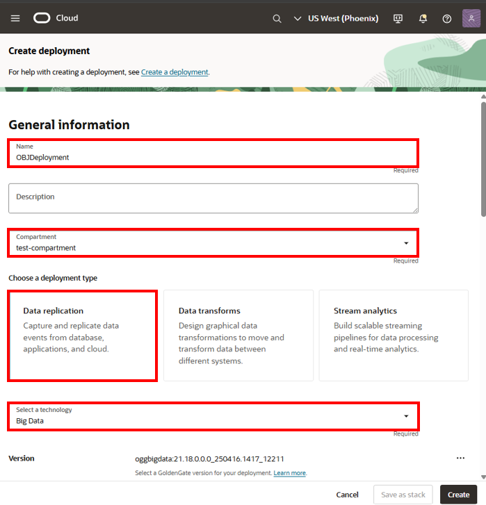
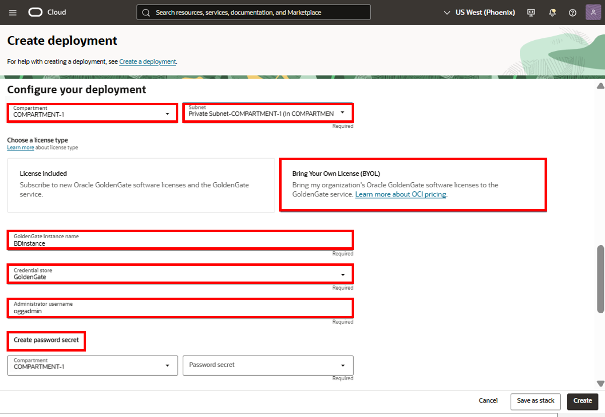
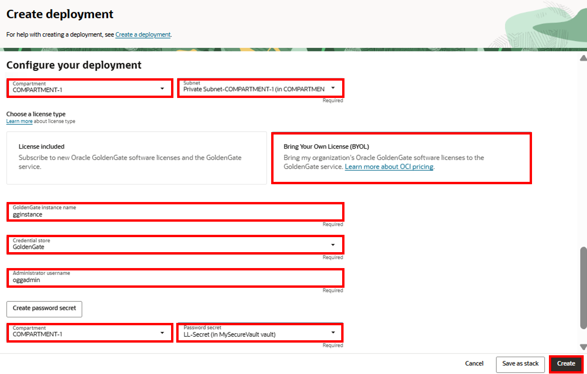

# Set up the environment

## Introduction

In this lab, you learn to create the required resources you'll use for Oracle Cloud Infrastructure (OCI) GoldenGate. You'll learn to create a VCN and subnet, provision an autonomous database instance, and load data into the database.

Estimated time: 20 mins

### Objectives

-  Learn to provision a VCN and subnet
-  Learn how to provision, connect, and load data into an Autonomous Transaction Processing (ATP) instance

### Prerequisites

To successfully complete this lab, you must:
* Have completed the Get Started lab and sign up for Free Tier/Log in to Oracle Cloud.
* For IAM-enabled tenancies, ensure that you [configure Identity domains for OCI GoldenGate](https://docs.oracle.com/en/cloud/paas/goldengate-service/mkmbs/#GUID-DD9C1BF8-69FE-4C9A-A2D1-74C73550ED65).
* For non-IAM enabled tenancies, ensure that you ensure that you first [set up your Vault](https://docs.oracle.com/en-us/iaas/Content/KeyManagement/Tasks/managingvaults_topic-To_create_a_new_vault.htm#createnewvault). [Learn more about Vault service](https://docs.oracle.com/en-us/iaas/Content/KeyManagement/Concepts/keyoverview.htm).

> **Notes:** 
* You may see differences in account details (eg: Compartment is different in different places) as you work through the labs. This is because the workshop was developed using different accounts over time.
* This workshop was designed to use Oracle Autonomous Database as the source. If you plan to use Oracle Database, ensure that you use the CDB user to capture data from the PDBs.

## Task 1: Create a VCN and subnet

## Task 2: Create an ATP instance

## Task 3: Load the ATP schema and enable supplemental logging

## Task 4: Create a deployment for Autonomous Transaction Processing

1.  Open the **Navigation Menu**, navigate to **Oracle Database**, and select **GoldenGate**.

    

2.  On the GoldenGate **Overview** page, click **Deployments**.

    

3.  You may need to select a compartment. Under List Scope, from the Compartment dropdown, expand the root compartment, and then select the compartment associated with your username. For example, if your LiveLab username is LL1234-user, expand root, and then select the compartment **LL1234-COMPARTMENT**.

4.  On the Deployments page, click **Create Deployment**.

    

5.  In the Create Deployment panel, enter **ATPDeployment** for Name.

6.  From the Compartment dropdown, select a compartment.

7. For Choose a deployment type, select **Data replication**.

8. For Select a technology dropdown, select **Oracle Database** from the dropdown.

    

9. Select **Development or testing**. The OCPU count is autopopulated based on your selection.

    

10. For Subnet, select a subnet. If you're using the workshop environment, select **&lt;USER&gt;-SUBNET-PUBLIC**. If located in a different compartment, use the dropdown to change compartments.

11. For License type, select **Bring Your Own License (BYOL)**.

12. For GoldenGate Instance Name, enter **ggsinstance**.

13. For Administrator Username, enter **oggadmin**.

14. Click **Create password secret**.

    

15. In the Create secret panel, for Name, enter `LLsecret`.

16. From the Compartment dropdown, select a compartment.

17. For Vault, select a subnet. If located in a different compartment, use the dropdown to change compartments. 

18. For Encryption key, select a subnet. If located in a different compartment, use the dropdown to change compartments. 

19. For User password, enter a password 8 to 30 alphanumeric characters in length, containing at least 1 uppercase, 1 lowercase, 1 numeric, and 1 special character.

    > **NOTE**: The special characters must not be $, ^, or ?

20. Confirm the password, and then click **Create**. 

    

18. Back in the Create deployment panel, for Password secret, ensure **LLsecret** is selected, and then click **Create**.

You're brought to the Deployment Details page. It takes a few minutes for the deployment to be created. Its status changes from CREATING to ACTIVE when it's ready for you to use. You can continue with Tasks 2, 3, 4 and 5 while you wait for the deployment creation to complete.

## Task 5: Create a deployment for Oracle Object Storage

1.  On the Deployments page, click **Create Deployment**.

2.  In the Create Deployment panel, enter **OBJDeployment** for Name.

3.  From the Compartment dropdown, select a compartment. 

4. For Choose a deployment type, select **Data replication**.

5. For Select a technology dropdown, select **Big Data** from the dropdown.

    

6. Select **Development or testing**. The OCPU count is autopopulated based on your selection.

    

7. For Subnet, select a subnet. If you're using the workshop environment, select **&lt;USER&gt;-SUBNET-PUBLIC**. If located in a different compartment, use the dropdown to change compartments.

8. For License type, select **Bring Your Own License (BYOL)**.

9. For GoldenGate Instance Name, enter **BDinstance**.

10. Select a **Credential store**:

    * If you select **OCI Identity and Access Management (OCI IAM)**, click **Create**, and then proceed to the next lab (skip the following steps).
    * If you select **GoldenGate**, complete the following steps.

11. For Administrator Username, enter **oggadmin**.

12. For Password secret in &lt;USER&gt;-COMPARTMENT, click **Create password secret**.

    

13. In the Create secret panel, enter `LLsecret`.

14. For User password, enter a password 8 to 30 alphanumeric characters in length, containing at least 1 uppercase, 1 lowercase, 1 numeric, and 1 special character.

    > **NOTE**: The special characters must not be $, ^, or ?. 

15. Confirm the password, and then click **Create**.

    

16. Back in the Create deployment panel, for Password secret, ensure **LLsecret** is selected, and then click **Create**.

You're brought to the Deployment Details page. It takes a few minutes for the deployment to be created. Its status will change from CREATING to ACTIVE when it is ready for you to use.

## Task 6: Create a deployment for Oracle Database

1.  On the Deployments page, click **Create Deployment**.

2.  In the Create Deployment panel, enter **ATPDeployment** for Name.

3.  From the Compartment dropdown, select a compartment. 

4. For Choose a deployment type, select **Data replication**.

5. For Select a technology dropdown, select **Oracle Database** from the dropdown.

    

6. Select **Development or testing**. The OCPU count is autopopulated based on your selection.

    

7. For Subnet, select a subnet. If you're using the workshop environment, select **&lt;USER&gt;-SUBNET-PRIVATE**. If located in a different compartment, use the dropdown to change compartments.

8. For License type, select **Bring Your Own License (BYOL)**.

9. For GoldenGate Instance Name, enter **gginstance**.

10. For Administrator Username, enter **oggadmin**.

11. For Password secret, select **LLSecret**.

12. Click **Create**.

    

You're brought to the Deployment Details page. It takes a few minutes for the deployment to be created. Its status will change from CREATING to ACTIVE when it is ready for you to use.

**Proceed to the next lab.**

## Acknowledgements

- **Author** - Jenny Chan, Consulting User Assistance Developer
- **Last Updated by** - Katherine Wardhana, June 2025
- **PAR Expiration date** - February 2030
