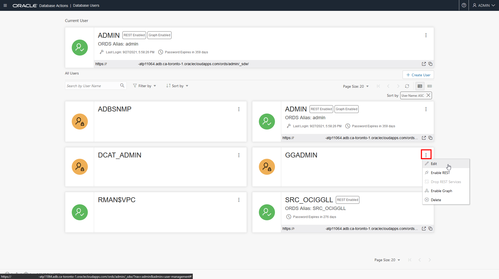
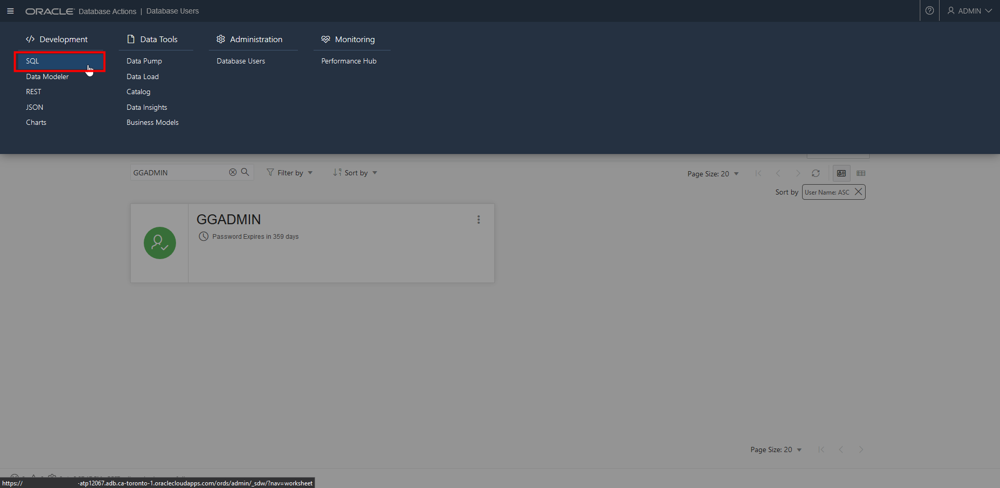
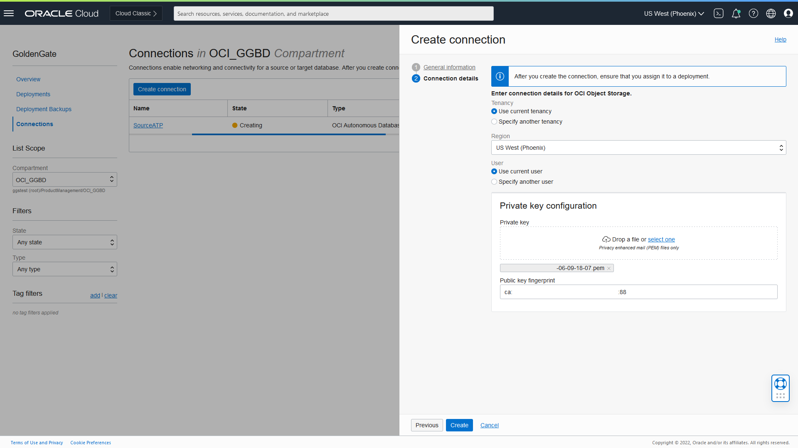
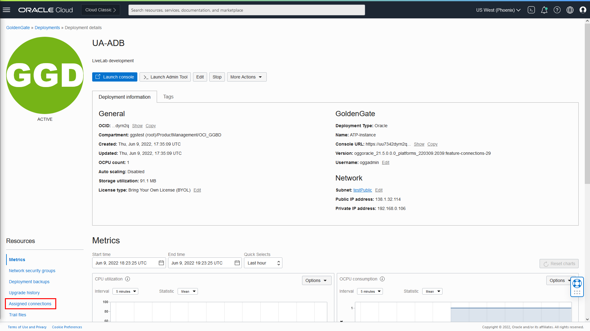
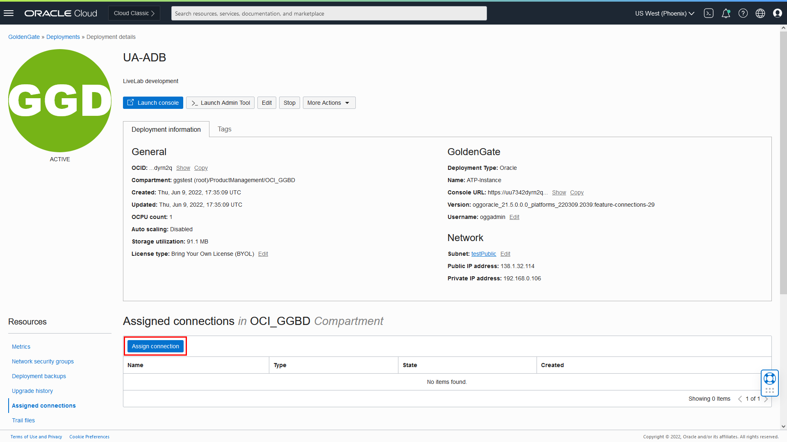
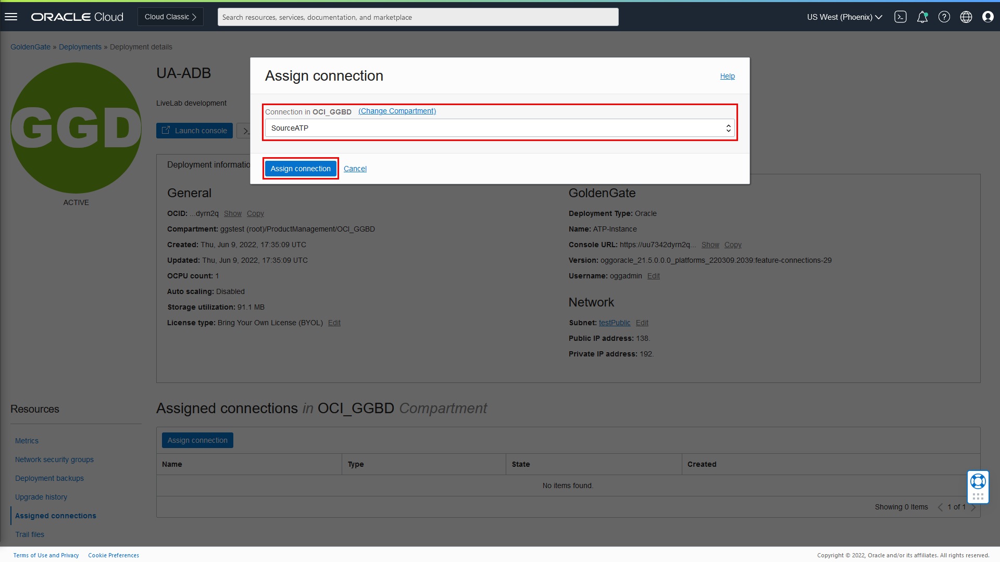
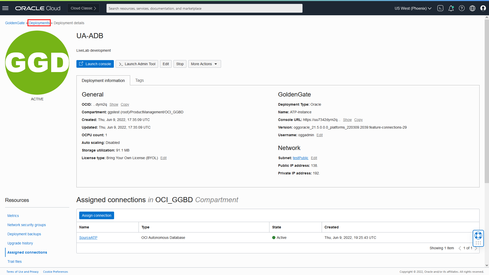
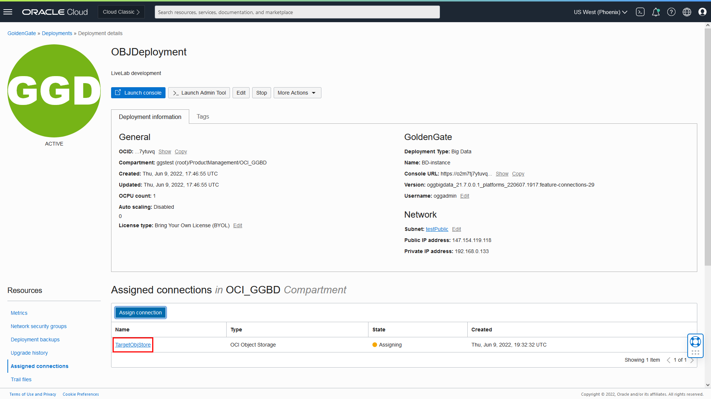

# Create the Oracle Cloud Infrastructure GoldenGate resources

## Introduction

This lab walks you through the steps to create Oracle Cloud Infrastructure (OCI) GoldenGate resources that you'll need to complete this workshop.

Estimated time: 30 minutes

### About Oracle Cloud Infrastructure GoldenGate resources

A Oracle Cloud Infrastructure GoldenGate deployment manages the resources it requires to function. The GoldenGate deployment also lets you access the GoldenGate deployment console, where you can access the OCI GoldenGate deployment console to create and manage processes such as Extracts and Replicats.

Connections capture source and target credential information. A connection also enables networking between the Oracle Cloud Infrastructure (OCI) GoldenGate service tenancy virtual cloud network (VCN) and your tenancy VCN using a private endpoint.

### Objectives

In this lab, you will:
* Locate Oracle Cloud Infrastructure GoldenGate in the Console
* Create an OCI GoldenGate deployment for the Autonomous Database
* Create an OCI GoldenGate deployment for Oracle Object Storage
* Create connections for the source Autonomous Databases and target Oracle Object Storage bucket
* Assign connections to deployments


### Prerequisites
In Task 5, you must upload a private key and enter the corresponding public key fingerprint. To add an API key:

1.  Oracle Cloud console global navigation bar, click Profile (user icon).

2.  On the user details page, under **Resources**, click API **Keys**.

3.  Click **Add API Key**.

4.  In the Add API Key dialog, click **Download Private Key**, and then click **Add**.

5.  In the Configuration File Preview dialog, copy the fingerprint to a text editor, and then click **Close**.

> **Note:** *Compartment names in the screenshots may differ from values that appear in your environment.*

## Task 1: Create a deployment for Autonomous Transaction Processing

1.  Open the **Navigation Menu**, navigate to **Oracle Database**, and select **GoldenGate**.

    

2.  On the GoldenGate **Overview** page, click **Deployments**.

    

3.  You may need to select a compartment. Under List Scope, from the Comparment dropdown, expand the root compartment, and then select the compartment associated with your username. For example, if your LiveLab username is LL1234-user, expand root, and then select the compartment **LL1234-COMPARTMENT**.

4.  On the Deployments page, click **Create Deployment**.

    

5.  In the Create Deployment panel, enter **ATPDeployment** for Name.

6.  From the Compartment dropdown, select a compartment.

7.  For OCPU Count, enter **1**.

8.  For Subnet, select a subnet. If you're using the workshop environment, select **&lt;user&gt;pubsubnt**.

9.  For License type, select **Bring You Own License (BYOL)**.

10. Click **Show Advanced Options**, and then select **Create Public Endpoint**.

    

11. Click **Next**.

12. From the Select a technology dropdown, select **Oracle Database**.

13. For GoldenGate Instance Name, enter **ATPinstance**.

14. For Administrator Username, enter **oggadmin**.

15. For Administrator Password, enter a password. Take note of this password.

16. Click **Create**.

    

You're brought to the Deployment Details page. It takes a few minutes for the deployment to be created. Its status will change from CREATING to ACTIVE when it is ready for you to use.

## Task 2: Create a deployment for Oracle Object Storage

1.  On the Deployments page, click **Create Deployment**.

2.  In the Create Deployment panel, enter **OBJDeployment** for Name.

3.  From the Compartment dropdown, select a compartment.

4.  For OCPU Count, enter **1**.

5.  For Subnet, select a subnet. If you're using the workshop environment, select **&lt;user&gt;pubsubnt**.

6.  For License type, select **Bring You Own License (BYOL)**.

7.  Click **Show Advanced Options**, and then select **Create Public Endpoint**.

    

8.  Click **Next**.

9.  From the Select a technology dropdown, select **Oracle Database**.

10. For GoldenGate Instance Name, enter **BDinstance**.

11. For Administrator Username, enter **oggadmin**.

12. For Administrator Password, enter a password. Take note of this password.

13. Click **Create**.

    

You're brought to the Deployment Details page. It takes a few minutes for the deployment to be created. Its status will change from CREATING to ACTIVE when it is ready for you to use.

## Task 3: Create an Autonomous Database connection

Follow the steps below to create a connection for the source Oracle Autonomous Transaction Processing \(ATP\) Database.

1.  Use the Oracle Cloud Console breadcrumb to navigate back to the GoldenGate page.

    

2.  Click **Connections**.

    

3.  Click **Create Connection**.

    

4.  In the Create Connection panel, for Name, enter **SourceATP**.

5.  From the Type dropdown, select **OCI Autonomous Database**.

6.  Click **Next**.

7.  For **Database in &lt;compartment-name&gt;**, click **Change Compartment**, select the compartment you created your ATP instance, and then select **SourceATP** from the dropdown. Some fields are autopopulated based on your selection.

8.  Enter a password for the `ggadmin` user in the Password field, and then click **Create**.

    

    The database registration becomes Active after a few minutes.

## Task 4: Unlock the GGADMIN user and enable supplemental logging for the source database

Oracle Autonomous Databases come with a GGADMIN user that is locked by default. The following steps guide you through how to unlock the GGADMIN user.

1.  From the Oracle Cloud Console **Navigation Menu** (hamburger icon), click **Oracle Database**, and then select **Autonomous Transaction Processing**.

	

2.  From the list of databases, select **SourceATP**.

    

3.  On the SourceATP Database Details page, click **Database Actions**.

    

    > **Note:** *If you're prompted to log in to Database Actions, use the SourceATP admin credentials located in the Workshop Details.*

4.  Under **Administration**, click **Database Users**.

    

5.  From the list of users, locate **GGADMIN**, and then click the ellipsis (three dots) icon and select **Edit**.

    

6.  In the Edit User panel, deselect **Account is Locked**, enter the password you gave the ggadmin user in the database registration steps above, and then click **Apply Changes**.

    

    Note that the user icon changes from a padlock to a checkmark.

7.  Open the navigation menu (hamburger icon), and then under **Development**, select **SQL**.

    

8.  Enter the following into the Worksheet, and then click **Run Statement**.

    ```
    <copy>ALTER PLUGGABLE DATABASE ADD SUPPLEMENTAL LOG DATA;</copy>
    ```

9.  Replace the supplemental logging script with the following to check support mode, and then click **Run Statement**:

    ```
    <copy>
    select * from DBA_GOLDENGATE_SUPPORT_MODE where owner = 'SRC_OCIGGLL';
    </copy>
    ```

    The Script Output panel displays six tables whose Support_Mode is **FULL**.

    

    You can leave the SQL window open and continue with the next Task.

## Task 5: Create a connection for Oracle Object Storage

1.  Use the Oracle Cloud Console navigation menu to navigate back to GoldenGate.

2.  Click **Connections** and then **Create Connection**.

3.  In the Create Connection panel, enter **TargetObjStore** for Name.

4.  From the Type dropdown, select **OCI Object Storage**.

5.  Click **Next**.

6.  From the Region dropdown, select a region.

7.  For Private key configuration, drag-and-drop the private key (.pem) or select it from your local machine.

    >**Note**: *Refer to the Prerequisites section for instructions on how to obtain a private key.*

8.  Enter the corresponding public key fingerprint.

9.  Click **Create**.

    

    The Connection becomes Active after a few minutes.

## Task 6: Assign connections to deployments

After your deployments and connections become active, you can assign the connections to the appropriate deployments.

1.  In the GoldenGate menu, click **Deployments**.

2.  Select **ATPDeployment** to view its details.

3.  On the ATPDeployment details page, under Resources, click **Assigned connections**.

    

4.  Under Assigned connections, click **Assign connection**.

    

5.  In the Assign connection dialog, from the **Connection** dropdown, select **SourceATP**, and then click **Assign connection**.

    

6.  Use the breadcrumb to return to the Deployments page.

    

7.  Repeat steps 2 to 6 to assign the TargetObjStore connection to the OBJDeployment.

    

## Task 7: Verify replication

13. Return to the Oracle Cloud Console and use the navigation menu (hamburger icon) to navigate back to **Oracle Database**, **Autonomous Transaction Processing**, and then **SourceATP**.

14. On the Source ATP Details page, click **Tools**, and then **Database Actions**.

15. Use the Source ATP database credentials in the Workshop details to log in to Database Actions, and then click **SQL**.

16. Enter the following inserts, and then click **Run Script**:

    ```
    <copy>Insert into SRC_OCIGGLL.SRC_CITY (CITY_ID,CITY,REGION_ID,POPULATION) values (1000,'Houston',20,743113);
Insert into SRC_OCIGGLL.SRC_CITY (CITY_ID,CITY,REGION_ID,POPULATION) values (1001,'Dallas',20,822416);
Insert into SRC_OCIGGLL.SRC_CITY (CITY_ID,CITY,REGION_ID,POPULATION) values (1002,'San Francisco',21,157574);
Insert into SRC_OCIGGLL.SRC_CITY (CITY_ID,CITY,REGION_ID,POPULATION) values (1003,'Los Angeles',21,743878);
Insert into SRC_OCIGGLL.SRC_CITY (CITY_ID,CITY,REGION_ID,POPULATION) values (1004,'San Diego',21,840689);
Insert into SRC_OCIGGLL.SRC_CITY (CITY_ID,CITY,REGION_ID,POPULATION) values (1005,'Chicago',23,616472);
Insert into SRC_OCIGGLL.SRC_CITY (CITY_ID,CITY,REGION_ID,POPULATION) values (1006,'Memphis',23,580075);
Insert into SRC_OCIGGLL.SRC_CITY (CITY_ID,CITY,REGION_ID,POPULATION) values (1007,'New York City',22,124434);
Insert into SRC_OCIGGLL.SRC_CITY (CITY_ID,CITY,REGION_ID,POPULATION) values (1008,'Boston',22,275581);
Insert into SRC_OCIGGLL.SRC_CITY (CITY_ID,CITY,REGION_ID,POPULATION) values (1009,'Washington D.C.',22,688002);</copy>
    ```

17. In the Oracle GoldenGate Marketplace Administration Server, select **Overview** from the navigation menu (hamburger icon), click the **Extract name (UAEXT)**, and then click **Statistics**. Verify that **SRC\_OCIGGLL.SRC\_CITY** is listed with 10 inserts.

    

18. Navigate to the Oracle GoldenGate Marketplace Distribution Server. From the **Action** menu, select **Details**, and then **Statistics**. Verify that **SRC\_OCIGGLL.SRC\_CITY** lists 10 inserts.

    

19. In the OCI GoldenGate Deployment Console, click the name of the Replicat to view its details, and then click **Statistics** to verify the Replicat applied the rows.

    


## Acknowledgements
* **Author** - Jenny Chan, Consulting User Assistance Developer, Database User Assistance
* **Contributors** -  Deniz Sendil, Database Product Management
* **Last Updated By/Date** - Jenny Chan, June 2022
