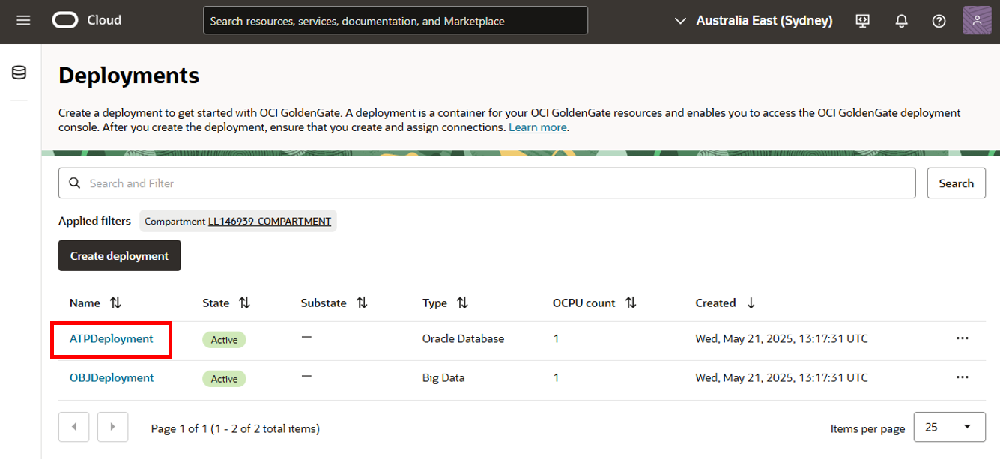
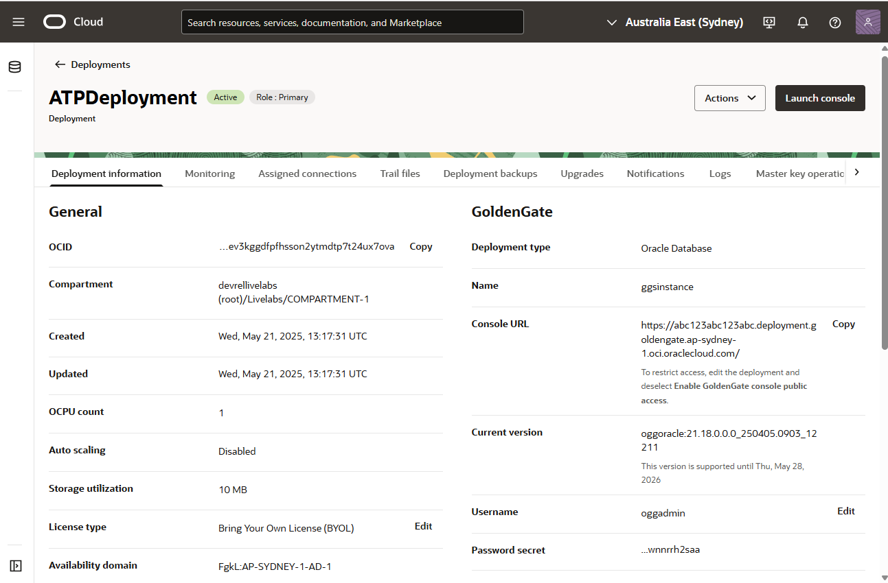
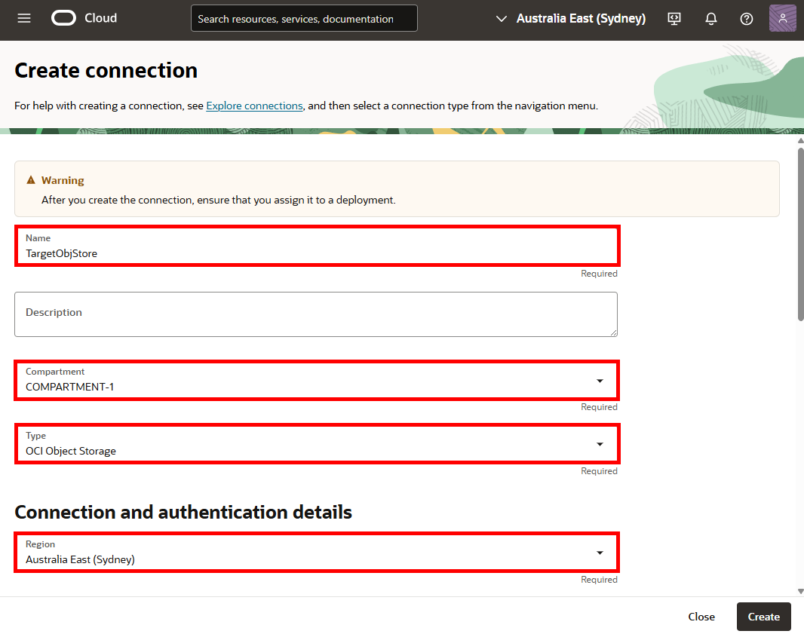
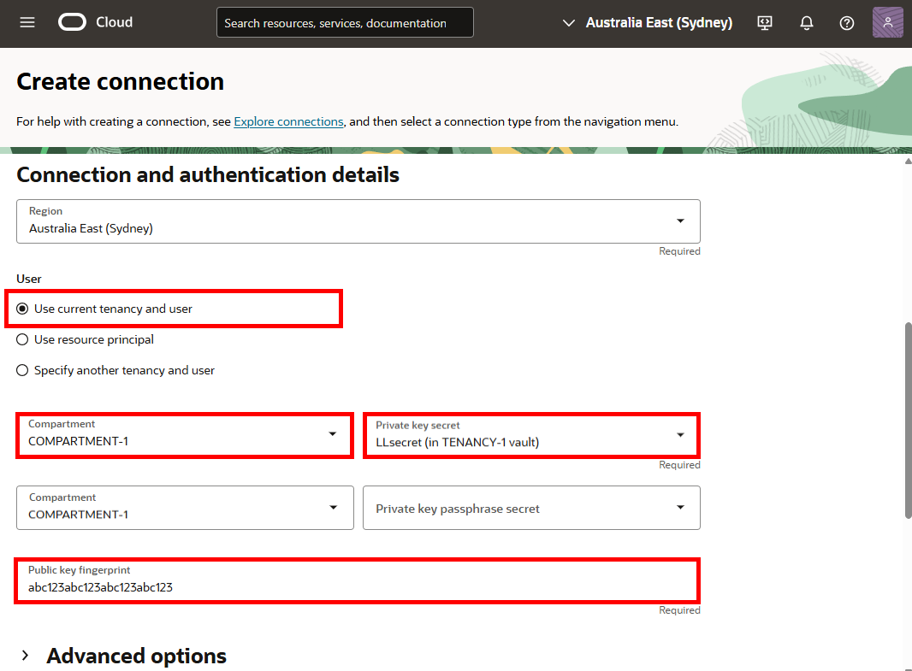
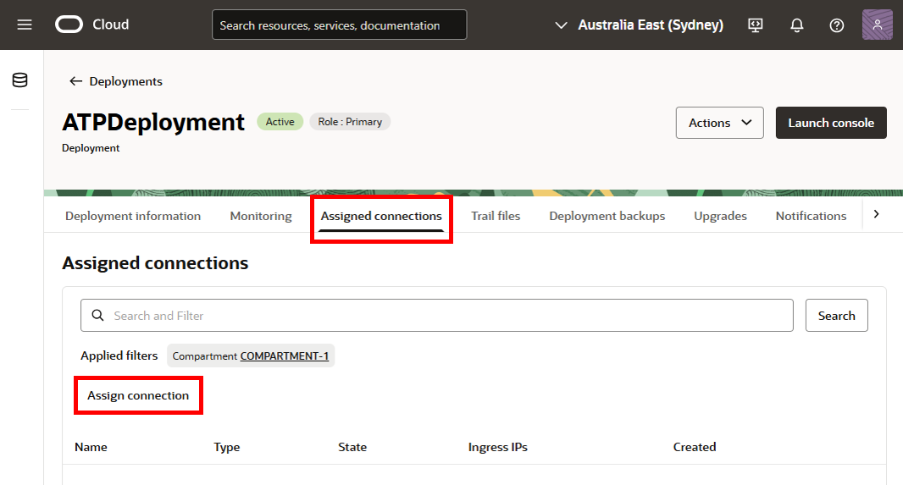
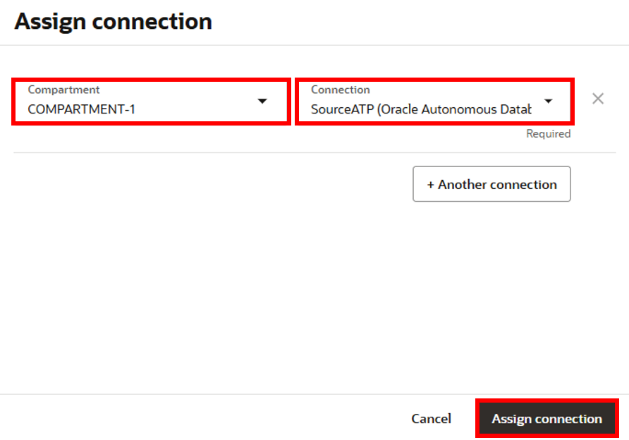
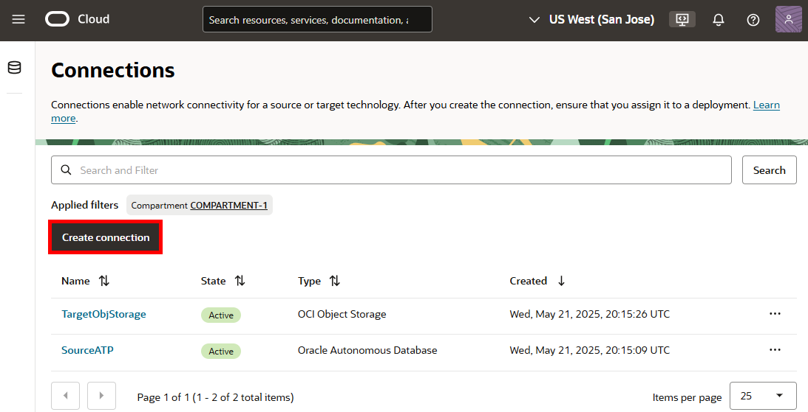
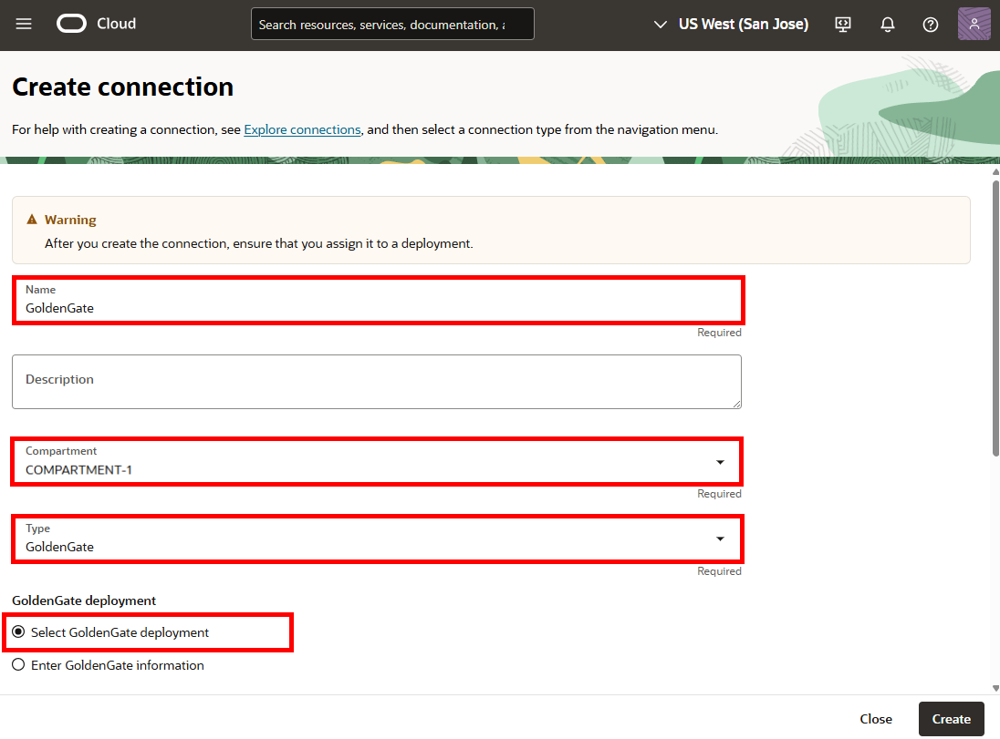
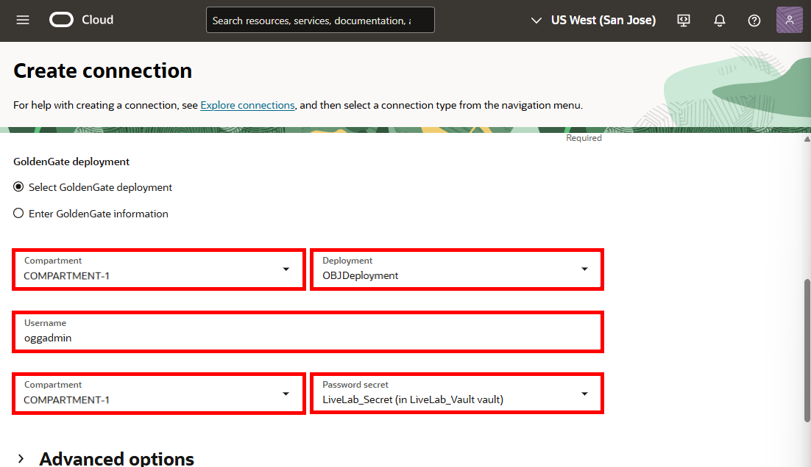
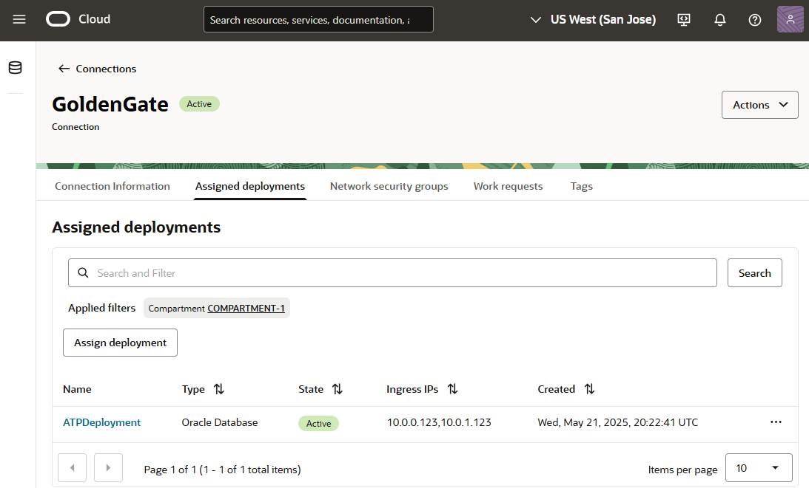

# Create the Oracle Cloud Infrastructure GoldenGate resources

## Introduction

This lab walks you through the steps to create Oracle Cloud Infrastructure (OCI) GoldenGate resources that you'll need to complete this workshop.

Estimated time: 30 minutes

### About Oracle Cloud Infrastructure GoldenGate resources

An Oracle Cloud Infrastructure GoldenGate deployment manages the resources it requires to function. You can create different deployments types such as, Oracle Database, MySQL, or Big Data. The GoldenGate deployment also lets you access the GoldenGate deployment console, where you can access the OCI GoldenGate deployment console to create and manage processes such as Extracts and Replicats.

Connections capture source and target credential information. A connection also enables networking between the Oracle Cloud Infrastructure (OCI) GoldenGate service tenancy virtual cloud network (VCN) and your tenancy VCN using a private endpoint.

### Objectives

In this lab, you will:
* Locate Oracle Cloud Infrastructure GoldenGate in the Console
* Create an OCI GoldenGate deployment for the Autonomous Database
* Create an OCI GoldenGate deployment for Oracle Object Storage
* Create connections for the source Autonomous Databases and target Oracle Object Storage bucket
* Assign connections to deployments

### Prerequisites
To successfully complete this lab in your own tenancy:
* For IAM-enabled tenancies, ensure that you [configure Identity domains for OCI GoldenGate](https://docs.oracle.com/en/cloud/paas/goldengate-service/mkmbs/#GUID-DD9C1BF8-69FE-4C9A-A2D1-74C73550ED65).
* For non-IAM enabled tenancies, ensure that you ensure that you first [set up your Vault](https://docs.oracle.com/en-us/iaas/Content/KeyManagement/Tasks/managingvaults_topic-To_create_a_new_vault.htm#createnewvault). [Learn more about Vault service](https://docs.oracle.com/en-us/iaas/Content/KeyManagement/Concepts/keyoverview.htm).
* Add an API key in your profile settings to be used in Task 3:

1.  Oracle Cloud console global navigation bar, click **Profile** (user icon), and then select **User settings**.

    

2.  On the user details page, under **Resources**, click **API Keys**.

3.  Click **Add API Key**.

    

4.  In the Add API Key dialog, click **Download Private Key** to download the key, and then click **Add**.

    

5.  In the Configuration File Preview dialog, copy the fingerprint to a text editor, and then click **Close**.

> **Note:** Compartment names in the screenshots may differ from values that appear in your environment.

## Task 1: Review the deployment

1. In the Oracle Cloud console, open the **navigation menu**, navigate to **Oracle Database**, and then select **GoldenGate**.

    

2. You may need to select a compartment. Under List Scope, from the Compartment dropdown, expand the root compartment, and then select the compartment.

3. On the GoldenGate **Overview** page, click **Deployment** and then **OCI GoldenGate Deployment**.

    

You can perform the following actions on the deployment details page:

* Review the deployment's status
* Launch the GoldenGate service deployment console
* Edit the deployment's name or description
* Stop and start the deployment
* Move the deployment to a different compartment
* Review the deployment resource information
* Add tags

    

## Task 2: Create an Autonomous Database connection

Follow the steps below to create a connection for the source Oracle Autonomous Transaction Processing \(ATP\) Database.

1.  Upen the navigation menu. Click **Connections**.

    

2.  Click **Create Connection**.

    

3.  The Create connection panel appears. For Name, enter **SourceATP** and optionally, a description.

4. For **Compartment**, select the compartment in which to create this connection.

5.  From the a Type dropdown, select **Oracle Autonomous Database**.

6. For Database details, select **Select database**.

    

7.  From the Compartment dropdown, select **&lt;USER&gt;-COMPARTMENT**, and then select **SourceATP-&lt;numbers&gt;** from the dropdown. 

8.  For Database username, enter `ggadmin`.

9.  From the Compartment dropdown, select **&lt;USER&gt;-COMPARTMENT**, and then select a Database user password secret from the dropdown.

    > **NOTE:** This password will be used to unlock `GGADMIN` in a later task.

10. Click **Create**.

    

    The connection becomes Active after a few minutes. You can proceed with the next task while service creates the connection.

## Task 3: Unlock the GGADMIN user and check support mode for the source database

Oracle Autonomous Databases come with a GGADMIN user that is locked by default. The following steps guide you through how to unlock the GGADMIN user.

1.  From the Oracle Cloud Console **Navigation Menu** (hamburger icon), click **Oracle Database**, and then select **Autonomous Transaction Processing**.

	

2.  From the list of databases, select **SourceATP**.

    

3.  On the SourceATP Database Details page, click **Database actions**, and select **Database Users** from the dropdown.

    

    > **Note:** If you're prompted to log in to Database Actions, use the source database admin credentials.

4.  From the list of users, locate **GGADMIN**, and then click the ellipsis (three dots) icon and select **Edit**.

    

5.  In the Edit User panel, deselect **Account is Locked**, enter the password you gave the ggadmin user in the connection Task 3, Step 8, and then click **Apply Changes**.

    

    Note that the user icon changes from a padlock to a checkmark.

6.  From the navigation menu (hamburger icon), click **SQL**.

    

7.  Enter the following into the Worksheet, and then click **Run Statement**.

    ```
    <copy>ALTER PLUGGABLE DATABASE ADD SUPPLEMENTAL LOG DATA;</copy>
    ```

    

8.  In the worksheet, enter the following, and then click **Run Statement**:

    ```
    <copy>
    select * from DBA_GOLDENGATE_SUPPORT_MODE where owner = 'SRC_OCIGGLL';
    </copy>
    ```

    The Script Output panel displays six tables whose Support_Mode is **FULL**.

    

You can leave the source database SQL window open for use in a later lab.

## Task 4: Create a connection for Oracle Object Storage

1.  Use the Oracle Cloud Console navigation menu to navigate back to GoldenGate. Open the Oracle Cloud console navigation menu, click **Oracle Database**, and then **GoldenGate**.

    

2.  Click **Connections** and then **Create Connection**.

3.  The Create connection panel appears. For Name, enter **TargetObjStore**.

4. For **Compartment**, select the compartment in which to create this connection.

5.  From the Type dropdown, select **OCI Object Storage**.

6.  From the Region dropdown, select your region.

    

7. For User, select **User current tenancy and user**.

8.  From the Compartment dropdown, select **&lt;USER&gt;-COMPARTMENT**, and then select a Private key secret from the dropdown.

9. Optionally, from the Compartment dropdown, select **&lt;USER&gt;-COMPARTMENT**, and then select a Private key passphrase secret from the dropdown.

10.  Enter the corresponding public key fingerprint you copied from the prerequisite steps. You can also go back to your User settings in the Oracle Cloud console global header to copy it again.

11.  Click **Create**.

  

    The Connection becomes Active after a few minutes.

## Task 5: Assign connections to deployments

After your deployments and connections become active, you can assign the connections to the appropriate deployments.

1.  In the GoldenGate menu, click **Deployments**.

2.  Select **ATPDeployment** to view its details.

3.  On the ATPDeployment details page, click **Assigned connections** from the navigation bar.

4.  Under Assigned connections, click **Assign connection**.

    

5.  In the Assign connection dialog, from the **Connection** dropdown, select **SourceATP**, and then click **Assign connection**.

    

6.  Use the breadcrumb to return to the Deployments page.

    

7.  Repeat steps 2 to 6 to assign the TargetObjStore connection to the OBJDeployment.

    

## Task 6: Create a GoldenGate connection

Create a GoldenGate connection if your Big Data deployment doesn't have a public endpoint, and then assign it to the source ATP deployment.

1.  On the Connections page, click **Create Connection**.

    

2.  The Create connection panel appears. Enter a **Name** and optionally, a description.

3.  For **Compartment**, select the compartment in which to create this connection.

4.  From the **Type** dropdown, under Generic, select **GoldenGate**.

5.  For **GoldenGate deployment**, select **Select GoldenGate deployment**.

    

6. From the Compartment dropdown, select **&lt;USER&gt;-COMPARTMENT**, and then select **OBJDeployment** from the Deployment dropdown.    

7.  For Username, enter `oggadmin`.

8.  From the Compartment dropdown, select **&lt;USER&gt;-COMPARTMENT**, and then select the Password secret from the Deployment dropdown. 

9. Click **Create**.

    

10. After the connection is active, on its details page, under **Resources**, click **Assigned deployments**.

11. Click **Assign deployment**.

12. In the Assign deployment dialog, select the source **ATPDeployment**, and then click **Assign deployment**.

    

**Proceed to the next lab**.

## Learn More

* [Create a deployments](https://docs.oracle.com/en/cloud/paas/goldengate-service/llyhq/index.html)
* [Create a connection to Autonomous Database](https://docs.oracle.com/en/cloud/paas/goldengate-service/tqrlh/index.html)
* [Create a connection to OCI Object Storage](https://docs.oracle.com/en/cloud/paas/goldengate-service/sjsrj/index.html)
* [Assign connections to a deployment](https://docs.oracle.com/en/cloud/paas/goldengate-service/qsqts/index.html)

## Acknowledgements
* **Author** - Jenny Chan, Consulting User Assistance Developer, Database User Assistance
* **Contributors** -  Denis Gray, Database Product Management; Katherine Wardhana, User Assistance Developer
* **Last Updated By/Date** - Katherine Wardhana, May 2025
