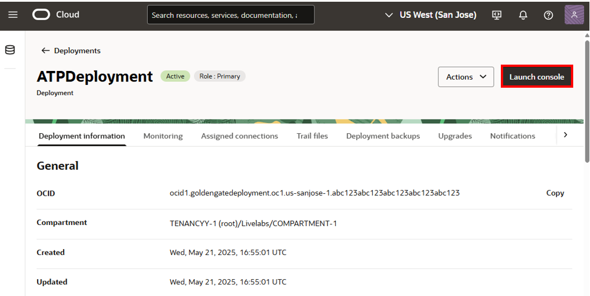
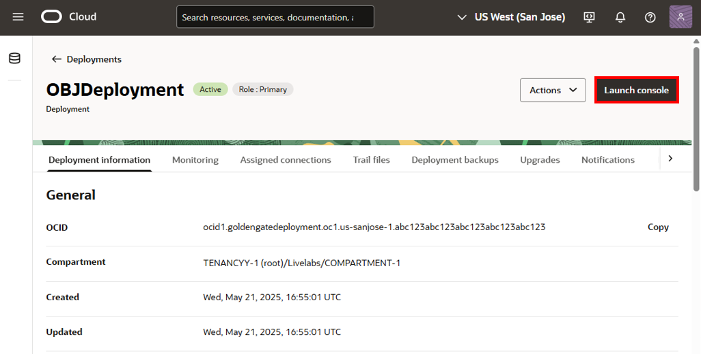
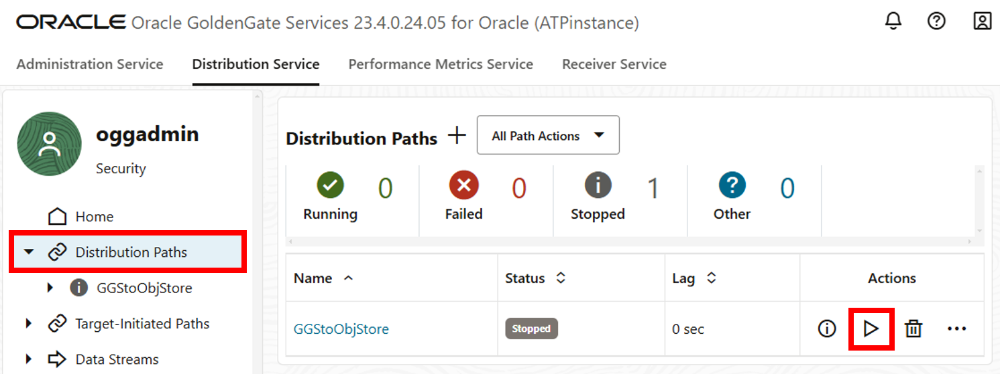
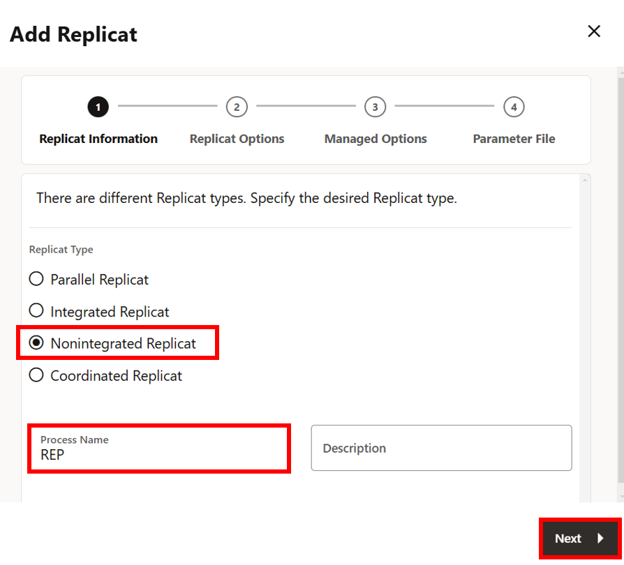
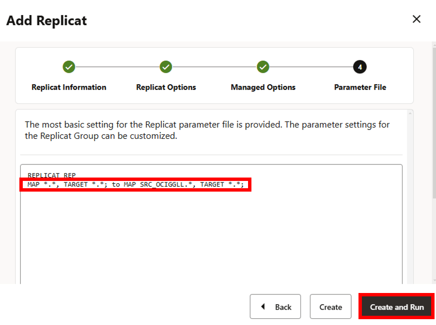

# Set up and run replication processes

## Introduction
This lab instructs you to use the OCI GoldenGate deployment console to add transaction information to the source database, and then add and run an Extract.

Estimated time: 15 minutes

Watch the video below for a quick walk-through of the lab.
[Set up and run replication processes](videohub:1_d6g4fbsx)

### About Extracts, Distribution paths, and Replicats
An Extract is a process that extracts, or captures, data from a source database. A Distribution Path is a source-to-destination configuration that uses the Distribution Server.

### Objectives
In this lab, you learn to:

* Log in to the OCI GoldenGate deployment console
* Connect to the source database to add transaction information
* Add and run an Extract
* Add and run a Distribution path
* Add and run a Replicat

## Task 1: Launch the GoldenGate Deployment Console

1. On the **ATPDeployment** details page, click **Launch Console**.

    

2. To log in to the GoldenGate deployment console, enter **oggadmin** for User name and the password, and then click **Sign In**.

    

    > **Note:** If using the LiveLab Sandbox environment, copy the deployment password from the Terraform output section of **View Login Info**.

    

    

After you log in, you're brought to the GoldenGate deployment console home page. Here, you can access the GoldenGate Administration, Performance Metrics, Distribution, and Receiver Services, as well as add Extracts and Replicats for your data replication tasks.

## Task 2: Add Trandata Information

> **Note:** Ensure that you enable supplemental logging before adding an Extract or you may encounter errors. If you encounter errors, delete and add the Extract before trying again.

1.  Open the navigation menu and then click **DB Connections**.

    

2.  Click **Connect to database SourceATP**.

    

3.  Next to **TRANDATA Information** click **Add TRANDATA** (plus icon).

    

4.  For **Schema Name**, enter `SRC_OCIGGLL`, and then click **Submit**.

    

5.  To verify, click **Search TRANDATA**, and then enter `SRC_OCIGGLL` into the Search field and click **Search**.

    

    

To return to the GoldenGate Deployment Console Home page, click **Overview** in the left navigation.

## Task 3: Add and run an Extract

1.  On the GoldenGate Deployment Console Home page, click **Add Extract** (plus icon).

    

2.  The Add Extract panel consists of five pages. On the Extract Information page, complete the following fields, and then click **Next**:

    * For **Extract Type**, select **Integrated Extract**.
    * For **Process Name**, enter a name for this Extract process, such as UAEXT.

    

3. On the Extract Options page, complete the following fields, and then click Next:

    * For **Domain**, select **OracleGoldenGate** from the dropdown.
    * For **Alias**, select the Credential Alias for the source Autonomous Transaction Processing database.
    * For **Trail Name**, enter a two-character name for the Trail file, such as E1.

    

4. On the Managed Options page, enable **Critical to deployment health**, and then click **Next**.

    

5. In the Parameter File page, add a new line, paste the following to the text area, and then click **Create and Run**:

    ```
    <copy>-- Capture DDL operations for listed schema tables
    ddl include mapped

    -- Add step-by-step history of ddl operations captured
    -- to the report file. Very useful when troubleshooting.
    ddloptions report

    -- Write capture stats per table to the report file daily.
    report at 00:01

    -- Rollover the report file weekly. Useful when IE runs
    -- without being stopped/started for long periods of time to
    -- keep the report files from becoming too large.
    reportrollover at 00:01 on Sunday

    -- Report total operations captured, and operations per second
    -- every 10 minutes.
    reportcount every 10 minutes, rate

    -- Table list for capture
    table SRC_OCIGGLL.*;</copy>
    ```

    

    

## Task 4: Create a user on the target deployment

>**Note**: Complete the following steps in the target **OBJDeployment**'s deployment console (BDinstance).

1.  In the Oracle Cloud console, click **Deployments** in the breadcrumb.

2.  On the Deployments page, click **OBJDeployment** to view its details.

3.  Click **Launch Console**.

    

4.  To log in to the GoldenGate deployment console, enter **oggadmin** for User name and the password, and then click **Sign In**.

    > **Note:** If using the LiveLab Sandbox environment, copy the deployment password from the Terraform output section of **View Login Info**.

5.  In the BDinstance deployment console, open the navigation menu, and then click **User Administration**.

    

6.  On the Users page, click **Add New User** (plus icon).

    

7. In the Create new User panel, complete the following fields, and then click **Submit**:

    * For the Authenticated By dropdown, select **Password**.
    * For the **Role** dropdown, select **Administrator**.
    * For **Username**, enter **dpuser**.
    * For **Password**, paste the Global Password from the Reservation Information. Verify the password.

    

## Task 5: Create a credential on the source deployment for the dpuser

>**Note**: Complete the following steps in the source **ATPDeployment** deployment console (ATPinstance).

1.  In the source ATPinstance deployment console, click **Administration Service**, open the navigation menu, and then select **DB Connections**.  

2.  On the Credentials page, click Add Credential (plus icon).

    

3. In the Credentials panel, complete the following fields, and then click **Submit**:

    * For Credential Domain, enter **ggs2objstore**.
    * For Credential Alias, enter **ocinetwork**.
    * For User ID, enter **dpuser**.
    * For **Password**, enter a password. Verify the password.

    

## Task 6: Add and run a Distribution Path in the source deployment console

>**Note**: Complete the following steps in the source **ATPDeployment** deployment console (ATPinstance).

The Distribution Path initiates the process to send the GoldenGate trail file to Oracle Object Storage.

1.  In the source ATPinstance deployment console, click **Distribution Service**, and then click **Add Path** (plus icon).

    

2. The Add Path panel consists of seven pages. On the Path Information page, for Name, enter **GGStoObjStore**, and then click **Next**.

    

3. On the Source Options page, complete the following fields, and then click **Next**:

    * For Source Extract, select **UAEXT** from the dropdown.
    * For Trail Name, **E1** should automatically populate the field.

    

4. On the Target Options page, complete the following fields, and then click **Next**:

    * For Target Host, enter the BDinstance hostname in the following format: **&lt;domain&gt;.deployment.goldengate.us-&lt;region&gt;-1.oci.oraclecloud.com**.
    
    > **Note:** You can copy the host from the browser address bar of target BDinstance deployment console window, or copy the Console URL from the Deployment Details page and remove the https:// and any trailing slashes (/).

    

    * For Port Number, enter **443**.
    * For Trail Name, enter a two-character name for the Trail file when it is received by OCI GoldenGate. For example, **T1**.
    * For Alias, enter the alias name you created in Oracle GoldenGate. For example, **ocinetwork**.

    

5. On the Advanced Options page, leave the fields as they are, and click **Next**.

    

6. On the Filtering Options page, leave the fields as they are, and click **Next**.

    

7. On the Managed Options page, leave the fields as they are, and click **Create Path**.

    

8. On the left hand navigation menu, click **Distribution Paths**.

9. In the GGStoObjStore **Action** menu, select **Start**. In the Confirm Action dialog, click **OK**.

    

    The **Stopped** grey status icon becomes a **Running** green checkmark when the Distribution Path starts successfully.

    

## Task 7: Verify Receiver Path creation

The Distribution path on the source ATPinstance creates a Receiver path on the target BDinstance.

>**Note**: Complete the following steps in the **OBJDeployment** deployment console (BDinstance).

1.  In the target BDinstance deployment console, click **Receiver Service**.

2.  On the Receiver Service Path page, verify that the path you created in previous tasks.

    

## Task 8: Add and run a Replicat

>**Note**: Complete the following steps in the **OBJDeployment** deployment console (BDinstance).

1.  Click **Administration Service**.

2.  In the Replicats section, click **Add Replicat** (plus icon).

    

3.  On the Replicat Information page, complete the following fields, and then click **Next**:

    * For Replicat Type, select **Nonintegrated Replicat**
    * For Process Name, enter **REP**.

    

4. On the Replicat Options page, complete the following fields, and then click **Next**:

    * For Replicat Trail Name, enter **T1**.
    * For Domain, select **OCI Object Storage**.
    * For Alias, select **TargetObjStore**.
    * For Checkpoint Table, select "SRCMIRROR_OCIGGLL"."CHECKTABLE".

    

5. On the Managed Options page, leave the fields as they are, and click **Next**.

    

6. On the Parameter Files page, change `MAP *.*, TARGET *.*;` to `MAP SRC_OCIGGLL.*, TARGET *.*;`, and then click **Create and Run**.

    

    The **Stopped** grey status icon becomes a **Running** green checkmark when the Distribution Path starts successfully.

    

In this lab, you:
* Added transaction data to the source database
* Added an Extract
* Created a user for the source deployment to connect to the target deployments
* Added a Distribution Path on the source deployment, which created a Receiver Path on the target deployment
* Added a Replicat process to replicate data from the Autonomous Transaction Processing instance to an OCI Object Storage bucket

**Proceed to the next lab**.

## Learn More

* [Explore the OCI GoldenGate deployment console](https://docs.oracle.com/en/cloud/paas/goldengate-service/jbkyg/index.html)
* [Add an Extract for Oracle Database](https://docs.oracle.com/en/cloud/paas/goldengate-service/eeske/index.html)
* [Add a Distribution Path](https://docs.oracle.com/en/cloud/paas/goldengate-service/adpen/index.html)
* [Add a Replicat for OCI Object Storage](https://docs.oracle.com/en/cloud/paas/goldengate-service/eepsp/index.html)

## Acknowledgements
* **Author** - Jenny Chan, Consulting User Assistance Developer, Database User Assistance
* **Contributors** -  Deniz Sendil, Database Product Management; Katherine Wardhana, User Assistance Developer
* **Last Updated By/Date** - Katherine Wardhana, June 2025
