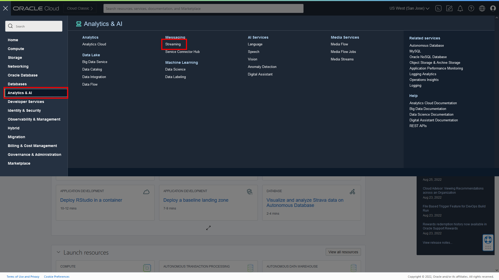
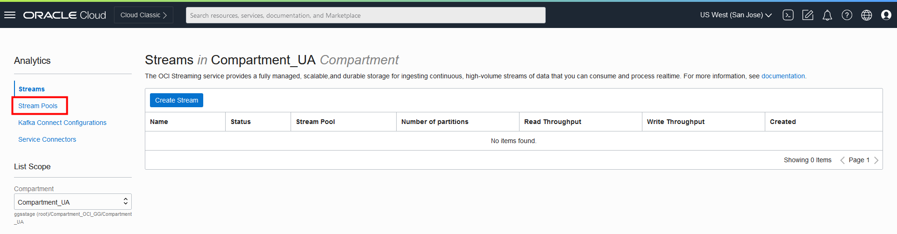
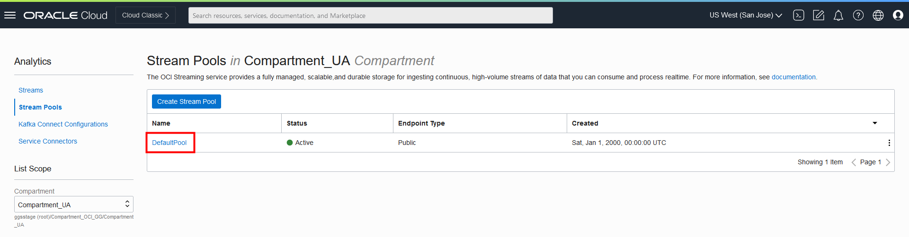
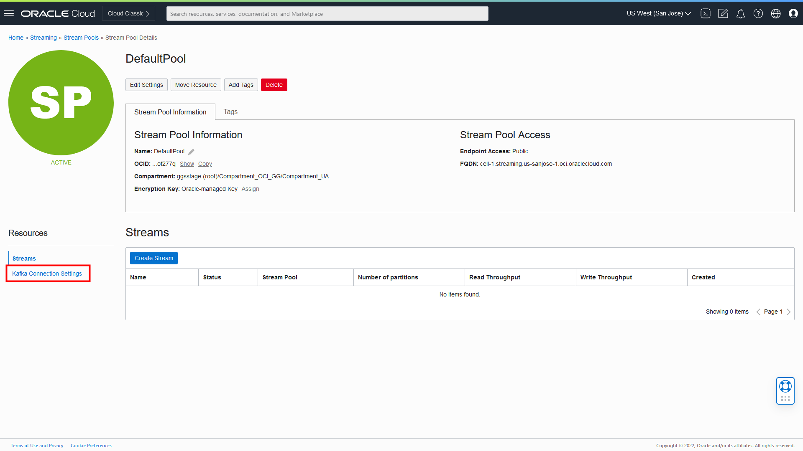
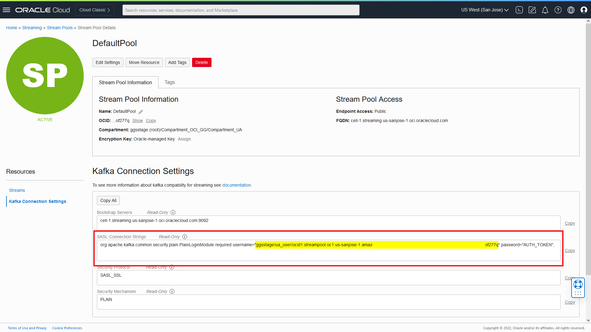
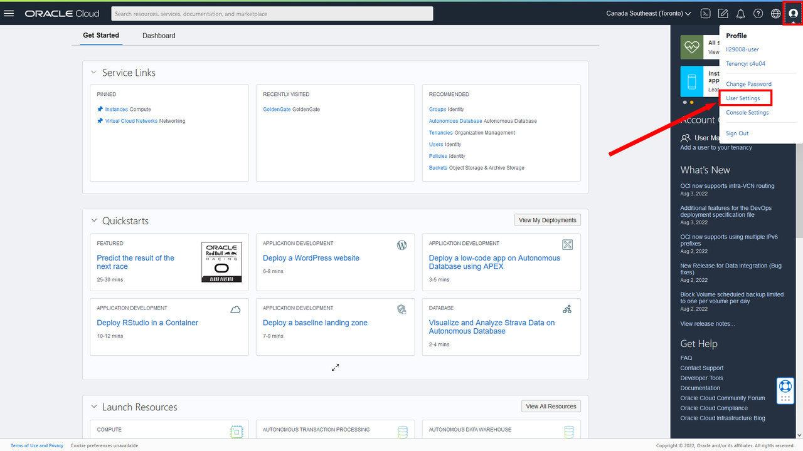
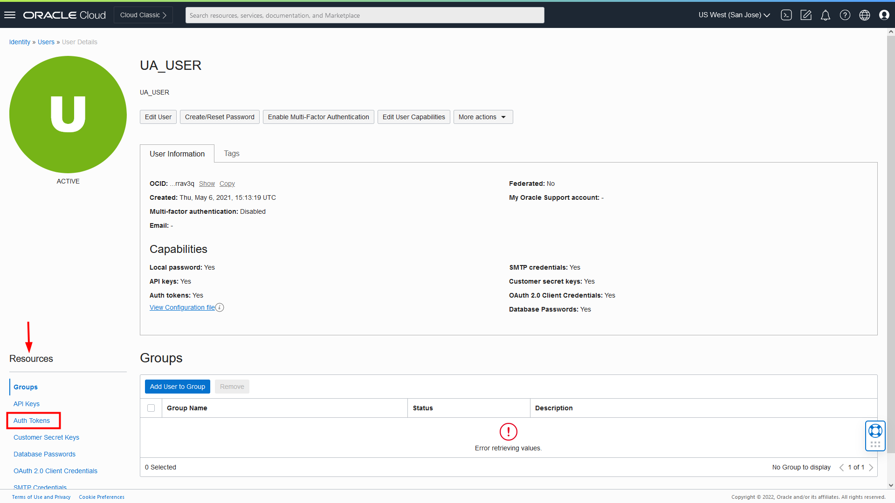
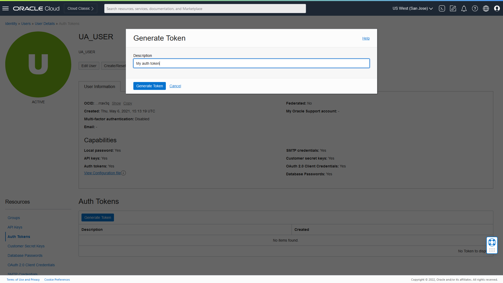

# Create the Oracle Cloud Infrastructure GoldenGate Deployment

## Introduction

This lab walks you through the steps to create Oracle Cloud Infrastructure (OCI) GoldenGate resources that you'll need to complete this workshop.

Estimated time: 30 minutes

### About Oracle Cloud Infrastructure GoldenGate resources

An Oracle Cloud Infrastructure GoldenGate deployment manages the resources it requires to function. You can create different deployments types such as, Oracle Database, MySQL, or Big Data. The GoldenGate deployment also lets you access the GoldenGate deployment console, where you can create and manage processes such as Extracts and Replicats.

Connections capture source and target credential information. A connection also enables networking between the Oracle Cloud Infrastructure (OCI) GoldenGate service tenancy virtual cloud network (VCN) and your tenancy VCN using a private endpoint.

### Objectives

In this lab, you will:
* Locate Oracle Cloud Infrastructure GoldenGate in the Console
* Create an OCI GoldenGate deployment for the Autonomous Database
* Create an OCI GoldenGate deployment for Oracle Object Storage
* Create connections for the source Autonomous Databases and target stream.
* Assign connections to deployments

### Prerequisites

To complete this lab:
* Ensure that you successfully completed the preceding lab.
* Your Autonomous Database is in the Active state.
* Create and download an Auth Token (see Task 0 for instructions).

> **Note:** *Compartment names in the screenshots may differ from values that appear in your environment.*

## Task 0: Obtain the Stream Pool username and create an Auth Token

1.  Open the Oracle Cloud console navigation menu, click **Analytics & AI**, and under **Messaging**, click **Streaming**.

	

2.  On the **Streams** page, under **Analytics**, click **Stream Pools**.

	

3.  On the **Stream Pools** page, select **DefaultPool**.

	

4.  On the **DefaultPool** details page, under **Resources**, click **Kafka Connection Settings**.

	

5.  In the SASL Connection Settings field, look for `username` and then copy its string value for later use. It's in the format of `<tenancy>/<username>/<streampool-ocid>`.

	

6.  In the Oracle Cloud console global header, click **Profile**, and then click **User Settings**.

	

7.  Under **Resources**, click **Auth Tokens**.

	

8.  Click **Generate Token**.

4.  In the Generate Token dialog, enter a friendly description, and then click **Generate Token**.

	

5.  **Copy** the auth token immediately to a secure location from where you can retrieve it later. You won't be able to retrieve it again from the Oracle Cloud console.

6.  Close the dialog.

## Task 1: Create a deployment

1.  Open the **Navigation Menu**, navigate to **Oracle Database**, and select **GoldenGate**.

    

2.  On the GoldenGate **Overview** page, click **Deployments**.

    

3.  You may need to select a compartment. Under List Scope, from the Compartment dropdown, expand the root compartment, and then select the compartment associated with your username. For example, if your LiveLab username is LL1234-user, expand root, and then select the compartment **LL1234-COMPARTMENT**.

4.  On the Deployments page, click **Create Deployment**.

    

5.  In the Create Deployment panel, enter **ATPDeployment** for Name.

6.  From the Compartment dropdown, select a compartment.

7.  For OCPU Count, enter **1**.

8.  For Subnet, select a subnet. If you're using the workshop environment, select **&lt;user&gt;pubsubnt**.

9.  For License type, select **Bring Your Own License (BYOL)**.

10. Click **Show Advanced Options**, and then select **Create Public Endpoint**.

    

11. Click **Next**.

12. From the Select a technology dropdown, select **Oracle Database**.

13. For GoldenGate Instance Name, enter **ATPinstance**.

14. For Administrator Username, enter **oggadmin**.

15. For Administrator Password, enter a password. Take note of this password.

16. Click **Create**.

    

You're brought to the Deployment Details page. It takes a few minutes for the deployment to be created. Its status will change from CREATING to ACTIVE when it is ready for you to use.

## Task 2: Create a deployment for OCI Streaming

1.  On the Deployments page, click **Create Deployment**.

2.  In the Create Deployment panel, enter **BDDeployment** for Name.

3.  From the Compartment dropdown, select a compartment.

4.  For OCPU Count, enter **1**.

5.  For Subnet, select a subnet. If you're using the workshop environment, select **&lt;user&gt;pubsubnt**.

6.  For License type, select **Bring You Own License (BYOL)**.

7.  Click **Show Advanced Options**, and then select **Create Public Endpoint**.

    

8.  Click **Next**.

9.  From the Select a technology dropdown, select **Big Data**.

10. For GoldenGate Instance Name, enter **BDinstance**.

11. For Administrator Username, enter **oggadmin**.

12. For Administrator Password, enter a password. Take note of this password.

13. Click **Create**.

    

You're brought to the Deployment Details page. It takes a few minutes for the deployment to be created. Its status will change from CREATING to ACTIVE when it is ready for you to use.

## Task 3: Create an Autonomous Database connection

Follow the steps below to create a connection for the source Oracle Autonomous Transaction Processing \(ATP\) Database.

1.  Use the Oracle Cloud Console breadcrumb to navigate back to the GoldenGate page.

    

2.  Click **Connections**.

    

3.  Click **Create Connection**.

    

4.  In the Create Connection panel, for Name, enter **SourceATP**.

5.  From the Type dropdown, select **OCI Autonomous Database**.

6.  Click **Next**.

7.  For **Database in &lt;compartment-name&gt;**, click **Change Compartment**, select the compartment you created your ATP instance, and then select **SourceATP** from the dropdown. Some fields are autopopulated based on your selection.

8.  Enter a password for the `ggadmin` user in the Password field, and then click **Create**.

    

    The database registration becomes Active after a few minutes.

## Task 4: Unlock the GGADMIN user and check support mode for the source database

Oracle Autonomous Databases come with a GGADMIN user that is locked by default. The following steps guide you through how to unlock the GGADMIN user.

1.  From the Oracle Cloud Console **Navigation Menu** (hamburger icon), click **Oracle Database**, and then select **Autonomous Transaction Processing**.

	

2.  From the list of databases, select **SourceATP**.

    

3.  On the SourceATP Database Details page, click **Database Actions**.

    

    > **Note:** *If you're prompted to log in to Database Actions, use the source database admin credentials.*

4.  Under **Administration**, click **Database Users**.

    

5.  From the list of users, locate **GGADMIN**, and then click the ellipsis (three dots) icon and select **Edit**.

    

6.  In the Edit User panel, deselect **Account is Locked**, enter the password you gave the ggadmin user in the database registration steps above, and then click **Apply Changes**.

    

    Note that the user icon changes from a padlock to a checkmark.

7.  From the navigation menu (hamburger icon), click **SQL**.

8.  In the worksheet, enter the following, and then click **Run Statement**:

    ```
    <copy>
select * from DBA_GOLDENGATE_SUPPORT_MODE where owner = 'SRC_OCIGGLL';
    </copy>
    ```

    The Script Output panel displays six tables whose Support_Mode is **FULL**.

    

You can leave the source database SQL window open for use in a later lab.

## Task 5: Create a connection for OCI Streaming

1.  Use the Oracle Cloud Console navigation menu to navigate back to GoldenGate.

2.  Click **Connections** and then **Create Connection**.

3.  In the Create Connection panel, enter **TargetStream** for Name.

4.  From the Type dropdown, select **OCI Streaming**.

5.  Click **Next**.

6.  For Connection Details, select the Stream Pool. To select a Stream Pool in a different compartment, click **Change Compartment**.

7.  For Username, enter a username for the Stream Pool.

8.  For Password, enter the Auth Token copied in the Prerequisite task (Task 0) for this lab.

9.  Click **Create**.

The Connection becomes Active after a few minutes.

## Task 6: Assign connections to deployments

After your deployments and connections become active, you can assign the connections to the appropriate deployments.

1.  In the GoldenGate menu, click **Deployments**.

2.  Select **ATPDeployment** to view its details.

3.  On the ATPDeployment details page, under Resources, click **Assigned connections**.

    

4.  Under Assigned connections, click **Assign connection**.

    

5.  In the Assign connection dialog, from the **Connection** dropdown, select **SourceATP**, and then click **Assign connection**.

    

6.  Use the breadcrumb to return to the Deployments page.

    

7.  Repeat steps 2 to 6 to assign the TargetStream connection to the BDDeployment.


**Proceed to the next lab**.

## Learn More

* [Create a deployments](https://docs.oracle.com/en/cloud/paas/goldengate-service/llyhq/index.html)
* [Create a connection to Autonomous Database](https://docs.oracle.com/en/cloud/paas/goldengate-service/tqrlh/index.html)
* [Create a connection to OCI Streaming](https://docs.oracle.com/en/cloud/paas/goldengate-service/oioio/index.html)
* [Assign connections to a deployment](https://docs.oracle.com/en/cloud/paas/goldengate-service/qsqts/index.html)

## Acknowledgements
* **Author** - Jenny Chan, Consulting User Assistance Developer, Database User Assistance
* **Contributors** -  Deniz Sendil, Database Product Management
* **Last Updated By/Date** - Jenny Chan, September 2022
