# Set up and run replication processes

## Introduction
This lab instructs you to use the OCI GoldenGate deployment console to add transaction information to the source database, and then add and run an Extract.

Estimated time: 15 minutes

### About Extracts, Distribution paths, and Replicats
An Extract is a process that extracts, or captures, data from a source database. A Distribution Path is a source-to-destination configuration that uses the Distribution Server.

### Objectives
In this lab, you learn to:

* Log in to the OCI GoldenGate deployment console
* Connect to the source database to add transaction information
* Add and run an Extract
* Add and run a Distribution path
* Add and run a Replicat

### Preprequisites
This lab assumes you completed all preceding labs.

## Task 1: Review the Deployment details

1. In the Oracle Cloud console, open the navigation menu, click **Oracle Database**, and then click **GoldenGate**.

2. Click **Deployments**.

3. On the Deployments page, select **ATPDeployment** to view its details.

On the Deployment Details page, you can:

* Review the deployment's status
* Launch the GoldenGate service deployment console
* Edit the deployment's name or description
* Stop and start the deployment
* Move the deployment to a different compartment
* Review the deployment resource information
* Add tags

    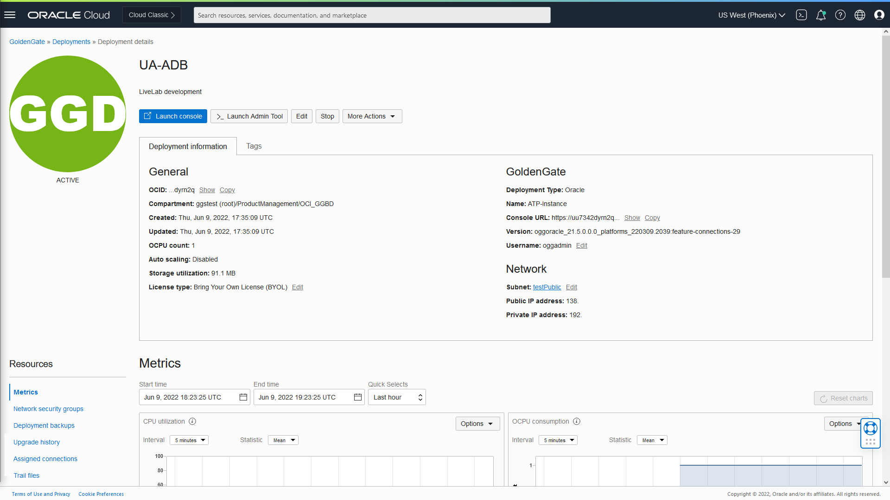

## Task 2: Launch the GoldenGate Deployment Console

1. On the deployment details page, click **Launch Console**.

    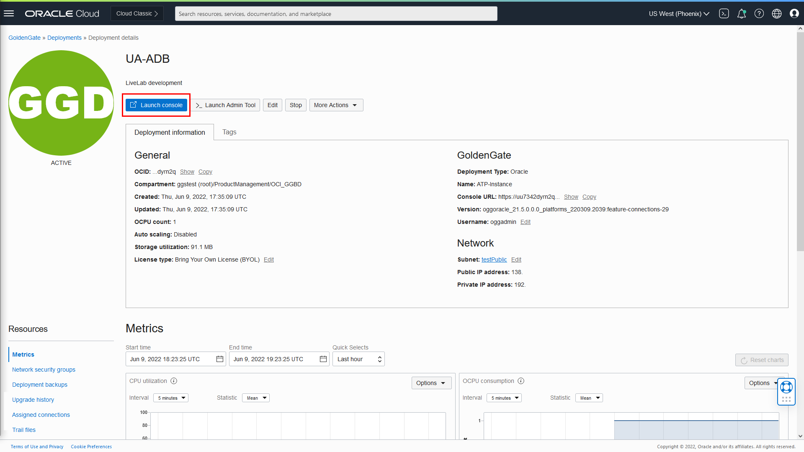

2. To log in to the GoldenGate deployment console, enter **oggadmin** for User Name and the password you provided in the previous lab (Task 1, Step 15), and then click **Sign In**.

    

After you log in, you're brought to the GoldenGate deployment console home page. Here, you can access the GoldenGate Administration, Performance Metrics, Distribution, and Receiver Services, as well as add Extracts and Replicats for your data replication tasks.

## Task 3: Add transaction data

> **Note:** *Ensure that you enable supplemental logging before adding an Extract or you may encounter errors. If you encounter errors, delete and add the Extract before trying again.*

1.  Open the navigation menu and then click **Configuration**.

    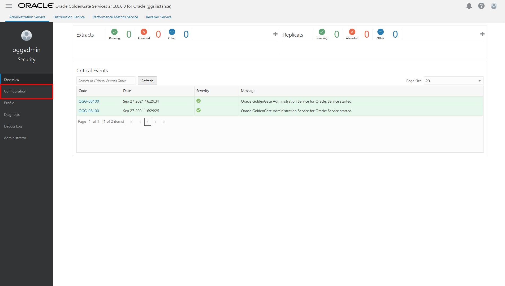

2.  Click **Connect to database SourceATP**.

    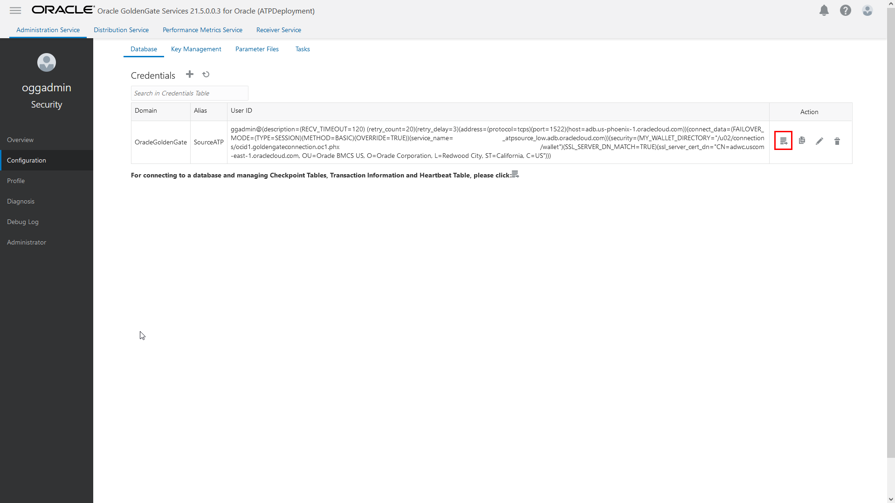

3.  Next to **TRANDATA Information** click **Add TRANDATA** (plus icon).

    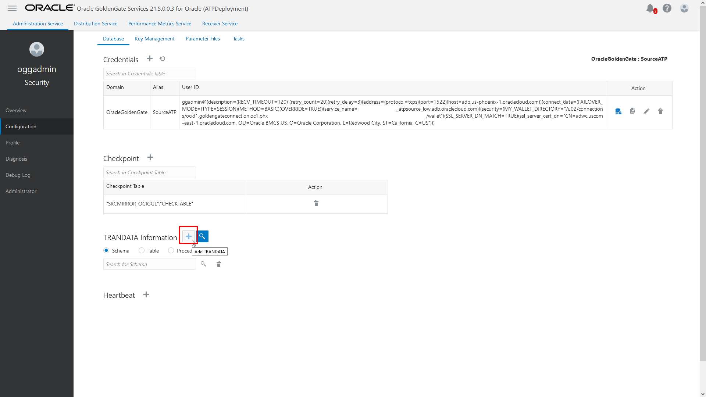

4.  For **Schema Name**, enter `SRC_OCIGGLL`, and then click **Submit**.

    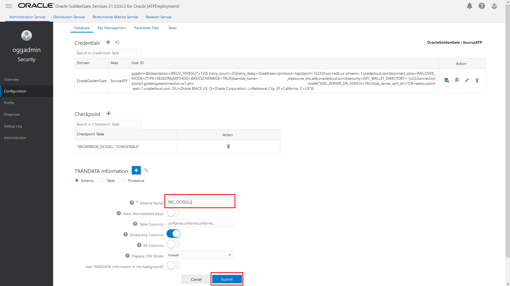

5.  To verify, click **Search TRANDATA**, and then enter `SRC_OCIGGLL` into the Search field and click **Search**.

    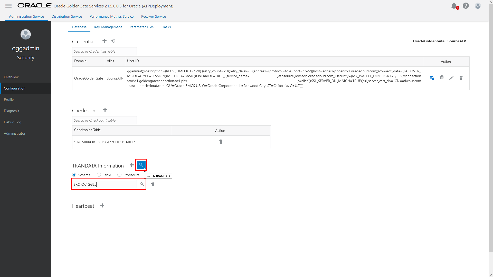

    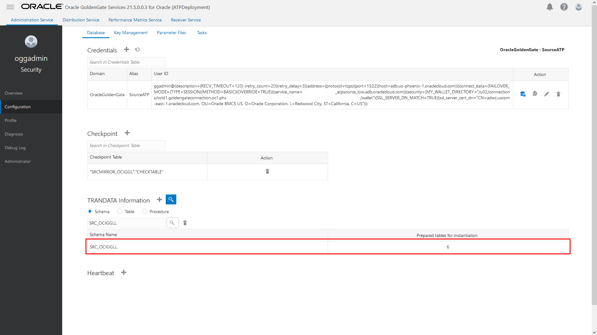

To return to the GoldenGate Deployment Console Home page, click **Overview** in the left navigation.

## Task 4: Add and run an Extract

1.  On the GoldenGate Deployment Console Home page, click **Add Extract** (plus icon).

    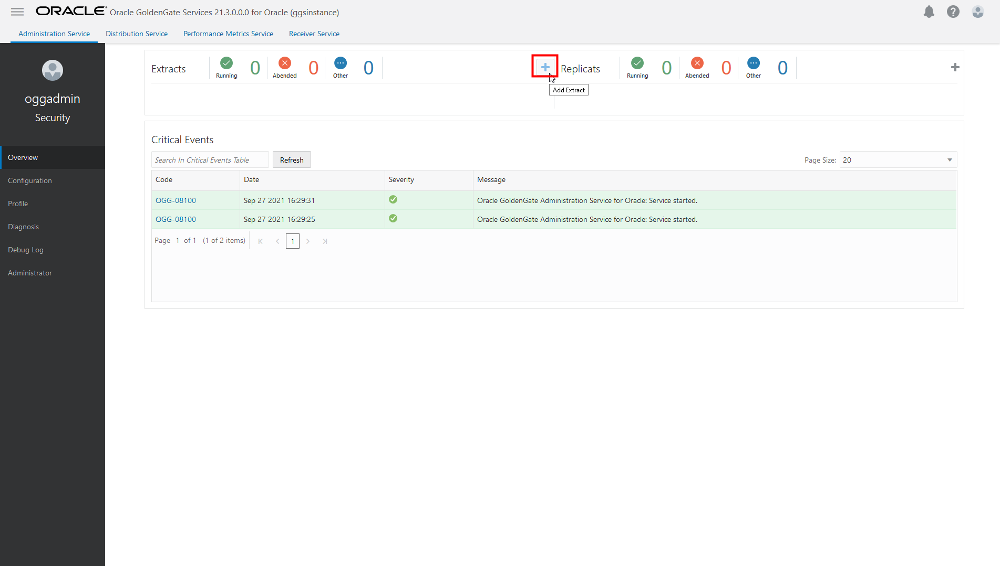

2.  On the Add Extract page, select **Integrated Extract**, and then click **Next**.

    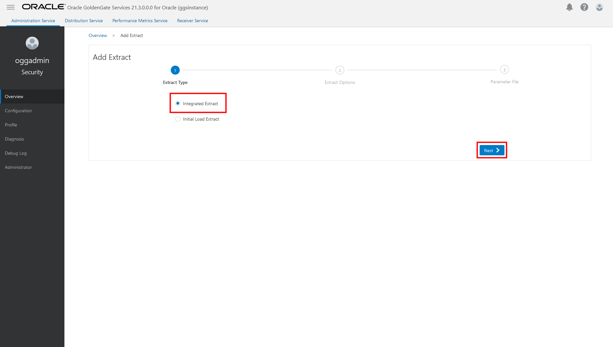

3.  For **Process Name**, enter UAEXT.

4.  For **Trail Name**, enter E1.

    

5.  Under **Source Database Credential**, for **Credential Domain**, select **OracleGoldenGate**.

6.  For **Credential Alias**, select the **SourceATP**.

    

7.  Under Managed Options, enable **Critical to deployment health**.

    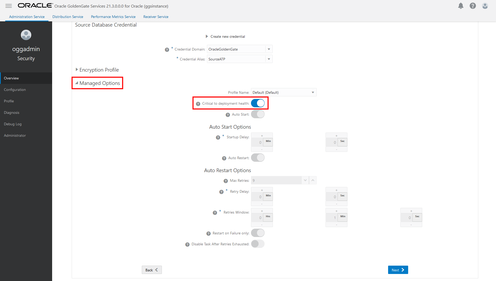

8.  Click **Next**.

9.  On the Parameter File page, in the text area, add a new line to the existing text and add the following:

    ```
    <copy>table SRC_OCIGGLL.*;</copy>
    ```

    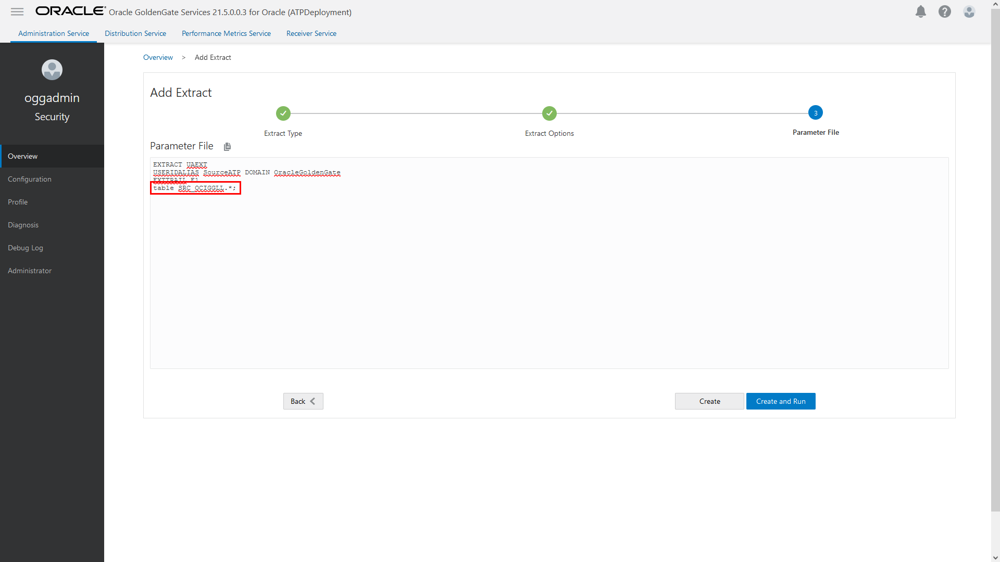

10. Click **Create**. You're returned to the OCI GoldenGate Deployment Console Home page.

11. In the UAEXT **Action** menu, select **Start**. In the Confirm Action dialog, click **OK**.

    

    The yellow exclamation point icon changes to a green checkmark.

    

## Task 5: Create a user on the target Big Data deployment

>**Note**: *Complete the following steps in the target **BDDeployment**'s deployment console (BDinstance).*

1.  In the Oracle Cloud console, click **Deployments** in the breadcrumb.

2.  On the Deployments page, click **BDDeployment** to view its details.

3.  Click **Launch Console**.

4.  Sign in to the deployment console using the **oggadmin** credentials you created in the previous lab Task 2, Step 12.

5.  In the BDinstance deployment console, open the navigation menu, and then click **Administrator**.

    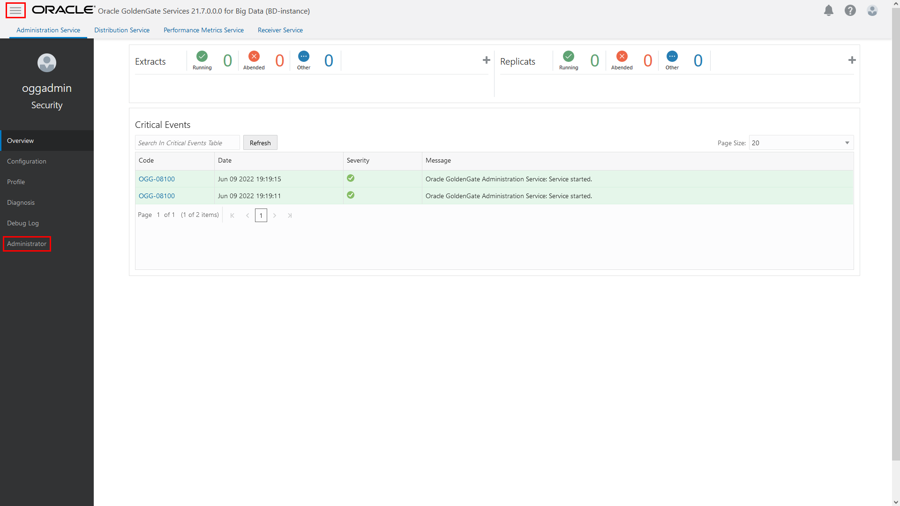

6.  On the Users page, click **Add New User** (plus icon).

7.  For Username, enter `dpuser`.

8.  For Role, select **Administrator**.

9.  For Password and Verify Password, enter a password, and take note of it.

10. Click **Submit**.

    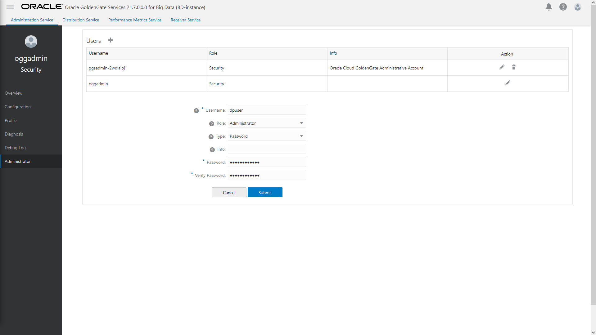

## Task 6: Create a credential on the source ATP deployment for the dpuser

>**Note**: *Complete the following steps in the source **ATPDeployment** deployment console (ATPinstance).*

1.  In the source ATPinstance deployment console, click **Administration Service**, open the navigation menu, and then select **Configuration**.  

    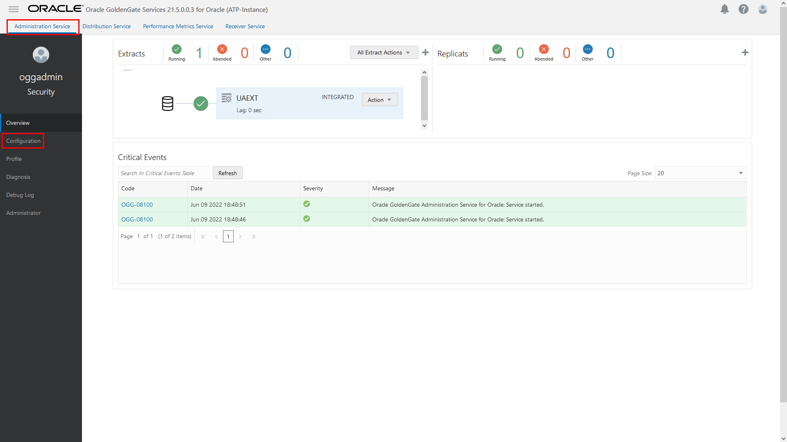

2.  On the Credentials page, click **Add Credential** (plus icon).

    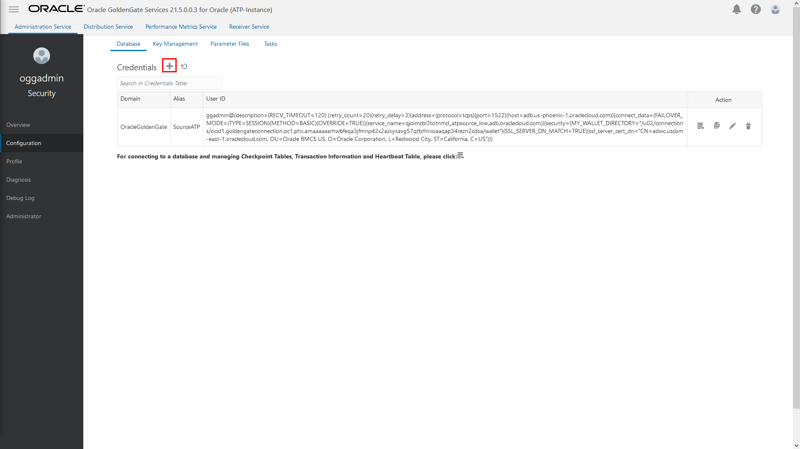

3.  For Credential Domain, enter `ggs2stream`.

4.  For Credential Alias, enter `ocinetwork`.

5.  For User ID, enter `dpuser`.

6.  For Password and Verify Password, enter the password created in Task 2 Step 9.

7.  Click **Submit**.

    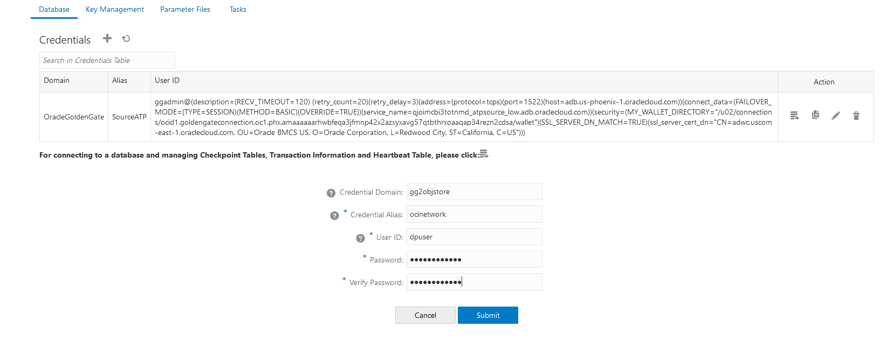

## Task 7: Add and run a Distribution Path in the source deployment console

>**Note**: *Complete the following steps in the source **ATPDeployment** deployment console (ATPinstance).*

The Distribution Path initiates the process to send the GoldenGate trail file to Oracle Object Storage.

1.  In the source ATPinstance deployment console, click **Distribution Service**, and then click **Add Path** (plus icon).

    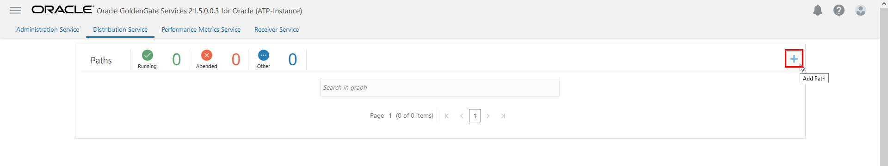

2.  On the Add Path page, for **Path Name**, enter a name for this Path. For example, `GGStoStream`.

3.  For **Description**, describe the purpose of this Path.

4.  Click **Source**, and then select the Extract created in STEP 1 above. For example, select **UAEXT**.

5.  Click **Trail Name**, and then select the trail file created in STEP 1 above, to send to OCI GoldenGate. For example, select **E1**.

6.  For **Target Host**, enter the BDinstance hostname in the following format: **&lt;domain&gt;.deployment.goldengate.us-&lt;region&gt;-1.oci.oraclecloud.com**.

    >**Note:** *You can copy the host from the browser address bar of target BDinstance deployment console window, or copy the Console URL from the Deployment Details page and remove the https:// and any trailing slashes (/).*

  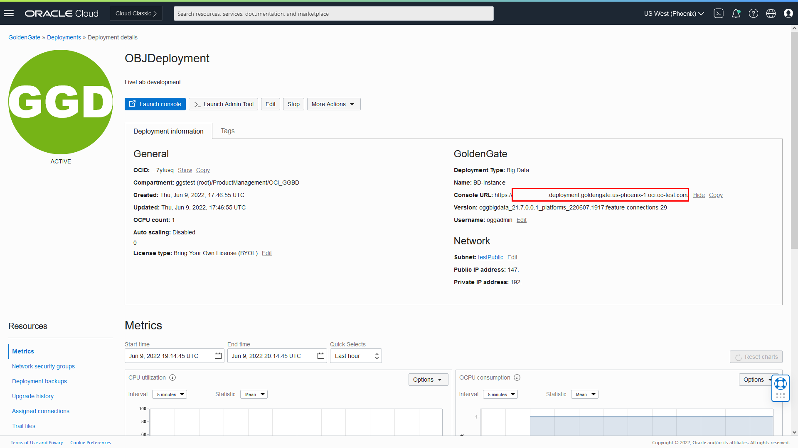

8.  For **Port Number**, enter 443.

9.  For **Trail Name**, enter a two-character name for the Trail file when it is received by OCI GoldenGate. For example, **T1**.

10. For **Target Domain**, enter the domain name you created in Oracle GoldenGate. For example, **ggs2stream**.

11. For **Target Alias**, enter the alias name you created in Oracle GoldenGate. For example, **ocinetwork**.

    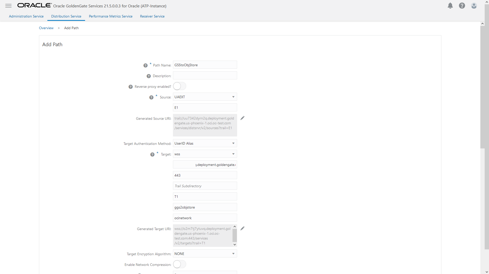

12. Click **Create Create and Run**. The yellow exclamation mark icon becomes a green checkmark when the Distribution Path starts successfully.

## Task 8: Verify Receiver Path creation

The Distribution path on the source ATPinstance creates a Receiver path on the target BDinstance.

>**Note**: *Complete the following steps in the **OBJDeployment** deployment console (BDinstance).

1.  In the target BDinstance deployment console, click **Receiver Service**.

    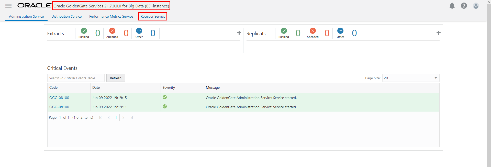

2.  On the Receiver Service Path page, verify that the graph shows the path you created in Task 4.

## Task 9: Add and run a Replicat

>**Note**: *Complete the following steps in the **OBJDeployment** deployment console (BDinstance).

1.  Click **Administration Service**.

2.  In the Replicats section, click **Add Replicat** (plus icon).

3.  On the Add Replicat page, under Replicat Type, select **Classic Replicat**, and then click **Next**.

    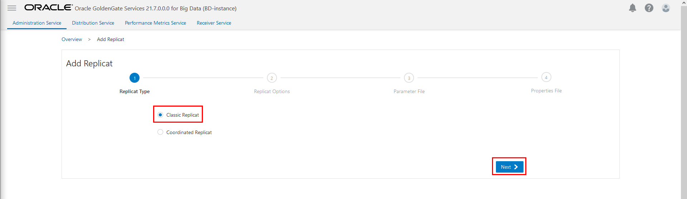

4.  On the the Replicat Options page, enter a `REP` for Name.

5.  For Trail Name, enter `T1`.

6.  For Target, select **OCI Streaming**.

7.  For Available Aliases, select **TargetStream**.

8.  Click **Next**.

    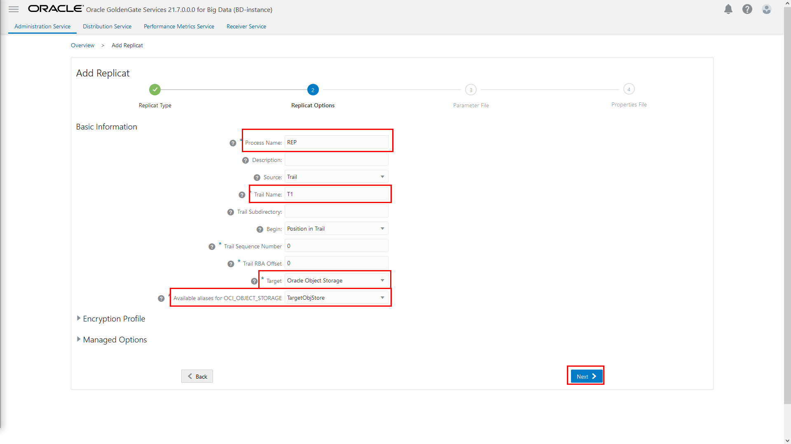

9.  On the Parameter Files page, replace `MAP *.*, TARGET *.*;`with `MAP SRC_OCIGGLL.*, TARGET *.*;`, and then click **Next**.

10. On the Properties File page, locate `gg.handler.kafkahandler.topicMappingTemplate=`, enter the name of your OCI Stream.

11. Click **Create and Run**. The yellow exclamation mark changes to a green check when the Replicat process starts successfully.


In this lab, you:
* Added transaction data to the source database
* Added an Extract
* Created a user for the source deployment to connect to the target deployments
* Added a Distribution Path on the source deployment, which created a Receiver Path on the target deployment
* Added a Replicat process to replicate data from the Autonomous Transaction Processing instance to an OCI Object Storage bucket

**Proceed to the next lab**.

## Learn More
* [Add an Extract](https://docs.oracle.com/en/cloud/paas/goldengate-service/eeske/index.html)
* [Add a Distribution Path](https://docs.oracle.com/en/cloud/paas/goldengate-service/adpen/index.html)
* [Add a Replicat for OCI Streaming](https://docs.oracle.com/en/cloud/paas/goldengate-service/uxxfx/index.html)

## Acknowledgements
* **Author** - Jenny Chan, Consulting User Assistance Developer, Database User Assistance
* **Contributors** -  Deniz Sendil, Database Product Management
* **Last Updated By/Date** - Jenny Chan, September 2022
