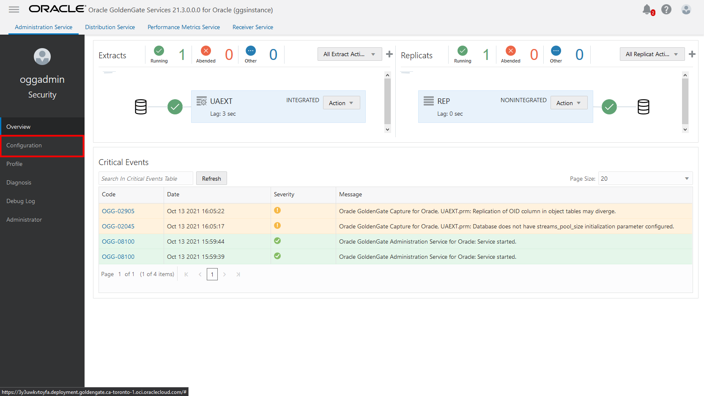
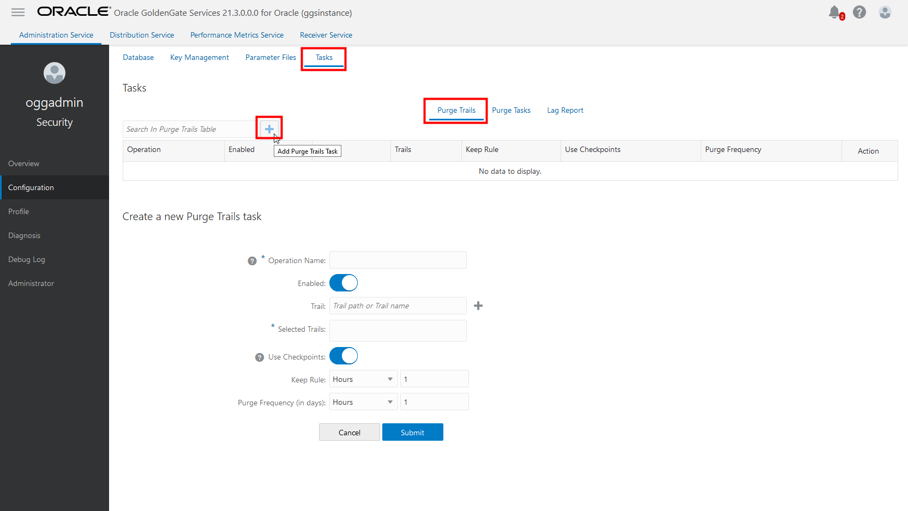
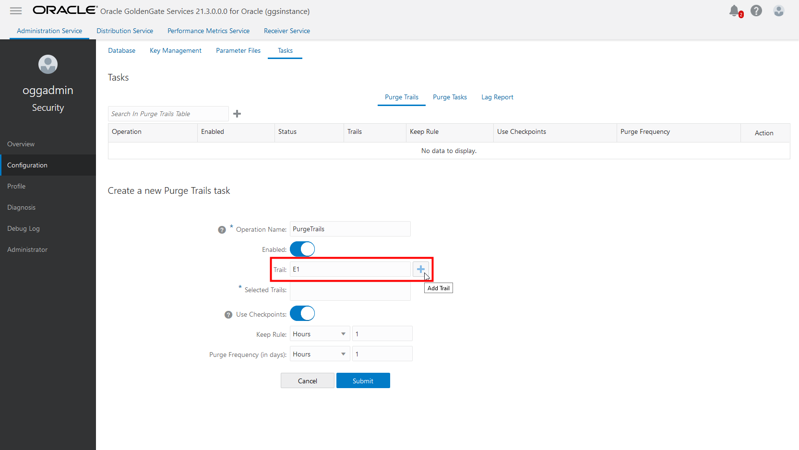

# Purge unused Trail files

## Introduction

This lab walks you through how to create Purge Tasks in the Oracle Cloud Infrastructure (OCI) GoldenGate Deployment Console.

Estimated time: 5 minutes

### About Purge Tasks

Purge Tasks help you to manage unused Trail files in your deployment. Trail files can add up over time and hinder the performance of your deployment.

### Objectives

In this lab, you will create and run a Purge task.

### Prerequisites

This lab assumes you completed all preceding labs.

## Task 1: Create a Purge Task

1.  In the OCI GoldenGate Deployment Console, open the navigation menu (hamburger icon), and then click **Configuration**.

    

2.  On the **Configuration** screen, click **Tasks**, and then click **Add Purge Trail Task** (plus icon). The **Create a new Purge Trials task** form appears.

    

3.  For **Operation Name**, enter a name.

4.  For **Trail**, enter the name of a Trail file, and then click **Add** (plus icon). For example, in this workshop, our Extract Trail file is called `E1`.

    

5.  For **Keep Rule**, select **Number of Files**, and then enter `1`. This indicates that one Trail file will be kept, while all others are purged.

6.  For **Purge Frequency**, select **Hours**, and then enter `1`. This indicates that this Purge task will run every hour.

    

7.  Click **Submit**.

## Learn more

* [Managing Trail Files](https://docs.oracle.com/en/cloud/paas/goldengate-service/ntzlj/index.html)

## Acknowledgements

* **Author** - Jenny Chan, Consulting User Assistance Developer, Database User Assistance
* **Contributors** -  Denis Gray, Database Product Management; Arabella Yao, Database Product Management
* **Last Updated By/Date** - Jenny Chan, July 2022
