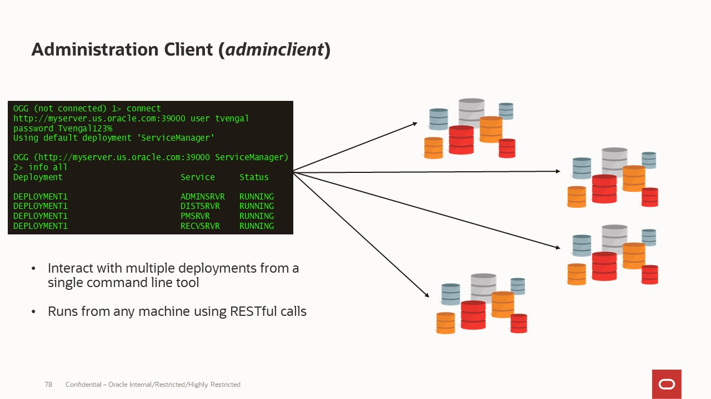
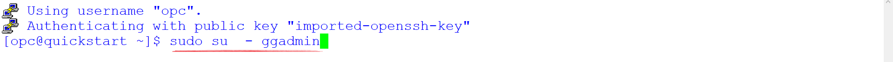

# GGMA Adminclient

## Introduction
This workshop will demonstrate how to connect to the Oracle GoldenGate Admin Client and use it to view all running processes, Extract statistics, log messages, and purge unused files.

*Estimated Workshop Time*: 5 minutes

#### Lab Architecture



### Objectives
-  Connect to the Admin Client
-  Run various commands

### Prerequisites
This Workshop assumes you have:
- A Free Tier, Paid or LiveLabs Oracle Cloud account
- SSH Private Key to access the host via SSH
- You have completed:
    - Lab: Generate SSH Keys
    - Lab: Prepare Setup
    - Lab: Environment Setup


## Task 0: Running your Lab
### Login to Host using SSH Key based authentication

Refer to *Lab Environment Setup* for detailed instructions relevant to your SSH client type (e.g. Putty on Windows or Native such as terminal on Mac OS:

  - Authentication OS User - “*opc*”
  - Authentication method - *SSH RSA Key*
  - OS User – “*ggadmin*”.

1. Login as “*opc*” using your SSH Private Key

2. Then sudo to “*ggadmin*”. E.g.

    ```
    <copy>sudo su - ggadmin</copy>
    ```

    

## Task 1: Connect to the Admin Client

1. Select **Q** to quit the labmenu.Change directories to ***/u01/ggbd_home/bin/***, and then start the Admin Client:

    To quit the Lab Menu:

    ```
    <copy>Q</copy>
    ```

    Navigate to GGMA Adminclient folder:

    ```
    <copy>
    cd /u01/ggbd_home/bin/
    ./adminclient

    </copy>
    ```

    

2. Connect to the GoldenGate deployment:

    ```
    <copy>connect http://localhost:16000 as oggadmin password Wel_Come1</copy>
    ```

    


3. After connecting successfully, you can run any of the following commands:

    Display the status of GoldenGate processes:

    ```
    <copy>
    info all
    </copy>
    ```

    


    View statistics of  Replicat ***REPKAFKA***

    ```
    <copy>
    STATS REPLICAT REPKAFKA TOTAL
    </copy>
    ```

    


    View the content of a ggserror log file:

    ```
    <copy>
    VIEW MESSAGES
    </copy>
    ```

    

## Summary
To summarize, Admin Client is a command line utility (similar to the classic GGSCI utility). It uses the REST API published by the Microservices Servers to accomplish control and configuration tasks in an Oracle GoldenGate deployment.


## Learn More

* [Using the Admin Client](https://docs.oracle.com/en/middleware/goldengate/core/21.1/admin/getting-started-oracle-goldengate-process-interfaces.html#GUID-84B33389-0594-4449-BF1A-A496FB1EDB29)

## Acknowledgements
* **Author** - Madhu Kumar S, Data Integration Team, Oracle, September  2021
* **Contributors** - Meghana Banka, Rene Fontcha
* **Last Updated By/Date** - Rene Fontcha, Master Principal Solutions Architect, NA Technology, September 2021
