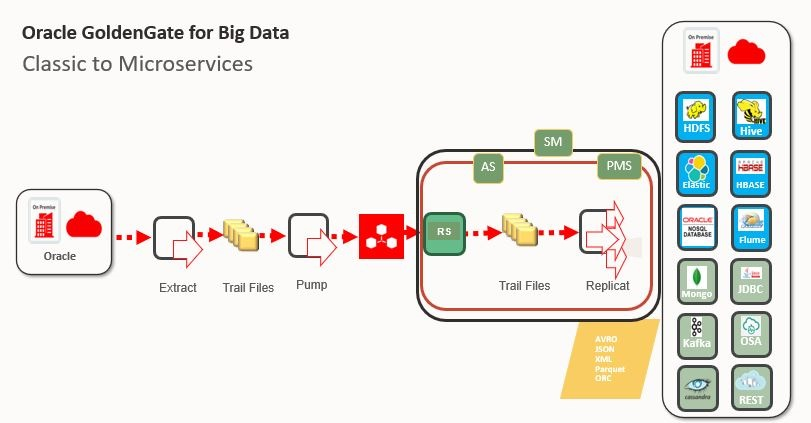

# Introduction

## About Oracle GoldenGate for Big Data - Microservices
Oracle GoldenGate for Big Data offers high-performance, fault-tolerant, easy-to-use, and flexible real- time data streaming platform for big data environments. It easily extends customers’ real-time data integration architectures to big data systems without impacting the performance of the source systems and enables timely business insight for better decision making. This workshop focuses on **GoldenGate Real Time Data Capture** demonstrating four scenarios that you can use (both on-premise and in the cloud) to capture real time data changes from your sources.

This hands-on lab is designed to demonstrate how Oracle **GoldenGate Classic** and  **GoldenGate 21.1 Microservices** can be used to setup a replication environment by a mix of web page, shell scripts and Rest API interfaces. All labs will use shell scripts to facilitate the building of the environment, at the same time provide insight into how to use the web pages and AdminClient.
The labs will walk the end-user through how to add all components of Oracle GoldenGate replication. To do the instantiation of the target database, the end-user will be performing a data pump export and import. All replication process will be started as they are built. Our source data changes are generated by Classic GoldenGate and trail file changes will be received into the GoldenGate Microservices Target.

**Workshop Classic Architecture**
    

**Workshop Classic to Microservices Architecture**
    

### Prerequisites
* An Oracle Cloud Account - Please view this workshop's LiveLabs landing page to see which environments are supported

*Note: If you have a **Free Trial** account, when your Free Trial expires your account will be converted to an **Always Free** account. You will not be able to conduct Free Tier workshops unless the Always Free environment is available. **[Click here for the Free Tier FAQ page.](https://www.oracle.com/cloud/free/faq.html)***

### Lab Overview

- **Lab: Installation Of GoldenGate for Big Data** -
    In this lab we will install GoldenGate for Big Data in the GG Target Home. Follow the steps below to install GG, or optionally you can select “I” from the Lab Menu below to auto-install GG.

- **Lab: Replication from Relational Database to Relational Database using GoldenGate** -
    This lab is intended to give you familiarity with how to configure GG for database to database replication. If you are already familiar with GG, you can choose to skip this lab.

- **Lab: Replication from Relational to HDFS** -
    This lab is intended to give you familiarity with how to configure GG for database to database replication. If you are already familiar with GG, you can choose to skip this lab.

- **Lab: Replication from Relational to Hive** -
    In this lab we will load data in MySQL database `ggsource`, GG extract process `extmysql` will capture the changes from MySQL's binary logs and wrote them to the local trail file. The pump process `pmphadop` will route the data from the local trail (on the source) to the remote trail (on the target). The replicat
    process `rhive` will read the trail file, create the Hive tables, write the data and the schema files (avsc) to the HDFS target directory for Hive:` /user/ggtarget/hive/data/*` and `/user/ggtarget/hive/schema/*`

- **Lab: Replication from Relational to HBase** -
    In this lab we will load data in MySQL database `ggsource`, GG extract process `extmysql` will In this lab we will load data in MySQL database `ggsource`, GG extract process `extmysql` will capture the changes from MySQL's binary logs and write them to the local trail file. The pump process `pmphadop` will route the data from the local trail (on the source) to the remote trail (on the target). The replicat process `rhbase` will read the remote trail files, create the HBase tables and write the data to those tables.

- **Lab: Replication from Relational to Kafka** -
    In this lab we will load data in MySQL database `ggsource`, GG extract process `extmysql` will capture the changes from MySQL's binary logs and write them to the local trail file. The pump process `pmphadop` will route the data from the local trail (on the source) to the remote trail (on the target). The replicat process `rkafka` will read the remote trail files, act as a producer and write the messages to an auto- created topic for each table in the source database.

- **Lab: Replication from Relational to Cassandra** -  
    In this lab we will load data in MySQL database `ggsource`, GG extract process `extmysql` will capture the changes from MySQL's binary logs and write them to the local trail file. The pump process `pmphadop` will route the data from the local trail (on the source) to the remote trail (on the target). The replicat process `rcass` will read the remote trail files, create the Cassandra tables and write the data to those tables.

- **Lab: Mysql-to-Kafka-via-GoldenGate Microservices** -  
    In this lab we will load data in MySQL database `ggsource`, GG extract process `extmysql` will capture the changes from MySQL's binary logs and write them to the local trail file. We will route the data from the local trail (on the source) to the remote trail in GoldenGate Microservices Dashboard. The replicat process will read the remote trail files, create the Cassandra tables and write the data to those tables.

- **Lab: GoldenGate Microservices Adminclient** -  
    In this lab we will manage GoldenGate using the GoldenGate Adminclient via RestfulAPI

## Learn More

* [GoldenGate](https://www.oracle.com/middleware/data-integration/goldengate/")
* [GoldenGate for Big Data](https://www.oracle.com/middleware/data-integration/goldengate/big-data/")
* [GoldenGate Microservices Architecture (MA)](https://docs.oracle.com/en/middleware/goldengate/big-data/21.1/gadbd/getting-started-oracle-goldengate-microservices-big-data.html#GUID-248D5562-397F-4D10-9E95-CE9477012950)

## Acknowledgements
* **Author** - Brian Elliott, Data Integration Team, Oracle, August 2020
* **Contributors** - Meghana Banka, Rene Fontcha
* **Last Updated By/Date** - Brian Elliott, Data Integration Team, Oracle, September 2021

