# MySQL to HBase

## Introduction

In this lab we will load data in MySQL database ‘ggsource’, GG extract process ‘extmysql’ will In this lab we will load data in MySQL database ‘ggsource’, GG extract process ‘extmysql’ will capture the changes from MySQL’s binary logs and write them to the local trail file. The pump process ‘pmphadop’ will route the data from the local trail (on the source) to the remote trail (on the target). The replicat
process ‘rhbase’ will read the remote trail files, create the HBase tables and write the data to those tables.

*Estimated Lab Time*:  60 minutes

#### Lab Architecture

  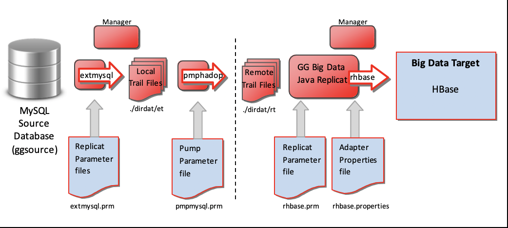

### Objectives
- Explore GoldenGate replication from **MySQL to HBase**

### Prerequisites
This lab assumes you have:
- A Free Tier, Paid or LiveLabs Oracle Cloud account
- SSH Private Key to access the host via SSH
- You have completed:
    - Lab: Generate SSH Keys (*Free-tier* and *Paid Tenants* only)
    - Lab: Prepare Setup (*Free-tier* and *Paid Tenants* only)
    - Lab: Environment Setup
    - Lab: Deploy GoldenGate for Big Data

## Task 0: Running your Lab
### Login to Host using SSH Key based authentication
Refer to *Lab Environment Setup* for detailed instructions relevant to your SSH client type (e.g. Putty on Windows or Native such as terminal on Mac OS):
  - Authentication OS User - “*opc*”
  - Authentication method - *SSH RSA Key*
  - OS User – “*ggadmin*”.

1. First login as “*opc*” using your SSH Private Key

2. Then sudo to “*ggadmin*”. E.g.

    ```
    <copy>sudo su - ggadmin</copy>
    ```

 3. Repeat the two steps above to create a second session. These two sessions will be used respectively for `source` and `target` execution tasks

## Task 1: Explore GoldenGate Configuration  
1. In the first or `source` terminal session as user `ggadmin`, type  `labmenu` to display the labmenu IF not at the labmenu.

  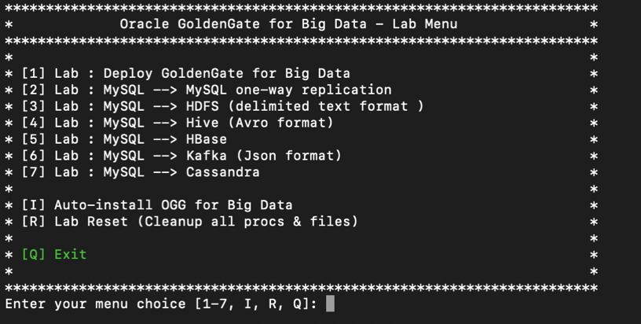

2. Select **R** to reset the lab environment, then select **5**

3. The above step will copy the GoldenGate configuration files to the GG Home directories, under ./dirprm.

4. Review the content of each of these files to explore how GoldenGate is being configured.

    ```
    <copy> cd /u01/gg4mysql
    view /u01/gg4mysql/dirprm/create_mysql_to_hadoop_gg_procs.oby</copy>
    ```
    ```
    <copy> cd /u01/gg4mysql/dirprm
    view /u01/gg4mysql/dirprm/mgr.prm</copy>
    ```
    ```
    <copy>view /u01/gg4mysql/dirprm/extmysql.prm</copy>
    ```
    ```
    <copy>view /u01/gg4mysql/dirprm/pmpmysql.prm</copy>
    ```
    ```
    <copy> cd /u01/gg4hadoop/dirprm
    view /u01/gg4hadoop123010/dirprm/create_hbase_replicat.oby</copy>
    ```
    ```
    <copy>view /u01/gg4hadoop123010/dirprm/rhbase.prm</copy>
    ```
    ```
    <copy>view /u01/gg4hadoop123010/dirprm/rhbase.properties</copy>
    ```

Now we need to start the GG manager process on both the source and target. Keep these sessions open for the rest of this lab.

## Task 2: GoldenGate Source Configuration
1. In the first session, go to the **GG Home for MySQL**, and start the manager process. You can either cd to the directory, or call the alias ggmysql:

  

    ```
    <copy> cd /u01/gg4mysql
    ./ggsci</copy>
    ```
    ```
    <copy> info all</copy>
    ```
    ```
    <copy> start mgr</copy>		
    ```
    ```
    <copy> info all</copy>
    ```

2. In the second or `target` terminal session, go to the **GG Home for Hadoop**, and start the manager process. You can either cd to the directory, or call the alias gghadoop:

  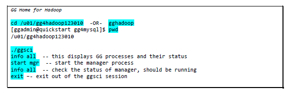

    ```
    <copy> cd /u01/gg4hadoop123010
    ./ggsci</copy>
    ```
    ```
    <copy> info all</copy>	 
    ```
    ```
    <copy> start mgr</copy>		
    ```
    ```
    <copy> info all</copy>	 
    ```
    ```
    <copy> exit</copy>
    ```

3. In the first or `source` terminal session (**GG for MySQL ggsci session**), we will create and start the GG extract process:

  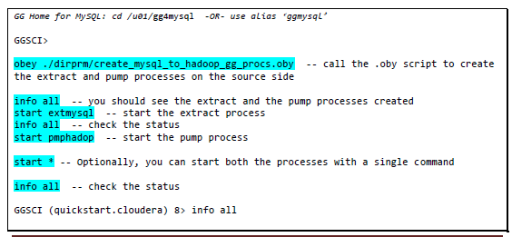
  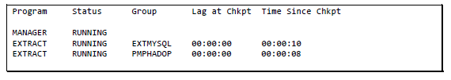

    ```
    <copy>./ggsci</copy>
    <copy>obey ./dirprm/create_mysql_to_hadoop_gg_procs.oby</copy>
    ```
    ```
    <copy>info all</copy>
    ```
    ```
    <copy>start extmysql</copy>
    ```
    ```
    <copy>info all</copy>
    ```
    ```
    <copy>start pmphadop</copy>
    ```
    ```
    <copy>info all</copy>
    ```

## Task 3: GoldenGate Target Configuration

Now that the source side is setup, let us configure GG on the target side (HBase).

1. In the **GG for Hadoop session**, you will need to modify the HBase properties by removing the `---` prefixes from the highlighted values:

  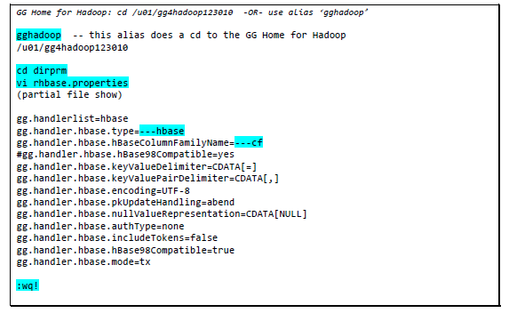

    ```
    <copy>cd dirprm
    vi rhbase.properties</copy>
    ```

2. Remove "---" from the items below as highlighted above

    ```
    ---hbase
    ---cf
    ```
3. Now create and start the HBase replicat process:

  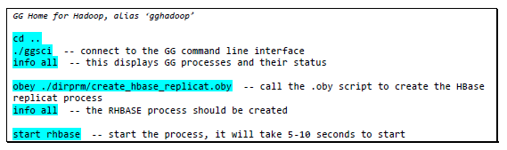
  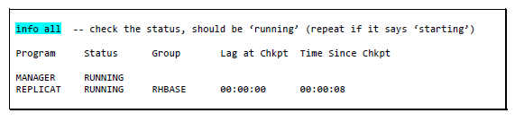

    ```
    <copy>cd ..
    ./ggsci</copy>
    ```
    ```
    <copy>info all</copy>
    ```
    ```
    <copy>obey ./dirprm/create_hbase_replicat.oby</copy>
    ```
    ```
    <copy>info all</copy>
    ```
    ```
    <copy>start rhbase</copy>
    ```
    ```
    <copy>info all</copy>
    ```

4. Now that GG processes have been created and started on both the source and target, let us take a look at what is in the HBase tables – they should be empty (they don’t even exist yet). We will load some data on the MySQL database `ggsource` and GG will extract the data, create the HBase tables, and write the data to the HBase target tables.

5. Start a new terminal session as `ggadmin`, then click **Q** to get to a prompt:

6. Execute the following:

  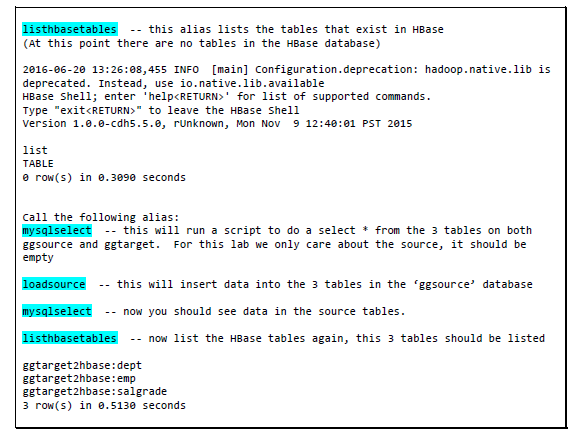

    ```
    <copy>listhbasetables</copy>
    ```
    ```
    <copy>mysqlselect</copy>
    ```
    ```
    <copy>loadsource</copy>
    ```
    ```
    <copy>mysqlselect</copy>
    ```

    ```
    <copy>listhbasetables</copy>
    ```

    **Note:** Starting with GG version 12.2.0.1.1, GG automatically creates the HBase tables. Let us take a look at the contents of the tables

  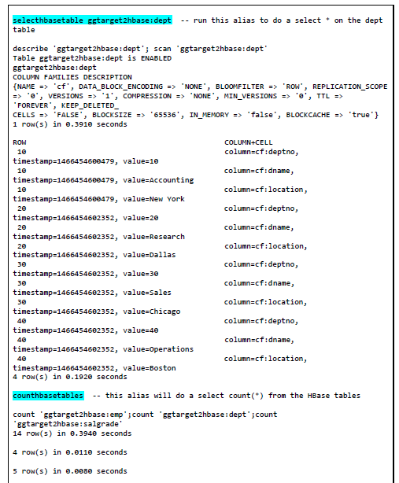
  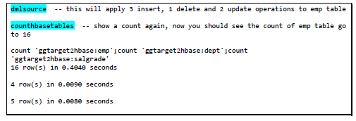

      ```
      <copy>selecthbasetable ggtarget2hbase:dept</copy>
      ```
      ```
      <copy>counthbasetables</copy>
      ```
      ```
      <copy>dmlsource</copy>
      ```
      ```
      <copy>counthbasetables</copy>
      ```

7. Let us confirm that GG replicated the data that it captured. In a **GG Home for Hadoop session:**

  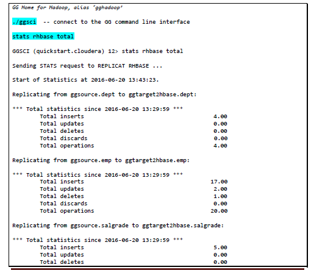
  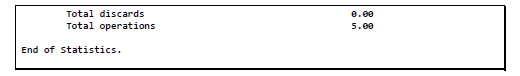

      ```
      <copy>./ggsci</copy>
      ```
      ```
      <copy>stats rhbase total</copy>
      ```

## Task 4: GoldenGate Results using HUE

1. Open a Browser window from your local machine to visualize data from HUE frontend application.
    - URL

    ```
    <copy>http://<Your Host Public IP address>:8888</copy>
    ```

    - Credentials: cloudera/cloudera

2. Click on *Data Browser > HBase > ggtarget2hbase:emp*

3. Select Hamburger Menu
4. Select Data Browser
5. Select HBase
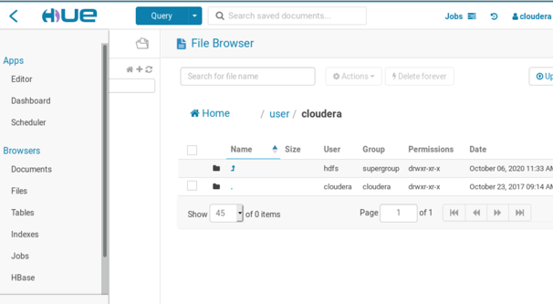

   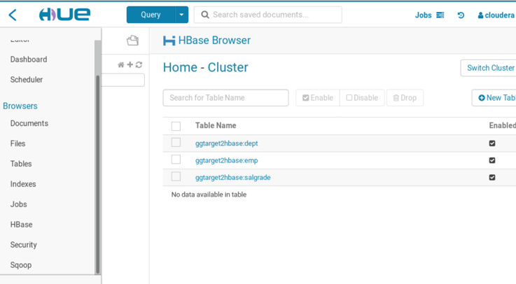

1. select ggtarget2hbase.dept

   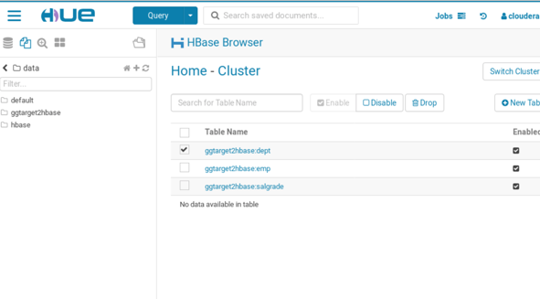

   

## Summary
In summary, you loaded data in MySQL database `ggsource`, GG extract process `extmysql` captured the changes from the MySQL binary logs and wrote them to the local trail file. The pump process
`pmphadop` routed the data from the local trail (on the source) to the remote trail (on the target). The replicat process `rhbase` read the remote trail files, created the HBase tables and wrote the data to those tables.

You may now *proceed to the next lab*.

## Learn More

* [Oracle GoldenGate for Big Data 19c | Oracle](https://www.oracle.com/middleware/data-integration/goldengate/big-data/)

## Acknowledgements
* **Author** - Brian Elliott, Data Integration Team, Oracle, August 2020
* **Contributors** - Meghana Banka, Rene Fontcha
* **Last Updated By/Date** - Brian Elliott, Data Integration Team, Oracle, August 2021
