#  MySQL to HDFS(delimited text format)


## Introduction
In this lab we will load data in MySQL database `ggsource`, GG extract process `extmysql` will capture the changes from MySQL’s binary logs and write them to the local trail file. The pump process `pmphadop` will route the data from the local trail (on the source) to the remote trail (on the target). The replicat
process `rhdfs` will read the remote trail files, and write the data to the HDFS target directory
/user/ggtarget/hdfs/

*Estimated Lab Time*:  60 minutes

#### Lab Architecture

  

### Objectives
- Explore GoldenGate replication from **MySQL to HDFS**

### Prerequisites
This lab assumes you have:
- A Free Tier, Paid or LiveLabs Oracle Cloud account
- SSH Private Key to access the host via SSH
- You have completed:
    - Lab: Generate SSH Keys (*Free-tier* and *Paid Tenants* only)
    - Lab: Prepare Setup (*Free-tier* and *Paid Tenants* only)
    - Lab: Environment Setup
    - Lab: Deploy GoldenGate for Big Data

## Task 0: Running your Lab
### Login to Host using SSH Key based authentication
Refer to *Lab Environment Setup* for detailed instructions relevant to your SSH client type (e.g. Putty on Windows or Native such as terminal on Mac OS):
  - Authentication OS User - “*opc*”
  - Authentication method - *SSH RSA Key*
  - OS User – “*ggadmin*”.

1. First login as “*opc*” using your SSH Private Key

2. Then sudo to “*ggadmin*”. E.g.

    ```
    <copy>sudo su - ggadmin</copy>
    ```

 3. Repeat the two steps above to create a second session. These two sessions will be used respectively for `source` and `target` execution tasks

## Task 1: Explore GoldenGate Configuration
1. In the first or `source` terminal session as user `ggadmin`, type  `labmenu` to display the labmenu IF not at the labmenu.

  

2. Select **R** to reset the lab environment, then select **3**

3. The above step will copy the GoldenGate configuration files to the GG Home directories, under ./dirprm. It's already done in the env script for this workshop

4. Review the content of each of these files to explore how GoldenGate is being configured.

    ```
    <copy>cd /u01/gg4hadoop123010/dirprm
    view create_hdfs_replicat.oby</copy>
    ```
    ```
    <copy>cd /u01/gg4hadoop123010/dirprm
    view /u01/gg4hadoop123010/dirprm/rhdfs.prm</copy>
    ```
    ```
    <copy> view /u01/gg4hadoop123010/dirprm/rhdfs.properties</copy>
    ```

Now we need to start the GG manager process on both the source and target. Keep these sessions open for the rest of this lab.

## Task 2: GoldenGate Source Configuration

1. In the first or `source` terminal session, go to the **GG Home for MySQL**, and start the manager process. You can either cd to the directory, or call the alias ggmysql:

  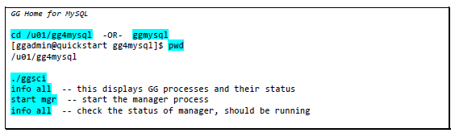

    ```
    <copy> cd /u01/gg4mysql
    ./ggsci</copy>
    ```
    ```
    <copy> info all</copy>
    ```
    ```
    <copy> start mgr</copy>		
     ```
     ```
    <copy> info all</copy>
    ```

2. In the second or `target` terminal session, go to the **GG Home for Hadoop**, and start the manager process. You can either cd to the directory, or call the alias gghadoop:

  

    ```
    <copy> cd /u01/gg4hadoop123010
    ./ggsci</copy>
    ```
    ```
    <copy> info all</copy>	 
    ```
    ```
    <copy> start mgr</copy>		
    ```
    ```
    <copy> info all</copy>	 
    ```
    ```
    <copy> exit</copy>
    ```

3. In the first or `source` terminal session (**GG for MySQL ggsci session**), we will create and start the GG extract process:

  
  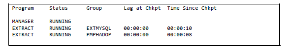

    ```
    <copy>./ggsci</copy>
    ````
    ```
    <copy>obey ./dirprm/create_mysql_to_hadoop_gg_procs.oby</copy>
    ```
    ```
    <copy> info all</copy>
     ```
     ```
    <copy> start extmysql</copy>
    ```
    ```
    <copy> info all</copy>
    ```
    ```
    <copy> start pmphadop</copy>
    ```

    ```
    <copy> info all</copy>
    ```

## Task 3: GoldenGate Target Configuration

Now that the source side is setup, let us configure GG on the target side (HDFS).

1. In the second or `target` terminal session (**GG for Hadoop session**), you will need to modify the HDFS properties by removing the `---` from the highlighted values:

  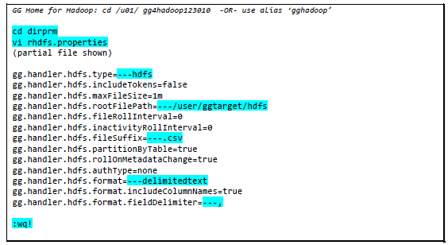

    ```
    <copy> cd dirprm
    vi rhdfs.properties</copy>
    ```

2. Remove "---" from the items below as highlighted above

    ```
     ---hdfs
     ---/user/ggtarget/hdfs
     ---delimitedtext
     ---.csv
    ```

3. Now create and start the HDFS replicat process:

  

    ```
    <copy> cd ..
    ./ggsci</copy>	 
    ```
    ```
    <copy>info all</copy>		
    ```
    ```
    <copy>start mgr</copy>
    ```
    ```
    <copy> obey ./dirprm/create_hdfs_replicat.oby</copy>
    ```
    ```
    <copy> info all</copy>
    ```
    ```
    <copy> start rhdfs</copy>
    ```
**Note**: You might have to run "info all" several times before the status changes to running

    ```
    <copy> info all</copy>
    ```

4. Replicat is now running

  

## Task 4: Exploring HDFS Target

1. Now that GG processes have been created and started on both the source and target, let us take a look at what is in the HDFS directory – it should be empty. Then we will load some data on the MySQL database `ggsource` and GG will extract and write it to the HDFS target. GG will create a subdirectory for each table in the base directory `/user/ggtarget`.

2. Start a new terminal session as `ggadmin`, then click **Q** to get to a prompt:

  
  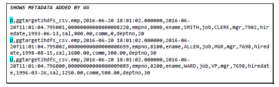

    ```
    <copy> hdfsls</copy>
    ```
    ```
    <copy> mysqlselect</copy>
    ```
    ```
    <copy> loadsource</copy>
    ```
    ```
    <copy> mysqlselect</copy>
    ```
    ```
    <copy> hdfsls</copy>
    ```
    ```
    <copy> dmlsource</copy>
    ```
    ```
    <copy> hdfscat</copy>
    ```

3. Let us confirm that GG replicated the data that it captured. Go back to the MySQL ggsci session and execute the following commands to see what data GG has processed, and do the same in the Hadoop ggsci session:

4. In MySQL ggsci session window:

  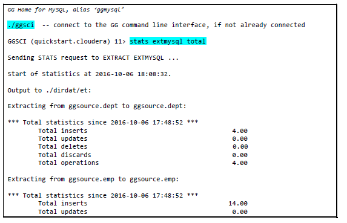

  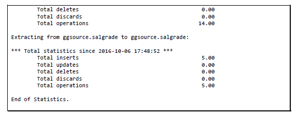

    ```
    <copy>./ggsci</copy>
    ```
    ```
    <copy> stats extmysql total</copy>
    ```

5. In Hadoop ggsci session window:

  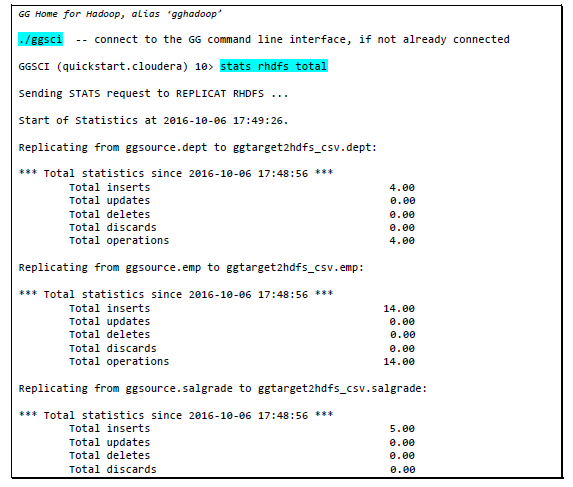

  

    ```
    <copy>./ggsci</copy>
    ```
    ```
    <copy> stats rhdfs total</copy>
    ```

The stats command displays the statistics of the data that GoldenGate processed (grouped by `insert/update/deletes`). Counts should match between source and target.

## Task 5: GoldenGate Results using HUE

1. Open a Browser window from your local machine to visualize data from HUE frontend application.
    - URL

    ```
    <copy>http://<Your Host Public IP address>:8888</copy>
    ```

    - Credentials: cloudera/cloudera

2. Click on Hamburger Menu, File Browser then Navigate to `/user/ggtarget/hdfs…`


  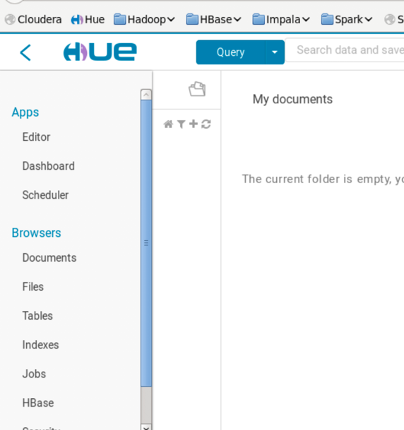

  select **ggtarget2hdfs_csv.emp**

  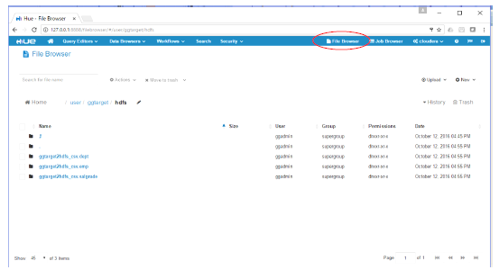
  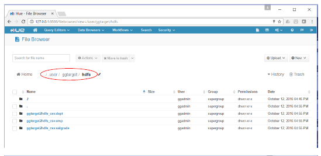
  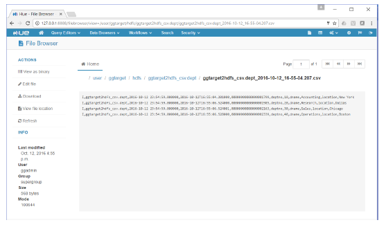

## Summary
In summary, we loaded data in MySQL database `ggsource`, GG extract process `extmysql` captured the changes from the MySQL binary logs and wrote them to the local trail file. The pump process
`pmphadop` routed the data from the local trail (on the source) to the remote trail (on the target). The replicat process `rhdfs` read the remote trail file, and wrote the data to the HDFS target directory `/user/ggtarget/hdfs/*`.

You may now *proceed to the next lab*.

## Learn More

* [Oracle GoldenGate for Big Data 19c | Oracle](https://www.oracle.com/middleware/data-integration/goldengate/big-data/)

## Acknowledgements
* **Author** - Brian Elliott, Data Integration Team, Oracle, August 2020
* **Contributors** - Meghana Banka, Rene Fontcha
* **Last Updated By/Date** - Rene Fontcha, Master Principal Solutions Architect, NA Technology, October 2020
