#  MySQL to Hive (Avro format)

## Introduction

In this lab we will load data in MySQL database `ggsource`, GG extract process `extmysql` will capture the changes from MySQL’s binary logs and wrote them to the local trail file. The pump process `pmphadop` will route the data from the local trail (on the source) to the remote trail (on the target). The replicatprocess `rhive` will read the trail file, create the Hive tables, write the data and the schema files (avsc) to the HDFS target directory for Hive: `/user/ggtarget/hive/data/*` and `/user/ggtarget/hive/schema/*`

*Estimated Lab Time*:  60 minutes

#### Lab Architecture

  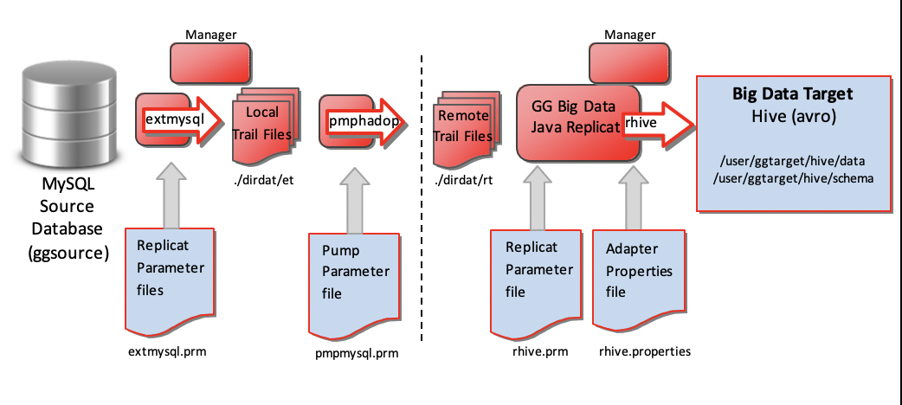

### Objectives
- Explore GoldenGate replication from **MySQL to Hive**

### Prerequisites
This lab assumes you have:
- A Free Tier, Paid or LiveLabs Oracle Cloud account
- SSH Private Key to access the host via SSH
- You have completed:
    - Lab: Generate SSH Keys (*Free-tier* and *Paid Tenants* only)
    - Lab: Prepare Setup (*Free-tier* and *Paid Tenants* only)
    - Lab: Environment Setup
    - Lab: Deploy GoldenGate for Big Data

## Task 0: Running your Lab
### Login to Host using SSH Key based authentication
Refer to *Lab Environment Setup* for detailed instructions relevant to your SSH client type (e.g. Putty on Windows or Native such as terminal on Mac OS):
  - Authentication OS User - “*opc*”
  - Authentication method - *SSH RSA Key*
  - OS User – “*ggadmin*”.

1. First login as “*opc*” using your SSH Private Key

2. Then sudo to “*ggadmin*”. E.g.

    ```
    <copy>sudo su - ggadmin</copy>
    ```

 3. Repeat the two steps above to create a second session. These two sessions will be used respectively for `source` and `target` execution tasks

## Task 1: Explore GoldenGate Configuration
1. In the first or `source` terminal session as user `ggadmin`, type  `labmenu` to display the labmenu IF not at the labmenu.

2. Select **R** to reset the lab then Option **4**

  

3. Review the overview notes on the following screen, then select **Q** to quit. These online notes have been provided so you can cut/paste file names to another session, to avoid typos.

4. The above step will copy the GoldenGate configuration files to the GG Home directories, under ./dirprm.

5. Review the content of each of these files to explore how GoldenGate is being configured.

    ```
    <copy>cd /u01/gg4mysql
    view /u01/gg4mysql/dirprm/create_mysql_to_hadoop_gg_procs.oby</copy>
    ```
    ```
    <copy>cd /u01/gg4mysql/dirprm
    view /u01/gg4mysql/dirprm/mgr.prm</copy>
    ```
    ```
    <copy>view /u01/gg4mysql/dirprm/extmysql.prm</copy>
    ```
    ```
    <copy>view  /u01/gg4mysql/dirprm/pmpmysql.prm</copy>
    ```
    ```
    <copy>cd /u01/gg4hadoop123010/dirprm
    view /u01/gg4hadoop123010/dirprm/create_hive_replicat.oby</copy>
    ```
    ```
    <copy>view /u01/gg4hadoop123010/dirprm/rhive.prm</copy>
    ```
    ```
    <copy>view /u01/gg4hadoop123010/dirprm/rhive.properties</copy>
    ```

Now we need to start the GG manager process on both the source and target. Keep these sessions open for the rest of this lab.

## Task 2: GoldenGate Source Configuration

4. In the first or `source` terminal session, go to the **GG Home for MySQL**, and start the manager process. You can cd to the directory:

 

    ```
    <copy>ggmysql</copy>
    ```
    ```
     <copy> pwd
     ./ggsci</copy>
    ```
    ```
    <copy> info all</copy>	 
    ```
    ```
    <copy> start mgr</copy>		
    ```
    ```
    <copy> info all</copy>
    ```

5. In the second or `target` terminal session, go to the **GG Home for Hadoop**, and start the manager process. You can either cd to the directory, or call the alias gghadoop:

  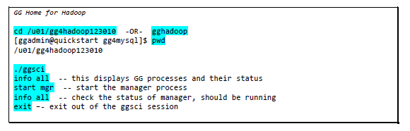

    ```
    <copy> cd /u01/gg4hadoop123010
    ./ggsci</copy>
    ```
    ```
    <copy> info all</copy>	 
    ```
    ```
    <copy> start mgr</copy>		
    ```
    ```
    <copy> info all</copy>	 
    ```
    ```
    <copy> exit</copy>
    ```

6. In the first or `source` terminal session (**GG for MySQL ggsci session**), we will create and start the GG extract process:

  
  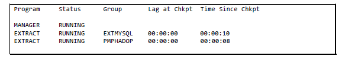

    ```
     <copy>./ggsci</copy>
     ```
     ```
    <copy> obey ./dirprm/create_mysql_to_hadoop_gg_procs.oby</copy>
    ```
    ```
    <copy> info all</copy>
     ```
     ```
    <copy> start extmysql</copy>
    ```
    ```
    <copy> info all</copy>
    ```
    ```
    <copy> start pmphadop</copy>
    ```
    **or use the following to start ALL**
    ```
    <copy> start *</copy>
    ```

    ```
    <copy> info all</copy>
    ```

## Task 3: GoldenGate Target Configuration

Now that the source side is setup, let us configure GG on the target side (Hive Avro format).

1. In the second or `target` terminal session (**GG for Hadoop session**), you will need to modify the Hive properties by removing the ‘---‘ from the highlighted values:

  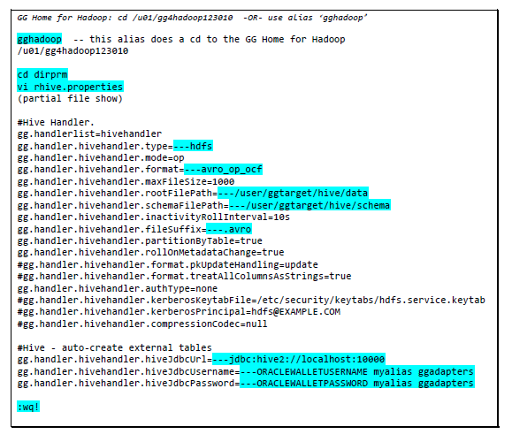

    ```
    <copy>cd /u01/gg4hadoop123010/dirprm</copy>
    ```
    ```
    <copy> vi rhive.properties</copy>
    ```

2. Remove "--" from the items below as highlighted above

    ```
    ---hdfs
    ---avro_op_ocf
    ---/user/ggtarget/hive/data
    ---/user/ggtarget/hive/schema
    ---.avro
    ---jdbc:hive2://localhost:10000
    ---ORACLEWALLETUSERNAME myalias
    ---ORACLEWALLETPASSWORD myalias
    ```

3. Now create and start the Hive replicat process:

  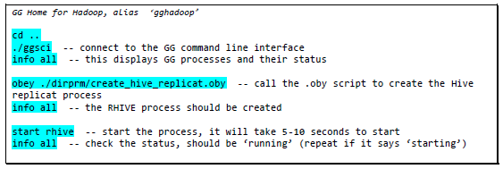

    ```
    <copy> cd ..
    ./ggsci</copy>
    ```
    ```
     <copy> info all</copy>
    ```
    ```
    <copy> obey ./dirprm/create_hive_replicat.oby</copy>
    ```
    ```
    <copy> info all</copy>
    ```
    ```
    <copy> start rhive</copy>
    ```
    ```
    <copy> info all</copy>
    ```
## Task 4:GoldenGate Hive Target

Now that GG processes have been created and started on both the source and target, let’s take a look at what’s in the Hive directories (schema & data) – they should be empty. Then we’ll load some data on the MySQL database `ggsource` and GG will extract and write it to the Hive target. GG will create a subdirectory for each table in the base directory `/user/ggtarget/hive/data`.

1. Open a terminal session as `ggadmin`, then click **Q** to get to a prompt:

  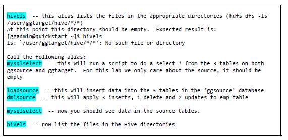

    ```
    <copy> hivels</copy>
    ```
    ```
    <copy> mysqlselect</copy>
    ```
    ```
    <copy> loadsource</copy>
    ```
    ```
    <copy> dmlsource</copy>
    ```
    ```
    <copy> mysqlselect	</copy>
    ```
    ```
    <copy> hivels</copy>
    ```
2. There should be several .avro files in the data directory, and 3 .avsc files in the schema directory. You will notice that a new directory has been created for each table in the data directory.

  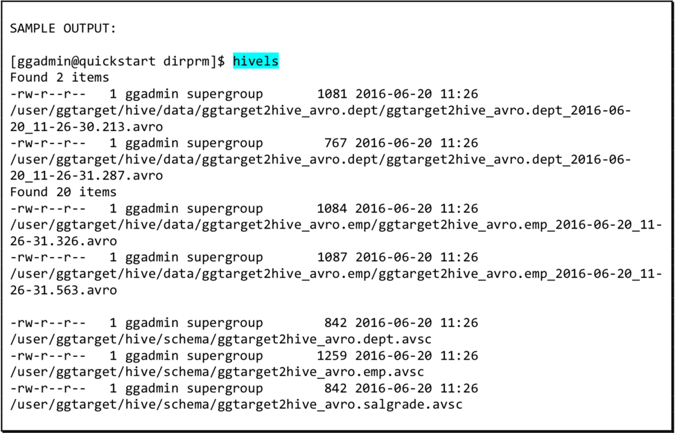

**Notes**:Starting with GG version 12.2.0.1.1, GG automatically creates the Hive tables with .avsc schema file. Let us take a look at the contents of the tables

## Task 5: GoldenGate Results using HUE

1. Open a Browser window from your local machine to visualize data from HUE frontend application.
    - URL

    ```
    <copy>http://<Your Host Public IP address>:8888</copy>
    ```

    - Credentials: cloudera/cloudera

2. Click on Query, Editor, Select Hive

  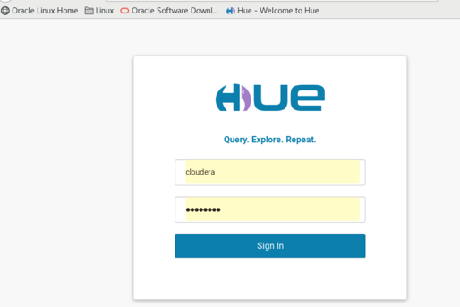

   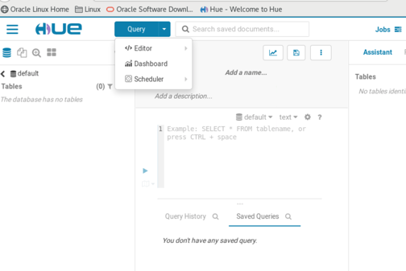
   Query, Editor, Hive

  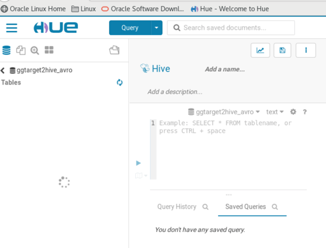

  

  **Schema:**

  **`/user/ ggtarget/ hive/ schema/ ggtarget2hive_avro.dept.avsc`**

  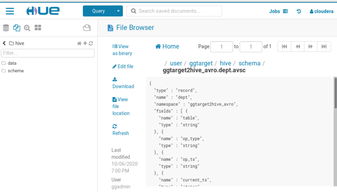

  **Data**

   **`/user/ ggtarget/ hive/ data/ ggtarget2hive_avro.dept.avsc`**

  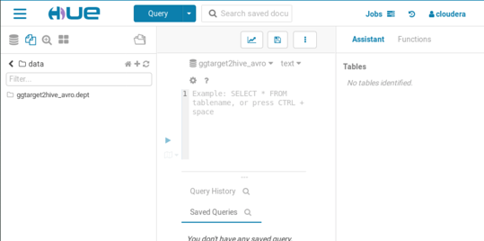

  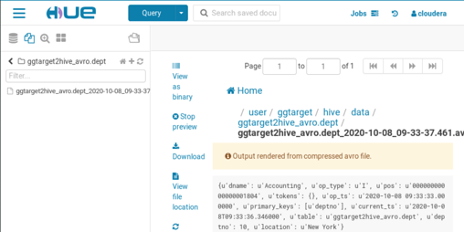

## Summary
In summary, we loaded data in MySQL database `ggsource`, GG extract process `extmysql` captured the changes from the MySQL binary logs and wrote them to the local trail file. The pump process `pmphadop` routed the data from the local trail (on the source) to the remote trail (on the target). The replicat process `rhive` read the remote trail files, created the Hive tables, wrote the data and the schema files (avsc) to the HDFS target directory for Hive: `/user/ggtarget/hive/data/*` and `/user/ggtarget/hive/schema`

You may now *proceed to the next lab*.

##  Learn More

* [Oracle GoldenGate for Big Data 19c | Oracle](https://www.oracle.com/middleware/data-integration/goldengate/big-data/)

## Acknowledgements
* **Author** - Brian Elliott, Data Integration Team, Oracle, August 2020
* **Contributors** - Meghana Banka, Rene Fontcha
* **Last Updated By/Date** - Rene Fontcha, Master Principal Solutions Architect, NA Technology, October 2020
