# MySql to Kafka via GGMA for BigData

## Introduction
This lab will demonstrate how to  ***Replicate from  mysql to kafka***.
In this lab we will load data in the MySQL database ‘ggsource’. The GG extract process ‘extmysql’ will capture the changes from MySQL’s binary logs and write them to the local trail file. The pump process ‘pmpmysql’ will route the data from the local trail (on the source) to the remote trail (on the target). The replicat process ‘repkafka’ will read the remote trail files, act as a producer and write the messages to an auto- created topic for each table in the source database.

*Estimated Workshop Time*: 60 minutes

#### Lab Architecture

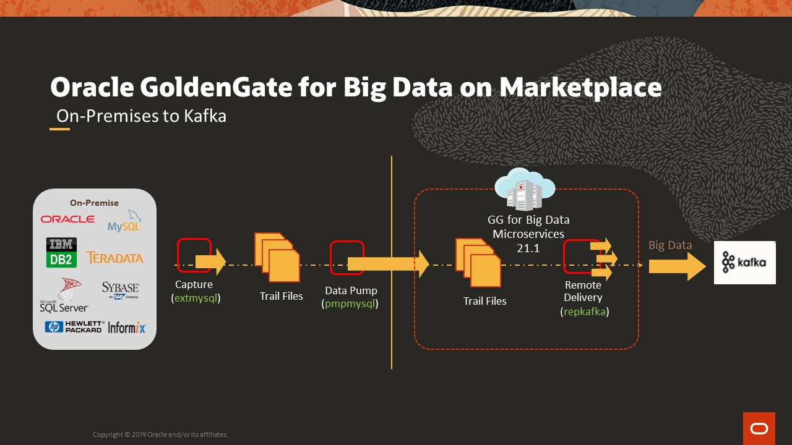

### Objectives
-  GoldenGate Microservices for BigData
-  Replicating from mysql to kafka through GGMA  

### Prerequisites
This Workshop assumes you have:
- A Free Tier, Paid or LiveLabs Oracle Cloud account
- SSH Private Key to access the host via SSH
- You have completed:
    - Lab: Generate SSH Keys
    - Lab: Prepare Setup
    - Lab: Environment Setup

## Task 0: Running your Lab
### Login to Host using SSH Key based authentication

Refer to *Lab Environment Setup* for detailed instructions relevant to your SSH client type (e.g. Putty on Windows or Native such as terminal on Mac OS:
  - Authentication OS User - “*opc*”
  - Authentication method - *SSH RSA Key*
  - OS User – “*ggadmin*”.

1. Login as “*opc*” using your SSH Private Key

2. Then sudo to “*ggadmin*”. E.g.

    ```
    <copy>sudo su - ggadmin</copy>
    ```

    

4. Select **Q** to quit the labmenu  and start the ServiceManager

    ```
    <copy>
    cd /u01/ggbd_home/bin
    ./ServiceManager
    </copy>
    ```

    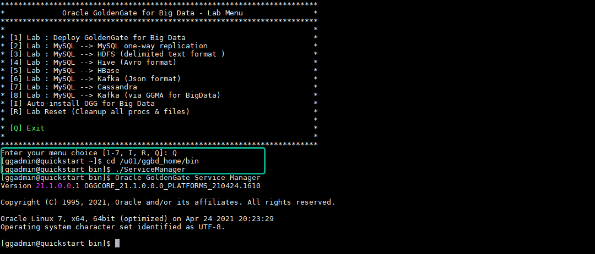

5. Press *Enter* to return to the prompt

6. Re-open the *labmenu* and reset the lab by selecting ***R*** in the option

    ```
    <copy>labmenu</copy>
    ```

    ```
    <copy>R</copy>
    ```

    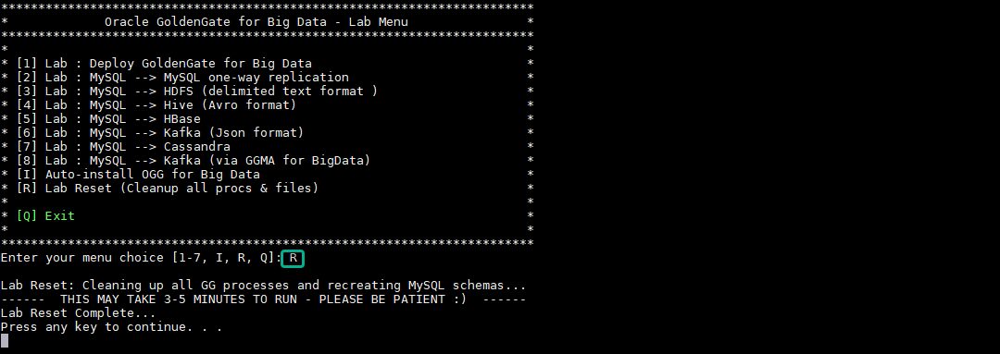


## Task 1: GoldenGate Configuration for MySQL as Source

1. Select Option **2** ,to deploy GoldenGate Configuration for MySQL(Source)

    Option ***2*** will copy all the parameter files to ***dirprm*** folder under goldengate home.

    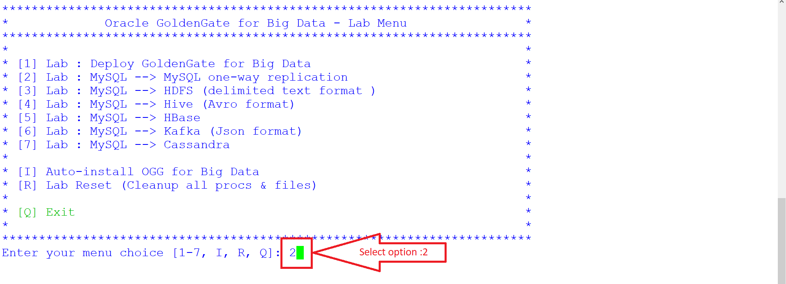

2. Once Deployment is completed. Select **Q** to quit the labmenu  and start the mananger.

    To quit the Lab Menu:

    ```
    <copy>Q</copy>
    ```
    Switch to GoldenGate command mode:

    ```
    <copy>
    cd /u01/gg4mysql
    ./ggsci

    </copy>
    ```
    To start the manager:

    ```
    <copy>start mgr</copy>
    ```

    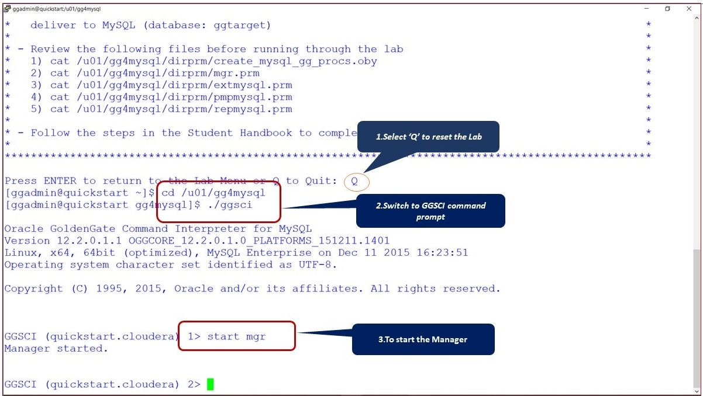

3. Execute the obey file to create the GoldenGate process.The Obey file contains all the commands to create the GoldenGate process.

    ```
    <copy>obey ./dirprm/create_mysql_gg_procs.oby</copy>
    ```
    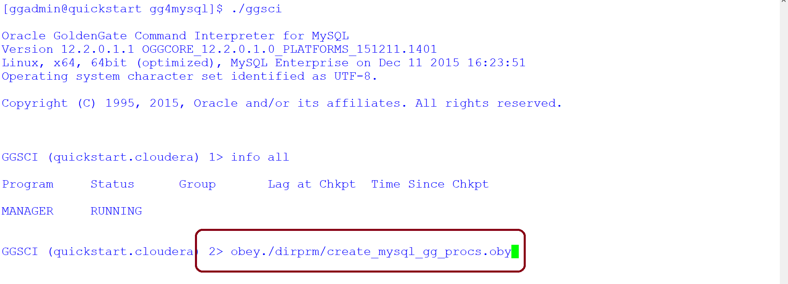

    Sample Output:

    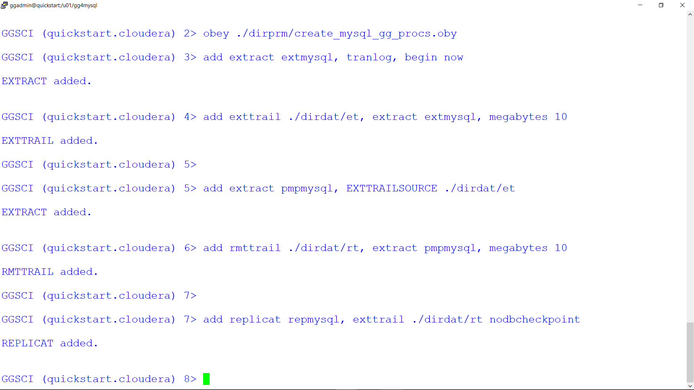

4. Start all GoldenGate processes .Start with wildcard '*' which will start all the GoldenGate processes.

    ```
    <copy>
    info all

    start *
    </copy>
    ```
    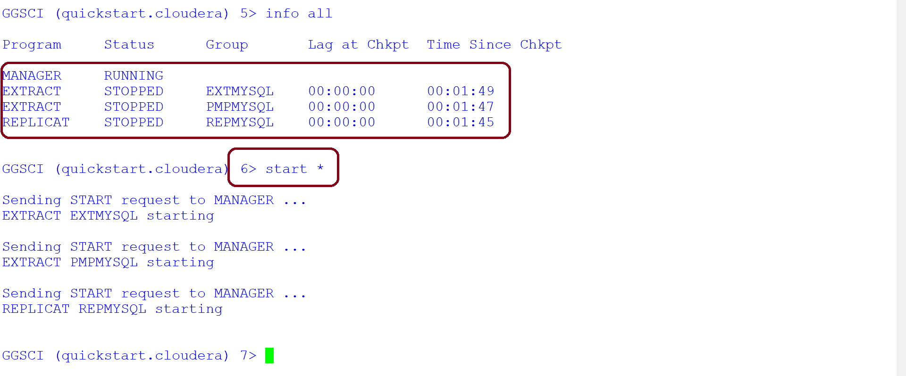

Source deployment completed!

## Task 2: GoldenGate Configuration for Kafka as Target

1. Login to GoldenGate for BigData console .

    Replace IP Address with livelab server generated IP

    ```
    <copy> http://[Public-IP Address]:16001/?root=account </copy>
    ```
Enter username as ***oggadmin***

    ```
    <copy>oggadmin</copy>
    ```
Enter Password as ***Wel_Come1***

    ```
    <copy>Wel_Come1</copy>
    ```
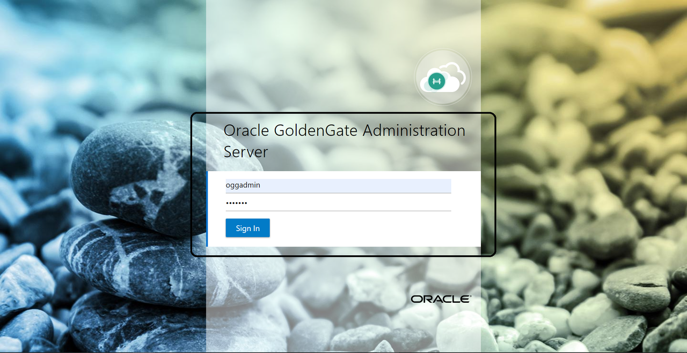

2. Click on '***+***' to create replicat process for target ***Kafka***.

    Replicat is a process that delivers data to a target database. It reads the trail file on the target database, reconstructs the DML or DDL operations, and applies them to the target database.

    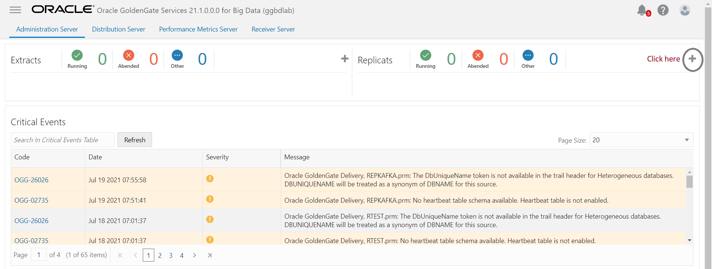

3. Click ***Next*** to navigate to **Replicat Options**.

    We are selecting ***Classic replicat*** as Replicat type for the workshop.

    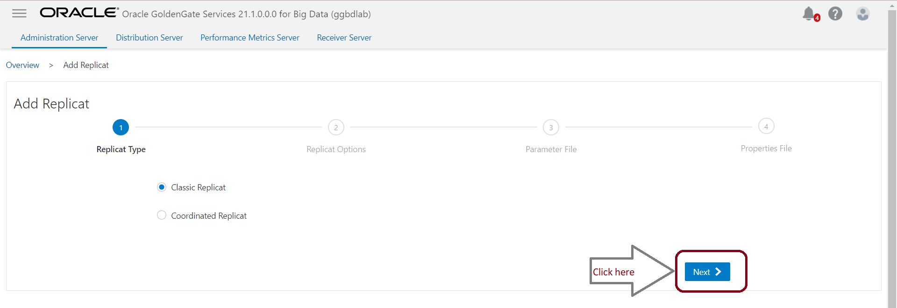

4. Enter process name as ***REPKAFKA***.Process Name ***REPKAFKA*** will  be 8 character user defined.

    ```
    <copy> REPKAFKA </copy>
    ```

    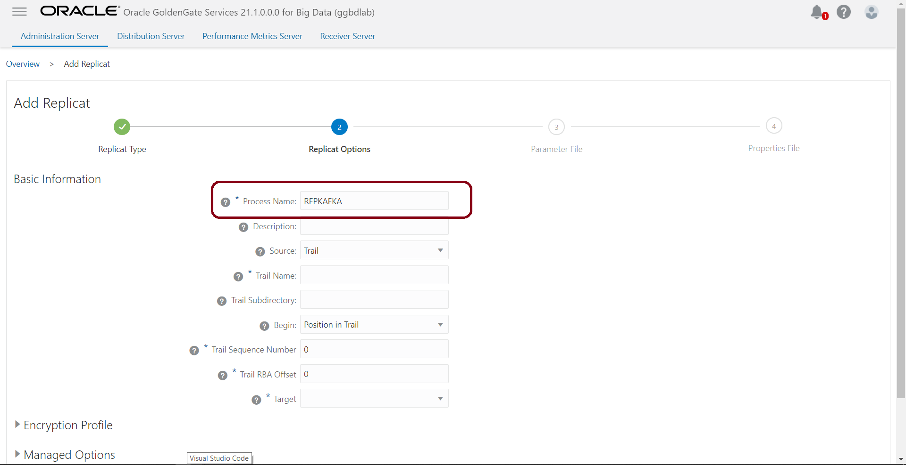

5. Update Trail Name and Trail Subdirectory as shown below.

    Trail Name ***rt*** is generated from goldengate for mysql

    Trail Name:

    ```
    <copy>rt</copy>
    ```

    Trail Subdirectory:

    ```
    <copy>/u01/gg4mysql/dirdat</copy>
    ```
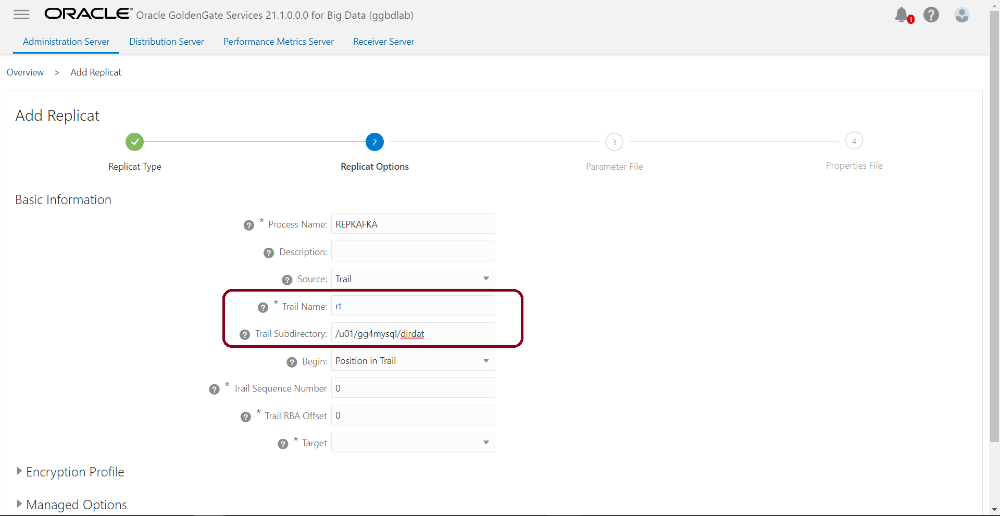

6. Choose target as ***kafka*** from the top-down menu.

    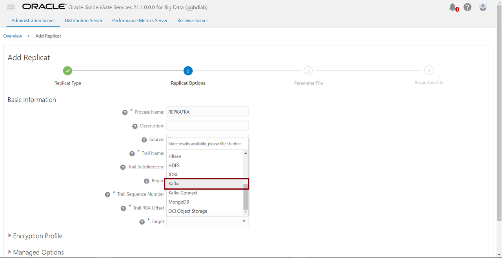

7. Click ***Next*** To navigate **parameter** tab.

    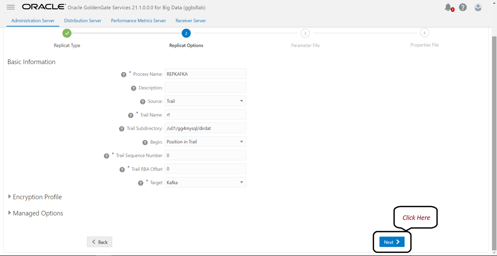


8. Review the parameter contents and mapping conditions and click ***Next***.

    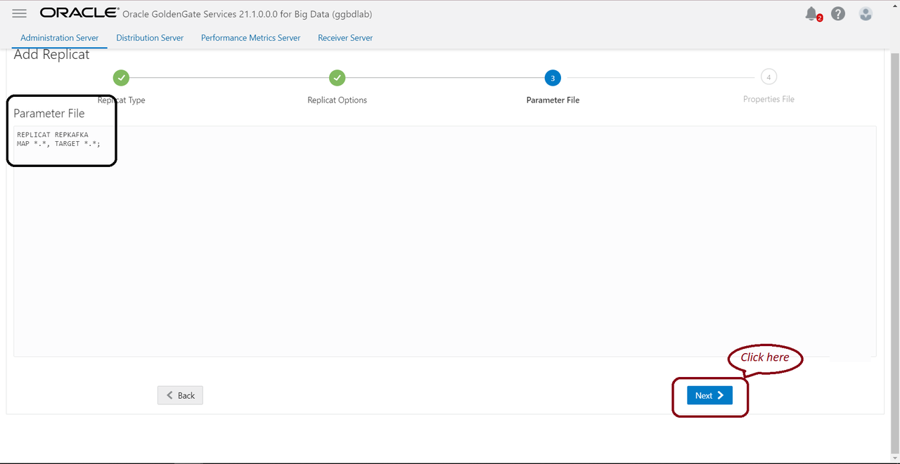

9. Replace the content of the **properties** file with a below code and click ***Create and Run***.

    ```
    <copy>
    # Properties file for Replicat rtest
    #Kafka Handler Template
    gg.handlerlist=kafkahandler
    gg.handler.kafkahandler.type=kafka
    #TODO: Set the name of the Kafka producer properties file.
    gg.handler.kafkahandler.kafkaProducerConfigFile=custom_kafka_producer.properties
    #TODO: Set the template for resolving the topic name.
    gg.handler.kafkahandler.topicMappingTemplate=${tablename}
    gg.handler.kafkahandler.keyMappingTemplate=${primaryKeys}
    gg.handler.kafkahandler.mode=op
    gg.handler.kafkahandler.format=json
    gg.handler.kafkahandler.format.metaColumnsTemplate=${objectname[table]},${optype[op_type]},${timestamp[op_ts]},${currenttimestamp[current_ts]},${position[pos]}
    #TODO: Set the location of the Kafka client libraries.
    gg.classpath=/home/ggadmin/kafka_2.13-2.8.0/libs/*
    jvm.bootoptions=-Xmx512m -Xms32m
    </copy>
    ```

    

10. The Replicat ***REPKAFKA*** creation is completed. Green check mark will show that Replicat ***REPKAFKA*** is up and running.

    

11. Load the data to source database MySql. Open a new putty session and choose ***Q*** to quit the lab menu and load the data to MySql database through command ***loadsource***.

    ```
    <copy>
    loadsource
    </copy>
    ```

    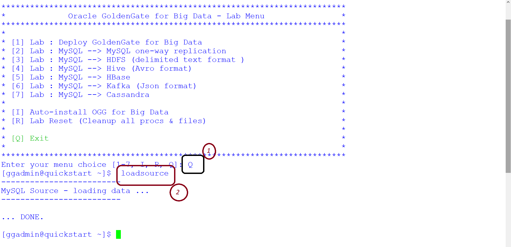

12. Validating the data replicated by ***REPKAFKA*** through **statastics**.Switch to GoldenGate for Bigdata console and click on ***Action*** to choose ***Details*** from top-down menu.

    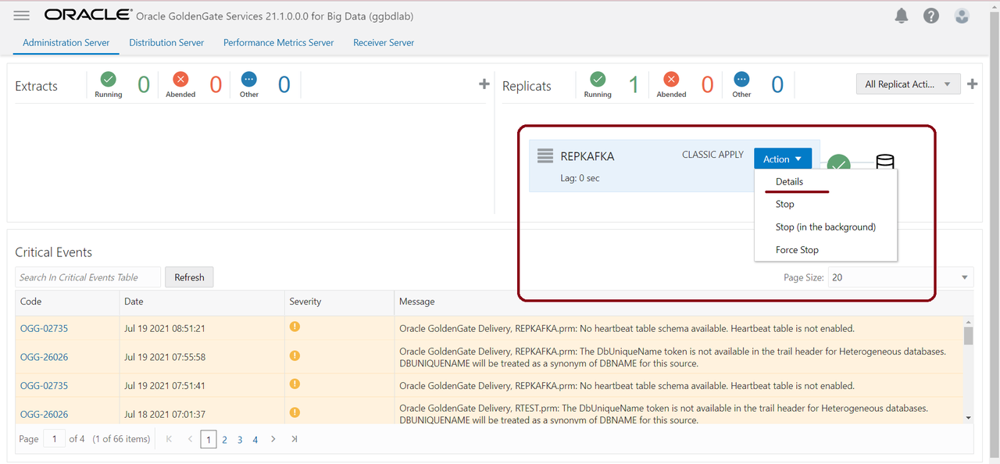

13. Click on the tab Statastics tab to view stats of the kafka message.

    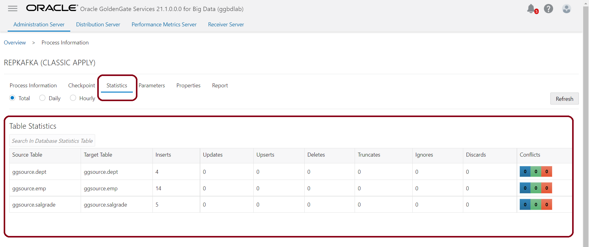

14.  Viewing the content of the ***kafka topics***

    ```
    <copy>
    consumetopic emp
    </copy>
    ```

    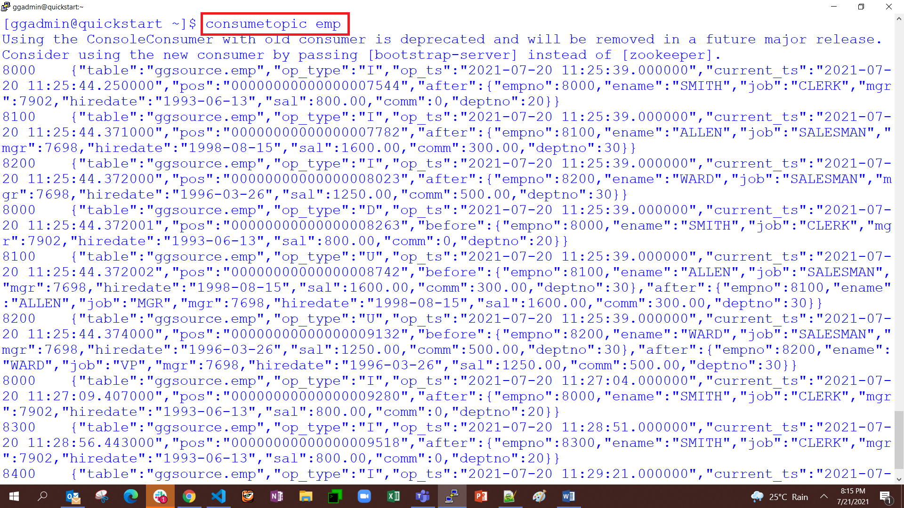

## Summary
To summarize, you loaded data in the MySQL database `‘ggsource’`.The GG extract process `‘extmysql’` captured the changes from the MySQL binary logs and wrote them to the local trail file. The pump process `‘pmpmysql’` routed the data from the local trail (on the source) to the remote trail (on the target). The replicat process `‘repkafka’` read the remote trail files, acted as a producer and wrote the messages to an auto-created topic for each table in the source database.

You may now *proceed to the next lab*

## Learn More

* [Oracle GoldenGate for Big Data 21c | Oracle](https://docs.oracle.com/en/middleware/goldengate/big-data/21.1/index.html)
* [GoldenGate Microservices Architecture 21c (MA)](https://docs.oracle.com/en/middleware/goldengate/big-data/21.1/gadbd/getting-started-oracle-goldengate-microservices-big-data.html#GUID-248D5562-397F-4D10-9E95-CE9477012950)

## Acknowledgements
* **Author** - Madhu Kumar S, Data Integration Team, Oracle, July 2021
* **Contributors** - Meghana Banka, Rene Fontcha
* **Last Updated By/Date** - Brian Elliott, Data Integration Team, Oracle, September 2021
