# MySQL to Kafka

## Introduction
In this lab we will load data in MySQL database ‘ggsource’, GG extract process ‘extmysql’ will capture the changes from MySQL’s binary logs and write them to the local trail file. The pump process ‘pmphadop’ will route the data from the local trail (on the source) to the remote trail (on the target). The replicat process ‘rkafka’ will read the remote trail files, act as a producer and write the messages to an auto- created topic for each table in the source database.

Estimated Lab Time:  60 minutes

#### Lab Architecture

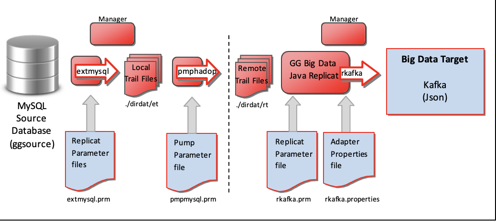


### Objectives
- GoldenGate replication from **MySQL to Kafka**

### Prerequisites
This lab assumes you have:
- A Free Tier, Paid or LiveLabs Oracle Cloud account
- SSH Private Key to access the host via SSH
- You have completed:
    - Lab: Generate SSH Keys (*Free-tier* and *Paid Tenants* only)
    - Lab: Prepare Setup (*Free-tier* and *Paid Tenants* only)
    - Lab: Environment Setup
    - Lab: Deploy GoldenGate for Big Data
    - Lab: MySQL to MySQL

## Task 0: Running your Lab
### Login to Host using SSH Key based authentication
Refer to *Lab Environment Setup* for detailed instructions relevant to your SSH client type (e.g. Putty on Windows or Native such as terminal on Mac OS):
  - Authentication OS User - “*opc*”
  - Authentication method - *SSH RSA Key*
  - OS User – “*ggadmin*”.

1. First login as “*opc*” using your SSH Private Key

2. Then sudo to “*ggadmin*”. E.g.

    ```
    <copy>sudo su - ggadmin</copy>
    ```
3. Repeat the two steps above to create a second session.
These two sessions will be used respectively for `source` and `target` execution tasks

## Task 1: Explore GoldenGate Configuration
1. In the first or `source` terminal session as user `ggadmin`, type  `labmenu` to display the labmenu IF not at the labmenu.

  

2. Select **R** to reset the lab environment, then select **6**

3. The above step will copy the GoldenGate configuration files to the GG Home directories, under ./dirprm.

4. Review the content of each of these files to explore how GoldenGate is being configured.

    ```
    <copy>view /u01/gg4mysql/dirprm/create_mysql_to_hadoop_gg_procs.oby</copy>
    ```
    ```
    <copy> cd /u01/gg4mysql/dirprm
    view /u01/gg4mysql/dirprm/mgr.prm</copy>
    ```
    ```
    <copy>view /u01/gg4mysql/dirprm/extmysql.prm</copy>
    ```
    ```
    <copy>view /u01/gg4mysql/dirprm/pmpmysql.prm</copy>
    ```
    ```
    <copy> cd /u01/gg4hadoop123010/dirprm
    view /u01/gg4hadoop123010/dirprm/create_kafka_replicat.oby</copy>
    ```
    ```
    <copy>view /u01/gg4hadoop123010/dirprm/rkafka.prm</copy>
    ```
    ```
    <copy>view /u01/gg4hadoop123010/dirprm/rkafka.properties</copy>
    ```
    ```
    <copy>view /u01/gg4hadoop123010/dirprm/custom_kafka_producer.properties</copy>
    ```
## Task 2: GoldenGate Source Configuration
1. In the first or `source` terminal session, go to the GG Home for MySQL, and start the manager process. You can either cd to the directory, or call the alias ggmysql:

    ```
    <copy>cd /u01/gg4mysql</copy>
    ```
    ```
    <copy>./ggsci</copy>
    ```
    ```
    <copy>info all</copy>	 
    ```
    ```
    <copy>start mgr</copy>		
    ```
    ```
    <copy>info all</copy>
    ```

  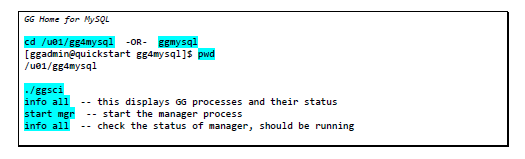

 2. In the second or `target` terminal session, go to the GG Home for Hadoop, and start the manager process. You can cd to the directory:

    ```
    <copy>cd /u01/gg4hadoop123010</copy>
    ```
    ```
    <copy>./ggsci</copy>
    ```
    ```
    <copy>info all</copy>
    ```
    ```
    <copy>start mgr</copy>		
    ```
    ```
    <copy>info all</copy>
    ```
    ```
    <copy>exit</copy>
    ```

  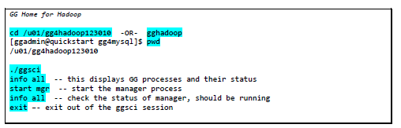

3. Now switch back to the first or `source` terminal session (GG for MySQL) to create and start the GG extract process:

    ```
    <copy>./ggsci</copy>
    ```
    ```
    <copy>obey ./dirprm/create_mysql_to_hadoop_gg_procs.oby</copy>
    ```
    ```
    <copy>info all</copy>
    ```
    ```
    <copy>start extmysql</copy>
    ```
    ```
    <copy>info all</copy>
    ```
    ```
    <copy>start pmphadop</copy>
    ```
    **or use start ALL **
    ```
    <copy>start *</copy>
    ```
    ```
    <copy>info all</copy>
    ```

  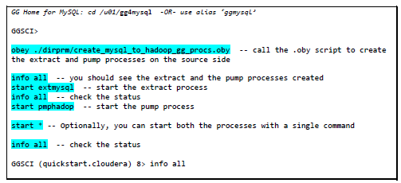
  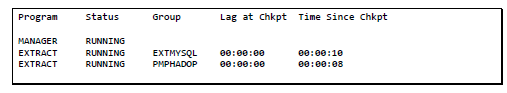

## Task 3: GoldenGate Target Configuration
Now that the source side is setup, let’s configure GG on the target side (Kafka).

1. In the second or `target` terminal session (GG for Hadoop), you’ll need to modify the Kafka properties by removing the ‘---‘ from the highlighted values:

  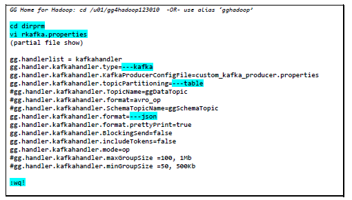

    ```
    <copy>cd /u01/gg4hadoop123010/dirprm

    vi rkafka.properties</copy>
    ```

2. Remove "--" from the 3 items below as highlighted above

    ```
    ---kafka
    ---table
    ---json
    ```

3. Now create the Kafka replicat process:

  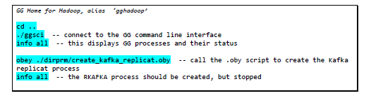

    ```
    <copy>cd .. </copy>
    ```
    ```
    <copy>./ggsci</copy>
    ```
    ```
    <copy>start mgr</copy>
    ```
    ```
    <copy>info all</copy>
    ```
    ```
    <copy>obey ./dirprm/create_kafka_replicat.oby</copy>
    ```
    ```
    <copy>info all</copy>

    ```
**Notes:** Before we start the GG Kafka replicat process, we need to start the Kafka Broker.

4. Start a new terminal session, sudo to `ggadmin`, then click **Q** to get to a prompt:

    ```
    <copy>sudo su - ggadmin</copy>
    ```
    ```
    <copy>startkafkabroker</copy>
    ```

    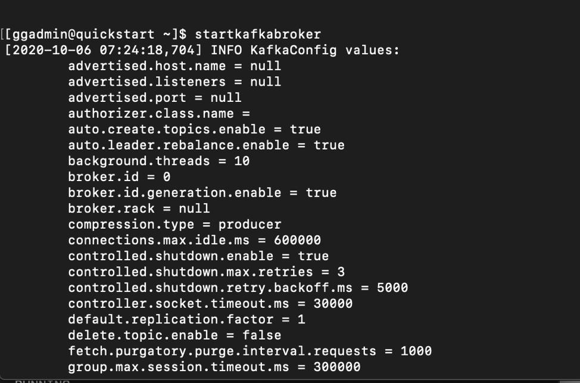

## Task 4: GoldenGate Replication to Kafka

1. Now that GG processes have been created and the Kafka Broker has been started, let’s start the GG replicat for Kafka. Go back to the GG Home for Hadoop ggsci session:

  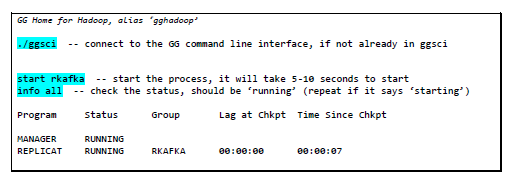

    ```
    <copy>./ggsci</copy>
    ```
    ```
    <copy>start rkafka</copy>
    ```
    ```
    <copy>info all</copy>
    ```
2. Now go back to the previous session, where you ran `showtopics`; we will load some data on the MySQL database `ggsource` and GG will extract and write it to the Kafka topics.

  

    ```
    <copy>loadsource</copy>
    ```
    ```
    <copy>mysqlselect</copy>
    ```
    ```
    <copy>showtopics</copy>
    ```
    ```
    <copy>consumetopic gg2kafka_json.dept</copy>

    ```


3. Also take a look at the Kafka schema files created by GG, it’s created in the ./dirdef directory in the GG Home for Hadoop:

  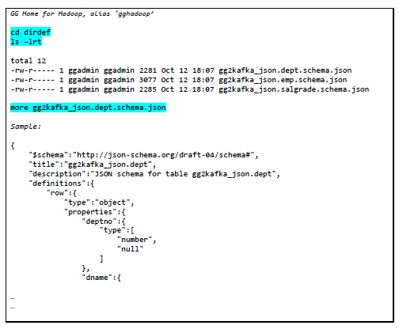

    ```
    <copy>cd /u01/gg4hadoop123010/dirdef
    ls -lrt
    more gg2kafka_json.dept.schema.json</copy>
    ```

4. Next we will apply more DML to the source, then we will consume the emp topic, and see the additional data get appended to the topic. Run this from another session, since the consumetopic command runs in the foreground, and outputs the results. Start a new terminal session, sudo to `ggadmin`, then click **Q** to get to a prompt:

  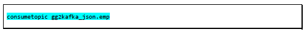

    ```
    <copy>sudo su - ggadmin</copy>
    ```
    ```
    <copy>consumetopic gg2kafka_json.emp</copy>
    ```
5. Now go back to the previous session, and run the DML script:

  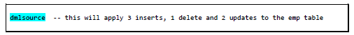

    ```
    <copy>dmlsource</copy>
    ```

6. Now go back to the session running `consumetopic gg2kafka_json.emp`, you should see the new messages written to the emp topics. Scroll up to see **op-type** **U** or **D**. For Updates, GG will write the before and after image of the operation

  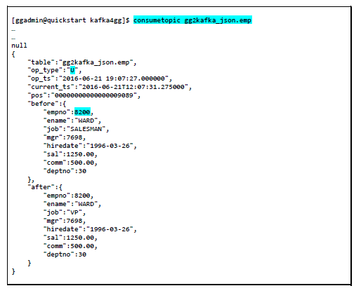

    ```
    <copy>consumetopic gg2kafka_json.emp</copy>
    ```

7. Let’s confirm that GG replicated the data that it captured. In the GG for Hadoop home

  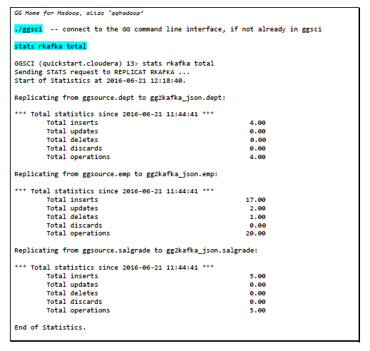

    ```
    <copy>stats rkafka total</copy>
    ```

## Summary
In summary, you loaded data in MySQL database `‘ggsource’`, GG extract process `‘extmysql’` captured the changes from the MySQL binary logs and wrote them to the local trail file. The pump process `‘pmphadop’` routed the data from the local trail (on the source) to the remote trail (on the target). The replicat process `‘rkafka’` read the remote trail files, acted as a producer and wrote the messages to an auto-created topic for each table in the source database.

You may now *proceed to the next lab*.

## Learn More

* [Oracle GoldenGate for Big Data 19c | Oracle](https://www.oracle.com/middleware/data-integration/goldengate/big-data/)

## Acknowledgements
* **Author** - Brian Elliott, Data Integration Team, Oracle, August 2020
* **Contributors** - Meghana Banka, Rene Fontcha
* **Last Updated By/Date** - Rene Fontcha, Master Principal Solutions Architect, NA Technology, October 2020
