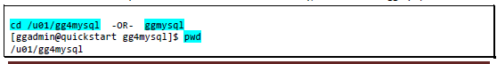
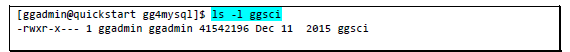
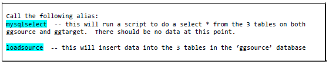
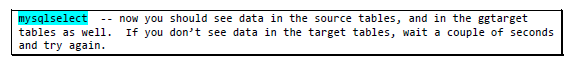
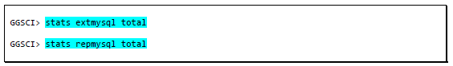
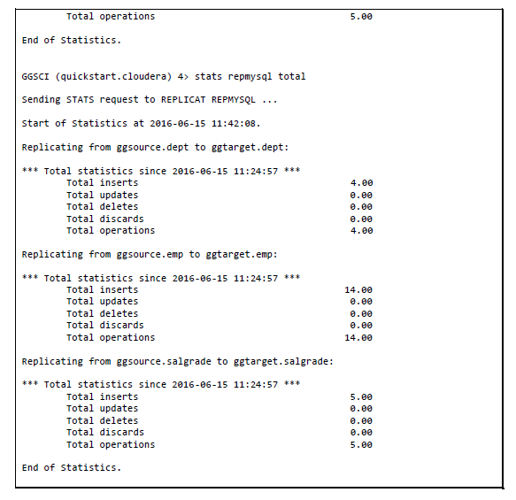

#  MySQL to MySQL - Unidirectional Replication

## Introduction

This lab is intended to give you familiarity with how to configure GG for database to database replication. If you are already familiar with GG, you can choose to skip this lab.

In this lab we will load data in MySQL database `ggsource`. The GG extract process `extmysql` will capture the changes from MySQL’s binary logs and write them to the local trail file. The pump process `pmpmysql` will route the data from the local trail (on the source) to the remote trail (on the target). The replicat process `repmysql` will read the remote trail files, and apply the changes to the MySQL database `ggtarget`

*Estimated Lab Time*:  30 minutes

#### Lab Architecture
 

### Objectives
- Explore replication from relational source to a relational target using GoldenGate

### Prerequisites
This lab assumes you have:
- A Free Tier, Paid or LiveLabs Oracle Cloud account
- SSH Private Key to access the host via SSH
- You have completed:
    - Lab: Generate SSH Keys (*Free-tier* and *Paid Tenants* only)
    - Lab: Prepare Setup (*Free-tier* and *Paid Tenants* only)
    - Lab: Environment Setup
    - Lab: Deploy GoldenGate for Big Data

## Task 0: Running your Lab
### Login to Host using SSH Key based authentication
Refer to *Lab Environment Setup* for detailed instructions relevant to your SSH client type (e.g. Putty on Windows or Native such as terminal on Mac OS):
  - Authentication OS User - “*opc*”
  - Authentication method - *SSH RSA Key*
  - OS User – “*ggadmin*”.

1. First login as “*opc*” using your SSH Private Key

2. Then sudo to “*ggadmin*”. E.g.

    ```
    <copy>sudo su - ggadmin</copy>
    ```

## Task 1: Explore GoldenGate Configuration
1. At the terminal prompt as user `ggadmin`, type  `labmenu` to display the labmenu IF not at the labmenu.

  

2. Select Option **2**

3. Review the overview notes on the following screen, then select **Q** to quit. These online notes have been provided so you can cut/paste file names to another session, to avoid typos.

4. Review the content of each of these files to explore how GoldenGate is being configured.

    ```
    <copy>cd /u01/gg4mysql/dirprm</copy>
    ```
    ```
    <copy>view /u01/gg4mysql/dirprm/create_mysql_gg_procs.oby</copy>
    ```
    ```
    <copy>view /u01/gg4mysql/dirprm/mgr.prm</copy>
    ```
    ```
    <copy>view /u01/gg4mysql/dirprm/extmysql.prm</copy>
    ```
    ```
    <copy>view /u01/gg4mysql/dirprm/pmpmysql.prm</copy>
    ```
    ```
    <copy>view /u01/gg4mysql/dirprm/repmysql.prm</copy>
    ```
    **:q!** to exit viewing

5. Go to the GG Home for MySQL by typing *ggmysql*

    ```
    <copy>ggmysql</copy>
    ```

    or

    ```
    <copy> cd /u01/gg4mysql</copy>
    ```
## Task 2: Start GoldenGate Processes

1. Go to the GG Home for MySQL. You can cd to the directory:

  
  

    ```
    <copy> cd /u01/gg4mysql
    ls -l ggsci</copy>
    ```

2. Login to ggsci (GG command line interface), to create and start the GG extract, pump and replicat
processes:

  

    ```  
    <copy>./ggsci</copy>
    ```
    ```
    <copy> info all</copy>
    ```
    ```
    <copy> start mgr</copy>
    ```
    ```
    <copy> info all</copy>
    ```
    ```
    <copy>obey ./dirprm/create_mysql_gg_procs.oby</copy>
    ```
    ```
    <copy> start extmysql</copy>
    ```
    ```
    <copy>info all</copy>
    ```
    ```
    <copy>start pmpmysql</copy>
    ```
    ```
    <copy>info all</copy>
    ```
    ```
    <copy>start repmysql</copy>
    ```

    ```
    <copy>info all</copy>
    ```
## Task 3: Load Data into Source Database

Now that the GoldenGate extract, pump and replicat processes are running, next you will run a script to load data into the ggsource MySQL database.

1. Start a new session as `ggadmin`.

    ```
    <copy>sudo su – ggadmin</copy>
    ```
2. Select  **Q**  to exit out of the LabMenu

3. Execute the following commands. We’ve provided aliases to avoid errors, and focus on GoldenGate, rather than MySQL or Hadoop commands.

   
   

    ```
    <copy>mysqlselect</copy>
    ```
    ```
    <copy>loadsource</copy>
    ```
    ```
    <copy>mysqlselect</copy>
    ```

4. At this point GoldenGate should have replicated all the data from database ggsource to database ggtarget, for all 3 tables. The rows should match. Let’s confirm that from within GoldenGate.

5. Go back to the session where you have ./ggsci running, and execute the following commands to see what data GG has processed.

    

    ```
    <copy>stats extmysql total</copy>
    ```
    ```
    <copy> stats repmysql total</copy>
    ```

6.  The stats command displays the statistics of the data that GoldenGate processed (grouped by insert/update/deletes). Counts should match between source and target.

  
  

## Summary
In summary, we loaded data in MySQL database `ggsource`, GG extract process `extmysql` captured the changes from the MySQL binary logs and wrote them to the local GG trail file. The pump process `pmpmysql` routed the data from the local trail (on the source) to the remote trail (on the target). The replicat process `repmysql` read the remote trail files, and applied the changes to the MySQL database `ggtarget`.

You may now *proceed to the next lab*

## Learn More

* [Oracle GoldenGate for Big Data 19c | Oracle](https://www.oracle.com/middleware/data-integration/goldengate/big-data/)

## Acknowledgements
* **Author** - Brian Elliott, Data Integration Team, Oracle, August 2020
* **Contributors** - Meghana Banka, Rene Fontcha
* **Last Updated By/Date** - Rene Fontcha, Master Principal Solutions Architect, NA Technology, October 2020
