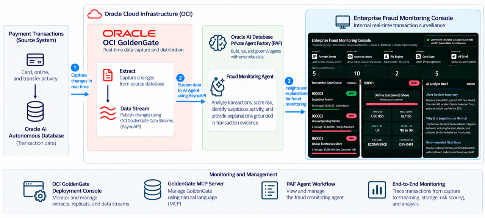

# Real-Time AI Fraud Monitoring with OCI GoldenGate and Oracle AI Database Private Agent Factory

## Introduction

### About this Workshop

Fraud operations need timely payment information and explanations grounded in transaction evidence. This workshop guides you through how to capture data in real-time with Oracle Cloud Infrastructure (OCI) GoldenGate and its Model Context Protocol (MCP) server, capture changed data from an Oracle AI Autonomous Database, and run AI Agents in Oracle AI Database Private Agent Factory (PAF) to build a fraud monitoring solution on OCI.

Estimated Workshop Time: 60-90 minutes.

### Architecture

The lab environment uses Oracle AI Autonomous Database as the payment transaction source, OCI GoldenGate for real-time capture and streaming, Oracle AI Database Private Agent Factory for fraud analysis, and the Enterprise Fraud Monitoring Console for end-to-end monitoring.

### About Oracle Cloud Infrastructure GoldenGate

Oracle Cloud Infrastructure (OCI) GoldenGate is a fully managed, native cloud service that moves data in real-time, at scale. OCI GoldenGate processes data as it moves from one or more data management systems to target databases. You can also design, run, orchestrate, and monitor data replication, verify data, transform data, and analyze streaming data in real time without having to allocate or manage any compute environments.

### About Oracle AI Database Private Agent Factory

Oracle AI Database Private Agent Factory (PAF) is a deployable platform for building, testing, governing, and operating AI agents across Oracle Databases, enterprise content, APIs, and approved model providers.

Built for AI platform teams, database teams, security teams, AI centers of excellence, and business units that need private agents in production.

### Objectives

In this workshop, you will:

- Log into the assigned workshop environment
- Review the pre-built OCI GoldenGate deployment and its source connection to Oracle Autonomous AI Database
- Use the GoldenGate MCP server to create and start a change data capture process
- Create an OCI GoldenGate Data Stream to distribute data to AI Agents using AsyncAPI
- Generate payment data in the source Oracle AI Autonomous Database
- Use the Enterprise Fraud Monitoring Console to trace a new transaction through capture, streaming, storage, risk scoring, and analysis
- Monitor OCI GoldenGate using the Deployment Console, and GoldenGate MCP operations
- Review the prepared AI Agents workflows in Oracle AI Database Private Agent Factory

### Prerequisites

- Experience with Oracle AI Database
- Familiarity with Oracle GoldenGate is helpful, but not required
- Familiarity with Oracle AI Database Private Agent Factory is helpful, but not required
- Familiarity with Oracle Cloud Infrastructure is helpful, but not required
- An Oracle Cloud Account - Please view this workshop's LiveLabs landing page to see which environments are supported

## Acknowledgements

- **Author** - Shrinidhi Kulkarni
- **Contributors** - Julien Testut, Denis Gray
- **Team** - OCI GoldenGate Product Management
