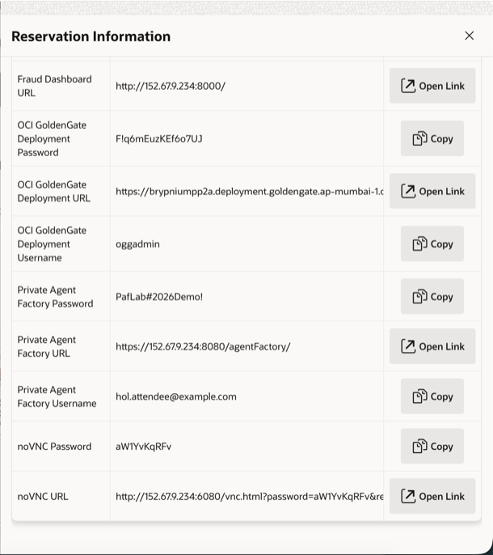
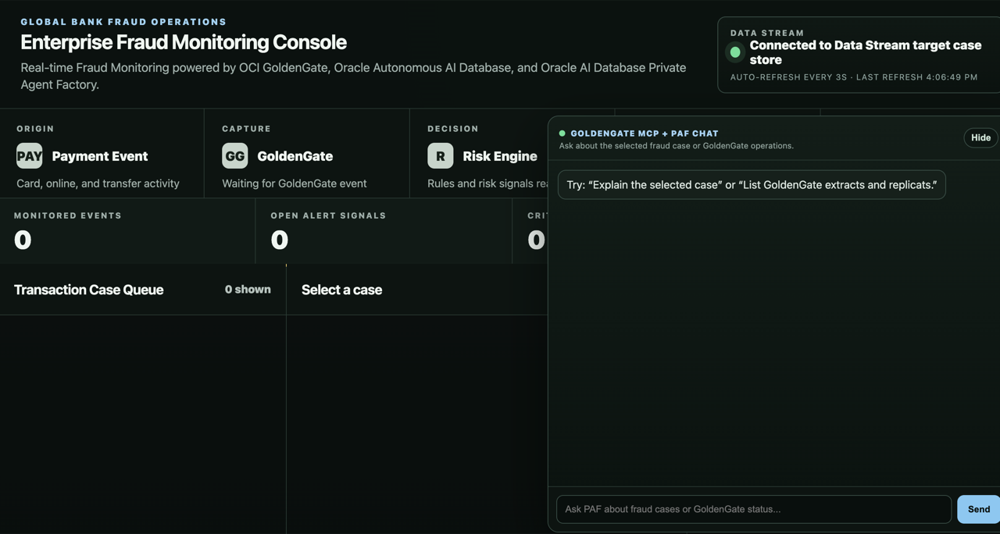
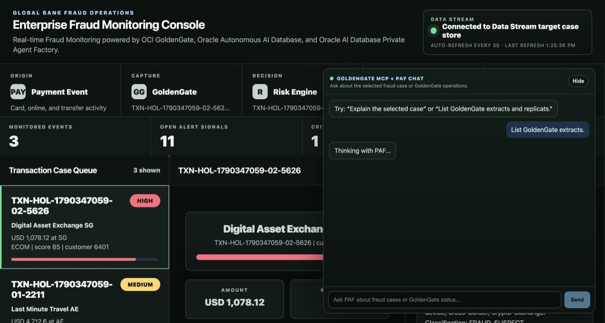
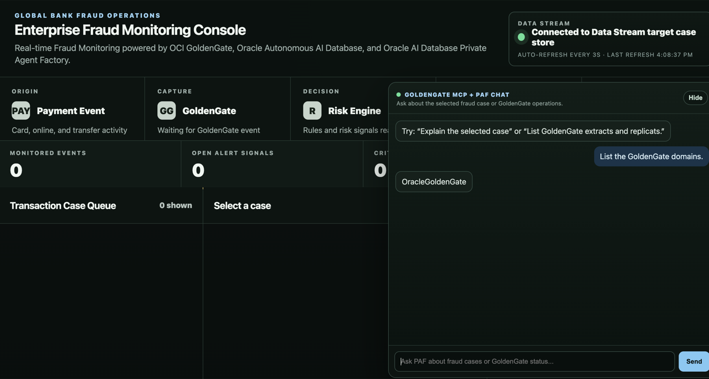
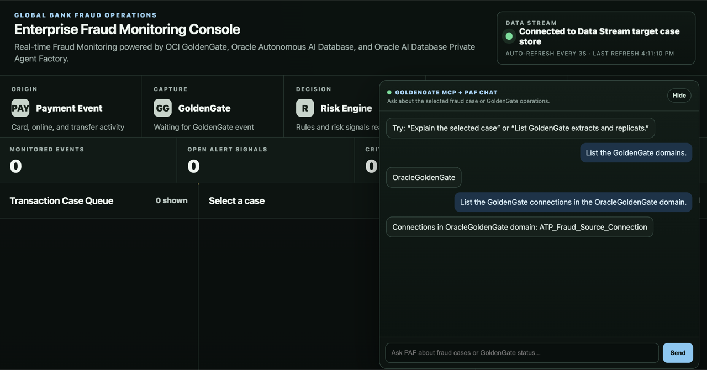
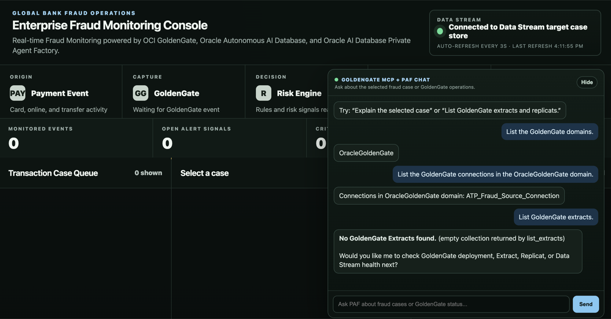
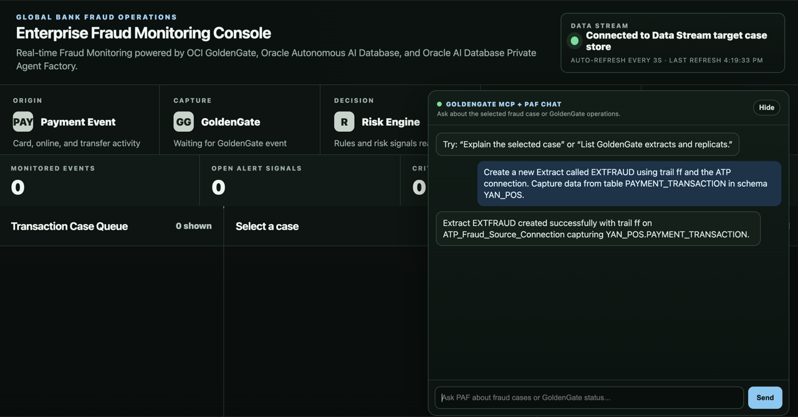
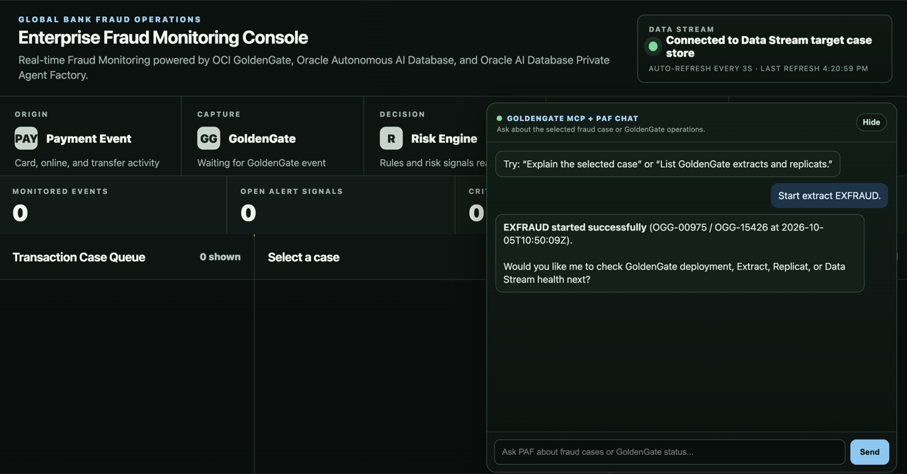
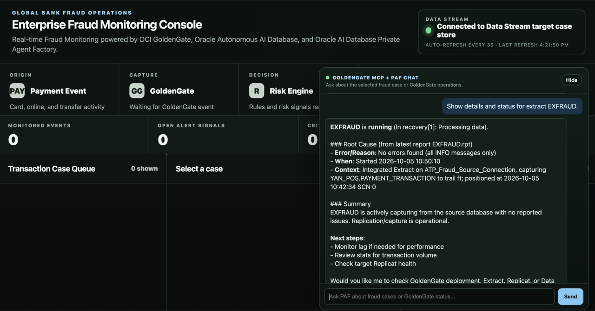

# Lab 2: Create and start the GoldenGate Extract process

## Introduction

In this lab, you use the GoldenGate Model Context Protocol (MCP) server to create and start the `EXFRAUD` Extract to capture data in real-time from the payment table stored in Oracle AI Autonomous Database. 

Estimated time: 15 minutes.

### About the Extract process

An Extract is a process that extracts, or captures, data from a source database.

### About the GoldenGate MCP Server

The GoldenGate MCP server provides tools to interact with Oracle GoldenGate deployments through the GoldenGate Administration REST APIs. It includes tools for administration, process lifecycle management, and operational monitoring. It enables end-to-end, AI agent-driven operational workflows.

### Objectives

In this lab, you learn to:

- Use the GoldenGate MCP server
- Add and run an Extract
- Verify the Extract configuration and status

### Prerequisites

- This lab assumes that you completed all preceding labs
- The OCI GoldenGate deployment is in the **Active** state
- The dashboard chat and its GoldenGate MCP operations flow are available

## Task 1: Connect to the Enterprise Fraud Monitoring Console

1. Find the Fraud Dashboard URL on the __LiveLabs Sandbox login page__.
    


2. Open the link or copy and paste it in your laptop browser and connect to the **Enterprise Fraud Monitoring Console**.

3. Click **Show** to maximize the **GoldenGate MCP + PAF Chat** panel if you minimized it previously.
    


   The chat panel is where you submit GoldenGate MCP requests throughout this lab.

    

**NOTE**: Wait a minute or so and run the same command again if you run into an error containing the following message `Compartment quota max-on-demand-chat-request-per-minute-count is exceeded`.

## Task 2: Discover the source connection

1. In the **GoldenGate MCP + PAF Chat** panel, submit the following request to list the available GoldenGate domains.

    ```text
    List the GoldenGate domains.
    ```

    Confirm that the response includes the `OracleGoldenGate` domain. You will use this domain for the source connection discovery request.

    

2. Submit the following request to list connections in the `OracleGoldenGate` domain.

    ```text
    List the GoldenGate connections in the OracleGoldenGate domain.
    ```

3. Confirm that the response includes the source connection. The expected connection name is:

    ```text
    ATP_Fraud_Source_Connection
    ```

   This connection points GoldenGate to the Oracle AI Autonomous Database that stores the payment transaction source table.

    

## Task 3: Create the Extract

1. In the **GoldenGate MCP + PAF Chat** panel, submit the following request.

    ```text
    List GoldenGate extracts.
    ```

    

    In a brand new environment, it should return `No GoldenGate Extracts are configured.`

2. Create the Extract using the following prompt.

    ```text
    Create a new Extract called EXFRAUD using trail ft and the ATP connection. Capture data from table PAYMENT_TRANSACTION in schema YAN_POS.
    ```

    

    The response should confirm that Extract `EXFRAUD` was created. If the operations flow asks for confirmation, missing table details, or connection details, provide the values shown in the prompt and continue.

    Wait until the Extract ``EXFRAUD`` is created successfully before issuing another request. If the operations flow requests confirmation or missing parameters, provide them for this Extract.

## Task 4: Start and monitor the Extract

1. In the **GoldenGate MCP + PAF Chat** panel, submit the following request to start the Extract.

    ```text
    Start extract EXFRAUD.
    ```

    

2. Verify its details and status.

    ```text
    Show details and status for extract EXFRAUD.
    ```

    

    The Extract should be started successfully. The status should be `RUNNING`.

    Confirm that the configured trail is `ft` and that the table statement refers to `YAN_POS.PAYMENT_TRANSACTION`.

    These values confirm that `EXFRAUD` is capturing the payment transaction source table and writing captured changes to trail `ft`, which is used by the Data Stream in the next lab.

    If the Extract stops or abends, submit `Show extract report for EXFRAUD.` and review the actual error before restarting.

3. Go back to the OCI GoldenGate deployment in the OCI Console, click **Launch Console**.

4. If prompted, enter the username and password found on the __LiveLabs Sandbox login page__, then click **Sign In**.

5. Click **Extracts** then click **EXFRAUD**.

6. Click **Parameters** to review the Extract configuration created using the GoldenGate MCP server.

You may now __proceed to the next lab__.

## Acknowledgements

- **Author** - Shrinidhi Kulkarni
- **Contributors** - Julien Testut, Denis Gray
- **Team** - OCI GoldenGate Product Management
