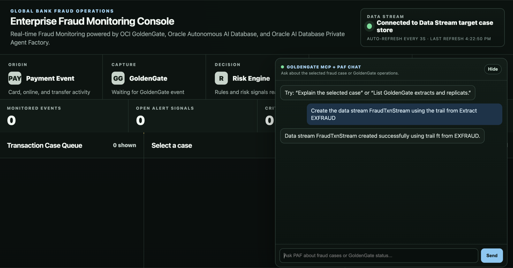
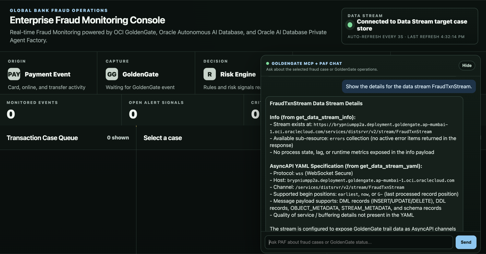
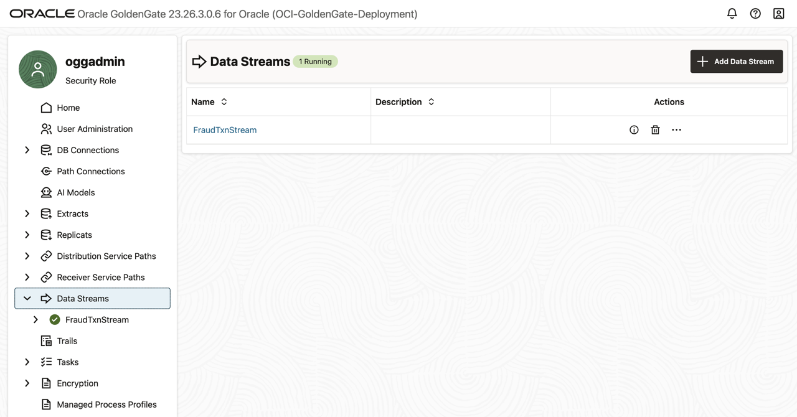
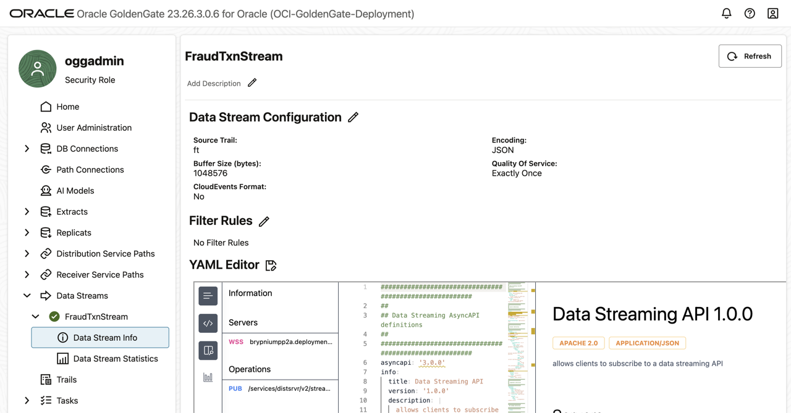

# Lab 3: Create the GoldenGate Data Stream process

## Introduction

This lab walks you through the steps to create a GoldenGate Data Stream to distribute changed data using AsyncAPI and the WebSocket Secure (WSS) protocol.

Estimated time: 10 minutes.

### About GoldenGate Data Stream

Oracle GoldenGate Data Streams utilizes the AsyncAPI specification for defining asynchronous APIs. This approach enables applications to efficiently subscribe to data streams using a Publish and Subscribe model.

### Objectives

In this lab, you will:

- Create a Data Stream
- Review the Data Stream details

### Prerequisites

- This lab assumes that you completed all preceding labs
- The Extract `EXFRAUD` is running
- The dashboard chat and its GoldenGate MCP operations flow are available

## Task 1: Create the Data Stream

1. In the **GoldenGate MCP + PAF Chat** panel, type the following and click Send.

    ```text
    Create the data stream FraudTxnStream using the trail from Extract EXFRAUD
    ```

    

    - The Data Stream uses the trail generated by Extract `EXFRAUD`. This connects the captured source database changes to the downstream fraud monitoring bridge.

    - Wait until the Data Stream is created successfully before issuing another request. If the operations flow requests confirmation or missing parameters, provide them for this Data Stream.

    **NOTE**: Wait a minute or so and run the same command again if you run into an error containing the following message `Compartment quota max-on-demand-chat-request-per-minute-count is exceeded`.

2. Check on the status and details of the Data Stream using the following prompt.

    ```text
    Show the details for the data stream FraudTxnStream.
    ```

    Review the summary and confirm that `FraudTxnStream` exists and is associated with the trail from `EXFRAUD`.

3. For additional detail, request the stream YAML when the operations flow supports it:

    ```text
    Show the YAML for GoldenGate data stream FraudTxnStream.
    ```

    

    In the YAML output, look for the stream name, source trail, and AsyncAPI/WebSocket details. These confirm that GoldenGate can publish changes from the Extract trail to downstream consumers.

## Task 2: Review the Data Stream in the OCI GoldenGate Console

1. Go back to the OCI GoldenGate Console. 

    **NOTE**: If needed, open the deployment details in the OCI Console and click **Launch Console**. If prompted, enter the username and password found on the __LiveLabs Sandbox login page__, then click **Sign In**

2. Click **Data Streams** to review the list of Data Streams.
    


3. Click **FraudTxnStream** and review the Data Stream details including its YAML definition and statistics.
    


You may now __proceed to the next lab__.

## Acknowledgements

- **Author** - Shrinidhi Kulkarni
- **Contributors** - Julien Testut, Denis Gray
- **Team** - OCI GoldenGate Product Management
