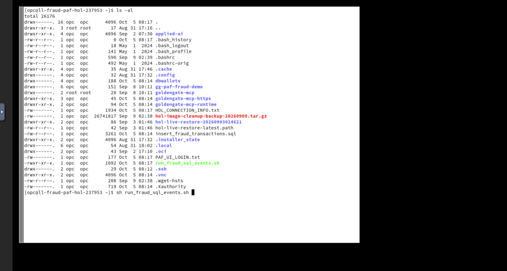
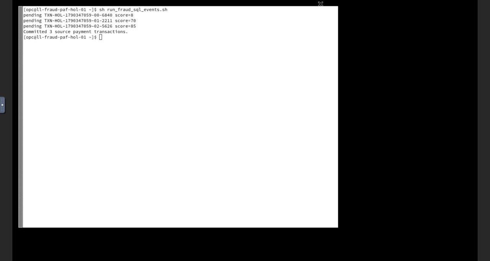
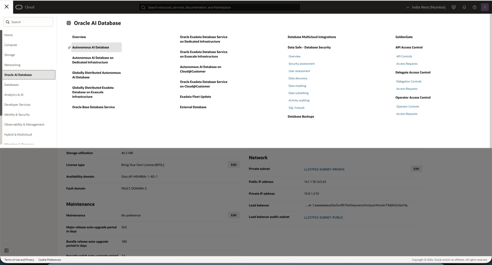
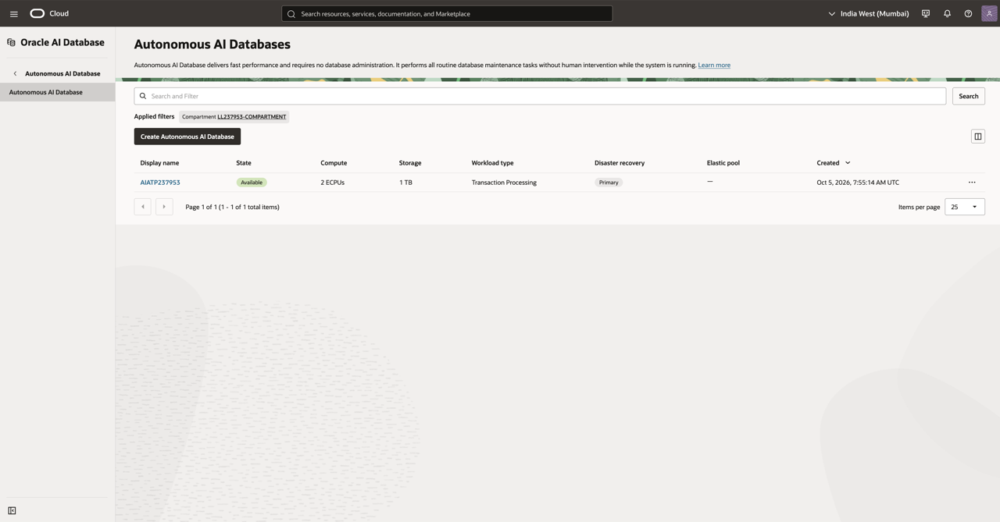
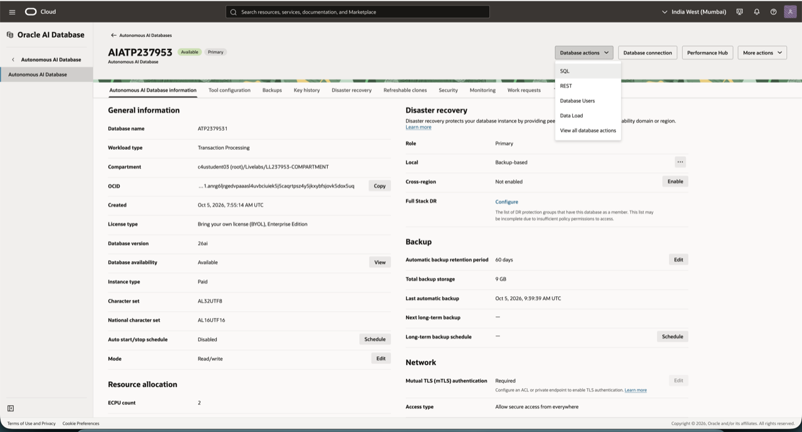
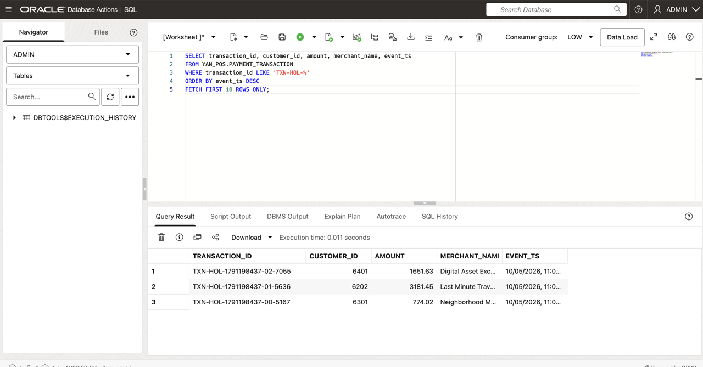

# Lab 4: Generate source payment transactions

## Introduction

In this lab, you create payment records in the source Oracle Autonomous AI Database. The Extract `EXFRAUD` captures the committed changes, and the Data Stream `FraudTxnStream` delivers the data to the AI Agent.

Estimated time: 10 minutes.

### Objectives

In this lab, you will:

- Insert source payment transactions with the supplied script.
- Record their transaction IDs for end-to-end verification.
- Verify that the source records were committed.

### Prerequisites

- This lab assumes that you completed all preceding labs
- The Extract `EXFRAUD` and Data Stream `FraudTxnStream` are running.

## Task 1: Perform inserts to the source database

1. Access the **Enterprise Fraud Monitoring** backend.
    - Find the noVNC URL on the __LiveLabs Sandbox login page__.
    - Copy and paste it in your laptop browser to access the Compute instance.

2. The noVNC session opens up and shows the Terminal. Type the following command and press Enter:

    ```bash
    sh run_fraud_sql_events.sh
    ```

    

    The script inserts demonstration payment transactions into `YAN_POS.PAYMENT_TRANSACTION`. Successful output should include generated transaction IDs that begin with `TXN-HOL-`.

3. Wait for the command to complete.
4. Record the generated transaction IDs. In this workshop, they are expected to begin with `TXN-HOL-`.

   The following image shows a successful script run from the lab compute instance. Your transaction IDs will differ.

    

## Task 2: Verify the source records

1. Return to the Oracle Cloud console and use the navigation menu to navigate back to **Oracle AI Database**, **Autonomous AI Database**, and click **AIATP&lt;LiveLab ID&gt;**. Ensure that the correct Compartment is selected in **Applied filters**.
    

    


    __NOTE__: If you're using the LiveLab Sandbox environment, you can find your compartment number in the Reservation Information panel (View Login Info) of the workshop instructions.

2. On the **AIATP&lt;LiveLab ID&gt;** Details page, click **Database actions**, and then select **SQL**.
    


    **NOTE**: Use the **AIATP&lt;LiveLab ID&gt;** database credentials in the Workshop details to log in to Database actions if needed, and then click **SQL**.

3. Enter the following select statement, and then click **Run Script**:
    


    ```sql
    SELECT transaction_id, customer_id, amount, merchant_name, event_ts
    FROM YAN_POS.PAYMENT_TRANSACTION
    WHERE transaction_id LIKE 'TXN-HOL-%'
    ORDER BY event_ts DESC
    FETCH FIRST 10 ROWS ONLY;
    ```

Write down at least one transaction ID and its insertion time for the next lab. You will use this value to verify that the same transaction appears in the dashboard and in the stored AI analyst brief.

You may now __proceed to the next lab__.

## Acknowledgements

- **Author** - Shrinidhi Kulkarni
- **Contributors** - Julien Testut, Denis Gray
- **Team** - OCI GoldenGate Product Management
