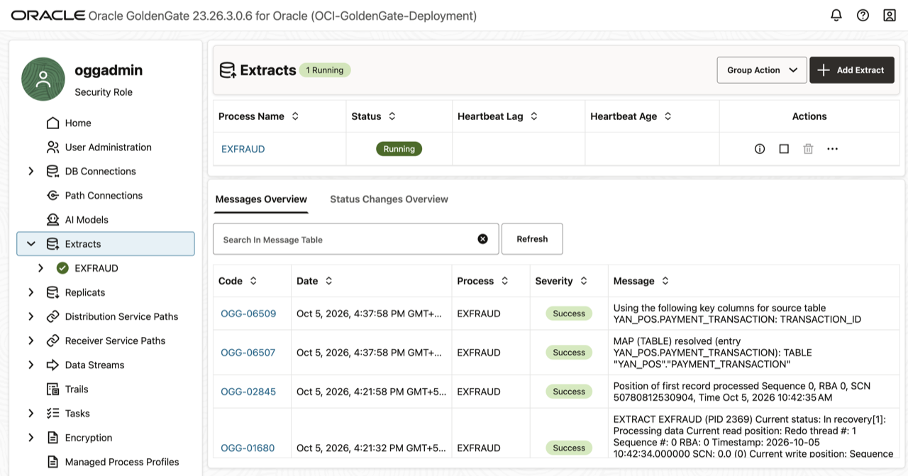
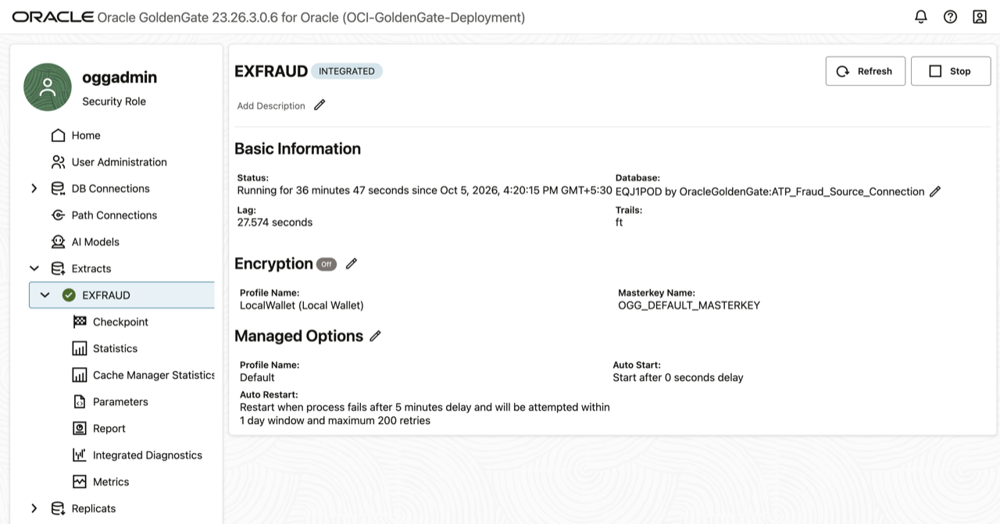
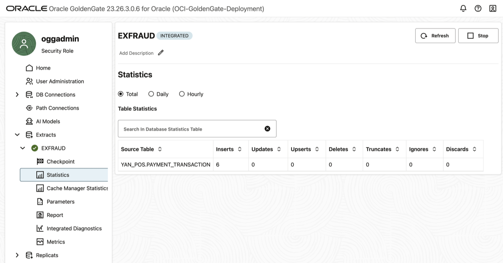
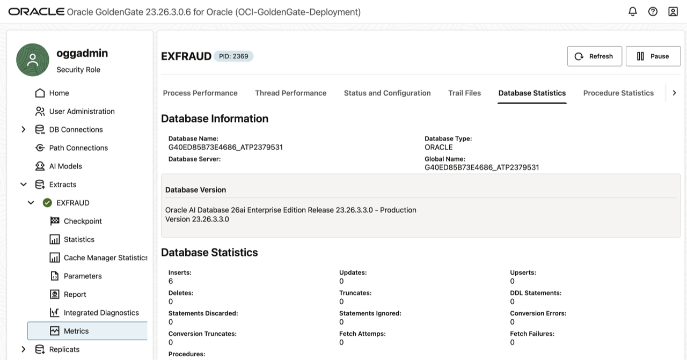
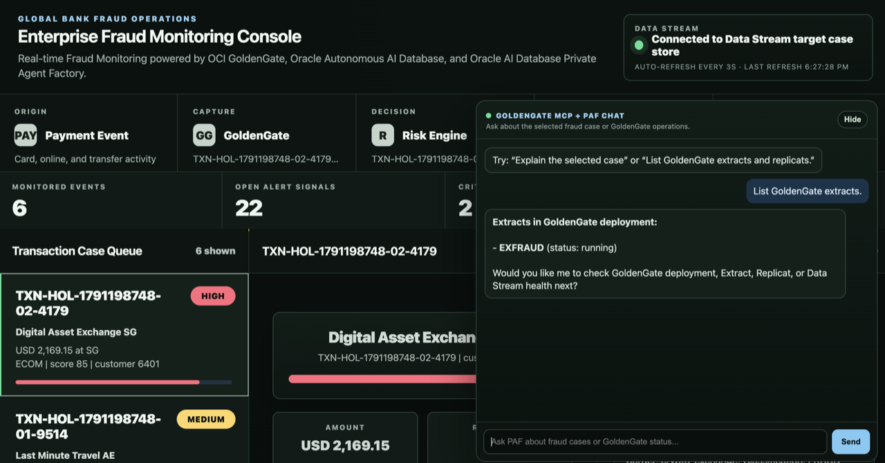
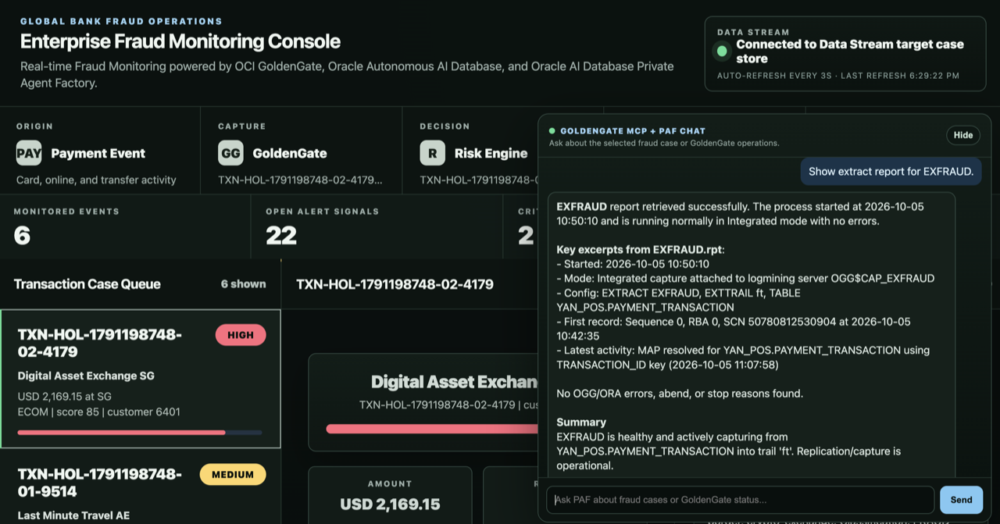
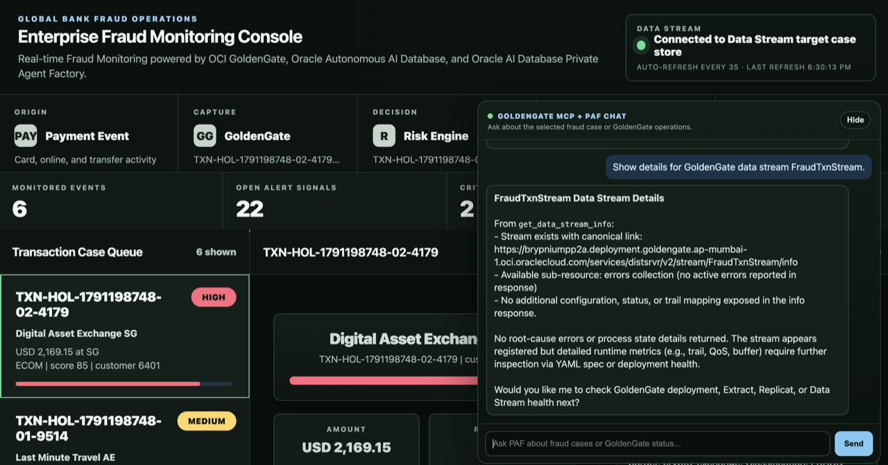
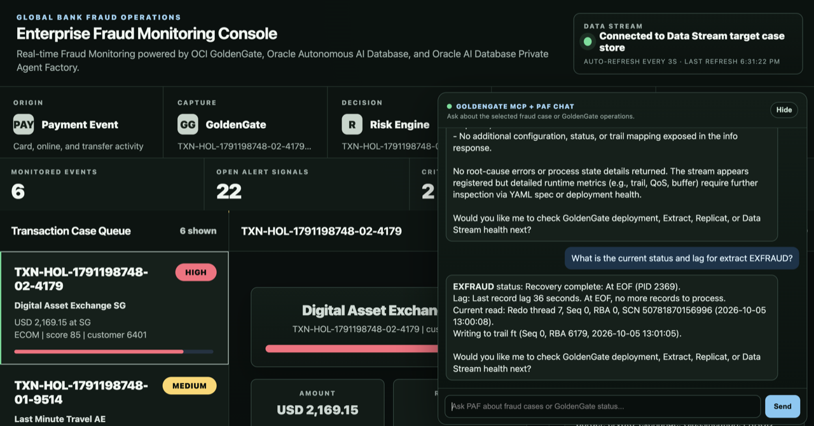
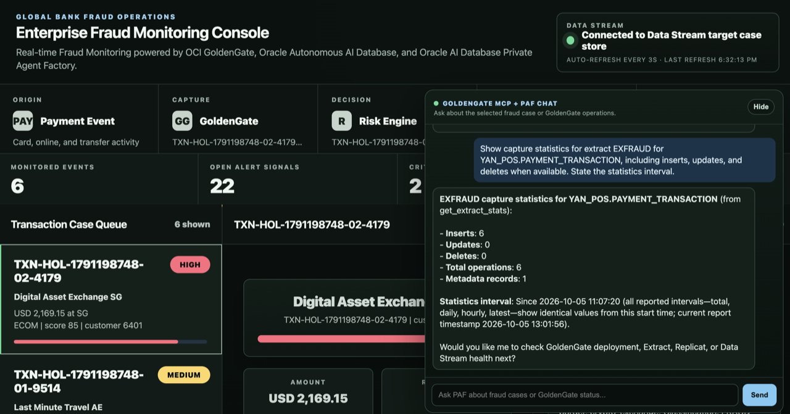

# Lab 6: Monitor GoldenGate and query operational evidence

## Introduction

In this lab, you learn to monitor the Extract and Data Stream processes that were created and run in the previous labs.

### About Performance Monitoring

Monitoring the performance of your GoldenGate instance ensures that your data replication processes are running smoothly and efficiently. You can monitor performance in both the Oracle Cloud Infrastructure (OCI) GoldenGate Deployment Console as well as in the Oracle Cloud Console on the Deployment Details page.

Estimated time: 10 minutes.

### Objectives

In this lab, you will:

- View GoldenGate charts and statistics in the Performance Metrics Server.
- Use OCI Console metrics to review overall deployment health and utilization.
- Inspect Extract reports, status, lag, and capture statistics through dashboard chat.
- Distinguish live operational evidence from generic or stale responses.

### Prerequisites

- This lab assumes that you completed all preceding labs.
- `EXFRAUD` is running.
- `FraudTxnStream` is running.
- You have at least one transaction ID from Lab 4.

## Task 1: View GoldenGate performance metrics

1. Go back to the OCI GoldenGate Console. 

    **NOTE**: If needed, open the deployment details in the OCI Console and click **Launch Console**. If prompted, enter the username and password found on the __LiveLabs Sandbox login page__, then click **Sign In**

2. Click **Extracts**, then click **EXFRAUD**
    

    

3. Click **Statistics** and review the number of Inserts that were processed by the Extract
    

    The insert count should be greater than zero after you generate transactions in Lab 4. Counts may include earlier workshop activity, so use them as operational evidence rather than fixed expected numbers.

4. Click **Metrics** and review the charts and statistics for the Extract. Click **Database Statistics** to review more information about the database activity.
    


## Task 2: View OCI GoldenGate metrics in the OCI Console

1. Return to the OCI GoldenGate deployment details page.
2. Open the **Monitoring** section from the deployment details page.
3. Review the available health, CPU utilization, memory utilization, deployment status, and performance indicators.

   These metrics provide the OCI service-level view of the GoldenGate deployment. Use them together with the GoldenGate Console and MCP responses to confirm the deployment is healthy.

## Task 3: Query GoldenGate operations using the MCP server

1. Return to the **Enterprise Fraud Monitoring Console**, enter these requests individually in the **GoldenGate MCP + PAF Chat** panel, then click **Send**. Wait for each result before proceeding.

    ```text
    List GoldenGate extracts.
    ```

    

   Confirm that `EXFRAUD` is listed.

    ```text
    Show extract report for EXFRAUD.
    ```

    

   Review the report for recent errors, warnings, or abended process messages.

    ```text
    Show details for GoldenGate data stream FraudTxnStream.
    ```

    

   Confirm that `FraudTxnStream` is present and points to the trail used by `EXFRAUD`.

    ```text
    What is the current status and lag for extract EXFRAUD?
    ```

    

   Confirm that the Extract status is `RUNNING` and that lag is low or not increasing.

    ```text
    Show capture statistics for extract EXFRAUD for YAN_POS.PAYMENT_TRANSACTION, including inserts, updates, and deletes when available. State the statistics interval.
    ```

    

   Confirm that insert statistics are present for `YAN_POS.PAYMENT_TRANSACTION`. Counts may include previous runs in the same lab environment.

   The response uses capture statistics and identifies the interval. Counts may include earlier activity. Compare the before and after values when validating a particular batch.

   Use the GoldenGate MCP + PAF Chat panel for these operational monitoring requests.

**NOTE**: Wait a minute or so and run the same command again if you run into an error containing the following message `Compartment quota max-on-demand-chat-request-per-minute-count is exceeded`.

You may now __proceed to the next lab__.

## Acknowledgements

- **Author** - Shrinidhi Kulkarni
- **Contributors** - Julien Testut, Denis Gray
- **Team** - OCI GoldenGate Product Management
