# Lab 7: Review the AI Agents configuration in Oracle AI Private Agent Factory

## Introduction

These review steps explain how the prepared services support the workshop labs. They are optional for attendees.

The PAF assets are already provisioned for this workshop. In this lab, you review how the prepared flows support the GoldenGate MCP chat operations and the fraud analyst brief shown on the dashboard.

Estimated time: 15 minutes.

### Objectives

In this lab, you will:

- Review the prepared PAF workflows that support GoldenGate operations and fraud analysis.
- Review MCP server registration and model configuration.
- Compare the stored AI analyst brief with the dashboard response.

### Prerequisites

- This lab assumes that you completed all preceding labs.

## Task 1: Review the Oracle AI Private Agent Factory workflows

1. Find the PAF URL, username, and password on the __LiveLabs Sandbox login page__. 
    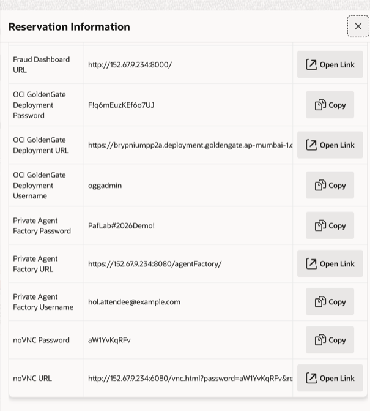

2. Click Open Link or copy and paste the URL into your browser. On the security warning page, click **Advanced** and select **Proceed to ...**. 
    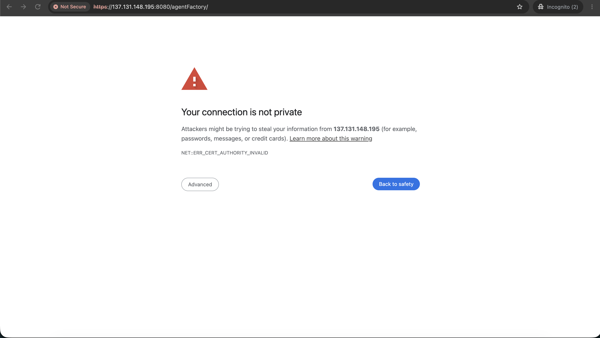

3. Enter the username and password and click **Sign In**.
    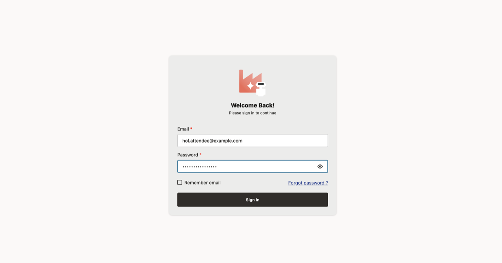

4. Open **My Custom Flows** under AGENT_FACTORY.
    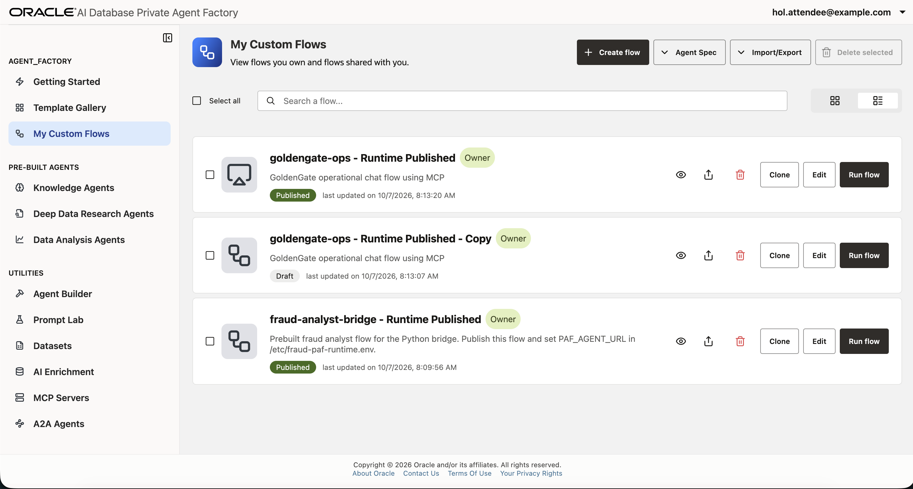

5. Locate the published `goldengate-ops - Runtime Published` flow and click **Edit**.
    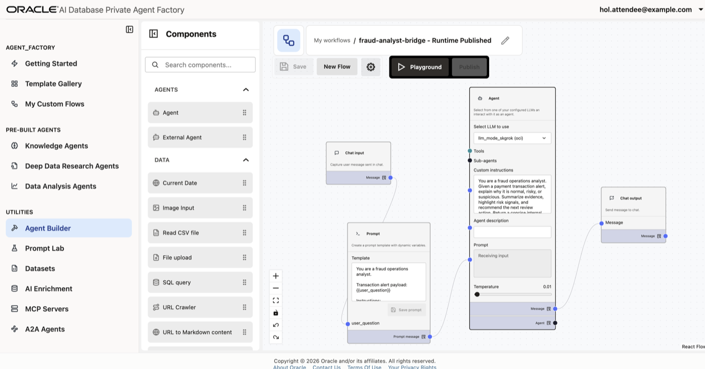

The `goldengate-ops - Runtime Published` flow powers the GoldenGate MCP + PAF Chat panel used in earlier labs. It routes natural-language GoldenGate requests to the registered GoldenGate MCP server.

6. Review the connections in the canvas:

    ```text
    Chat input -> Prompt -> Agent -> Chat output
    MCP server -> Agent tools input
    ```

7. Review the **Prompt** template and **Agent** Custom instructions. The flow must permit explicitly requested Extract and Data Stream creation or Start operations.
8. Click the **Allowed tools** drop-down in the **MCP server** box to display the list of MCP tools. MCP tools include *create_extract*, *create_replicat*, *add_trandata_table* and more.
    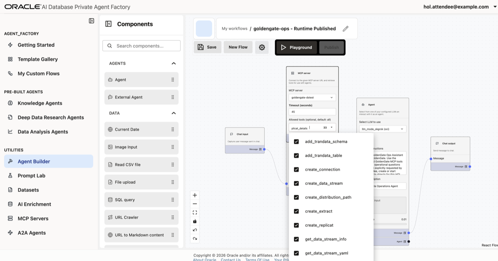

9. Go back to **My Custom Flows** under **AGENT_FACTORY** and click **Edit** next to the published fraud analyst flow, called `fraud-analyst-bridge - Runtime Published`. Click **Continue without saving** as many times as needed if prompted.
    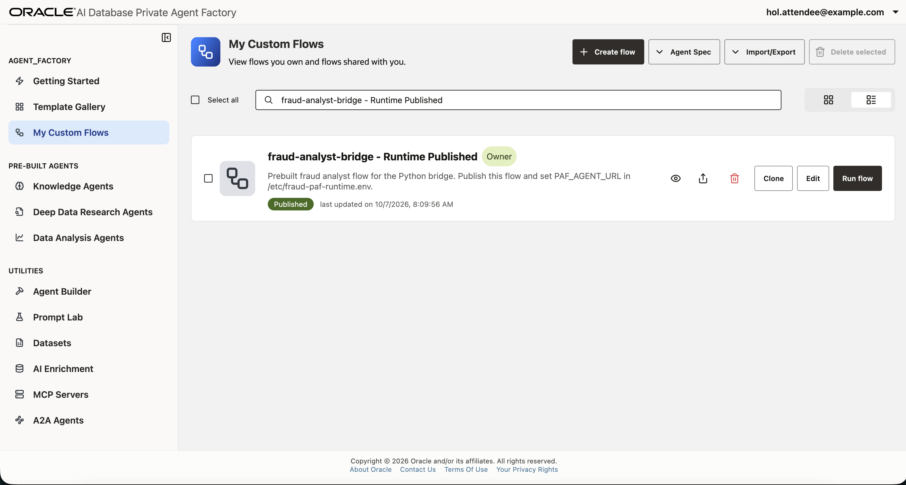

The `fraud-analyst-bridge - Runtime Published` flow generates analyst-ready explanations for fraud monitoring events. The dashboard displays the stored response for the selected transaction.

10. Review its **Prompt**, the selected OCI model for the Agent, and published integration configuration.
    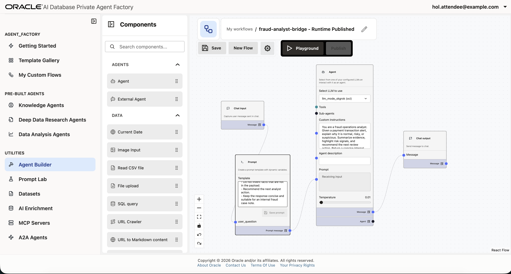

## Task 2: Review MCP registration and the OCI model

1. Open **MCP Servers** under **UTILITIES** in PAF, find `goldengate-dstest` and click on the **Pencil icon** to review its configuration.
    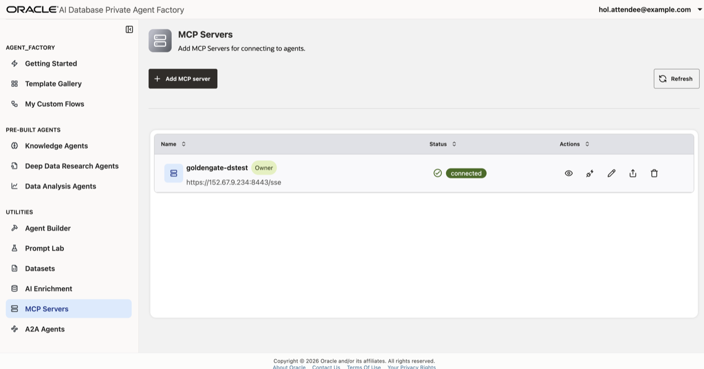

2. Review the registered **Server URL** generated for this Compute instance. 
    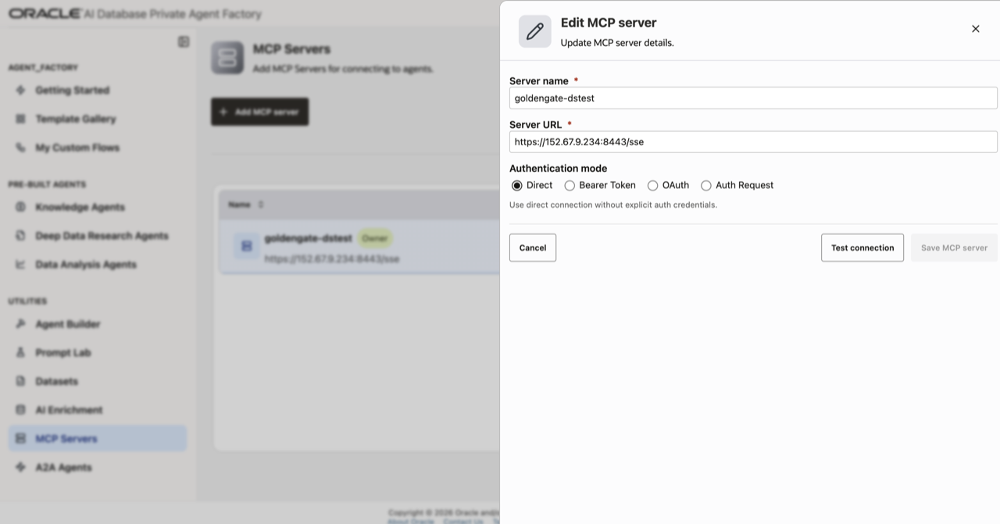

3. Click **Test connection** to review the connection status and click **Cancel**.
    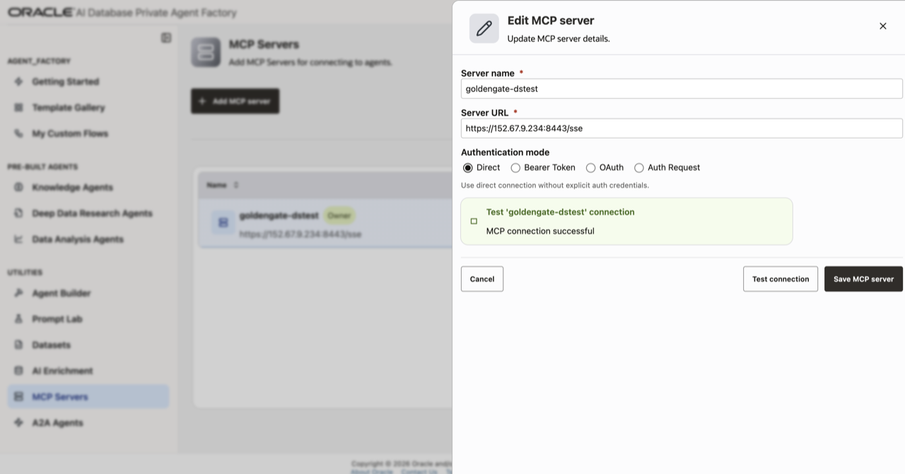

The test should complete successfully. This confirms that PAF can reach the GoldenGate MCP server running in the lab environment.

4. Open **Model Management** under **SETTINGS** and inspect the model selected by the agent: SpaceXAI Grok. Click the **Actions** menu and select **Edit details** to review the Model ID, OCI Generative AI endpoint, authentication configuration, and model availability.
    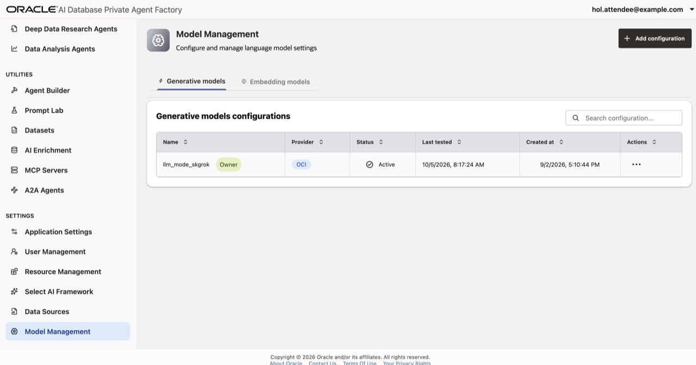

    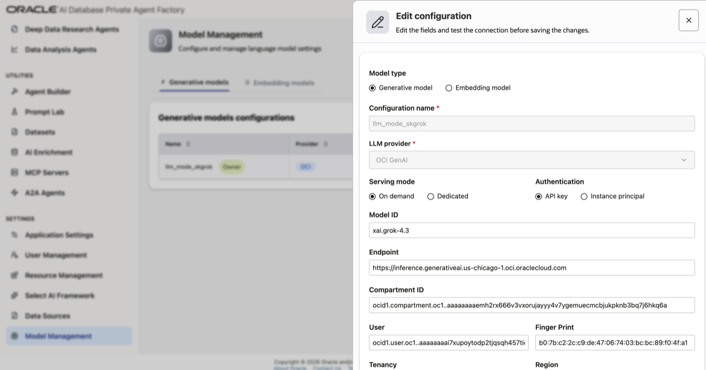


## Task 3: Review the stored AI response

1. Return to the Oracle Cloud console and use the navigation menu to navigate back to **Oracle AI Database**, **Autonomous AI Database**, and click **AIATP&lt;LiveLab ID&gt;**.
2. On the **AIATP&lt;LiveLab ID&gt;** Details page, click **Database actions**, and then **SQL**.

   **NOTE**: Use the **AIATP&lt;LiveLab ID&gt;** database credentials in the Workshop details to log in to Database actions if needed, and then click **SQL**.

3. Enter the following select statement (replace the example transaction_id with one from previous labs), and then click **Run Script**:
    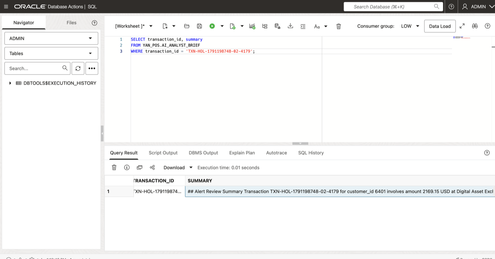


    ```sql
    SELECT transaction_id, summary
    FROM YAN_POS.AI_ANALYST_BRIEF
    WHERE transaction_id = 'TXN-HOL-REPLACE-WITH-YOUR-ID';
    ```

   The query should return the stored AI analyst brief for the selected transaction ID. If no row is returned, use a high-risk transaction from Lab 5 that shows a PAF analyst brief on the dashboard.

   Compare the text stored in the SUMMARY column with the dashboard brief seen in the Enterprise Fraud Monitoring Console.

   This representative successful run shows the PAF response attached to the selected dashboard case. Your transaction ID and generated wording will differ.

    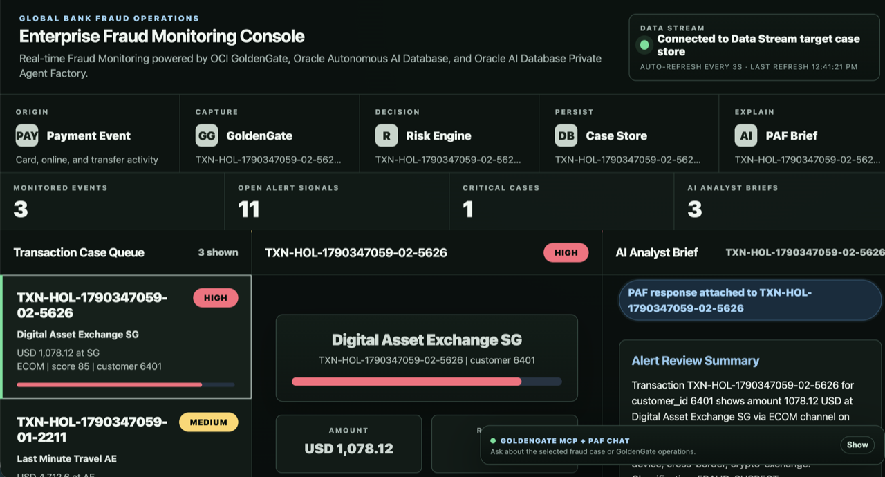

## Acknowledgements

- **Author** - Shrinidhi Kulkarni
- **Contributors** - Julien Testut, Denis Gray
- **Team** - OCI GoldenGate Product Management
