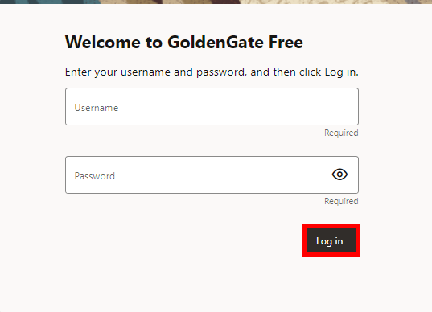
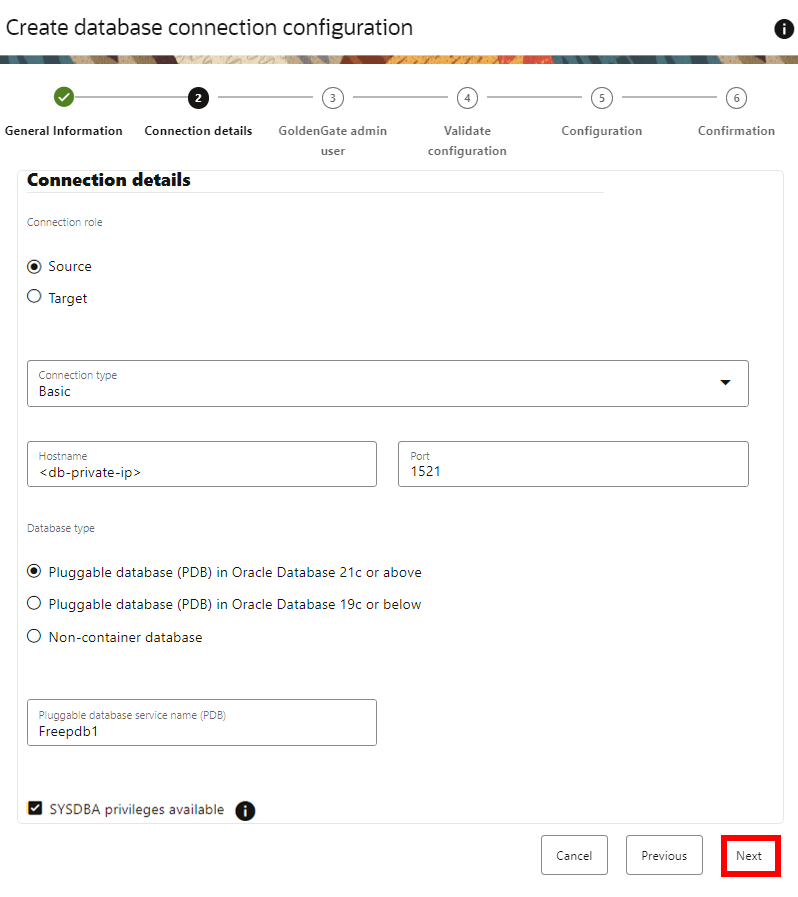
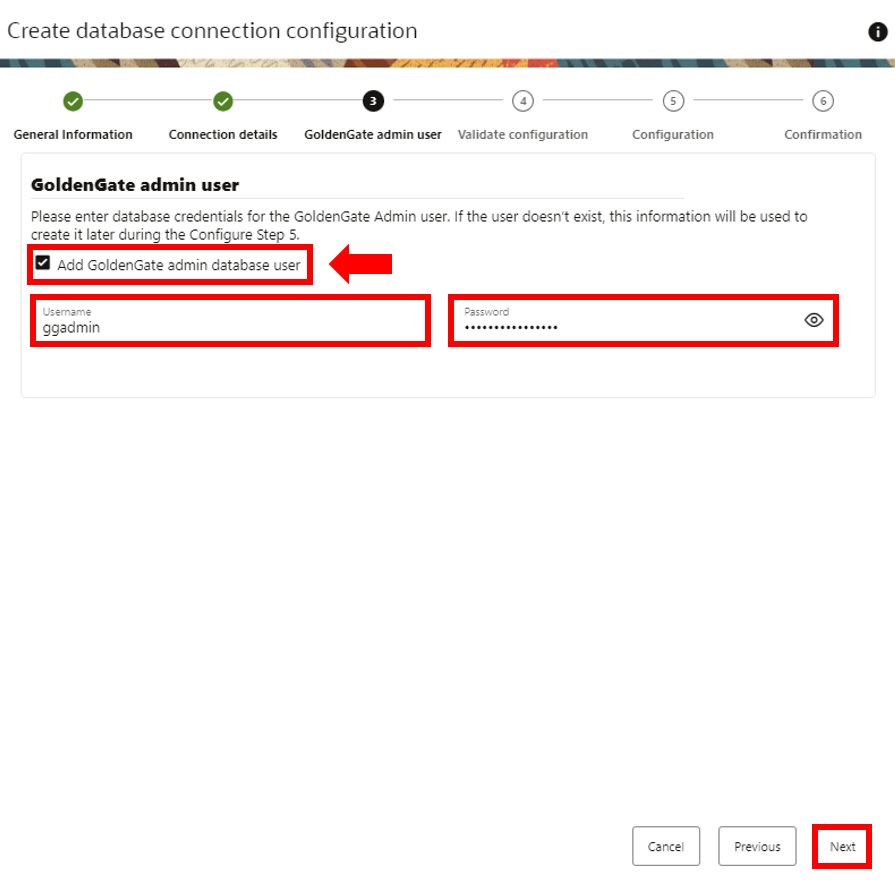
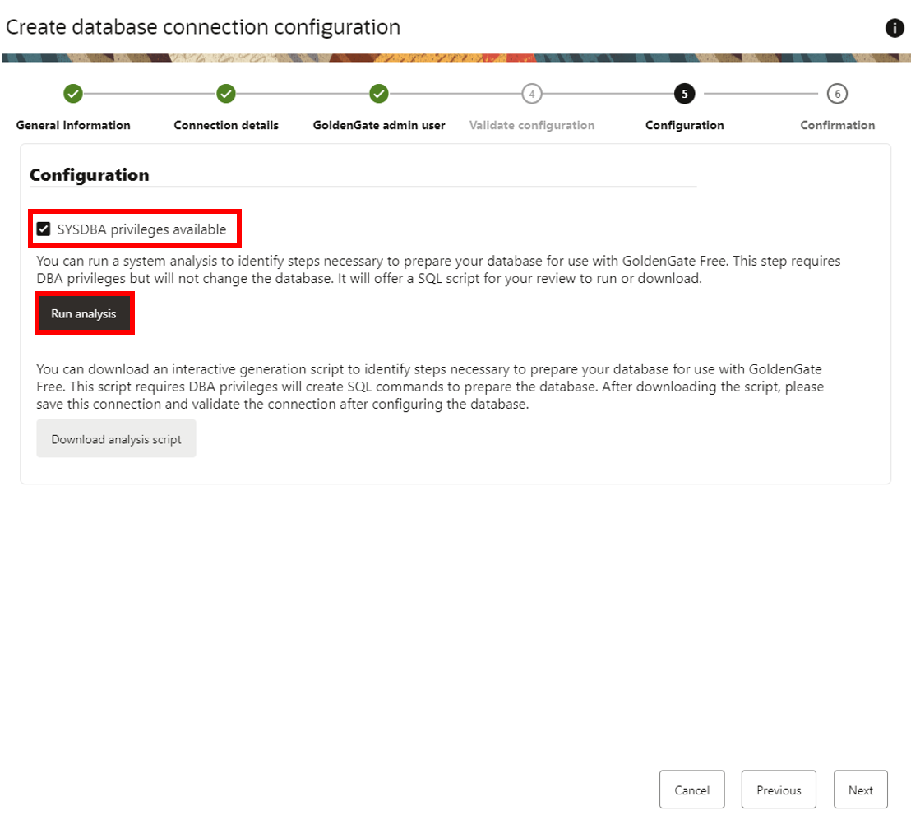
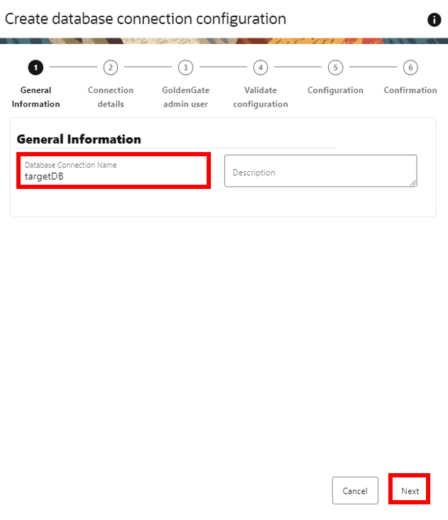

# Create the database connections

## Introduction

In this lab, you learn to create Oracle GoldenGate Free database connections.

Estimated time: 15 minutes

### About Oracle Cloud Infrastructure GoldenGate deployments and connections

A Oracle Cloud Infrastructure GoldenGate deployment manages the resources it requires to function. The GoldenGate deployment also lets you access the GoldenGate deployment console, where you can access the OCI GoldenGate deployment console to create and manage processes such as Extracts and Replicats.

Connections store the source and target credential information for OCI GoldenGate. A connection also enables networking between the Oracle Cloud Infrastructure (OCI) GoldenGate service tenancy virtual cloud network (VCN) and your tenancy VCN using a private endpoint.

### Objectives

In this lab, you will:
* Locate Oracle Cloud Infrastructure GoldenGate in the Console
* Create a OCI GoldenGate deployment
* Create the source and target connections

## Task 1: Log in to GoldenGate Free

1.  In the GoldenGate Free welcome page, enter your username and password, and then click **Log in**.

    

## Task 2: Create the source connection

1.  On the GoldenGate Free **Home** page, click **Create connection**.

    

2.  The Create database connection configuration panel consists of six pages. On the General information page, for Name, enter **SourceDB** and optionally, a description.

3.  Click **Next**.

    

4.  On the Connection details page, under Connection details select **Source**.

5.  For the Connection type dropdown, select **Basic**.

6.  For Hostname, enter .

7.  For Port, enter **1521**.

8. For Database type, select **Pluggable database in container database**.

9.  For Container database dervice name (CDB), enter .

10.  Select **SYSDBA privileges available**.

    

11. Under the Administrator Credentials pop up, insert your admin privilege username and password. Click **OK**.

    

12. You are brought back to the Connection details page. Click **Next**.

    

13. On the GoldenGate admin user page, enter your username, password, and select the **Add GoldenGate admin database user**. 

14. Click **Next**.

    

15. On the Configuration page, click **Run Analysis**.

    

16. Review the script by scrolling through and reviewing it completely. Select **I have reviewed the SQL script and am aware of the changes it will apply to my database**.

17. Click **Run SQL**.

    

18. Review the Prepare database result. Click **OK**.

    

19. Click **Next**.

20. On the Confirmation page, review the details, and then click **Create**.

    

## Task 3: Create the target connection

1.  On the Database connections page, click **Create database connection**.

	

2.  The Create database connection configuration panel consists of six pages. On the General information page, for Name, enter **TargetDB** and optionally, a description.

3.  Click **Next**.

    

4.  On the Connection details page, under Connection details select **Target**.

5.  For the Connection type dropdown, select **Basic**.

6.  For Hostname, enter .

7.  For Port, enter **1621**.

8. For Database type, select **Pluggable database in container database**.

9.  For Container database dervice name (CDB), enter .

10.  Tick the SYSDBA priviledges available 

    

11. Under the Administrator Credentials pop up, insert your admin privilege username and password. Click **OK**.

    

12. Click **Next**.

    

13. On the GoldenGate admin user page, enter your username, password, and tick the **Add GoldenGate admin database user**. 

14. Click **Next**.

    

15. On the Configuration page, click **Run Analysis**.

    

16. Review the script by scrolling through and reviewing it completely. Tick **I have reviewed the SQL script and am aware of the changes it will apply to my database**.

17. Click **Run SQL**.

    

18. Review the Prepare database result. Click **OK**.

    

19. Click **Next**.

20. On the Confirmation page, review the details, and then click **Create**.

    

**Proceed to the next lab.**

## Learn more

* [Managing deployments](https://docs.oracle.com/en/cloud/paas/goldengate-service/ebbpf/index.html)
* [Managing connections](https://docs.oracle.com/en/cloud/paas/goldengate-service/mcjzr/index.html)

## Acknowledgements
* **Author** - Jenny Chan, Consulting User Assistance Developer, Database User Assistance
* **Contributors** -  Denis Gray, Database Product Management; Katherine Wardhana, User Assistance Developer
* **Last Updated By/Date** - Katherine Wardhana, 

