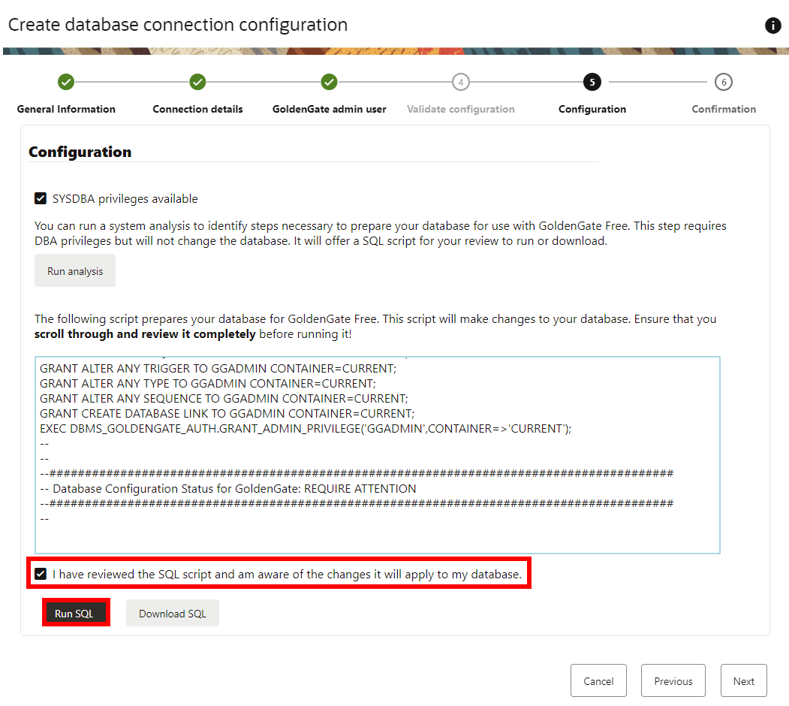
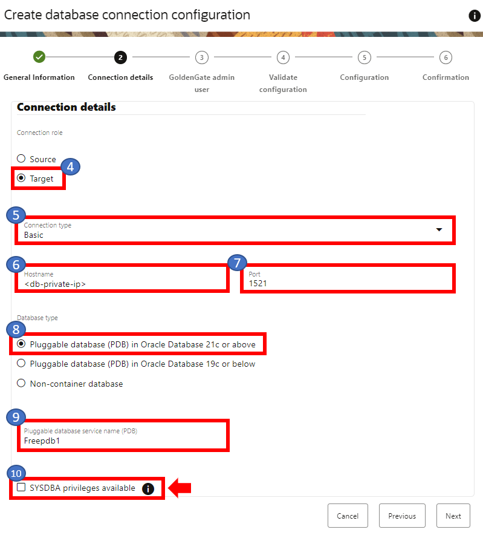

# Create the database connections

## Introduction

In this lab, you learn to create Oracle GoldenGate Free database connections.

Estimated time: 15 minutes

### About Oracle GoldenGate Free connections

An Oracle GoldenGate Free connection contains the network connectivity information for Oracle Database sources and targets.

### Objectives

In this lab, you will:
* Login to the Oracle GoldenGate Free console 
* Create the source and target connections

## Task 1: Log in to GoldenGate Free

1. In your lab instructions, click **View Login Info**.

    

2. On the Reservation Information page, under Terraform Values, copy the **OGG Public IP** and paste the IP in a new window.

    

    > **Note:** Add `https://` before the IP address if you're having trouble connecting. 

3. In the GoldenGate Free welcome page, enter **oggadmin** for your Username. For password, paste the **Global Password** from the Reservation Information. Click **Log in**. 

    

## Task 2: Create the source connection

1.  On the GoldenGate Free **Home** page, click **Create connection**.

    

2.  The Create database connection configuration panel consists of six pages. On the General information page, for Name, enter **sourceDB** and optionally, a description.

3.  Click **Next**.

    

4.  On the Connection details page, for Connection role select **Source**.

5.  For the Connection type dropdown, select **Basic**.

6.  For Hostname, enter the **DB Free E Private IP** found in the Reservation Information.

7.  For Port, enter **1521**.

8. For Database type, select **Pluggable database (PDB) in Oracle Database 21c or above**.

9.  For Pluggable database service name (PDB), enter **Freepdb1**.

10.  Select **SYSDBA privileges available**.

    

11. Once you click on the SYSDBA checkbox, an Administrator Credentials pop up will appear. For User with admin privilege, enter `sys`. For password, paste the **Global Password** from the Reservation Information. Click **OK**.

    

12. You're brought back to the Connection details page. Click **Next**.

    

13. On the GoldenGate admin user page, enter your username, **ggadmin**, password, and select **Add GoldenGate admin database user**. For password, paste the **Global Password** from the Reservation Information.

14. Click **Next**.

    

15. On the Configuration page, click **Run analysis**.

    

16. Review the script by scrolling through and reviewing it completely. Select **I have reviewed the SQL script and am aware of the changes it will apply to my database**.

17. Click **Run SQL**.

    

18. Review the Prepare database result. Click **OK**.

    

19. Click **Next**.

20. On the Confirmation page, review the details, and then click **Create**.

    

## Task 3: Create the target connection

1.  On the Database connections page, click **Create database connection**.

	

2.  The Create database connection configuration panel consists of six pages. On the General information page, for Name, enter **targetDB** and optionally, a description.

3.  Click **Next**.

    

4.  On the Connection details page, for Connection role select **Target**.

5.  For the Connection type dropdown, select **Basic**.

6.  For Hostname, enter the **DB Free W Private IP** found in the Reservation Information.

7.  For Port, enter **1521**.

8. For Database type, select **Pluggable database (PDB) in Oracle Database 21c or above**.

9.  For Pluggable database service name (PDB), enter **Freepdb1**.

10.  Select **SYSDBA privileges available**.

    

11. Once you click on the SYSDBA checkbox, an Administrator Credentials pop up will appear. For User with admin privilege, enter `sys`. For password, paste the **Global Password** from the Reservation Information. Click **OK**.

    

12. Click **Next**.

    

13. On the GoldenGate admin user page, enter your username, **ggadmin**, password, and select **Add GoldenGate admin database user**. For password, paste the **Global Password** from the Reservation Information.

14. Click **Next**.

    

15. On the Configuration page, click **Run analysis**.

    

16. Review the script by scrolling through and reviewing it completely. Select **I have reviewed the SQL script and am aware of the changes it will apply to my database**.

17. Click **Run SQL**.

    

18. Review the Prepare database result. Click **OK**.

    

19. Click **Next**.

20. On the Confirmation page, review the details, and then click **Create**.

    

**Proceed to the next lab.**

## Learn more

* [Create an Oracle Database connection](https://docs-uat.us.oracle.com/en/middleware/goldengate/free/21/uggfe/create-database-connections.html#GUID-F752AD5C-20E4-4397-A5C2-8066CB80A2E6)
* [About the configuration script](https://docs-uat.us.oracle.com/en/middleware/goldengate/free/21/uggfe/create-database-connections.html#GUID-3C6691FA-2C40-445D-8A1A-A7B708085DD9)

## Acknowledgements
* **Author** - Katherine Wardhana, User Assistance Developer
* **Contributors** -  Alex Lima, Database Product Management & Jenny Chan, Consulting User Assistance Developer, Database User Assistance 
* **Last Updated By/Date** - Katherine Wardhana, September 2023

