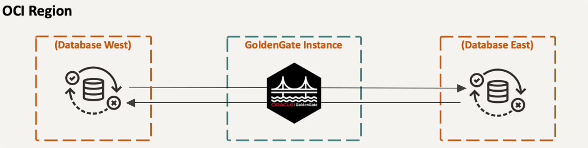

# Introduction

## About this Workshop

Oracle GoldenGate Free is a starter version of Oracle's best in class replication software. With GoldenGate Free, you can learn the basic concepts while creating simple data replication processes in a simplified user interface.

This workshop guides you through how to create an Active-Active bidirectional replication process in GoldenGate Free. You will create database source and target connections, create and configure a pipeline, and monitor pipeline performance.

   

Estimated workshop time: 1 hour

### About Oracle GoldenGate Free

Oracle GoldenGate Free provides all features of the licensed GoldenGate product and additionally provides a recipe-driven user interface to easily create and manage replication pipelines. 

### Prerequisites

* Experience with Oracle Database
* An Oracle Cloud Account - Please view this workshop's LiveLabs landing page to see which environments are supported

## Learn More

* [Overview of Oracle GoldenGate Free](https://docs-uat.us.oracle.com/en/middleware/goldengate/free/21/uggfe/what-is-goldengate-free.html#GUID-D4BFD976-AA02-4D0B-B22D-B00254F3A6C4)

## Acknowledgements

* **Author** - Katherine Wardhana, User Assistance Developer
* **Contributors** -  Alex Lima, Database Product Management & Jenny Chan, Consulting User Assistance Developer, Database User Assistance 
* **Last Updated By/Date** - Katherine Wardhana, September 2023
