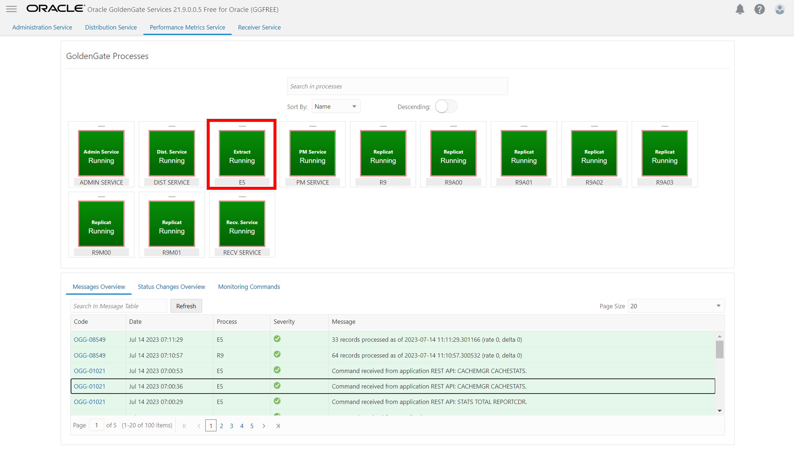

# Monitor pipeline performance

## Introduction

In this lab, you learn to monitor the Extract and Replicat processes that were created and run in the previous lab.

Estimated time: 2 minutes

### About Performance Monitoring

Monitoring the performance of your GoldenGate instance ensures that your data replication processes are running smoothly and efficiently. You can monitor performance in both the Oracle Cloud Infrastructure (OCI) GoldenGate Deployment Console as well as in the Oracle Cloud Console on the Deployment Details page.

### Objectives

In this lab, you will:
* View charts and statistics using the Performance Metrics Server in the GoldenGate deployment console
* Use Metrics on the Deployment Details page in the Oracle Cloud Console to determine overall instance health and utilization.

### Prerequisites

In order to complete this lab, you should have completed the preceding lab and have both an Extract and Replicat running.

## Task 1: Monitor the pipeline

For advanced monitoring you can open the GoldenGate microservices console.

1.  Open the Extract menu (ellipses) and then click **GoldenGate Console**. 

    

2.  To log in to the GoldenGate console, enter oggadmin for user name and a password, and then click Sign In.

    

3. In the GoldenGate deployment console, click **Performance Metrics Service**, and then click the Extract process (in this example, E5).

    

4. Under Performance Metrics Service, monitor the performance of the extract.

    

## Learn more

* [Monitor performance using the Oracle Cloud console](https://docs.oracle.com/en/cloud/paas/goldengate-service/vddvk/index.html#articletitle)

## Acknowledgements
* **Author** - Jenny Chan, Consulting User Assistance Developer, Database User Assistance
* **Contributors** -  Alex Lima, Database Product Management & Katherine Wardhana, User Assistance Developer
* **Last Updated By/Date** - Katherine Wardhana, July 2023
