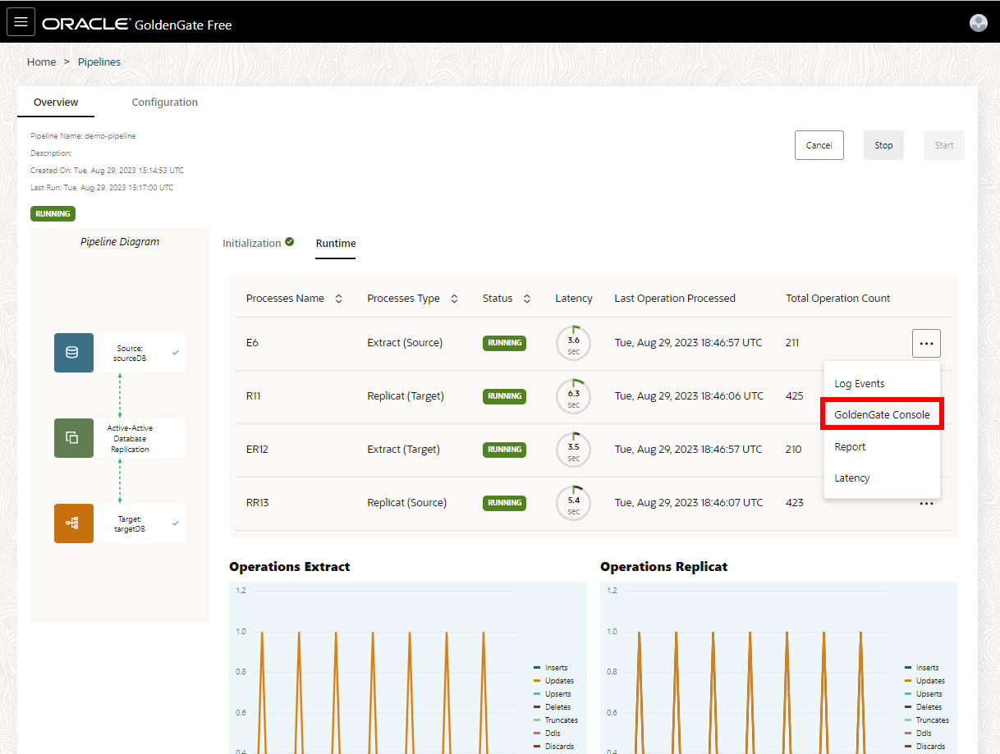
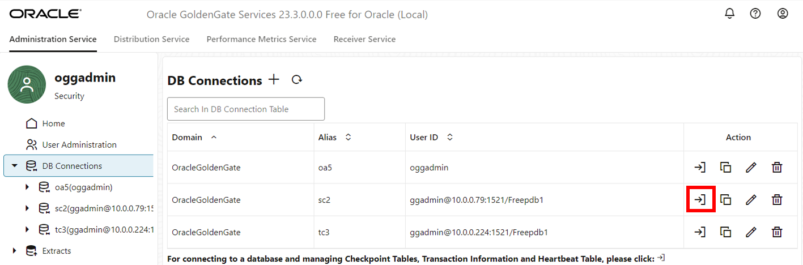

# Explore the Microservices UI

## Introduction

In this lab, you learn to monitor the Extract and Replicat processes that were created and run in the previous lab.

Estimated time: 2 minutes

### About Performance Monitoring

Monitoring the performance of your GoldenGate instance ensures that your data replication processes are running smoothly and efficiently. You can monitor performance in both the Oracle Cloud Infrastructure (OCI) GoldenGate Deployment Console as well as in the Oracle Cloud Console on the Deployment Details page.

### Objectives

In this lab, you will:
* Review the Oracle GoldenGate Microservices, such as, Administration Service, Distribution Service, Performance Metrics Service, and Receiver Service. 
* View charts and statistics using the Performance Metrics Server in the GoldenGate deployment console
* Use Metrics on the Deployment Details page in the Oracle Cloud Console to determine overall instance health and utilization.

### Prerequisites

In order to complete this lab, you should have completed the preceding lab and have both an Extract and Replicat running.

## Task 1: Review GoldenGate Console

1.  From the list of pipelines, select **demo-pipeline**. 

    

2. Open the Extract menu (ellipses) and then click **GoldenGate Console**. 

    

3.  To log in to the GoldenGate console, enter **oggadmin** for your Username. For password, paste the **Global Password** from the Reservation Information. Click **Log in**.

    

4. You're directed to the **Administration Service** page. You can view and manage Extract and Replicat process details, reports, and statistics.

    

5. Select **Distribution Service**. You can view and manage Distribution Paths and Target-Initiated Paths details.

    

6. Select **Performance Metrics Service**. You can view service and process performance metrics.

    

7. Select **Receiver Service**. You can view and manage Distribution Paths and Target-Initiated Paths details, and filter Log Information. You can filter the log information by clicking **Search By** and selecting Severity, Date, and/or Message from the dropdown.

    

## Task 2: Review connections

1. On the **Administration Service** screen, click **DB Connections**. Connections listed in **DB Connections** were created in Lab 1 in the GoldenGate Free console.

    

2. Click **Connect to database: sc2**. To verify a successful connection, checkpoint and trandata options become available.

    

3.  Redirected to the **Checkpoint** screen.

    

4.  Select **Trandata** and on the **TRANDATA Information** search schema, search **HR**. Verify that **HR** is listed with inserts.

    

## Task 3: Review Extract details

1. Click Extracts, then click the Extract Action menu (in this case, E6), and select **Details** from the dropdown. Extracts listed here were created in Lab 1 in the GoldenGate Free console.

    

2.  On the Extract screen, view the process details such as registration information, Encryption, and Managed Options.

    

3.  On the **Checkpoint** screen, view the Checkpoint basic information, Input Checkpoints, and Output Checkpoints.

    

4.  On the **Statistics** screen, view the Data Definition Language (DDL) and Table Statistics. You can organize the statistics based on total, daily, or hourly.

    

5.  On the **Parameters** screen, view the parameters in use. 

    

6.  On the **Cache Manager Statistics** screen, view the Cache Statistics, and Objects Pool Statistics. You can view the Global Statistics under Runtime Statistics or Cumulative Statistics. 

    

7.  On the **Report** screen, view the Report Files and Discard Files.

    

8.  On the **Integrated Diagnostics** screen, view and add Integrated Diagnostics. 

    

## Task 4: Review Replicats details

1. Click Replicats, then click the Replicat Action menu (in this case, R11), and select **Details** from the dropdown. Replicats listed here were created in Lab 1 in the GoldenGate Free console.

    

2.  On the **Process Information** screen, view the process details such as registration information, Encryption, and Managed Options.

    

3.  On the **Checkpoint** screen, view the Checkpoint Basic Information, and Input Checkpoints. 

    

4.  On the **Statistics** screen, view the Data Definition Language (DDL), Table Statistics, and Integrated Replicat. You can organize the statistics based on total, daily, or hourly.

    

5. On the **Parameters** screen, view the parameters in use. 

    

6.  On the **Report** screen, view the Report Files and Discard Files.

    

7.  On the **Heartbeat** screen, view the Heartbeat Information and Latest Heartbeats. 

    

8.  Click **See History** to view the replicat's Heartbeats History.

    

9. Click **Table View** to view the replicat's Heartbeats History in a table view.

    

10. Click **Integrated Diagnostics** screen, view and add Integrated Diagnostics.

    

## Task 5: Monitor the pipeline

1. Click **Performance Metrics Service**, and then click the Extract process (in this example, E6).

    

2. Under **Process Performance**, monitor the performance of the extract.

    

3. Under **Thread Performance**, monitor different threads, such as Extract, Service Threads, and Monitoring.

    

4. Under **Status and Configuration**, view various Process Messages and Process Status Changes. 

    

5. Under **Trail Files**, view the Output Trail File and Trail Checkpoint. 

    

6. Under **Database Statistics**, view the Database Information, Statistics, and Table Statistics. 

    

7. Under **Procedure Statistics**, view the Procedure Statistics Table. 

    

8. Under **Cache Statistics**, view the Cache Manager Statistics and Cache Bucket Statistics.  

    

9. Under **Queue Statistics**, view the various Queue statistics and graphs. 

    

10. Under **Bounded Recovery**, view Bounded Recovery Status, and Bounded Recovery Statistics. 

    

3. Repeat Task 5, steps 1-10, to monitor the performance of the Replicat process (in this case, R11).

## Learn more

* [Monitor performance using the Oracle Cloud console](https://docs.oracle.com/en/cloud/paas/goldengate-service/vddvk/index.html#articletitle)

## Acknowledgements
* **Author** - Katherine Wardhana, User Assistance Developer 
* **Contributors** -  Alex Lima, Database Product Management & Jenny Chan, Consulting User Assistance Developer, Database User Assistance
* **Last Updated By/Date** - Jenny Chan, September 2025
