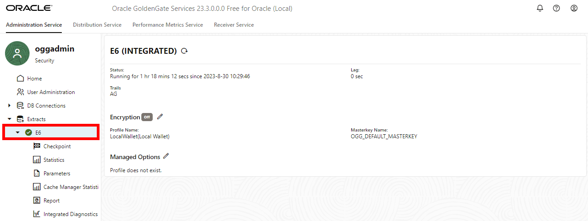

# Explore the Microservices UI

## Introduction

In this lab, you learn to monitor the Extract and Replicat processes that were created and run in the previous lab.

Estimated time: 2 minutes

### About Performance Monitoring

Monitoring the performance of your GoldenGate instance ensures that your data replication processes are running smoothly and efficiently. You can monitor performance in both the Oracle Cloud Infrastructure (OCI) GoldenGate Deployment Console as well as in the Oracle Cloud Console on the Deployment Details page.

### Objectives

In this lab, you will:
* View charts and statistics using the Performance Metrics Server in the GoldenGate deployment console
* Use Metrics on the Deployment Details page in the Oracle Cloud Console to determine overall instance health and utilization.

### Prerequisites

In order to complete this lab, you should have completed the preceding lab and have both an Extract and Replicat running.

## Task 1: Review connections

1.  Open the Extract menu (ellipses) and then click **GoldenGate Console**. 

    

2.  To log in to the GoldenGate console, enter oggadmin for user name and a password, and then click Sign In.

    

3. Open the navigation menu and then click Configuration.

    

4. Click **Connect to database: sb2**. To verify a successful connection, checkpoint and trandata options become available

    

## Task 2: Review Extract details

1. On the Overview page, click the E5 Action menu, and select **Details** from the dropdown.

    

2.  On the **Process Information** screen, view the process details such as Trails, Encryption Profile, Managed Options, and Registration Information.

    

3.  On the **Checkpoint** screen, view the Checkpoint Basic Information, Input Checkpoints, and Output Checkpoints. 

    

4.  On the **Statistics** screen, view the Data Definition Language (DDL) and Table Statistics. 

    

5.  On the **Cache Manager Statistics** screen, view the Current Memory Usage, Current Memory Used Breakdown, Objects Pool Statistics, File Caching, Global Cache Object Statics, and Cache Object Size Distribution. 

    

6.  On the **Parameters** screen, view the parameters in use. 

    

7.  On the **Report** screen, view the extract report.

    

## Task 3: Review Replicat details

1. On the Overview page, click the R9 Action menu, and select **Details** from the dropdown.

    

2.  On the **Process Information** screen, view the process details such as Encryption Profile, and Managed Options.

    

3.  On the **Checkpoint** screen, view the Checkpoint Basic Information, and Input Checkpoints. 

    

4.  On the **Statistics** screen, view the Table Statistics, Parallel Replicat, and Workload Dependency Statistics.

    

5. On the **Parameters** screen, view the parameters in use. 

    

6.  On the **Report** screen, view the replicat report.

    

7.  On the **Heartbeat** screen, view the Heartbeat Information and Latest Heartbreats. Click **See History** to view the replicat's Heartbeats History.

    

## Task 4: Monitor the pipeline

For advanced monitoring you can open the GoldenGate microservices console.

1. In the GoldenGate deployment console, click **Performance Metrics Service**, and then click the Extract process (in this example, E5).

    

2. Under **Process Performance**, monitor the performance of the extract.

    

3. Repeat Task 4, steps 1-2, to monitor the performance of the R9 replicat.

## Learn more

* [Monitor performance using the Oracle Cloud console](https://docs.oracle.com/en/cloud/paas/goldengate-service/vddvk/index.html#articletitle)

## Acknowledgements
* **Author** - Jenny Chan, Consulting User Assistance Developer, Database User Assistance
* **Contributors** -  Alex Lima, Database Product Management & Katherine Wardhana, User Assistance Developer
* **Last Updated By/Date** - Katherine Wardhana, July 2023
