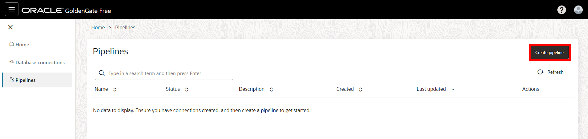

# Create and configure the pipeline

## Introduction
This lab instructs you to create a pipeline. 

Estimated time: 25 minutes

### About pipelines
A pipeline is an instance of a recipe. It enables you to select your source connection, the type of replication action(s) to apply, and the target connection. After creating the pipeline, you can configure which schemas and tables to replicate to the target. After the pipeline starts, you can observe the replication process in real time. 

### Objectives
In this lab, you learn to:
* Create a pipeline
* Configure a pipeline
* Start a pipeline

## Task 1: Create the pipeline

1. Use the GoldenGate Free Console navigation menu to navigate to **Pipelines**.

    

2. On the Pipelines page, click **Create pipeline**.

    

3. The Create pipeline configuration panel consists of three pages. On the Recipe page, select the **One-way Database Replication** recipe. Click **Next**.

    

4. On the Overview page, for Name, enter **demo-pipeline** and optionally, a description. Click **Next**.

    

5. On the Connections page, for Source database, select your target database connection from the dropdown.

6. For target database, select your target database connection from the dropdown.

7. Click **Save & configure**.

    

## Task 2: Configure the pipeline

1.  x

2.  x

3.  x

## Task 3: Start the pipeline

1.  x

2.  x

3.  x

## Task 4: x

1.  x

2.  x

3.  x

**Proceed to the next lab.**

## Learn more

* [Create pipelines](https://docs-uat.us.oracle.com/en/middleware/goldengate/free/21/uggfe/create-pipelines.html#GUID-F8027670-E92C-4187-B312-D9532729CC8F)

## Acknowledgements
* **Author** - Jenny Chan, Consulting User Assistance Developer, Database User Assistance
* **Contributors** -  Alex Lima, Database Product Management; Katherine Wardhana, User Assistance Developer
* **Last Updated By/Date** - Katherine Wardhana, May 2023
