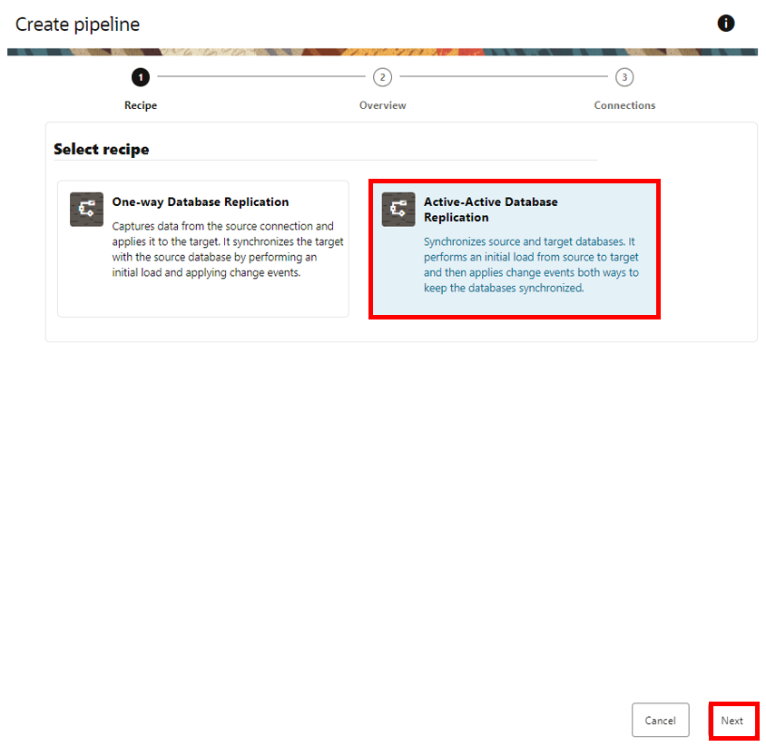
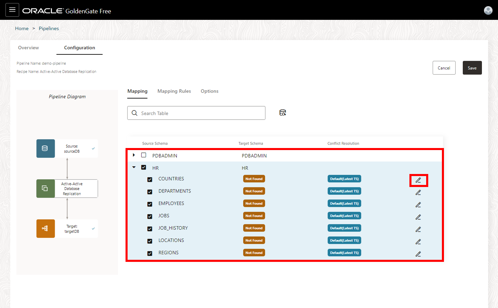

# Create and configure the pipeline

## Introduction
This lab instructs you to create a pipeline. 

Estimated time: 25 minutes

### About pipelines
A pipeline is an instance of a recipe. It enables you to select your source connection, the type of replication action(s) to apply, and the target connection. After creating the pipeline, you can configure which schemas and tables to replicate to the target. After the pipeline starts, you can observe the replication process in real time. 

### About recipe
A recipe is template for common replication scenarios that you can use to accelerate your data replication journey.

### Objectives
In this lab, you learn to:
* Create a pipeline
* Configure a pipeline
* Start a pipeline

## Task 1: Create the pipeline

1. Use the GoldenGate Free Console navigation menu to navigate to **Pipelines**.

    

2. On the Pipelines page, click **Create pipeline**.

    

3. The Create pipeline configuration panel consists of three pages. On the Recipe page, select the **Active-Active Database Replication** recipe. Click **Next**.

    

4. On the Overview page, for Name, enter **demo-pipeline** and optionally, a description. Click **Next**.

    

5. On the Connections page, for Source database, select your source database connection from the dropdown.

6. For Target database, select your target database connection from the dropdown.

7. Click **Save & configure**.

    

9. A warning pop-up appears. Click **OK**.

    

## Task 2: Configure the pipeline

1. On the Configuration page, for Mapping, deselect **PDBADMIN** so that **HR** is the only Source Schema selected. Click **Save**.

    

2.  On the Overview page, in the Initialization view, click **Start**. It takes a few minutes for the pipeline initialization to run. The status of each of the steps will change from PENDING to IN PROGRESS to COMPLETED when it is ready for you to use.

    

3.  In the Runtime view, you can view the real time database statistics, such as Operations Extract and Operations Replicat. 

    

4. Select the Configuration tab, and on the **Mapping** screen, you can review and select the source database schemas and tables to replicate.

    

5. On the **Mapping Rules** screen, you can review, add, delete, and reorder rules.

    

6. On the **Options** screen, you can configure a limited set of GoldenGate parameters. Under **Advanced Options**, you can set the **Initial Load (Data Pump)** options. You can configure the Data Pump Options and Handling Open Transactions. 

    

7. On the **Extract** screen, you can configure the Source database timezone, list Additional Extract Parameters, and enable Extract Auto Restart Options.

    

8. On the **Replicat** screen, you can configure Replicat Errors Handling, list Additional Extract Paramters, and enable Extract Auto Restart Options.

    

9. Select **Cancel** after you're done exploring the Configuration screen. 

    

**Proceed to the next lab.**

## Learn more

* [Create pipelines](https://docs-uat.us.oracle.com/en/middleware/goldengate/free/21/uggfe/create-pipelines.html#GUID-F8027670-E92C-4187-B312-D9532729CC8F)

## Acknowledgements
* **Author** - Katherine Wardhana, User Assistance Developer
* **Contributors** -  Alex Lima, Database Product Management & Jenny Chan, Consulting User Assistance Developer, Database User Assistance
* **Last Updated By/Date** - Katherine Wardhana, September 2023
