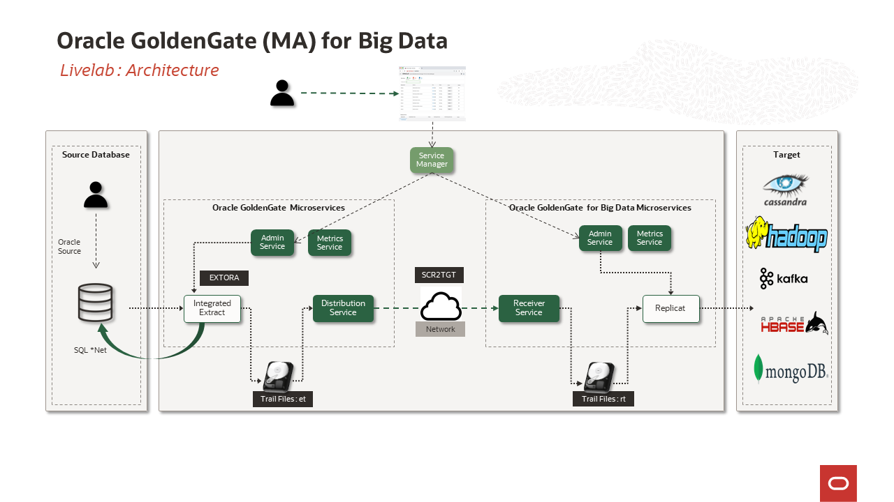

# Oracle GoldenGate Microservices for Big Data Workshop

## How to Prepare for This Workshop 

- Once you are viewing the workshop's gitHub page's website, you can see a list of Lab Guides at any time by clicking on the **Menu Icon**

## Oracle Goldengate for Big Data Microservices Workshop

Welcome to the Oracle GoldenGate Microservices for Big Data. The content will give you a basic understanding of **GoldenGate Microservices** and **Big Data**.

## Introduction

The Oracle GoldenGate Microservices for Big Data Workshop is designed to introduce replication capabilities from relational sources to **“Big Data”** targets, specifically ***HDFS, HBase, Kafka,MongoDB and Cassandra***. This workshop is based on Oracle GoldenGate Microservices Architecture and  Oracle GoldenGate (MA) for Big Data  which covers all GG supported Big Data targets, except Flume. Additional targets may be supported using open-source pluggable adapters. For more information, please discuss this with the workshop facilitator or the Data Integration Sales team.

## Workshop architecture

## Workshop Details

This hands-on lab is designed to demonstrate how  **Oracle GoldenGate Microservices Architecture** and  **Oracle GoldenGate (MA) for Big Data** can be used to setup a replication environment by a mix of web page, shell scripts and Rest API interfaces. All labs will use shell scripts to facilitate the building of the environment, at the same time provide insight into how to use the web pages and AdminClient.The labs will walk the end-user through how to add all components of Oracle GoldenGate replication.
 
Workshop Outline
-------------------
- Lab 1:Introduction 
- Lab 2:Oracle to Kafka
- Lab 3:Oracle to HDFS 
- Lab 4:Oracle to HBase
- Lab 5:Oracle to Cassandra
- Lab 6:Oracle to mongoDB
- Lab 7:GoldenGate Microservices AdminClient

